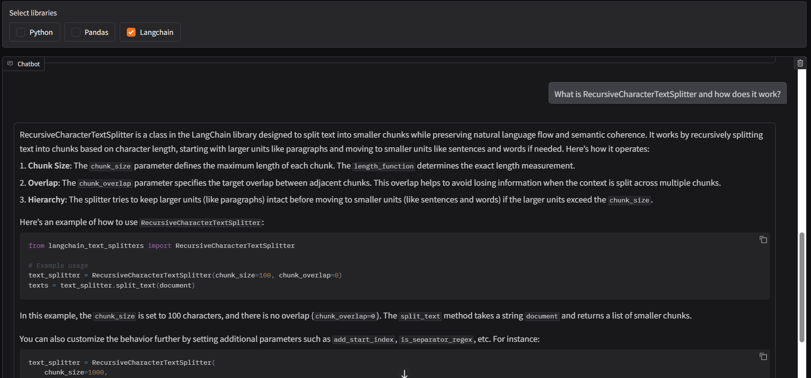
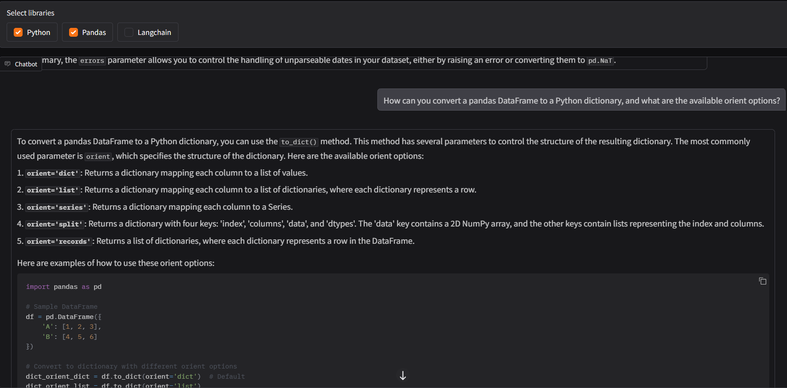
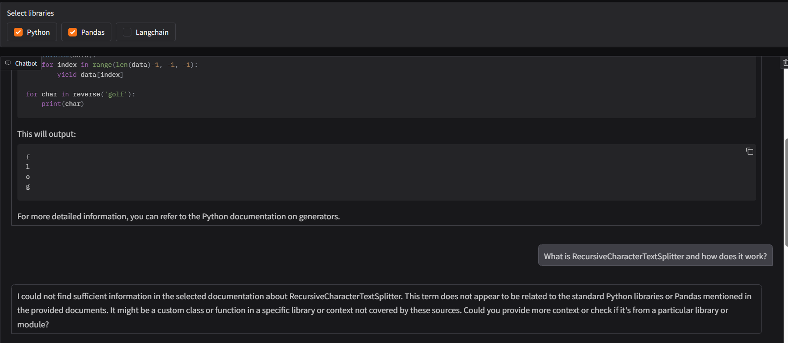

# Documentation Expert RAG

A Retrieval-Augmented Generation (RAG) system that answers questions using the official documentation for **Python**, **Pandas**, and **LangChain**.

Instead of relying on the language model's internal knowledge, the system retrieves relevant documentation, reranks the results, and generates answers strictly from the retrieved context. When sufficient documentation cannot be found, it refuses to answer.

---

## Features

- Official documentation knowledge base
  - Python
  - Pandas
  - LangChain
- Dense vector retrieval using ChromaDB
- Cross-Encoder reranking
- Metadata-based library filtering
- Conversation history with automatic summarization
- Strict context-based answer generation
- Context sufficiency check to reduce hallucinations
- Gradio web interface
- Modular architecture for future extensions

---

## 🛠 Tech Stack

| Category | Technology |
|-----------|------------|
| Language | Python |
| LLM | Qwen2.5-7B-Instruct (4-bit) |
| Embeddings | BAAI/bge-small-en-v1.5 |
| Reranker | BAAI/bge-reranker-base |
| Vector Database | ChromaDB |
| Framework | LangChain |
| UI | Gradio |
| Development | VS Code |
| Inference | Google Colab (Tesla T4) |

---

# System Architecture

```text
                    User Question
                          │
                          ▼
              Library Selection Filter
                          │
                          ▼
                 Dense Vector Retrieval
                    (ChromaDB + BGE)
                          │
                          ▼
             Cross-Encoder Reranker
             (BAAI/bge-reranker-base)
                          │
                          ▼
             Context Sufficiency Check
                          │
             ┌────────────┴────────────┐
             │                         │
             ▼                         ▼
      Insufficient Context       Retrieved Context
             │                         │
             ▼                         ▼
      Refuse to Answer         Qwen2.5-7B-Instruct
                                      │
                                      ▼
                               Final Response
```

---

# Pipeline

1. User selects one or more documentation libraries.
2. The retriever searches the Chroma vector database.
3. Top retrieval results are reranked using a Cross-Encoder.
4. Retrieved context is checked for sufficiency.
5. If sufficient, the LLM answers using only the retrieved documentation.
6. Otherwise, the system refuses to answer instead of hallucinating.

---

# Screenshots

## Python Documentation

> Correct library selected.



---

## Multiple Documentation Sources

> Answer generated using information retrieved from multiple selected libraries.



---

## Context Refusal

> Incorrect library selected. The system correctly reports insufficient context.



---

# Dataset Statistics

| Metric | Value |
|---------|------:|
| Documentation Files | 461 |
| Final Chunks | 12,894 |
| Chunk Size | 1000 |
| Chunk Overlap | 150 |

---

# Key Design Decisions

- Preserve original documentation hierarchy
- Metadata-driven retrieval filtering
- Single Chroma collection
- Modular architecture
- Separate retrieval, reranking, generation and UI
- Conversation summarization for long chats
- Strict refusal when context is insufficient

---

# Future Improvements

- Source citations
- Hybrid Search (BM25 + Dense Retrieval)
- Query rewriting
- Multi-query retrieval
- Streaming responses

---

# Installation

```bash
git clone <repo-url>

cd Documentation-Expert

pip install -r requirements.txt
```

Build the knowledge base and vector database before launching the application.

---

# Run

```bash
python app.py
```

---

# Acknowledgements

- Python Documentation
- Pandas Documentation
- LangChain Documentation
- Hugging Face
- LangChain
- ChromaDB

---

# License

This project is licensed under the MIT License. See the `LICENSE` file for details.

## Third-Party Models and Resources

This project uses several third-party models and libraries, each with their own licenses and usage terms:

- Qwen2.5-7B-Instruct
- BAAI/bge-small-en-v1.5
- BAAI/bge-reranker-base
- ChromaDB
- LangChain
- Gradio

Please review the respective licenses and terms of use before using this project commercially or redistributing models.