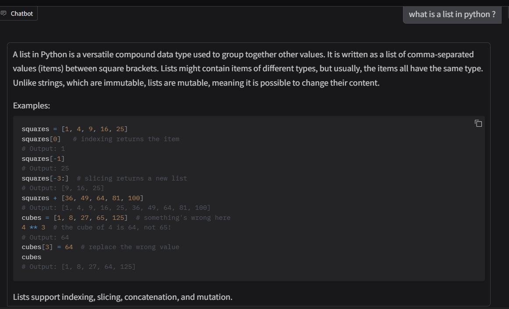
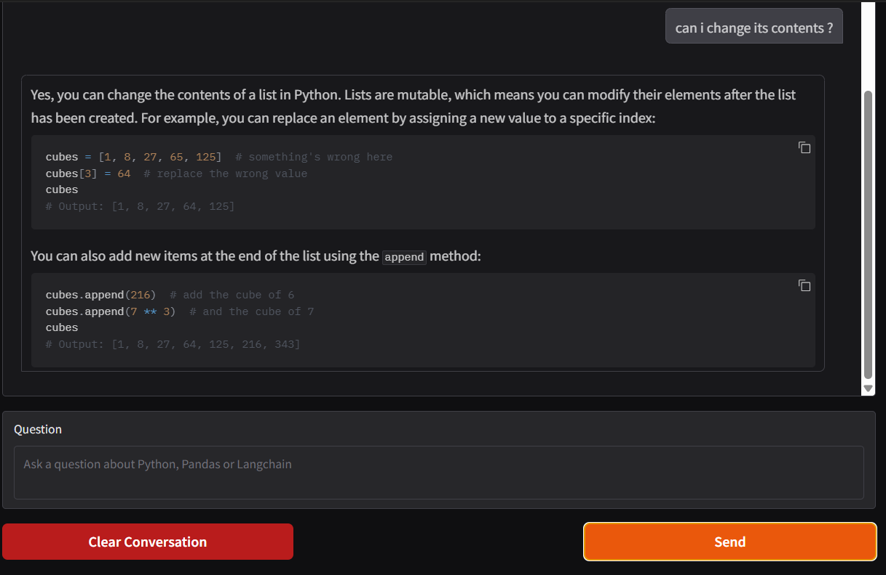
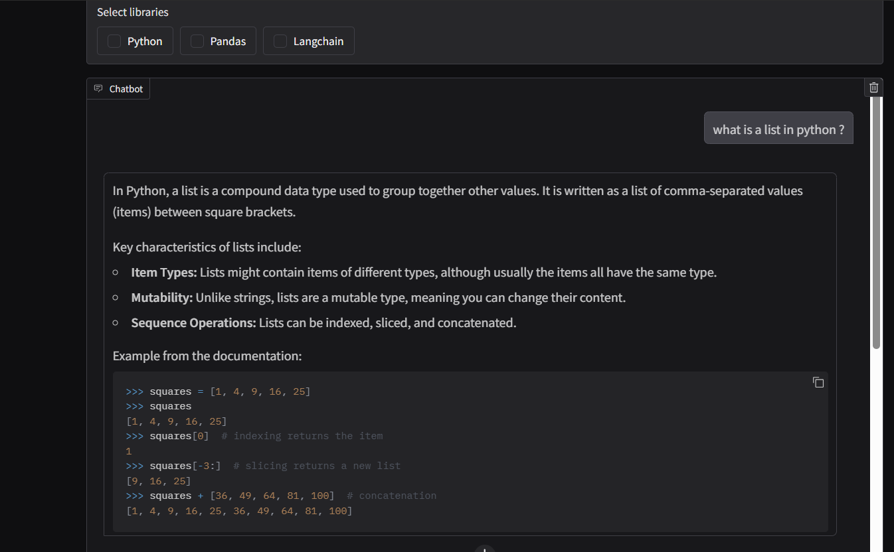
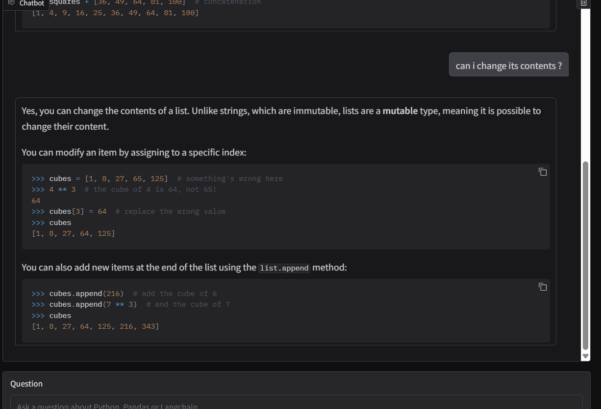

# Documentation Expert RAG

A Retrieval-Augmented Generation (RAG) system that answers questions using the official documentation for **Python**, **Pandas**, and **LangChain**.

The system is designed to reduce hallucinations by grounding responses in retrieved documentation rather than relying solely on the language model's internal knowledge. It combines metadata filtering, dense retrieval, Cross-Encoder reranking, query rewriting, conversation context, and a strict context-sufficiency check before generating an answer.

The project supports both **local Hugging Face inference** and **OpenAI-compatible Chat Completions APIs** through a common LLM interface.

---

## Overview

The Documentation Expert takes a user's question and processes it through a retrieval pipeline before generating a response.

The main flow is:

1. Select one or more documentation libraries.
2. Rewrite the question when recent conversation context is required.
3. Retrieve relevant documentation chunks from ChromaDB.
4. Rerank the retrieved chunks using a Cross-Encoder.
5. Check whether the retrieved context is sufficient.
6. Generate a grounded answer using the selected LLM.
7. Refuse to answer when the available documentation is insufficient.

This allows the same system to handle both direct documentation questions and follow-up questions within a conversation.

---

## Features

- Official documentation knowledge base
  - Python
  - Pandas
  - LangChain
- Metadata-based library filtering
- Dense vector retrieval using ChromaDB
- Cross-Encoder reranking
- Query rewriting for follow-up questions
- Conversation history
- Automatic conversation summarization
- Recent-message buffer for query rewriting
- Strict context-based answer generation
- Context sufficiency check
- Local 4-bit LLM inference
- OpenAI-compatible API support
- Gradio web interface
- Modular architecture separating retrieval, reranking, generation, and UI

---

## System Architecture

```text
                         User Question
                               │
                               ▼
                    Library Selection Filter
                               │
                               ▼
                       Query Rewriting
                    (Recent Conversation)
                               │
                               ▼
                     Dense Vector Retrieval
                         (ChromaDB + BGE)
                               │
                               ▼
                     Cross-Encoder Reranker
                    (BAAI/bge-reranker-base)
                               │
                               ▼
                    Context Sufficiency Check
                         ┌─────┴─────┐
                         │           │
                         ▼           ▼
                  Insufficient   Sufficient
                    Context        Context
                         │           │
                         ▼           ▼
                  Refuse to Answer  LLM
                                     │
                         ┌───────────┴───────────┐
                         │                       │
                         ▼                       ▼
                    Local Qwen             API Client
                  4-bit inference       OpenAI-compatible
                         │                       │
                         └───────────┬───────────┘
                                     ▼
                              Final Response
```

---

## Pipeline

### 1. Library Selection

The user can select one or more documentation libraries.

The selected libraries are used as metadata filters during retrieval so that the search is restricted to the documentation sources relevant to the user's request.

### 2. Query Rewriting

For follow-up questions, the system uses recent conversation turns to convert an ambiguous question into a self-contained retrieval query.

For example:

```text
User: What is pandas.read_csv?
User: What parameters does it accept?
```

The second question depends on the previous turn. Query rewriting resolves that dependency before retrieval.

When there is no recent conversation context, the original question is used directly without an unnecessary LLM call.

### 3. Dense Retrieval

The rewritten query is embedded using:

```text
BAAI/bge-small-en-v1.5
```

The resulting embedding is used to search the ChromaDB vector store for relevant documentation chunks.

The initial retrieval stage returns the top:

```text
15
```

results.

### 4. Cross-Encoder Reranking

The retrieved documents are passed to:

```text
BAAI/bge-reranker-base
```

The reranker evaluates the relationship between the query and each retrieved chunk and improves the ordering of the candidate context.

The top:

```text
7
```

reranked chunks are retained for generation.

### 5. Context Sufficiency Check

Before the LLM is asked to answer, the pipeline checks whether the retrieved context is sufficiently relevant.

If the context does not meet the configured threshold, the system refuses to answer rather than asking the LLM to rely on information outside the retrieved documentation.

### 6. Grounded Response Generation

When sufficient context is available, the selected LLM receives:

- The original user question
- Conversation history
- Retrieved documentation

The LLM is instructed to answer using the supplied documentation and not to invent unsupported information.

### 7. Conversation Management

The conversation system maintains:

- Conversation summaries for older turns
- Active messages for the current conversation window
- Recent complete turns for query rewriting

This allows longer conversations to retain useful context without continuously sending the entire conversation to the model.

---

## Tech Stack

| Category | Technology |
|-----------|------------|
| Language | Python |
| Local LLM | Qwen2.5-7B-Instruct |
| LLM Quantization | BitsAndBytes, 4-bit NF4 |
| Embeddings | BAAI/bge-small-en-v1.5 |
| Reranker | BAAI/bge-reranker-base |
| Vector Database | ChromaDB |
| Framework | LangChain |
| UI | Gradio |
| API Client | OpenAI Python SDK |
| Development | VS Code |
| Local Inference | Google Colab / NVIDIA Tesla T4 |

---

# LLM Backends

The project uses a common `generate()` interface so that the RAG pipeline does not need to know whether inference is performed locally or through an API.

```text
                         RAGPipeline
                              │
                              ▼
                          load_llm()
                         ┌────┴────┐
                         │         │
                         ▼         ▼
                     LocalLLM   APIClient
                         │         │
                         ▼         ▼
                   Hugging Face  OpenAI-compatible
                     Qwen 7B      Chat Completions
```

### Local LLM

The default local model is:

```text
Qwen/Qwen2.5-7B-Instruct
```

It is loaded with 4-bit NF4 quantization to make local inference practical on a constrained GPU environment.

The same loaded model is reused for:

- Query rewriting
- Response generation
- Conversation summarization

This avoids loading multiple LLMs into GPU memory.

### API Models

The project also supports models exposed through **OpenAI-compatible Chat Completions APIs**.

For example:

```python
LLM_PROVIDER = "api"
LLM_MODEL = "gpt-4.1-mini"
LLM_BASE_URL = None
```

The API backend uses the OpenAI Python SDK and a single `generate(messages)` interface.

A custom base URL can be supplied for another provider when that provider exposes an OpenAI-compatible Chat Completions endpoint.

> API compatibility is required. Native provider APIs that do not expose an OpenAI-compatible Chat Completions interface are not automatically supported by this client.

---

# Configuration

Model and retrieval settings are controlled through `config.py`.

Important configuration values include:

```python
EMBEDDING_MODEL = "BAAI/bge-small-en-v1.5"
LLM_MODEL = "Qwen/Qwen2.5-7B-Instruct"
RERANKER_MODEL = "BAAI/bge-reranker-base"

RETRIEVAL_K = 15
RERANK_TOP_K = 7

CONTEXT_SUFFICIENCY_THRESHOLD = 0.10

CONVERSATION_SUMMARY_TURNS = 10
MAX_RECENT_MESSAGE_TURNS = 3
```

The LLM backend can be selected using:

```python
LLM_PROVIDER = "local"
```

or:

```python
LLM_PROVIDER = "api"
```

For API inference, the API key is read from the environment:

```text
LLM_API_KEY=your_api_key
```

The local model is not loaded when API mode is selected.

---

# Hugging Face Authentication

The public models used by the default configuration do not require a Hugging Face token for downloading.

A Hugging Face token may still be required when using gated or private models.

For Google Colab, credentials can be supplied through Colab Secrets rather than storing them in the repository.

The project keeps Hugging Face authentication separate from the RAG pipeline so that public-model users do not need to configure credentials unnecessarily.

---

# Dataset Statistics

The current documentation knowledge base contains:

| Metric | Value |
|---------|------:|
| Documentation Files | 461 |
| Final Chunks | 12,894 |
| Chunk Size | 1000 |
| Chunk Overlap | 159 |

The knowledge base contains documentation from:

```text
Python
Pandas
LangChain
```

---

# Project Structure

The project is organized into separate components for ingestion, retrieval, reranking, LLM interaction, conversation management, and the user interface.

A simplified view is:

```text
Documentation-Expert/
│
├── app.py
├── rag.py
├── config.py
├── colab_app.ipynb
├── requirements.txt
├── README.md
├── LICENSE
│
├── ingestion/
│   ├── build_kb/
│   │    ├── __init__.py
│   │    ├── build_langchain_kb.py
│   │    ├── build_pandas_kb.py
│   │    ├── build_python_kb.pt
│   │    └── README.md
│   ├── chunking
│   │    ├── __init__.py
│   │    ├── chunker.py
│   │    ├── loader.py
│   │    ├── metadata.py
│   │    └── splitter.py
│   ├── embedding
│   │    ├── embedder.py
│   │    └── vector_store.py
│   ├── __init__.py
│   └── build_vector_store.py
│
├── Knowledge_base/
│
├── llm/
│   ├── __init__.py
│   ├── client.py
│   ├── conversation_summary_prompt.py
│   ├── response_prompt.py
│   ├── model.py
│   ├── conversations.py
│   ├── query_rewriter.py
│   └── rewrite_prompt.py
│
│ 
├── retrieval/
│    ├── retriever.py
│    └── reranker.py
│ 
├── testing/
│ 
├── ui/
│   ├── __init__.py
│   ├── callbacks.py
│   └── interface.py
│
├── utils/
│   ├── __init__.py
│   ├── greetings.py
│   ├── md_cleaner.py
│   ├── formatter.py
│   └── message_builder.py
│
├── vector_store/
│   └── chroma_db/
│
└── assets/
```

The exact contents may change as the project evolves; the important architectural separation is between ingestion, retrieval, LLM interaction, conversation handling, and presentation.

---

# Installation

Clone the repository:

```bash
git clone <repo-url>

cd Documentation-Expert

pip install -r requirements.txt
```

Before launching the application, the documentation knowledge base and ChromaDB vector store must be available.

Refer to:

```text
ingestion/build_kb/README.md
```

for knowledge-base construction and:

```text
ingestion/build_vector_store.py
```

for vector-store construction details.

---

# Running the Project

## Local

The main entry point is:

```bash
python app.py
```

When using API mode, configure the required API key in `.env`:

```text
LLM_API_KEY=your_api_key
```

When using the local model, ensure the machine has a compatible GPU and sufficient memory.

---

## Google Colab

The project includes a Colab notebook for running the local model.

```text
colab_app.ipynb
```

The notebook can be used to clone the repository, install dependencies, configure authentication when required, and launch the application.

The local Qwen2.5-7B-Instruct model was tested using an NVIDIA Tesla T4 environment.

---

# Screenshots

## Python Documentation

> Correct library selected and the system retrieves the relevant documentation.


---

## Multiple Documentation Sources

> The system retrieves information from multiple selected documentation libraries when required.


---

## Context Refusal

> When the selected documentation does not provide sufficient context, the system refuses to answer.


---

## Query Rewriting

> Follow-up questions can be rewritten using recent conversation context before retrieval.


---

## API Model Response

> The API backend can be used through the same RAG pipeline without loading the local model.

## GPT Model Response

> Responses generated using gpt-4.1-mini





## Gemini Model Response

> Responses generated using gemini-3.6-flash





---

# Key Design Decisions

### Single LLM for Rewriting and Generation

A single Qwen2.5-7B-Instruct model is used for both query rewriting and response generation.

This avoids loading a second model and keeps GPU memory usage practical.

### Query Rewriting Uses Recent Conversation

Only recent complete turns are used for query rewriting.

Older conversation content is summarized separately, allowing the rewriting context to remain focused and compact.

### Retrieval and Reranking Are Separate

Dense retrieval is used to find a broad candidate set, while the Cross-Encoder reranker is responsible for improving the ordering of those candidates.

This provides a clear separation between recall-oriented retrieval and relevance-oriented reranking.

### Strict Context Grounding

The LLM is not treated as the source of truth.

Retrieved documentation is the source of information, and the system is designed to refuse questions when sufficient context is not available.

### Provider-Independent LLM Interface

The RAG pipeline interacts with the LLM through:

```python
llm.generate(messages)
```

This keeps the retrieval and generation pipeline independent of whether the underlying model is local or accessed through an API.

---

# Limitations

- Retrieval quality depends on the documentation chunks and embedding model.
- Query rewriting cannot resolve every ambiguous reference, particularly references to concepts that are not explicitly represented in recent conversation.
- A relevant document may still be insufficient for answering a question if the required information is not explicitly present.
- Strict grounding can occasionally cause the model to refuse questions that a general-purpose LLM could answer from its internal knowledge.
- Local Qwen inference requires a compatible GPU with sufficient memory.
- API inference requires valid provider credentials and may incur usage costs.
- OpenAI-compatible API support depends on the provider exposing a compatible Chat Completions endpoint.
- The system does not currently provide source citations in generated answers.

---

# Future Improvements

Potential future improvements include:

- Source citations and document references
- Hybrid retrieval using BM25 + dense retrieval
- Multi-query retrieval
- Streaming responses
- Improved handling of complex conversational references
- Additional retrieval and evaluation strategies

---

# Acknowledgements

This project makes use of:

- Python Documentation
- Pandas Documentation
- LangChain Documentation
- Hugging Face
- LangChain
- ChromaDB
- BAAI embedding and reranking models
- Qwen2.5-7B-Instruct
- OpenAI's Chat completions API
- Gradio

---

# License

This project is licensed under the **MIT License**. See the `LICENSE` file for details.

## Third-Party Models and Resources

This project uses third-party models and libraries with their own licenses and usage terms, including:

- Qwen/Qwen2.5-7B-Instruct
- BAAI/bge-small-en-v1.5
- BAAI/bge-reranker-base
- ChromaDB
- LangChain
- Gradio

Please review the respective licenses and terms of use before using the project commercially or redistributing third-party models.

In particular, review the applicable licensing terms for the Qwen model before redistributing or deploying it.

---

# Author

Praveen Kumar T

MCA Graduate

Python • LLMs • RAG • Generative AI
