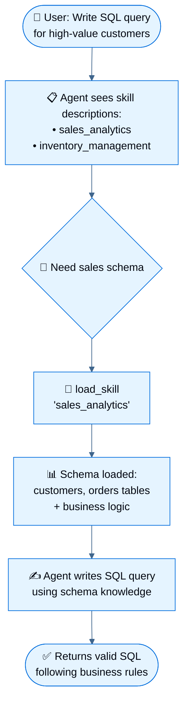

# Retrieval Evaluation Report

- Retrieval K: 15
- Rerank Top K: 7

# Question 1

**Question:** How do I read a CSV file into a pandas DataFrame?

# Dense Retrieval

## Rank 1

| Field | Value |
|------|-------|
| Library | pandas |
| Module | cookbook |
| Section | user_guide |
| Source | user_guide/cookbook.md |
| Chunk ID | pandas:cookbook:0046 |
| Rerank Score | 0.9917 |

### Content

```text
a context manager and using that handle to read. [See
here](https://stackoverflow.com/questions/17789907/pandas-convert-winzipped-csv-file-to-data-frame)  
[Inferring dtypes from a
file](https://stackoverflow.com/questions/15555005/get-inferred-dataframe-types-iteratively-using-chunksize)  
Dealing with bad lines `2886`  
[Write a multi-row index CSV without writing
duplicates](https://stackoverflow.com/questions/17349574/pandas-write-multiindex-rows-with-to-csv)  
#### Reading multiple files to create a single DataFrame {#cookbook.csv.multiple_files}  
The best way to combine multiple files into a single DataFrame is to
read the individual frames one by one, put all of the individual frames
into a list, and then combine the frames in the list using
`pd.concat`:  
::: ipython
python  
for i in range(3):  
: data = pd.DataFrame(np.random.randn(10, 4))
data.to_csv(\"file\_{}.csv\".format(i))  
files = \[\"file_0.csv\", \"file_1.csv\", \"file_2.csv\"\] result =
pd.concat(\[pd.read_csv(f)
```

## Rank 2

| Field | Value |
|------|-------|
| Library | pandas |
| Module | io |
| Section | user_guide |
| Source | user_guide/io.md |
| Chunk ID | pandas:io:0189 |
| Rerank Score | 0.2185 |

### Content

```text
A handy way to grab data is to use the
`~DataFrame.read_clipboard` method, which
takes the contents of the clipboard buffer and passes them to the
`read_csv` method. For instance, you can copy the following text to the
clipboard (CTRL-C on many operating systems):  
``` console
A B C
x 1 4 p
y 2 5 q
z 3 6 r
```  
And then import the data directly to a `DataFrame` by calling:  
``` python
>>> clipdf = pd.read_clipboard()
>>> clipdf
A B C
x 1 4 p
y 2 5 q
z 3 6 r
```  
The `to_clipboard` method can be used to write the contents of a
`DataFrame` to the clipboard. Following which you can paste the
clipboard contents into other applications (CTRL-V on many operating
systems). Here we illustrate writing a `DataFrame` into clipboard and
reading it back.  
``` python
>>> df = pd.DataFrame(
...     {"A": [1, 2, 3], "B": [4, 5, 6], "C": ["p", "q", "r"]}, index=["x", "y", "z"]
... )
```

## Rank 3

| Field | Value |
|------|-------|
| Library | pandas |
| Module | cookbook |
| Section | user_guide |
| Source | user_guide/cookbook.md |
| Chunk ID | pandas:cookbook:0045 |
| Rerank Score | 0.9949 |

### Content

```text
The `CSV <io.read_csv_table>` docs  
[read_csv in action](https://www.datacamp.com/tutorial/pandas-read-csv)  
[appending to a
csv](https://stackoverflow.com/questions/17134942/pandas-dataframe-output-end-of-csv)  
[Reading a csv
chunk-by-chunk](https://stackoverflow.com/questions/11622652/large-persistent-dataframe-in-pandas/12193309#12193309)  
[Reading only certain rows of a csv
chunk-by-chunk](https://stackoverflow.com/questions/19674212/pandas-data-frame-select-rows-and-clear-memory)  
[Reading the first few lines of a
frame](https://stackoverflow.com/questions/15008970/way-to-read-first-few-lines-for-pandas-dataframe)  
Reading a file that is compressed but not by `gzip/bz2` (the native
compressed formats which `read_csv` understands). This example shows a
`WinZipped` file, but is a general application of opening the file
within a context manager and using that handle to read. [See
here](https://stackoverflow.com/questions/17789907/pandas-convert-winzipped-csv-file-to-data-frame)
```

## Rank 4

| Field | Value |
|------|-------|
| Library | pandas |
| Module | cookbook |
| Section | user_guide |
| Source | user_guide/cookbook.md |
| Chunk ID | pandas:cookbook:0049 |
| Rerank Score | 0.0172 |

### Content

```text
12\], index_col=0,
parse_dates=True, header=10,  
)
:::  
####### Option 2: read column names and then data  
::: ipython
python  
pd.read_csv(StringIO(data), sep=\";\", header=10, nrows=10).columns
columns = pd.read_csv(StringIO(data), sep=\";\", header=10,
nrows=10).columns pd.read_csv( StringIO(data), sep=\";\", index_col=0,
header=12, parse_dates=True, names=columns )
:::
```

## Rank 5

| Field | Value |
|------|-------|
| Library | pandas |
| Module | 10min |
| Section | user_guide |
| Source | user_guide/10min.md |
| Chunk ID | pandas:10min:0033 |
| Rerank Score | 0.9871 |

### Content

```text
`Writing to a csv file: <io.store_in_csv>`
using `DataFrame.to_csv`  
::: ipython
python  
df = pd.DataFrame(np.random.randint(0, 5, (10, 5)))
df.to_csv(\"foo.csv\")
:::  
`Reading from a csv file: <io.read_csv_table>` using `read_csv`  
::: ipython
python  
pd.read_csv(\"foo.csv\")
:::  
::: {.ipython suppress=""}
python  
import os  
os.remove(\"foo.csv\")
:::
```

## Rank 6

| Field | Value |
|------|-------|
| Library | pandas |
| Module | io |
| Section | user_guide |
| Source | user_guide/io.md |
| Chunk ID | pandas:io:0085 |
| Rerank Score | 0.9989 |

### Content

```text
`read_csv` is capable of inferring delimited (not necessarily
comma-separated) files, as pandas uses the
`python:csv.Sniffer` class of the csv
module. For this, you have to specify `sep=None`.  
::: ipython
python  
df = pd.DataFrame(np.random.randn(10, 4)) df.to_csv(\"tmp2.csv\",
sep=\":\", index=False) pd.read_csv(\"tmp2.csv\", sep=None,
engine=\"python\")
:::  
::: {.ipython suppress=""}
python  
os.remove(\"tmp2.csv\")
:::
```

## Rank 7

| Field | Value |
|------|-------|
| Library | pandas |
| Module | io |
| Section | user_guide |
| Source | user_guide/io.md |
| Chunk ID | pandas:io:0094 |
| Rerank Score | 0.2703 |

### Content

```text
#### Writing to CSV format {#io.store_in_csv}  
The `Series` and `DataFrame` objects have an instance method `to_csv`
which allows storing the contents of the object as a
comma-separated-values file. The function takes a number of arguments.
Only the first is required.  
- `path_or_buf`: A string path to the file to write or a file object. If
a file object it must be opened with `newline=''`
- `sep` : Field delimiter for the output file (default \",\")
- `na_rep`: A string representation of a missing value (default \'\')
- `float_format`: Format string for floating point numbers
- `columns`: Columns to write (default None)
- `header`: Whether to write out the column names (default True)
- `index`: whether to write row (index) names (default True)
- `index_label`: Column label(s) for index column(s) if desired. If None
(default), and `header` and `index` are True, then the index names are
used. (A sequence should be given if the `DataFrame` uses MultiIndex).
- `mode` : Python write
```


---

# Reranked Retrieval

## Rank 1

| Field | Value |
|------|-------|
| Library | pandas |
| Module | io |
| Section | user_guide |
| Source | user_guide/io.md |
| Chunk ID | pandas:io:0085 |
| Rerank Score | 0.9989 |

### Content

```text
`read_csv` is capable of inferring delimited (not necessarily
comma-separated) files, as pandas uses the
`python:csv.Sniffer` class of the csv
module. For this, you have to specify `sep=None`.  
::: ipython
python  
df = pd.DataFrame(np.random.randn(10, 4)) df.to_csv(\"tmp2.csv\",
sep=\":\", index=False) pd.read_csv(\"tmp2.csv\", sep=None,
engine=\"python\")
:::  
::: {.ipython suppress=""}
python  
os.remove(\"tmp2.csv\")
:::
```

## Rank 2

| Field | Value |
|------|-------|
| Library | pandas |
| Module | cookbook |
| Section | user_guide |
| Source | user_guide/cookbook.md |
| Chunk ID | pandas:cookbook:0045 |
| Rerank Score | 0.9949 |

### Content

```text
The `CSV <io.read_csv_table>` docs  
[read_csv in action](https://www.datacamp.com/tutorial/pandas-read-csv)  
[appending to a
csv](https://stackoverflow.com/questions/17134942/pandas-dataframe-output-end-of-csv)  
[Reading a csv
chunk-by-chunk](https://stackoverflow.com/questions/11622652/large-persistent-dataframe-in-pandas/12193309#12193309)  
[Reading only certain rows of a csv
chunk-by-chunk](https://stackoverflow.com/questions/19674212/pandas-data-frame-select-rows-and-clear-memory)  
[Reading the first few lines of a
frame](https://stackoverflow.com/questions/15008970/way-to-read-first-few-lines-for-pandas-dataframe)  
Reading a file that is compressed but not by `gzip/bz2` (the native
compressed formats which `read_csv` understands). This example shows a
`WinZipped` file, but is a general application of opening the file
within a context manager and using that handle to read. [See
here](https://stackoverflow.com/questions/17789907/pandas-convert-winzipped-csv-file-to-data-frame)
```

## Rank 3

| Field | Value |
|------|-------|
| Library | pandas |
| Module | cookbook |
| Section | user_guide |
| Source | user_guide/cookbook.md |
| Chunk ID | pandas:cookbook:0046 |
| Rerank Score | 0.9917 |

### Content

```text
a context manager and using that handle to read. [See
here](https://stackoverflow.com/questions/17789907/pandas-convert-winzipped-csv-file-to-data-frame)  
[Inferring dtypes from a
file](https://stackoverflow.com/questions/15555005/get-inferred-dataframe-types-iteratively-using-chunksize)  
Dealing with bad lines `2886`  
[Write a multi-row index CSV without writing
duplicates](https://stackoverflow.com/questions/17349574/pandas-write-multiindex-rows-with-to-csv)  
#### Reading multiple files to create a single DataFrame {#cookbook.csv.multiple_files}  
The best way to combine multiple files into a single DataFrame is to
read the individual frames one by one, put all of the individual frames
into a list, and then combine the frames in the list using
`pd.concat`:  
::: ipython
python  
for i in range(3):  
: data = pd.DataFrame(np.random.randn(10, 4))
data.to_csv(\"file\_{}.csv\".format(i))  
files = \[\"file_0.csv\", \"file_1.csv\", \"file_2.csv\"\] result =
pd.concat(\[pd.read_csv(f)
```

## Rank 4

| Field | Value |
|------|-------|
| Library | pandas |
| Module | 10min |
| Section | user_guide |
| Source | user_guide/10min.md |
| Chunk ID | pandas:10min:0033 |
| Rerank Score | 0.9871 |

### Content

```text
`Writing to a csv file: <io.store_in_csv>`
using `DataFrame.to_csv`  
::: ipython
python  
df = pd.DataFrame(np.random.randint(0, 5, (10, 5)))
df.to_csv(\"foo.csv\")
:::  
`Reading from a csv file: <io.read_csv_table>` using `read_csv`  
::: ipython
python  
pd.read_csv(\"foo.csv\")
:::  
::: {.ipython suppress=""}
python  
import os  
os.remove(\"foo.csv\")
:::
```

## Rank 5

| Field | Value |
|------|-------|
| Library | pandas |
| Module | io |
| Section | user_guide |
| Source | user_guide/io.md |
| Chunk ID | pandas:io:0044 |
| Rerank Score | 0.8109 |

### Content

```text
You can indicate the data type for the whole `DataFrame` or individual
columns:  
::: ipython
python  
import numpy as np  
data = \"a,b,c,dn1,2,3,4n5,6,7,8n9,10,11\" print(data)  
df = pd.read_csv(StringIO(data), dtype=object) df df\[\"a\"\]\[0\] df =
pd.read_csv(StringIO(data), dtype={\"b\": object, \"c\": np.float64,
\"d\": \"Int64\"}) df.dtypes
:::  
Fortunately, pandas offers more than one way to ensure that your
column(s) contain only one `dtype`. If you\'re unfamiliar with these
concepts, you can see `here<basics.dtypes>` to learn more about dtypes, and
`here<basics.object_conversion>` to learn
more about `object` conversion in pandas.  
For instance, you can use the `converters` argument of
`~pandas.read_csv`:  
::: ipython
python  
data = \"col_1n1n2n\'A\'n4.22\" df = pd.read_csv(StringIO(data),
converters={\"col_1\": str}) df
df\[\"col_1\"\].apply(type).value_counts()
:::  
Or you can use the `~pandas.to_numeric`
function to coerce the dtypes after reading in the data,  
:::
```

## Rank 6

| Field | Value |
|------|-------|
| Library | pandas |
| Module | io |
| Section | user_guide |
| Source | user_guide/io.md |
| Chunk ID | pandas:io:0083 |
| Rerank Score | 0.5761 |

### Content

```text
= \'year,indiv,zit,xitn1977,\"A\",1.2,.6n1977,\"B\",1.5,.5\'
print(data) with open(\"mindex_ex.csv\", mode=\"w\") as f: f.write(data)
:::  
The `index_col` argument to `read_csv` can take a list of column numbers
to turn multiple columns into a `MultiIndex` for the index of the
returned object:  
::: ipython
python  
df = pd.read_csv(\"mindex_ex.csv\", index_col=\[0, 1\]) df
df.loc\[1977\]
:::  
::: {.ipython suppress=""}
python  
os.remove(\"mindex_ex.csv\")
:::  
#### Reading columns with a `MultiIndex` {#io.multi_index_columns}  
By specifying list of row locations for the `header` argument, you can
read in a `MultiIndex` for the columns. Specifying non-consecutive rows
will skip the intervening rows.  
::: ipython
python  
mi_idx = pd.MultiIndex.from_arrays(\[\[1, 2, 3, 4\], list(\"abcd\")\],
names=list(\"ab\")) mi_col = pd.MultiIndex.from_arrays(\[\[1, 2\],
list(\"ab\")\], names=list(\"cd\")) df = pd.DataFrame(np.ones((4, 2)),
index=mi_idx, columns=mi_col)
```

## Rank 7

| Field | Value |
|------|-------|
| Library | pandas |
| Module | basics |
| Section | user_guide |
| Source | user_guide/basics.md |
| Chunk ID | pandas:basics:0033 |
| Rerank Score | 0.3637 |

### Content

```text
In [148]: bb = pd.read_csv("data/baseball.csv", index_col="id")
```


---

## Observation

_Write your observations here._

============================================================

# Question 2

**Question:** How can I select multiple columns from a pandas DataFrame?

# Dense Retrieval

## Rank 1

| Field | Value |
|------|-------|
| Library | pandas |
| Module | cookbook |
| Section | user_guide |
| Source | user_guide/cookbook.md |
| Chunk ID | pandas:cookbook:0006 |
| Rerank Score | 0.9960 |

### Content

```text
[Select with multi-column
criteria](https://stackoverflow.com/questions/15315452/selecting-with-complex-criteria-from-pandas-dataframe)  
::: ipython
python  
df = pd.DataFrame(  
: {\"AAA\": \[4, 5, 6, 7\], \"BBB\": \[10, 20, 30, 40\], \"CCC\": \[100,
50, -30, -50\]}  
) df
:::  
\...and (without assignment returns a Series)  
::: ipython
python  
df.loc\[(df\[\"BBB\"\] \< 25) & (df\[\"CCC\"\] \>= -40), \"AAA\"\]
:::  
\...or (without assignment returns a Series)  
::: ipython
python  
df.loc\[(df\[\"BBB\"\] \> 25) \| (df\[\"CCC\"\] \>= -40), \"AAA\"\]
:::  
\...or (with assignment modifies the DataFrame.)  
::: ipython
python  
df.loc\[(df\[\"BBB\"\] \> 25) \| (df\[\"CCC\"\] \>= 75), \"AAA\"\] = 999
df
:::  
[Select rows with data closest to certain value using
argsort](https://stackoverflow.com/questions/17758023/return-rows-in-a-dataframe-closest-to-a-user-defined-number)  
::: ipython
python  
df = pd.DataFrame(  
: {\"AAA\": \[4, 5, 6, 7\], \"BBB\": \[10, 20, 30, 40\], \"CCC\":
```

## Rank 2

| Field | Value |
|------|-------|
| Library | pandas |
| Module | 10min |
| Section | user_guide |
| Source | user_guide/10min.md |
| Chunk ID | pandas:10min:0009 |
| Rerank Score | 0.9943 |

### Content

```text
For a `DataFrame`, passing a single
label selects a column and yields a `Series`:  
::: ipython
python  
df\[\"A\"\]
:::  
If the label only contains letters, numbers, and underscores, you can
alternatively use the column name attribute:  
::: ipython
python  
df.A
:::  
Passing a list of column labels selects multiple columns, which can be
useful for getting a subset/rearranging:  
::: ipython
python  
df\[\[\"B\", \"A\"\]\]
:::  
For a `DataFrame`, passing a slice `:`
selects matching rows:  
::: ipython
python  
df\[0:3\] df\[\"20130102\":\"20130104\"\]
:::
```

## Rank 3

| Field | Value |
|------|-------|
| Library | pandas |
| Module | indexing |
| Section | user_guide |
| Source | user_guide/indexing.md |
| Chunk ID | pandas:indexing:0045 |
| Rerank Score | 0.9896 |

### Content

```text
Thus, as per above, we have the most basic indexing using `[]`:  
::: ipython
python  
s = df\[\'A\'\] s\[dates\[5\]\]
:::  
You can pass a list of columns to `[]` to select columns in that order.
If a column is not contained in the DataFrame, an exception will be
raised. Multiple columns can also be set in this manner:  
::: ipython
python  
df df\[\[\'B\', \'A\'\]\] = df\[\[\'A\', \'B\'\]\] df
:::  
You may find this useful for applying a transform (in-place) to a subset
of the columns.  
::::::: warning
::: title
Warning
:::  
pandas aligns all AXES when setting `Series` and `DataFrame` from
`.loc`.  
This will **not** modify `df` because the column alignment is before
value assignment.  
::: ipython
python  
df\[\[\'A\', \'B\'\]\] df.loc\[:, \[\'B\', \'A\'\]\] = df\[\[\'A\',
\'B\'\]\] df\[\[\'A\', \'B\'\]\]
:::  
The correct way to swap column values is by using raw values:  
::: ipython
python  
df.loc\[:, \[\'B\', \'A\'\]\] = df\[\[\'A\', \'B\'\]\].to_numpy()
df\[\[\'A\',
```

## Rank 4

| Field | Value |
|------|-------|
| Library | pandas |
| Module | advanced |
| Section | user_guide |
| Source | user_guide/advanced.md |
| Chunk ID | pandas:advanced:0020 |
| Rerank Score | 0.9701 |

### Content

```text
### Cross-section {#advanced.xs}

The `~DataFrame.xs` method of `DataFrame`
additionally takes a level argument to make selecting data at a
particular level of a `MultiIndex` easier.

::: ipython
python

df df.xs(\"one\", level=\"second\")
:::

::: ipython
python

\# using the slicers df.loc\[(slice(None), \"one\"), :\]
:::

You can also select on the columns with `xs`, by providing the axis
argument.

::: ipython
python

df = df.T df.xs(\"one\", level=\"second\", axis=1)
:::

::: ipython
python

\# using the slicers df.loc\[:, (slice(None), \"one\")\]
:::

`xs` also allows selection with multiple keys.

::: ipython
python

df.xs((\"one\", \"bar\"), level=(\"second\", \"first\"), axis=1)
:::

::: ipython
python

\# using the slicers df.loc\[:, (\"bar\", \"one\")\]
:::

You can pass `drop_level=False` to `xs` to retain the level that was
selected.

::: ipython
python

df.xs(\"one\", level=\"second\", axis=1, drop_level=False)
:::
```

## Rank 5

| Field | Value |
|------|-------|
| Library | pandas |
| Module | io |
| Section | user_guide |
| Source | user_guide/io.md |
| Chunk ID | pandas:io:0216 |
| Rerank Score | 0.9750 |

### Content

```text
= dftd\[\"A\"\] - dftd\[\"B\"\] dftd
store.append(\"dftd\", dftd, data_columns=True) store.select(\"dftd\",
\"C\<\'-3.5D\'\")
:::  
#### Query MultiIndex {#io.query_multi}  
Selecting from a `MultiIndex` can be achieved by using the name of the
level.  
::: ipython
python  
df_mi.index.names store.select(\"df_mi\", \"foo=baz and bar=two\")
:::  
If the `MultiIndex` levels names are `None`, the levels are
automatically made available via the `level_n` keyword with `n` the
level of the `MultiIndex` you want to select from.  
::: ipython
python  
index = pd.MultiIndex(  
: levels=\[\[\"foo\", \"bar\", \"baz\", \"qux\"\], \[\"one\", \"two\",
\"three\"\]\], codes=\[\[0, 0, 0, 1, 1, 2, 2, 3, 3, 3\], \[0, 1, 2, 0,
1, 1, 2, 0, 1, 2\]\],  
) df_mi_2 = pd.DataFrame(np.random.randn(10, 3), index=index,
columns=\[\"A\", \"B\", \"C\"\]) df_mi_2  
store.append(\"df_mi_2\", df_mi_2)  
\# the levels are automatically included as data columns with keyword
level_n store.select(\"df_mi_2\",
```

## Rank 6

| Field | Value |
|------|-------|
| Library | pandas |
| Module | indexing |
| Section | user_guide |
| Source | user_guide/indexing.md |
| Chunk ID | pandas:indexing:0082 |
| Rerank Score | 0.9813 |

### Content

```text
`~pandas.DataFrame` objects have a
`~pandas.DataFrame.query` method that
allows selection using an expression.  
You can get the value of the frame where column `b` has values between
the values of columns `a` and `c`. For example:  
::: ipython
python  
n = 10 df = pd.DataFrame(np.random.rand(n, 3), columns=list(\'abc\')) df  
\# pure python df\[(df\[\'a\'\] \< df\[\'b\'\]) & (df\[\'b\'\] \<
df\[\'c\'\])\]  
\# query df.query(\'(a \< b) & (b \< c)\')
:::  
Do the same thing but fall back on a named index if there is no column
with the name `a`.  
::: ipython
python  
df = pd.DataFrame(np.random.randint(n / 2, size=(n, 2)),
columns=list(\'bc\')) df.index.name = \'a\' df df.query(\'a \< b and b
\< c\')
:::  
If instead you don\'t want to or cannot name your index, you can use the
name `index` in your query expression:  
::: ipython
python  
df = pd.DataFrame(np.random.randint(n, size=(n, 2)),
columns=list(\'bc\')) df df.query(\'index \< b \< c\')
:::  
:::::: note
::: title
Note
:::
```

## Rank 7

| Field | Value |
|------|-------|
| Library | pandas |
| Module | io |
| Section | user_guide |
| Source | user_guide/io.md |
| Chunk ID | pandas:io:0208 |
| Rerank Score | 0.8026 |

### Content

```text
}, index=list(range(8)),  
) df_mixed.loc\[df_mixed.index\[3:5\], \[\"A\", \"B\", \"string\",
\"datetime64\"\]\] = np.nan  
store.append(\"df_mixed\", df_mixed, min_itemsize={\"values\": 50})
df_mixed1 = store.select(\"df_mixed\") df_mixed1
df_mixed1.dtypes.value_counts()  
\# we have provided a minimum string column size
store.root.df_mixed.table
:::  
#### Storing MultiIndex DataFrames  
Storing MultiIndex `DataFrames` as tables is very similar to
storing/selecting from homogeneous index `DataFrames`.  
::: ipython
python  
index = pd.MultiIndex(  
: levels=\[\[\"foo\", \"bar\", \"baz\", \"qux\"\], \[\"one\", \"two\",
\"three\"\]\], codes=\[\[0, 0, 0, 1, 1, 2, 2, 3, 3, 3\], \[0, 1, 2, 0,
1, 1, 2, 0, 1, 2\]\], names=\[\"foo\", \"bar\"\],  
) df_mi = pd.DataFrame(np.random.randn(10, 3), index=index,
columns=\[\"A\", \"B\", \"C\"\]) df_mi  
store.append(\"df_mi\", df_mi) store.select(\"df_mi\")  
\# the levels are automatically included as data columns
store.select(\"df_mi\",
```


---

# Reranked Retrieval

## Rank 1

| Field | Value |
|------|-------|
| Library | pandas |
| Module | cookbook |
| Section | user_guide |
| Source | user_guide/cookbook.md |
| Chunk ID | pandas:cookbook:0006 |
| Rerank Score | 0.9960 |

### Content

```text
[Select with multi-column
criteria](https://stackoverflow.com/questions/15315452/selecting-with-complex-criteria-from-pandas-dataframe)  
::: ipython
python  
df = pd.DataFrame(  
: {\"AAA\": \[4, 5, 6, 7\], \"BBB\": \[10, 20, 30, 40\], \"CCC\": \[100,
50, -30, -50\]}  
) df
:::  
\...and (without assignment returns a Series)  
::: ipython
python  
df.loc\[(df\[\"BBB\"\] \< 25) & (df\[\"CCC\"\] \>= -40), \"AAA\"\]
:::  
\...or (without assignment returns a Series)  
::: ipython
python  
df.loc\[(df\[\"BBB\"\] \> 25) \| (df\[\"CCC\"\] \>= -40), \"AAA\"\]
:::  
\...or (with assignment modifies the DataFrame.)  
::: ipython
python  
df.loc\[(df\[\"BBB\"\] \> 25) \| (df\[\"CCC\"\] \>= 75), \"AAA\"\] = 999
df
:::  
[Select rows with data closest to certain value using
argsort](https://stackoverflow.com/questions/17758023/return-rows-in-a-dataframe-closest-to-a-user-defined-number)  
::: ipython
python  
df = pd.DataFrame(  
: {\"AAA\": \[4, 5, 6, 7\], \"BBB\": \[10, 20, 30, 40\], \"CCC\":
```

## Rank 2

| Field | Value |
|------|-------|
| Library | pandas |
| Module | 10min |
| Section | user_guide |
| Source | user_guide/10min.md |
| Chunk ID | pandas:10min:0009 |
| Rerank Score | 0.9943 |

### Content

```text
For a `DataFrame`, passing a single
label selects a column and yields a `Series`:  
::: ipython
python  
df\[\"A\"\]
:::  
If the label only contains letters, numbers, and underscores, you can
alternatively use the column name attribute:  
::: ipython
python  
df.A
:::  
Passing a list of column labels selects multiple columns, which can be
useful for getting a subset/rearranging:  
::: ipython
python  
df\[\[\"B\", \"A\"\]\]
:::  
For a `DataFrame`, passing a slice `:`
selects matching rows:  
::: ipython
python  
df\[0:3\] df\[\"20130102\":\"20130104\"\]
:::
```

## Rank 3

| Field | Value |
|------|-------|
| Library | pandas |
| Module | indexing |
| Section | user_guide |
| Source | user_guide/indexing.md |
| Chunk ID | pandas:indexing:0045 |
| Rerank Score | 0.9896 |

### Content

```text
Thus, as per above, we have the most basic indexing using `[]`:  
::: ipython
python  
s = df\[\'A\'\] s\[dates\[5\]\]
:::  
You can pass a list of columns to `[]` to select columns in that order.
If a column is not contained in the DataFrame, an exception will be
raised. Multiple columns can also be set in this manner:  
::: ipython
python  
df df\[\[\'B\', \'A\'\]\] = df\[\[\'A\', \'B\'\]\] df
:::  
You may find this useful for applying a transform (in-place) to a subset
of the columns.  
::::::: warning
::: title
Warning
:::  
pandas aligns all AXES when setting `Series` and `DataFrame` from
`.loc`.  
This will **not** modify `df` because the column alignment is before
value assignment.  
::: ipython
python  
df\[\[\'A\', \'B\'\]\] df.loc\[:, \[\'B\', \'A\'\]\] = df\[\[\'A\',
\'B\'\]\] df\[\[\'A\', \'B\'\]\]
:::  
The correct way to swap column values is by using raw values:  
::: ipython
python  
df.loc\[:, \[\'B\', \'A\'\]\] = df\[\[\'A\', \'B\'\]\].to_numpy()
df\[\[\'A\',
```

## Rank 4

| Field | Value |
|------|-------|
| Library | pandas |
| Module | indexing |
| Section | user_guide |
| Source | user_guide/indexing.md |
| Chunk ID | pandas:indexing:0082 |
| Rerank Score | 0.9813 |

### Content

```text
`~pandas.DataFrame` objects have a
`~pandas.DataFrame.query` method that
allows selection using an expression.  
You can get the value of the frame where column `b` has values between
the values of columns `a` and `c`. For example:  
::: ipython
python  
n = 10 df = pd.DataFrame(np.random.rand(n, 3), columns=list(\'abc\')) df  
\# pure python df\[(df\[\'a\'\] \< df\[\'b\'\]) & (df\[\'b\'\] \<
df\[\'c\'\])\]  
\# query df.query(\'(a \< b) & (b \< c)\')
:::  
Do the same thing but fall back on a named index if there is no column
with the name `a`.  
::: ipython
python  
df = pd.DataFrame(np.random.randint(n / 2, size=(n, 2)),
columns=list(\'bc\')) df.index.name = \'a\' df df.query(\'a \< b and b
\< c\')
:::  
If instead you don\'t want to or cannot name your index, you can use the
name `index` in your query expression:  
::: ipython
python  
df = pd.DataFrame(np.random.randint(n, size=(n, 2)),
columns=list(\'bc\')) df df.query(\'index \< b \< c\')
:::  
:::::: note
::: title
Note
:::
```

## Rank 5

| Field | Value |
|------|-------|
| Library | pandas |
| Module | io |
| Section | user_guide |
| Source | user_guide/io.md |
| Chunk ID | pandas:io:0216 |
| Rerank Score | 0.9750 |

### Content

```text
= dftd\[\"A\"\] - dftd\[\"B\"\] dftd
store.append(\"dftd\", dftd, data_columns=True) store.select(\"dftd\",
\"C\<\'-3.5D\'\")
:::  
#### Query MultiIndex {#io.query_multi}  
Selecting from a `MultiIndex` can be achieved by using the name of the
level.  
::: ipython
python  
df_mi.index.names store.select(\"df_mi\", \"foo=baz and bar=two\")
:::  
If the `MultiIndex` levels names are `None`, the levels are
automatically made available via the `level_n` keyword with `n` the
level of the `MultiIndex` you want to select from.  
::: ipython
python  
index = pd.MultiIndex(  
: levels=\[\[\"foo\", \"bar\", \"baz\", \"qux\"\], \[\"one\", \"two\",
\"three\"\]\], codes=\[\[0, 0, 0, 1, 1, 2, 2, 3, 3, 3\], \[0, 1, 2, 0,
1, 1, 2, 0, 1, 2\]\],  
) df_mi_2 = pd.DataFrame(np.random.randn(10, 3), index=index,
columns=\[\"A\", \"B\", \"C\"\]) df_mi_2  
store.append(\"df_mi_2\", df_mi_2)  
\# the levels are automatically included as data columns with keyword
level_n store.select(\"df_mi_2\",
```

## Rank 6

| Field | Value |
|------|-------|
| Library | pandas |
| Module | advanced |
| Section | user_guide |
| Source | user_guide/advanced.md |
| Chunk ID | pandas:advanced:0020 |
| Rerank Score | 0.9701 |

### Content

```text
### Cross-section {#advanced.xs}

The `~DataFrame.xs` method of `DataFrame`
additionally takes a level argument to make selecting data at a
particular level of a `MultiIndex` easier.

::: ipython
python

df df.xs(\"one\", level=\"second\")
:::

::: ipython
python

\# using the slicers df.loc\[(slice(None), \"one\"), :\]
:::

You can also select on the columns with `xs`, by providing the axis
argument.

::: ipython
python

df = df.T df.xs(\"one\", level=\"second\", axis=1)
:::

::: ipython
python

\# using the slicers df.loc\[:, (slice(None), \"one\")\]
:::

`xs` also allows selection with multiple keys.

::: ipython
python

df.xs((\"one\", \"bar\"), level=(\"second\", \"first\"), axis=1)
:::

::: ipython
python

\# using the slicers df.loc\[:, (\"bar\", \"one\")\]
:::

You can pass `drop_level=False` to `xs` to retain the level that was
selected.

::: ipython
python

df.xs(\"one\", level=\"second\", axis=1, drop_level=False)
:::
```

## Rank 7

| Field | Value |
|------|-------|
| Library | pandas |
| Module | io |
| Section | user_guide |
| Source | user_guide/io.md |
| Chunk ID | pandas:io:0083 |
| Rerank Score | 0.8801 |

### Content

```text
= \'year,indiv,zit,xitn1977,\"A\",1.2,.6n1977,\"B\",1.5,.5\'
print(data) with open(\"mindex_ex.csv\", mode=\"w\") as f: f.write(data)
:::  
The `index_col` argument to `read_csv` can take a list of column numbers
to turn multiple columns into a `MultiIndex` for the index of the
returned object:  
::: ipython
python  
df = pd.read_csv(\"mindex_ex.csv\", index_col=\[0, 1\]) df
df.loc\[1977\]
:::  
::: {.ipython suppress=""}
python  
os.remove(\"mindex_ex.csv\")
:::  
#### Reading columns with a `MultiIndex` {#io.multi_index_columns}  
By specifying list of row locations for the `header` argument, you can
read in a `MultiIndex` for the columns. Specifying non-consecutive rows
will skip the intervening rows.  
::: ipython
python  
mi_idx = pd.MultiIndex.from_arrays(\[\[1, 2, 3, 4\], list(\"abcd\")\],
names=list(\"ab\")) mi_col = pd.MultiIndex.from_arrays(\[\[1, 2\],
list(\"ab\")\], names=list(\"cd\")) df = pd.DataFrame(np.ones((4, 2)),
index=mi_idx, columns=mi_col)
```


---

## Observation

_Write your observations here._

============================================================

# Question 3

**Question:** What is the difference between loc and iloc in pandas?

# Dense Retrieval

## Rank 1

| Field | Value |
|------|-------|
| Library | pandas |
| Module | categorical |
| Section | user_guide |
| Source | user_guide/categorical.md |
| Chunk ID | pandas:categorical:0032 |
| Rerank Score | 0.9722 |

### Content

```text
The optimized pandas data access methods `.loc`, `.iloc`, `.at`, and
`.iat`, work as normal. The only difference is the return type (for
getting) and that only values already in `categories` can be assigned.
```

## Rank 2

| Field | Value |
|------|-------|
| Library | pandas |
| Module | indexing |
| Section | user_guide |
| Source | user_guide/indexing.md |
| Chunk ID | pandas:indexing:0072 |
| Rerank Score | 0.8621 |

### Content

```text
df2.loc\[criterion & (df2\[\'b\'\] == \'x\'), \'b\':\'c\'\]
:::  
::::: warning
::: title
Warning
:::  
While `loc` supports two kinds of boolean indexing, `iloc` only supports
indexing with a boolean array. If the indexer is a boolean `Series`, an
error will be raised. For instance, in the following example,
`df.iloc[s.values, 1]` is ok. The boolean indexer is an array. But
`df.iloc[s, 1]` would raise `ValueError`.  
::: ipython
python  
df = pd.DataFrame(\[\[1, 2\], \[3, 4\], \[5, 6\]\],  
: index=list(\'abc\'), columns=\[\'A\', \'B\'\])  
s = (df\[\'A\'\] \> 2) s  
df.loc\[s, \'B\'\]  
df.iloc\[s.values, 1\]
:::
:::::
```

## Rank 3

| Field | Value |
|------|-------|
| Library | pandas |
| Module | indexing |
| Section | user_guide |
| Source | user_guide/indexing.md |
| Chunk ID | pandas:indexing:0060 |
| Rerank Score | 0.1186 |

### Content

```text
`.loc`, `.iloc`, and also `[]` indexing can accept a `callable` as
indexer. The `callable` must be a function with one argument (the
calling Series or DataFrame) that returns valid output for indexing.  
:::: note
::: title
Note
:::  
For `.iloc` indexing, returning a tuple from the callable is not
supported, since tuple destructuring for row and column indexes occurs
*before* applying callables.
::::  
::: ipython
python  
df1 = pd.DataFrame(np.random.randn(6, 4),  
: index=list(\'abcdef\'), columns=list(\'ABCD\'))  
df1  
df1.loc\[lambda df: df\[\'A\'\] \> 0, :\] df1.loc\[:, lambda df:
\[\'A\', \'B\'\]\]  
df1.iloc\[:, lambda df: \[0, 1\]\]  
df1\[lambda df: df.columns\[0\]\]
:::  
You can use callable indexing in `Series`.  
::: ipython
python  
df1\[\'A\'\].loc\[lambda s: s \> 0\]
:::  
Using these methods / indexers, you can chain data selection operations
without using a temporary variable.  
::: ipython
python  
bb = pd.read_csv(\'data/baseball.csv\',
```

## Rank 4

| Field | Value |
|------|-------|
| Library | pandas |
| Module | indexing |
| Section | user_guide |
| Source | user_guide/indexing.md |
| Chunk ID | pandas:indexing:0042 |
| Rerank Score | 0.1441 |

### Content

```text
notation (using `.loc` as an example, but the following
applies to `.iloc` as well). Any of the axes accessors may be the null
slice `:`. Axes left out of the specification are assumed to be `:`,
e.g. `p.loc['a']` is equivalent to `p.loc['a', :]`.  
::: ipython
python  
ser = pd.Series(range(5), index=list(\"abcde\")) ser.loc\[\[\"a\",
\"c\", \"e\"\]\]  
df = pd.DataFrame(np.arange(25).reshape(5, 5), index=list(\"abcde\"),
columns=list(\"abcde\")) df.loc\[\[\"a\", \"c\", \"e\"\], \[\"b\",
\"d\"\]\]
:::
```

## Rank 5

| Field | Value |
|------|-------|
| Library | pandas |
| Module | indexing |
| Section | user_guide |
| Source | user_guide/indexing.md |
| Chunk ID | pandas:indexing:0111 |
| Rerank Score | 0.2076 |

### Content

```text
While index alignment is consistent between `df[col] = value` and
`df.loc[:, col] = value` (see the previous section), the two forms
differ in how they treat the column\'s existing dtype:  
- `df[col] = value` **replaces** the column. The new column\'s dtype is
inferred from `value`, regardless of what dtype the old column had.
- `df.loc[:, col] = value` (and `df.iloc[:, i] = value`) **sets the
values in place** in the existing column. The original dtype is
preserved, and the assignment will raise `TypeError` if `value` is not
compatible with it.  
This is most visible for
`~pandas.api.types.ExtensionDtype`
columns such as `category`, `Int64`, `boolean`, or `string`, where the
replacing form silently drops the extension dtype:  
::: ipython
python  
df = pd.DataFrame({\"a\": pd.Categorical(\[\"x\", \"y\"\],
categories=\[\"x\", \"y\", \"z\"\])}) df\[\"a\"\] = \"z\" \# replaces
the column df.dtypes  
df = pd.DataFrame({\"a\": pd.Categorical(\[\"x\", \"y\"\],
categories=\[\"x\", \"y\",
```

## Rank 6

| Field | Value |
|------|-------|
| Library | pandas |
| Module | indexing |
| Section | user_guide |
| Source | user_guide/indexing.md |
| Chunk ID | pandas:indexing:0039 |
| Rerank Score | 0.9107 |

### Content

```text
Object selection has had a number of user-requested additions in order
to support more explicit location based indexing. pandas now supports
three types of multi-axis indexing.  
- `.loc` is primarily label based, but may also be used with a boolean
array. `.loc` will raise `KeyError` when the items are not found.
Allowed inputs are:  
> - A single label, e.g. `5` or `'a'` (Note that `5` is interpreted as
>   a *label* of the index. This use is **not** an integer position
>   along the index.).
> - A list or array of labels `['a', 'b', 'c']`.
> - A slice object with labels `'a':'f'` (Note that contrary to usual
>   Python slices, **both** the start and the stop are included, when
>   present in the index! See
>   `Slicing with labels <indexing.slicing_with_labels>` and
>   `Endpoints are inclusive <advanced.endpoints_are_inclusive>`.)
> - A boolean array (any `NA` values will be treated as `False`).
> - A `callable` function with one argument (the calling Series or
>   DataFrame) and
```

## Rank 7

| Field | Value |
|------|-------|
| Library | pandas |
| Module | indexing |
| Section | user_guide |
| Source | user_guide/indexing.md |
| Chunk ID | pandas:indexing:0051 |
| Rerank Score | 0.7781 |

### Content

```text
:::::: warning
::: title
Warning
:::  
`.loc` is strict when you present slicers that are not compatible (or
convertible) with the index type. For example using integers in a
`DatetimeIndex`. These will raise a `TypeError`.  
::: {.ipython okexcept=""}
python  
dfl = pd.DataFrame(np.random.randn(5, 4),  
: columns=list(\'ABCD\'), index=pd.date_range(\'20130101\', periods=5))  
dfl dfl.loc\[2:3\]
:::  
String likes in slicing *can* be convertible to the type of the index
and lead to natural slicing.  
::: ipython
python  
dfl.loc\[\'20130102\':\'20130104\'\]
:::
::::::  
pandas provides a suite of methods in order to have **purely label based
indexing**. This is a strict inclusion based protocol. Every label asked
for must be in the index, or a `KeyError` will be raised. When slicing,
both the start bound **AND** the stop bound are *included*, if present
in the index. Integers are valid labels, but they refer to the label
**and not the position**.  
The `.loc` attribute is the primary
```


---

# Reranked Retrieval

## Rank 1

| Field | Value |
|------|-------|
| Library | pandas |
| Module | categorical |
| Section | user_guide |
| Source | user_guide/categorical.md |
| Chunk ID | pandas:categorical:0032 |
| Rerank Score | 0.9722 |

### Content

```text
The optimized pandas data access methods `.loc`, `.iloc`, `.at`, and
`.iat`, work as normal. The only difference is the return type (for
getting) and that only values already in `categories` can be assigned.
```

## Rank 2

| Field | Value |
|------|-------|
| Library | pandas |
| Module | indexing |
| Section | user_guide |
| Source | user_guide/indexing.md |
| Chunk ID | pandas:indexing:0039 |
| Rerank Score | 0.9107 |

### Content

```text
Object selection has had a number of user-requested additions in order
to support more explicit location based indexing. pandas now supports
three types of multi-axis indexing.  
- `.loc` is primarily label based, but may also be used with a boolean
array. `.loc` will raise `KeyError` when the items are not found.
Allowed inputs are:  
> - A single label, e.g. `5` or `'a'` (Note that `5` is interpreted as
>   a *label* of the index. This use is **not** an integer position
>   along the index.).
> - A list or array of labels `['a', 'b', 'c']`.
> - A slice object with labels `'a':'f'` (Note that contrary to usual
>   Python slices, **both** the start and the stop are included, when
>   present in the index! See
>   `Slicing with labels <indexing.slicing_with_labels>` and
>   `Endpoints are inclusive <advanced.endpoints_are_inclusive>`.)
> - A boolean array (any `NA` values will be treated as `False`).
> - A `callable` function with one argument (the calling Series or
>   DataFrame) and
```

## Rank 3

| Field | Value |
|------|-------|
| Library | pandas |
| Module | indexing |
| Section | user_guide |
| Source | user_guide/indexing.md |
| Chunk ID | pandas:indexing:0072 |
| Rerank Score | 0.8621 |

### Content

```text
df2.loc\[criterion & (df2\[\'b\'\] == \'x\'), \'b\':\'c\'\]
:::  
::::: warning
::: title
Warning
:::  
While `loc` supports two kinds of boolean indexing, `iloc` only supports
indexing with a boolean array. If the indexer is a boolean `Series`, an
error will be raised. For instance, in the following example,
`df.iloc[s.values, 1]` is ok. The boolean indexer is an array. But
`df.iloc[s, 1]` would raise `ValueError`.  
::: ipython
python  
df = pd.DataFrame(\[\[1, 2\], \[3, 4\], \[5, 6\]\],  
: index=list(\'abc\'), columns=\[\'A\', \'B\'\])  
s = (df\[\'A\'\] \> 2) s  
df.loc\[s, \'B\'\]  
df.iloc\[s.values, 1\]
:::
:::::
```

## Rank 4

| Field | Value |
|------|-------|
| Library | pandas |
| Module | indexing |
| Section | user_guide |
| Source | user_guide/indexing.md |
| Chunk ID | pandas:indexing:0057 |
| Rerank Score | 0.8438 |

### Content

```text
pandas provides a suite of methods in order to get **purely integer
based indexing**. The semantics follow closely Python and NumPy slicing.
These are `0-based` indexing. When slicing, the start bound is
*included*, while the upper bound is *excluded*. Trying to use a
non-integer, even a **valid** label will raise an `IndexError`.  
The `.iloc` attribute is the primary access method. The following are
valid inputs:  
- An integer e.g. `5`.
- A list or array of integers `[4, 3, 0]`.
- A slice object with ints `1:7`.
- A boolean array.
- A `callable`, see
`Selection By Callable <indexing.callable>`.
- A tuple of row (and column) indexes, whose elements are one of the
above types.  
::: ipython
python  
s1 = pd.Series(np.random.randn(5), index=list(range(0, 10, 2))) s1
s1.iloc\[:3\] s1.iloc\[3\]
:::  
Note that setting works as well:  
::: ipython
python  
s1.iloc\[:3\] = 0 s1
:::  
With a DataFrame:  
::: ipython
python  
df1 = pd.DataFrame(np.random.randn(6, 4),  
: index=list(range(0,
```

## Rank 5

| Field | Value |
|------|-------|
| Library | pandas |
| Module | indexing |
| Section | user_guide |
| Source | user_guide/indexing.md |
| Chunk ID | pandas:indexing:0051 |
| Rerank Score | 0.7781 |

### Content

```text
:::::: warning
::: title
Warning
:::  
`.loc` is strict when you present slicers that are not compatible (or
convertible) with the index type. For example using integers in a
`DatetimeIndex`. These will raise a `TypeError`.  
::: {.ipython okexcept=""}
python  
dfl = pd.DataFrame(np.random.randn(5, 4),  
: columns=list(\'ABCD\'), index=pd.date_range(\'20130101\', periods=5))  
dfl dfl.loc\[2:3\]
:::  
String likes in slicing *can* be convertible to the type of the index
and lead to natural slicing.  
::: ipython
python  
dfl.loc\[\'20130102\':\'20130104\'\]
:::
::::::  
pandas provides a suite of methods in order to have **purely label based
indexing**. This is a strict inclusion based protocol. Every label asked
for must be in the index, or a `KeyError` will be raised. When slicing,
both the start bound **AND** the stop bound are *included*, if present
in the index. Integers are valid labels, but they refer to the label
**and not the position**.  
The `.loc` attribute is the primary
```

## Rank 6

| Field | Value |
|------|-------|
| Library | pandas |
| Module | indexing |
| Section | user_guide |
| Source | user_guide/indexing.md |
| Chunk ID | pandas:indexing:0044 |
| Rerank Score | 0.7292 |

### Content

```text
The same principle applies to label-based selection with `.loc`: a
list-like of labels preserves the corresponding axis (so
`df.loc[:, ["A"]]` returns a `DataFrame`, even when the list contains a
single label), while a scalar label reduces the axis when labels on that
axis are unique (so `df.loc[:, "A"]` typically returns a `Series`; if
`"A"` is duplicated on the axis, a `DataFrame` is returned instead). See
`indexing.label` for details.  
Here we construct a simple time series data set to use for illustrating
the indexing functionality:  
::: ipython
python  
dates = pd.date_range(\'1/1/2000\', periods=8) df =
pd.DataFrame(np.random.randn(8, 4), index=dates, columns=\[\'A\', \'B\',
\'C\', \'D\'\]) df
:::  
:::: note
::: title
Note
:::  
None of the indexing functionality is time series specific unless
specifically stated.
::::  
Thus, as per above, we have the most basic indexing using `[]`:  
::: ipython
python  
s = df\[\'A\'\] s\[dates\[5\]\]
:::  
You can pass a list of columns
```

## Rank 7

| Field | Value |
|------|-------|
| Library | pandas |
| Module | timeseries |
| Section | user_guide |
| Source | user_guide/timeseries.md |
| Chunk ID | pandas:timeseries:0037 |
| Rerank Score | 0.5428 |

### Content

```text
\>= \"2000-01-02\") & (ts_example.index \<
\"2000-01-04\")\]
:::  
For large time series where boolean indexing may be less efficient, you
can use `~pandas.Index.get_slice_bound`
together with `.iloc` to achieve non-inclusive slicing on a sorted
index:  
::: ipython
python  
lo = ts_example.index.get_slice_bound(\"2000-01-02\", \"right\") hi =
ts_example.index.get_slice_bound(\"2000-01-04\", \"left\")
ts_example.iloc\[lo:hi\]
:::  
Here, `side="right"` returns the position just past `"2000-01-02"`, and
`side="left"` returns the position of `"2000-01-04"` itself. Since
`.iloc` uses standard Python half-open slicing, the result excludes both
endpoints.
```


---

## Observation

_Write your observations here._

============================================================

# Question 4

**Question:** How do I merge two DataFrames on a common column in pandas?

# Dense Retrieval

## Rank 1

| Field | Value |
|------|-------|
| Library | pandas |
| Module | merging |
| Section | user_guide |
| Source | user_guide/merging.md |
| Chunk ID | pandas:merging:0016 |
| Rerank Score | 0.9948 |

### Content

```text
`~pandas.merge` implements common SQL
style joining operations.  
- **one-to-one**: joining two `DataFrame` objects on their indexes which must contain unique
values.
- **many-to-one**: joining a unique index to one or more columns in a
different `DataFrame`.
- **many-to-many**: joining columns on columns.  
:::: note
::: title
Note
:::  
When joining columns on columns, potentially a many-to-many join, any
indexes on the passed `DataFrame`
objects **will be discarded**.
::::  
For a **many-to-many** join, if a key combination appears more than once
in both tables, the `DataFrame` will
have the **Cartesian product** of the associated data.  
::: ipython
python  
left = pd.DataFrame(  
:  
{  
: \"key\": \[\"K0\", \"K1\", \"K2\", \"K3\"\], \"A\": \[\"A0\",
\"A1\", \"A2\", \"A3\"\], \"B\": \[\"B0\", \"B1\", \"B2\", \"B3\"\],  
}  
)  
right = pd.DataFrame(  
:  
{  
: \"key\": \[\"K0\", \"K1\", \"K2\", \"K3\"\], \"C\": \[\"C0\",
\"C1\", \"C2\", \"C3\"\], \"D\": \[\"D0\", \"D1\", \"D2\",
```

## Rank 2

| Field | Value |
|------|-------|
| Library | pandas |
| Module | cookbook |
| Section | user_guide |
| Source | user_guide/cookbook.md |
| Chunk ID | pandas:cookbook:0040 |
| Rerank Score | 0.9954 |

### Content

```text
The `Join <merging.join>` docs.  
[Concatenate two dataframes with overlapping index (emulate R
rbind)](https://stackoverflow.com/questions/14988480/pandas-version-of-rbind)  
::: ipython
python  
rng = pd.date_range(\"2000-01-01\", periods=6) df1 =
pd.DataFrame(np.random.randn(6, 3), index=rng, columns=\[\"A\", \"B\",
\"C\"\]) df2 = df1.copy()
:::  
Depending on df construction, `ignore_index` may be needed  
::: ipython
python  
df = pd.concat(\[df1, df2\], ignore_index=True) df
:::  
Self Join of a DataFrame `2996`  
::: ipython
python  
df = pd.DataFrame(  
:  
data={  
: \"Area\": \[\"A\"\] \* 5 + \[\"C\"\] \* 2, \"Bins\": \[110\] \* 2 +
\[160\] \* 3 + \[40\] \* 2, \"Test_0\": \[0, 1, 0, 1, 2, 0, 1\],
\"Data\": np.random.randn(7),  
}  
) df  
df\[\"Test_1\"\] = df\[\"Test_0\"\] - 1  
pd.merge(  
: df, df, left_on=\[\"Bins\", \"Area\", \"Test_0\"\],
right_on=\[\"Bins\", \"Area\", \"Test_1\"\], suffixes=(\"\_L\",
\"\_R\"),  
)
:::  
[How to set the index
```

## Rank 3

| Field | Value |
|------|-------|
| Library | pandas |
| Module | merging |
| Section | user_guide |
| Source | user_guide/merging.md |
| Chunk ID | pandas:merging:0002 |
| Rerank Score | 0.9985 |

### Content

```text
pandas provides various methods for combining and comparing
`Series` or
`DataFrame`.  
- `~pandas.concat`: Merge multiple
`Series` or
`DataFrame` objects along a shared
index or column
- `DataFrame.join`: Merge multiple
`DataFrame` objects along the columns
- `DataFrame.combine_first`: Update
missing values with non-missing values in the same location
- `~pandas.merge`: Combine two
`Series` or
`DataFrame` objects with SQL-style
joining
- `~pandas.merge_ordered`: Combine two
`Series` or
`DataFrame` objects along an ordered
axis
- `~pandas.merge_asof`: Combine two
`Series` or
`DataFrame` objects by near instead of
exact matching keys
- `Series.compare` and
`DataFrame.compare`: Show differences
in values between two `Series` or
`DataFrame` objects
```

## Rank 4

| Field | Value |
|------|-------|
| Library | pandas |
| Module | merging |
| Section | user_guide |
| Source | user_guide/merging.md |
| Chunk ID | pandas:merging:0021 |
| Rerank Score | 0.3984 |

### Content

```text
df  
ser = pd.Series(  
: \[\"a\", \"b\", \"c\", \"d\", \"e\", \"f\"\],
index=pd.MultiIndex.from_arrays( \[\[\"A\", \"B\", \"C\"\] \* 2, \[1,
2, 3, 4, 5, 6\]\], names=\[\"Let\", \"Num\"\] ),  
) ser  
pd.merge(df, ser.reset_index(), on=\[\"Let\", \"Num\"\])
:::  
Performing an outer join with duplicate join keys in
`DataFrame`:  
::: ipython
python  
left = pd.DataFrame({\"A\": \[1, 2\], \"B\": \[2, 2\]})  
right = pd.DataFrame({\"A\": \[4, 5, 6\], \"B\": \[2, 2, 2\]})  
result = pd.merge(left, right, on=\"B\", how=\"outer\") result
:::  
::: {.ipython suppress=""}
python  
\@savefig merging_merge_on_key_dup.png p.plot(\[left, right\], result,
labels=\[\"left\", \"right\"\], vertical=False); plt.close(\"all\");
:::  
:::: warning
::: title
Warning
:::  
Merging on duplicate keys significantly increase the dimensions of the
result and can cause a memory overflow.
::::
```

## Rank 5

| Field | Value |
|------|-------|
| Library | pandas |
| Module | 10min |
| Section | user_guide |
| Source | user_guide/10min.md |
| Chunk ID | pandas:10min:0020 |
| Rerank Score | 0.9969 |

### Content

```text
pandas provides various facilities for easily combining together
`Series` and
`DataFrame` objects with various kinds
of set logic for the indexes and relational algebra functionality in the
case of join / merge-type operations.  
See the `Merging section <merging>`.  
Concatenating pandas objects together row-wise with
`concat`:  
::: ipython
python  
df = pd.DataFrame(np.random.randn(10, 4)) df  
\# break it into pieces pieces = \[df\[:3\], df\[3:7\], df\[7:\]\]  
pd.concat(pieces)
:::  
:::: note
::: title
Note
:::  
Adding a column to a `DataFrame` is
relatively fast. However, adding a row requires a copy, and may be
expensive. We recommend passing a pre-built list of records to the
`DataFrame` constructor instead of
building a `DataFrame` by iteratively
appending records to it.
::::
```

## Rank 6

| Field | Value |
|------|-------|
| Library | pandas |
| Module | merging |
| Section | user_guide |
| Source | user_guide/merging.md |
| Chunk ID | pandas:merging:0025 |
| Rerank Score | 0.9715 |

### Content

```text
`DataFrame.join` combines the columns of
multiple, potentially differently-indexed `DataFrame` into a single result `DataFrame`.  
::: ipython
python  
left = pd.DataFrame(  
: {\"A\": \[\"A0\", \"A1\", \"A2\"\], \"B\": \[\"B0\", \"B1\",
\"B2\"\]}, index=\[\"K0\", \"K1\", \"K2\"\]  
)  
right = pd.DataFrame(  
: {\"C\": \[\"C0\", \"C2\", \"C3\"\], \"D\": \[\"D0\", \"D2\",
\"D3\"\]}, index=\[\"K0\", \"K2\", \"K3\"\]  
)  
result = left.join(right) result
:::  
::: {.ipython suppress=""}
python  
\@savefig merging_join.png p.plot(\[left, right\], result,
labels=\[\"left\", \"right\"\], vertical=False); plt.close(\"all\");
:::  
::: ipython
python  
result = left.join(right, how=\"outer\") result
:::  
::: {.ipython suppress=""}
python  
\@savefig merging_join_outer.png p.plot(\[left, right\], result,
labels=\[\"left\", \"right\"\], vertical=False); plt.close(\"all\");
:::  
::: ipython
python  
result = left.join(right, how=\"inner\") result
:::  
::: {.ipython suppress=""}
python
```

## Rank 7

| Field | Value |
|------|-------|
| Library | pandas |
| Module | merging |
| Section | user_guide |
| Source | user_guide/merging.md |
| Chunk ID | pandas:merging:0009 |
| Rerank Score | 0.9525 |

### Content

```text
You can concatenate a mix of `Series`
and `DataFrame` objects. The
`Series` will be transformed to
`DataFrame` with the column name as the
name of the `Series`.  
::: ipython
python  
s1 = pd.Series(\[\"X0\", \"X1\", \"X2\", \"X3\"\], name=\"X\") result =
pd.concat(\[df1, s1\], axis=1) result
:::  
::: {.ipython suppress=""}
python  
\@savefig merging_concat_mixed_ndim.png p.plot(\[df1, s1\], result,
labels=\[\"df1\", \"s1\"\], vertical=False); plt.close(\"all\");
:::  
Unnamed `Series` will be numbered
consecutively.  
::: ipython
python  
s2 = pd.Series(\[\"\_0\", \"\_1\", \"\_2\", \"\_3\"\]) result =
pd.concat(\[df1, s2, s2, s2\], axis=1) result
:::  
::: {.ipython suppress=""}
python  
\@savefig merging_concat_unnamed_series.png p.plot(\[df1, s2\], result,
labels=\[\"df1\", \"s2\"\], vertical=False); plt.close(\"all\");
:::  
`ignore_index=True` will drop all name references.  
::: ipython
python  
result = pd.concat(\[df1, s1\], axis=1, ignore_index=True) result
:::  
:::
```


---

# Reranked Retrieval

## Rank 1

| Field | Value |
|------|-------|
| Library | pandas |
| Module | merging |
| Section | user_guide |
| Source | user_guide/merging.md |
| Chunk ID | pandas:merging:0002 |
| Rerank Score | 0.9985 |

### Content

```text
pandas provides various methods for combining and comparing
`Series` or
`DataFrame`.  
- `~pandas.concat`: Merge multiple
`Series` or
`DataFrame` objects along a shared
index or column
- `DataFrame.join`: Merge multiple
`DataFrame` objects along the columns
- `DataFrame.combine_first`: Update
missing values with non-missing values in the same location
- `~pandas.merge`: Combine two
`Series` or
`DataFrame` objects with SQL-style
joining
- `~pandas.merge_ordered`: Combine two
`Series` or
`DataFrame` objects along an ordered
axis
- `~pandas.merge_asof`: Combine two
`Series` or
`DataFrame` objects by near instead of
exact matching keys
- `Series.compare` and
`DataFrame.compare`: Show differences
in values between two `Series` or
`DataFrame` objects
```

## Rank 2

| Field | Value |
|------|-------|
| Library | pandas |
| Module | 10min |
| Section | user_guide |
| Source | user_guide/10min.md |
| Chunk ID | pandas:10min:0020 |
| Rerank Score | 0.9969 |

### Content

```text
pandas provides various facilities for easily combining together
`Series` and
`DataFrame` objects with various kinds
of set logic for the indexes and relational algebra functionality in the
case of join / merge-type operations.  
See the `Merging section <merging>`.  
Concatenating pandas objects together row-wise with
`concat`:  
::: ipython
python  
df = pd.DataFrame(np.random.randn(10, 4)) df  
\# break it into pieces pieces = \[df\[:3\], df\[3:7\], df\[7:\]\]  
pd.concat(pieces)
:::  
:::: note
::: title
Note
:::  
Adding a column to a `DataFrame` is
relatively fast. However, adding a row requires a copy, and may be
expensive. We recommend passing a pre-built list of records to the
`DataFrame` constructor instead of
building a `DataFrame` by iteratively
appending records to it.
::::
```

## Rank 3

| Field | Value |
|------|-------|
| Library | pandas |
| Module | cookbook |
| Section | user_guide |
| Source | user_guide/cookbook.md |
| Chunk ID | pandas:cookbook:0040 |
| Rerank Score | 0.9954 |

### Content

```text
The `Join <merging.join>` docs.  
[Concatenate two dataframes with overlapping index (emulate R
rbind)](https://stackoverflow.com/questions/14988480/pandas-version-of-rbind)  
::: ipython
python  
rng = pd.date_range(\"2000-01-01\", periods=6) df1 =
pd.DataFrame(np.random.randn(6, 3), index=rng, columns=\[\"A\", \"B\",
\"C\"\]) df2 = df1.copy()
:::  
Depending on df construction, `ignore_index` may be needed  
::: ipython
python  
df = pd.concat(\[df1, df2\], ignore_index=True) df
:::  
Self Join of a DataFrame `2996`  
::: ipython
python  
df = pd.DataFrame(  
:  
data={  
: \"Area\": \[\"A\"\] \* 5 + \[\"C\"\] \* 2, \"Bins\": \[110\] \* 2 +
\[160\] \* 3 + \[40\] \* 2, \"Test_0\": \[0, 1, 0, 1, 2, 0, 1\],
\"Data\": np.random.randn(7),  
}  
) df  
df\[\"Test_1\"\] = df\[\"Test_0\"\] - 1  
pd.merge(  
: df, df, left_on=\[\"Bins\", \"Area\", \"Test_0\"\],
right_on=\[\"Bins\", \"Area\", \"Test_1\"\], suffixes=(\"\_L\",
\"\_R\"),  
)
:::  
[How to set the index
```

## Rank 4

| Field | Value |
|------|-------|
| Library | pandas |
| Module | merging |
| Section | user_guide |
| Source | user_guide/merging.md |
| Chunk ID | pandas:merging:0023 |
| Rerank Score | 0.9953 |

### Content

```text
`~pandas.merge` accepts the argument
`indicator`. If `True`, a Categorical-type column called `_merge` will
be added to the output object that takes on values:  
>
>   Observation Origin                  `_merge` value
>   ----------------------------------- ----------------
>   Merge key only in `'left'` frame    `left_only`
>   Merge key only in `'right'` frame   `right_only`
>   Merge key in both frames            `both`  
::: ipython
python  
df1 = pd.DataFrame({\"col1\": \[0, 1\], \"col_left\": \[\"a\", \"b\"\]})
df2 = pd.DataFrame({\"col1\": \[1, 2, 2\], \"col_right\": \[2, 2, 2\]})
pd.merge(df1, df2, on=\"col1\", how=\"outer\", indicator=True)
:::  
A string argument to `indicator` will use the value as the name for the
indicator column.  
::: ipython
python  
pd.merge(df1, df2, on=\"col1\", how=\"outer\",
indicator=\"indicator_column\")
:::
```

## Rank 5

| Field | Value |
|------|-------|
| Library | pandas |
| Module | merging |
| Section | user_guide |
| Source | user_guide/merging.md |
| Chunk ID | pandas:merging:0016 |
| Rerank Score | 0.9948 |

### Content

```text
`~pandas.merge` implements common SQL
style joining operations.  
- **one-to-one**: joining two `DataFrame` objects on their indexes which must contain unique
values.
- **many-to-one**: joining a unique index to one or more columns in a
different `DataFrame`.
- **many-to-many**: joining columns on columns.  
:::: note
::: title
Note
:::  
When joining columns on columns, potentially a many-to-many join, any
indexes on the passed `DataFrame`
objects **will be discarded**.
::::  
For a **many-to-many** join, if a key combination appears more than once
in both tables, the `DataFrame` will
have the **Cartesian product** of the associated data.  
::: ipython
python  
left = pd.DataFrame(  
:  
{  
: \"key\": \[\"K0\", \"K1\", \"K2\", \"K3\"\], \"A\": \[\"A0\",
\"A1\", \"A2\", \"A3\"\], \"B\": \[\"B0\", \"B1\", \"B2\", \"B3\"\],  
}  
)  
right = pd.DataFrame(  
:  
{  
: \"key\": \[\"K0\", \"K1\", \"K2\", \"K3\"\], \"C\": \[\"C0\",
\"C1\", \"C2\", \"C3\"\], \"D\": \[\"D0\", \"D1\", \"D2\",
```

## Rank 6

| Field | Value |
|------|-------|
| Library | pandas |
| Module | merging |
| Section | user_guide |
| Source | user_guide/merging.md |
| Chunk ID | pandas:merging:0034 |
| Rerank Score | 0.9871 |

### Content

```text
A list or tuple of `DataFrame` can also
be passed to `~DataFrame.join` to join
them together on their indexes.  
::: ipython
python  
right2 = pd.DataFrame({\"v\": \[7, 8, 9\]}, index=\[\"K1\", \"K1\",
\"K2\"\]) result = left.join(\[right, right2\])
:::  
::: {.ipython suppress=""}
python  
\@savefig merging_join_multi_df.png p.plot( \[left, right, right2\],
result, labels=\[\"left\", \"right\", \"right2\"\], vertical=False, );
plt.close(\"all\");
:::
```

## Rank 7

| Field | Value |
|------|-------|
| Library | pandas |
| Module | merging |
| Section | user_guide |
| Source | user_guide/merging.md |
| Chunk ID | pandas:merging:0025 |
| Rerank Score | 0.9715 |

### Content

```text
`DataFrame.join` combines the columns of
multiple, potentially differently-indexed `DataFrame` into a single result `DataFrame`.  
::: ipython
python  
left = pd.DataFrame(  
: {\"A\": \[\"A0\", \"A1\", \"A2\"\], \"B\": \[\"B0\", \"B1\",
\"B2\"\]}, index=\[\"K0\", \"K1\", \"K2\"\]  
)  
right = pd.DataFrame(  
: {\"C\": \[\"C0\", \"C2\", \"C3\"\], \"D\": \[\"D0\", \"D2\",
\"D3\"\]}, index=\[\"K0\", \"K2\", \"K3\"\]  
)  
result = left.join(right) result
:::  
::: {.ipython suppress=""}
python  
\@savefig merging_join.png p.plot(\[left, right\], result,
labels=\[\"left\", \"right\"\], vertical=False); plt.close(\"all\");
:::  
::: ipython
python  
result = left.join(right, how=\"outer\") result
:::  
::: {.ipython suppress=""}
python  
\@savefig merging_join_outer.png p.plot(\[left, right\], result,
labels=\[\"left\", \"right\"\], vertical=False); plt.close(\"all\");
:::  
::: ipython
python  
result = left.join(right, how=\"inner\") result
:::  
::: {.ipython suppress=""}
python
```


---

## Observation

_Write your observations here._

============================================================

# Question 5

**Question:** How can I remove duplicate rows from a pandas DataFrame?

# Dense Retrieval

## Rank 1

| Field | Value |
|------|-------|
| Library | pandas |
| Module | indexing |
| Section | user_guide |
| Source | user_guide/indexing.md |
| Chunk ID | pandas:indexing:0092 |
| Rerank Score | 0.9979 |

### Content

```text
::: {#indexing.duplicate}
If you want to identify and remove duplicate rows in a DataFrame, there
are two methods that will help: `duplicated` and `drop_duplicates`. Each
takes as an argument the columns to use to identify duplicated rows.
:::  
- `duplicated` returns a boolean vector whose length is the number of
rows, and which indicates whether a row is duplicated.
- `drop_duplicates` removes duplicate rows.  
By default, the first observed row of a duplicate set is considered
unique, but each method has a `keep` parameter to specify targets to be
kept.  
- `keep='first'` (default): mark / drop duplicates except for the first
occurrence.
- `keep='last'`: mark / drop duplicates except for the last occurrence.
- `keep=False`: mark / drop all duplicates.  
::: ipython
python  
df2 = pd.DataFrame({\'a\': \[\'one\', \'one\', \'two\', \'two\', \'two\', \'three\', \'four\'\],  
: \'b\': \[\'x\', \'y\', \'x\', \'y\', \'x\', \'x\', \'x\'\], \'c\':
np.random.randn(7)})  
df2
```

## Rank 2

| Field | Value |
|------|-------|
| Library | pandas |
| Module | duplicates |
| Section | user_guide |
| Source | user_guide/duplicates.md |
| Chunk ID | pandas:duplicates:0005 |
| Rerank Score | 0.9894 |

### Content

```text
If you want to remove all occurrences of duplicated labels, you can use
`keep=False`:  
::: ipython
python  
df2.loc\[\~df2.index.duplicated(keep=False), :\]
:::  
If you need additional logic to handle duplicate labels, rather than
just dropping the repeats, using `~DataFrame.groupby` on the index is a common trick. For example, we\'ll resolve
duplicates by taking the average of all rows with the same label.  
::: ipython
python  
df2.groupby(level=0).mean()
:::
```

## Rank 3

| Field | Value |
|------|-------|
| Library | pandas |
| Module | indexing |
| Section | user_guide |
| Source | user_guide/indexing.md |
| Chunk ID | pandas:indexing:0093 |
| Rerank Score | 0.7397 |

### Content

```text
\'one\', \'two\', \'two\', \'two\', \'three\', \'four\'\],  
: \'b\': \[\'x\', \'y\', \'x\', \'y\', \'x\', \'x\', \'x\'\], \'c\':
np.random.randn(7)})  
df2 df2.duplicated(\'a\') df2.duplicated(\'a\', keep=\'last\')
df2.duplicated(\'a\', keep=False) df2.drop_duplicates(\'a\')
df2.drop_duplicates(\'a\', keep=\'last\') df2.drop_duplicates(\'a\',
keep=False)
:::  
Also, you can pass a list of columns to identify duplications.  
::: ipython
python  
df2.duplicated(\[\'a\', \'b\'\]) df2.drop_duplicates(\[\'a\', \'b\'\])
:::  
To drop duplicates by index value, use `Index.duplicated` then perform
slicing. The same set of options are available for the `keep` parameter.  
::: ipython
python  
df3 = pd.DataFrame({\'a\': np.arange(6),  
: \'b\': np.random.randn(6)}, index=\[\'a\', \'a\', \'b\', \'c\', \'b\',
\'a\'\])  
df3 df3.index.duplicated() df3\[\~df3.index.duplicated()\]
df3\[\~df3.index.duplicated(keep=\'last\')\]
df3\[\~df3.index.duplicated(keep=False)\]
:::
```

## Rank 4

| Field | Value |
|------|-------|
| Library | pandas |
| Module | duplicates |
| Section | user_guide |
| Source | user_guide/duplicates.md |
| Chunk ID | pandas:duplicates:0008 |
| Rerank Score | 0.8816 |

### Content

```text
you might initially read in the messy
data (which potentially has duplicate labels), deduplicate, and then
disallow duplicates going forward, to ensure that your data pipeline
doesn\'t introduce duplicates.  
``` python
>>> raw = pd.read_csv("...")
>>> deduplicated = raw.groupby(level=0).first()  # remove duplicates
>>> deduplicated.flags.allows_duplicate_labels = False  # disallow going forward
```  
Setting `allows_duplicate_labels=False` on a `Series` or `DataFrame`
with duplicate labels or performing an operation that introduces
duplicate labels on a `Series` or `DataFrame` that disallows duplicates
will raise an `errors.DuplicateLabelError`.  
::: {.ipython okexcept=""}
python  
df.rename(str.upper)
:::  
This error message contains the labels that are duplicated, and the
numeric positions of all the duplicates (including the \"original\") in
the `Series` or `DataFrame`
```

## Rank 5

| Field | Value |
|------|-------|
| Library | pandas |
| Module | duplicates |
| Section | user_guide |
| Source | user_guide/duplicates.md |
| Chunk ID | pandas:duplicates:0006 |
| Rerank Score | 0.9515 |

### Content

```text
As noted above, handling duplicates is an important feature when reading
in raw data. That said, you may want to avoid introducing duplicates as
part of a data processing pipeline (from methods like
`pandas.concat`,
`~DataFrame.rename`, etc.). Both
`Series` and
`DataFrame` *disallow* duplicate labels
by calling `.set_flags(allows_duplicate_labels=False)`. (the default is
to allow them). If there are duplicate labels, an exception will be
raised.  
::: {.ipython okexcept=""}
python  
pd.Series(\[0, 1, 2\], index=\[\"a\", \"b\",
\"b\"\]).set_flags(allows_duplicate_labels=False)
:::  
This applies to both row and column labels for a
`DataFrame`  
::: {.ipython okexcept=""}
python  
pd.DataFrame(\[\[0, 1, 2\], \[3, 4, 5\]\], columns=\[\"A\", \"B\", \"C\"\],).set_flags(  
: allows_duplicate_labels=False  
)
:::  
This attribute can be checked or set with
`~DataFrame.flags.allows_duplicate_labels`, which indicates whether that object can have duplicate
labels.  
::: ipython
python  
df =
```

## Rank 6

| Field | Value |
|------|-------|
| Library | pandas |
| Module | merging |
| Section | user_guide |
| Source | user_guide/merging.md |
| Chunk ID | pandas:merging:0021 |
| Rerank Score | 0.0902 |

### Content

```text
df  
ser = pd.Series(  
: \[\"a\", \"b\", \"c\", \"d\", \"e\", \"f\"\],
index=pd.MultiIndex.from_arrays( \[\[\"A\", \"B\", \"C\"\] \* 2, \[1,
2, 3, 4, 5, 6\]\], names=\[\"Let\", \"Num\"\] ),  
) ser  
pd.merge(df, ser.reset_index(), on=\[\"Let\", \"Num\"\])
:::  
Performing an outer join with duplicate join keys in
`DataFrame`:  
::: ipython
python  
left = pd.DataFrame({\"A\": \[1, 2\], \"B\": \[2, 2\]})  
right = pd.DataFrame({\"A\": \[4, 5, 6\], \"B\": \[2, 2, 2\]})  
result = pd.merge(left, right, on=\"B\", how=\"outer\") result
:::  
::: {.ipython suppress=""}
python  
\@savefig merging_merge_on_key_dup.png p.plot(\[left, right\], result,
labels=\[\"left\", \"right\"\], vertical=False); plt.close(\"all\");
:::  
:::: warning
::: title
Warning
:::  
Merging on duplicate keys significantly increase the dimensions of the
result and can cause a memory overflow.
::::
```

## Rank 7

| Field | Value |
|------|-------|
| Library | pandas |
| Module | duplicates |
| Section | user_guide |
| Source | user_guide/duplicates.md |
| Chunk ID | pandas:duplicates:0001 |
| Rerank Score | 0.0589 |

### Content

```text
`Index` objects are not required to be
unique; you can have duplicate row or column labels. This may be a bit
confusing at first. If you\'re familiar with SQL, you know that row
labels are similar to a primary key on a table, and you would never want
duplicates in a SQL table. But one of pandas\' roles is to clean messy,
real-world data before it goes to some downstream system. And real-world
data has duplicates, even in fields that are supposed to be unique.  
This section describes how duplicate labels change the behavior of
certain operations, and how prevent duplicates from arising during
operations, or to detect them if they do.  
::: ipython
python  
import pandas as pd import numpy as np
:::
```


---

# Reranked Retrieval

## Rank 1

| Field | Value |
|------|-------|
| Library | pandas |
| Module | indexing |
| Section | user_guide |
| Source | user_guide/indexing.md |
| Chunk ID | pandas:indexing:0092 |
| Rerank Score | 0.9979 |

### Content

```text
::: {#indexing.duplicate}
If you want to identify and remove duplicate rows in a DataFrame, there
are two methods that will help: `duplicated` and `drop_duplicates`. Each
takes as an argument the columns to use to identify duplicated rows.
:::  
- `duplicated` returns a boolean vector whose length is the number of
rows, and which indicates whether a row is duplicated.
- `drop_duplicates` removes duplicate rows.  
By default, the first observed row of a duplicate set is considered
unique, but each method has a `keep` parameter to specify targets to be
kept.  
- `keep='first'` (default): mark / drop duplicates except for the first
occurrence.
- `keep='last'`: mark / drop duplicates except for the last occurrence.
- `keep=False`: mark / drop all duplicates.  
::: ipython
python  
df2 = pd.DataFrame({\'a\': \[\'one\', \'one\', \'two\', \'two\', \'two\', \'three\', \'four\'\],  
: \'b\': \[\'x\', \'y\', \'x\', \'y\', \'x\', \'x\', \'x\'\], \'c\':
np.random.randn(7)})  
df2
```

## Rank 2

| Field | Value |
|------|-------|
| Library | pandas |
| Module | duplicates |
| Section | user_guide |
| Source | user_guide/duplicates.md |
| Chunk ID | pandas:duplicates:0005 |
| Rerank Score | 0.9894 |

### Content

```text
If you want to remove all occurrences of duplicated labels, you can use
`keep=False`:  
::: ipython
python  
df2.loc\[\~df2.index.duplicated(keep=False), :\]
:::  
If you need additional logic to handle duplicate labels, rather than
just dropping the repeats, using `~DataFrame.groupby` on the index is a common trick. For example, we\'ll resolve
duplicates by taking the average of all rows with the same label.  
::: ipython
python  
df2.groupby(level=0).mean()
:::
```

## Rank 3

| Field | Value |
|------|-------|
| Library | pandas |
| Module | duplicates |
| Section | user_guide |
| Source | user_guide/duplicates.md |
| Chunk ID | pandas:duplicates:0004 |
| Rerank Score | 0.9876 |

### Content

```text
You can check whether an `Index`
(storing the row or column labels) is unique with
`Index.is_unique`:  
::: ipython
python  
df2 df2.index.is_unique df2.columns.is_unique
:::  
:::: note
::: title
Note
:::  
Checking whether an index is unique is somewhat expensive for large
datasets. pandas does cache this result, so re-checking on the same
index is very fast.
::::  
`Index.duplicated` will return a boolean
ndarray indicating whether a label is repeated.  
::: ipython
python  
df2.index.duplicated()
:::  
Which can be used as a boolean filter to drop duplicate rows.  
::: ipython
python  
df2.loc\[\~df2.index.duplicated(), :\]
:::  
This approach keeps the first occurrence of each label. To keep the last
occurrence instead, you can pass `keep="last"`:  
::: ipython
python  
df2.loc\[\~df2.index.duplicated(keep=\"last\"), :\]
:::  
If you want to remove all occurrences of duplicated labels, you can use
`keep=False`:  
::: ipython
python  
df2.loc\[\~df2.index.duplicated(keep=False),
```

## Rank 4

| Field | Value |
|------|-------|
| Library | pandas |
| Module | duplicates |
| Section | user_guide |
| Source | user_guide/duplicates.md |
| Chunk ID | pandas:duplicates:0006 |
| Rerank Score | 0.9515 |

### Content

```text
As noted above, handling duplicates is an important feature when reading
in raw data. That said, you may want to avoid introducing duplicates as
part of a data processing pipeline (from methods like
`pandas.concat`,
`~DataFrame.rename`, etc.). Both
`Series` and
`DataFrame` *disallow* duplicate labels
by calling `.set_flags(allows_duplicate_labels=False)`. (the default is
to allow them). If there are duplicate labels, an exception will be
raised.  
::: {.ipython okexcept=""}
python  
pd.Series(\[0, 1, 2\], index=\[\"a\", \"b\",
\"b\"\]).set_flags(allows_duplicate_labels=False)
:::  
This applies to both row and column labels for a
`DataFrame`  
::: {.ipython okexcept=""}
python  
pd.DataFrame(\[\[0, 1, 2\], \[3, 4, 5\]\], columns=\[\"A\", \"B\", \"C\"\],).set_flags(  
: allows_duplicate_labels=False  
)
:::  
This attribute can be checked or set with
`~DataFrame.flags.allows_duplicate_labels`, which indicates whether that object can have duplicate
labels.  
::: ipython
python  
df =
```

## Rank 5

| Field | Value |
|------|-------|
| Library | pandas |
| Module | duplicates |
| Section | user_guide |
| Source | user_guide/duplicates.md |
| Chunk ID | pandas:duplicates:0008 |
| Rerank Score | 0.8816 |

### Content

```text
you might initially read in the messy
data (which potentially has duplicate labels), deduplicate, and then
disallow duplicates going forward, to ensure that your data pipeline
doesn\'t introduce duplicates.  
``` python
>>> raw = pd.read_csv("...")
>>> deduplicated = raw.groupby(level=0).first()  # remove duplicates
>>> deduplicated.flags.allows_duplicate_labels = False  # disallow going forward
```  
Setting `allows_duplicate_labels=False` on a `Series` or `DataFrame`
with duplicate labels or performing an operation that introduces
duplicate labels on a `Series` or `DataFrame` that disallows duplicates
will raise an `errors.DuplicateLabelError`.  
::: {.ipython okexcept=""}
python  
df.rename(str.upper)
:::  
This error message contains the labels that are duplicated, and the
numeric positions of all the duplicates (including the \"original\") in
the `Series` or `DataFrame`
```

## Rank 6

| Field | Value |
|------|-------|
| Library | pandas |
| Module | indexing |
| Section | user_guide |
| Source | user_guide/indexing.md |
| Chunk ID | pandas:indexing:0093 |
| Rerank Score | 0.7397 |

### Content

```text
\'one\', \'two\', \'two\', \'two\', \'three\', \'four\'\],  
: \'b\': \[\'x\', \'y\', \'x\', \'y\', \'x\', \'x\', \'x\'\], \'c\':
np.random.randn(7)})  
df2 df2.duplicated(\'a\') df2.duplicated(\'a\', keep=\'last\')
df2.duplicated(\'a\', keep=False) df2.drop_duplicates(\'a\')
df2.drop_duplicates(\'a\', keep=\'last\') df2.drop_duplicates(\'a\',
keep=False)
:::  
Also, you can pass a list of columns to identify duplications.  
::: ipython
python  
df2.duplicated(\[\'a\', \'b\'\]) df2.drop_duplicates(\[\'a\', \'b\'\])
:::  
To drop duplicates by index value, use `Index.duplicated` then perform
slicing. The same set of options are available for the `keep` parameter.  
::: ipython
python  
df3 = pd.DataFrame({\'a\': np.arange(6),  
: \'b\': np.random.randn(6)}, index=\[\'a\', \'a\', \'b\', \'c\', \'b\',
\'a\'\])  
df3 df3.index.duplicated() df3\[\~df3.index.duplicated()\]
df3\[\~df3.index.duplicated(keep=\'last\')\]
df3\[\~df3.index.duplicated(keep=False)\]
:::
```

## Rank 7

| Field | Value |
|------|-------|
| Library | pandas |
| Module | aliases |
| Section | reference |
| Source | reference/aliases.md |
| Chunk ID | pandas:aliases:0010 |
| Rerank Score | 0.6618 |

### Content

```text
|
| DropKeep                  | `DataFrame's <pandas.DataFrame.drop_duplicates>` and   |
| :::                       | `Series' <pandas.Series.drop_duplicates>`              |
|                           | `drop_duplicates()` methods                                                           |
+---------------------------+---------------------------------------------------------------------------------------+
| ::: type                  | Types as objects that can be used to specify dtypes                                   |
| Dtype                     |                                                                                       |
| :::                       |                                                                                       |
+---------------------------+---------------------------------------------------------------------------------------+
| ::: type                  | Argument type for `dtype` in various methods
```


---

## Observation

_Write your observations here._

============================================================

# Question 6

**Question:** How do I create a virtual environment in Python?

# Dense Retrieval

## Rank 1

| Field | Value |
|------|-------|
| Library | python |
| Module | venv |
| Section | library |
| Source | library/venv.md |
| Chunk ID | python:venv:0006 |
| Rerank Score | 0.9128 |

### Content

```text
Creates virtual Python environments in one or more target directories.
```

## Rank 2

| Field | Value |
|------|-------|
| Library | python |
| Module | venv |
| Section | tutorial |
| Source | tutorial/venv.md |
| Chunk ID | python:venv:0040 |
| Rerank Score | 0.9954 |

### Content

```text
The module used to create and manage virtual environments is called
`venv`. `venv` will install the Python version from which the command was
run (as reported by the `--version`
option). For instance, executing the command with `python3.12` will
install version 3.12.  
To create a virtual environment, decide upon a directory where you want
to place it, and run the `venv` module as
a script with the directory path:  
python -m venv tutorial-env  
This will create the `tutorial-env` directory if it doesn\'t exist, and
also create directories inside it containing a copy of the Python
interpreter and various supporting files.  
A common directory location for a virtual environment is `.venv`. This
name keeps the directory typically hidden in your shell and thus out of
the way while giving it a name that explains why the directory exists.
It also prevents clashing with `.env` environment variable definition
files that some tooling supports.  
Once you\'ve created a virtual environment, you
```

## Rank 3

| Field | Value |
|------|-------|
| Library | python |
| Module | venv |
| Section | library |
| Source | library/venv.md |
| Chunk ID | python:venv:0001 |
| Rerank Score | 0.9150 |

### Content

```text
::: {.module synopsis="Creation of virtual environments."}
venv
:::  
::: versionadded
3.3
:::  
**Source code:** `Lib/venv/`  
:::: {#venv-def}
::: {#venv-intro}
The `!venv` module supports creating
lightweight \"virtual environments\", each with their own independent
set of Python packages installed in their `site` directories. A virtual environment is created on top of an
existing Python installation, known as the virtual environment\'s
\"base\" Python, and by default is isolated from the packages in the
base environment, so that only those explicitly installed in the virtual
environment are available. See
`sys-path-init-virtual-environments` and
`site`\'s
`virtual environments documentation <site-virtual-environments-configuration>` for more information.
:::
::::  
When used from within a virtual environment, common installation tools
such as `pip` will install Python
packages into a virtual environment without needing to be told to do so
explicitly.  
A virtual environment is
```

## Rank 4

| Field | Value |
|------|-------|
| Library | python |
| Module | venv |
| Section | library |
| Source | library/venv.md |
| Chunk ID | python:venv:0004 |
| Rerank Score | 0.9942 |

### Content

```text
`Virtual environments <venv-def>` are
created by executing the `venv` module:  
``` shell
python -m venv /path/to/new/virtual/environment
```  
This creates the target directory (including parent directories as
needed) and places a `pyvenv.cfg` file in
it with a `home` key pointing to the Python installation from which the
command was run. It also creates a `bin`
(or `Scripts` on Windows) subdirectory
containing a copy or symlink of the Python executable (as appropriate
for the platform or arguments used at environment creation time). It
also creates a `lib/pythonX.Y/site-packages` subdirectory (on Windows, this is
`Lib\\site-packages`). If an existing
directory is specified, it will be re-used. Reusing an existing
directory does not leave it unchanged: `venv` may create, update, or
replace files in the target directory. Use a dedicated directory for the
virtual environment, and avoid placing project files directly inside it.  
::: versionchanged
3.5 The use of `venv` is now
```

## Rank 5

| Field | Value |
|------|-------|
| Library | python |
| Module | venv |
| Section | library |
| Source | library/venv.md |
| Chunk ID | python:venv:0034 |
| Rerank Score | 0.9805 |

### Content

```text
parser = argparse.ArgumentParser(prog=__name__,
description='Creates virtual Python '
'environments in one or '
'more target '
'directories.')
parser.add_argument('dirs', metavar='ENV_DIR', nargs='+',
help='A directory in which to create the '
'virtual environment.')
parser.add_argument('--no-setuptools', default=False,
action='store_true', dest='nodist',
help="Don't install setuptools or pip in the "
"virtual environment.")
parser.add_argument('--no-pip', default=False,
action='store_true', dest='nopip',
help="Don't install pip in the virtual "
"environment.")
parser.add_argument('--system-site-packages', default=False,
action='store_true', dest='system_site',
help='Give the virtual environment access to the '
'system site-packages dir.')
if os.name == 'nt':
use_symlinks = False
else:
use_symlinks = True
parser.add_argument('--symlinks', default=use_symlinks,
action='store_true', dest='symlinks',
help='Try to use symlinks rather than copies, '
'when symlinks are not the default for
```

## Rank 6

| Field | Value |
|------|-------|
| Library | python |
| Module | venv |
| Section | library |
| Source | library/venv.md |
| Chunk ID | python:venv:0005 |
| Rerank Score | 0.9897 |

### Content

```text
Use a dedicated directory for the
virtual environment, and avoid placing project files directly inside it.  
::: versionchanged
3.5 The use of `venv` is now recommended for creating virtual
environments.
:::  
::: deprecated-removed
3.6 3.8 `pyvenv` was the recommended
tool for creating virtual environments for Python 3.3 and 3.4, and
replaced in 3.5 by executing `venv` directly.
:::  
On Windows, invoke the `venv` command as follows:  
``` ps1con
PS> python -m venv C:\path\to\new\virtual\environment
```  
The command, if run with `-h`, will show the available options:  
``` none
usage: venv [-h] [--system-site-packages] [--symlinks | --copies] [--clear]
[--upgrade] [--without-pip] [--prompt PROMPT] [--upgrade-deps]
[--without-scm-ignore-files]
ENV_DIR [ENV_DIR ...]
```

## Rank 7

| Field | Value |
|------|-------|
| Library | python |
| Module | venv |
| Section | library |
| Source | library/venv.md |
| Chunk ID | python:venv:0002 |
| Rerank Score | 0.5761 |

### Content

```text
tools
such as `pip` will install Python
packages into a virtual environment without needing to be told to do so
explicitly.  
A virtual environment is (amongst other things):  
- Used to contain a specific Python interpreter and software libraries
and binaries which are needed to support a project (library or
application). These are by default isolated from software in other
virtual environments and Python interpreters and libraries installed
in the operating system.
- Contained in a directory, conventionally named `.venv` or `venv` in
the project directory, or under a container directory for lots of
virtual environments, such as `~/.virtualenvs`.
- Not checked into source control systems such as Git.
- Considered as disposable \-- it should be simple to delete and
recreate it from scratch. You don\'t place any project code in the
environment.
- Not considered as movable or copyable \-- you just recreate the same
environment in the target location.  
See `405` for more background on
```


---

# Reranked Retrieval

## Rank 1

| Field | Value |
|------|-------|
| Library | python |
| Module | venv |
| Section | tutorial |
| Source | tutorial/venv.md |
| Chunk ID | python:venv:0040 |
| Rerank Score | 0.9954 |

### Content

```text
The module used to create and manage virtual environments is called
`venv`. `venv` will install the Python version from which the command was
run (as reported by the `--version`
option). For instance, executing the command with `python3.12` will
install version 3.12.  
To create a virtual environment, decide upon a directory where you want
to place it, and run the `venv` module as
a script with the directory path:  
python -m venv tutorial-env  
This will create the `tutorial-env` directory if it doesn\'t exist, and
also create directories inside it containing a copy of the Python
interpreter and various supporting files.  
A common directory location for a virtual environment is `.venv`. This
name keeps the directory typically hidden in your shell and thus out of
the way while giving it a name that explains why the directory exists.
It also prevents clashing with `.env` environment variable definition
files that some tooling supports.  
Once you\'ve created a virtual environment, you
```

## Rank 2

| Field | Value |
|------|-------|
| Library | python |
| Module | venv |
| Section | library |
| Source | library/venv.md |
| Chunk ID | python:venv:0004 |
| Rerank Score | 0.9942 |

### Content

```text
`Virtual environments <venv-def>` are
created by executing the `venv` module:  
``` shell
python -m venv /path/to/new/virtual/environment
```  
This creates the target directory (including parent directories as
needed) and places a `pyvenv.cfg` file in
it with a `home` key pointing to the Python installation from which the
command was run. It also creates a `bin`
(or `Scripts` on Windows) subdirectory
containing a copy or symlink of the Python executable (as appropriate
for the platform or arguments used at environment creation time). It
also creates a `lib/pythonX.Y/site-packages` subdirectory (on Windows, this is
`Lib\\site-packages`). If an existing
directory is specified, it will be re-used. Reusing an existing
directory does not leave it unchanged: `venv` may create, update, or
replace files in the target directory. Use a dedicated directory for the
virtual environment, and avoid placing project files directly inside it.  
::: versionchanged
3.5 The use of `venv` is now
```

## Rank 3

| Field | Value |
|------|-------|
| Library | python |
| Module | venv |
| Section | library |
| Source | library/venv.md |
| Chunk ID | python:venv:0005 |
| Rerank Score | 0.9897 |

### Content

```text
Use a dedicated directory for the
virtual environment, and avoid placing project files directly inside it.  
::: versionchanged
3.5 The use of `venv` is now recommended for creating virtual
environments.
:::  
::: deprecated-removed
3.6 3.8 `pyvenv` was the recommended
tool for creating virtual environments for Python 3.3 and 3.4, and
replaced in 3.5 by executing `venv` directly.
:::  
On Windows, invoke the `venv` command as follows:  
``` ps1con
PS> python -m venv C:\path\to\new\virtual\environment
```  
The command, if run with `-h`, will show the available options:  
``` none
usage: venv [-h] [--system-site-packages] [--symlinks | --copies] [--clear]
[--upgrade] [--without-pip] [--prompt PROMPT] [--upgrade-deps]
[--without-scm-ignore-files]
ENV_DIR [ENV_DIR ...]
```

## Rank 4

| Field | Value |
|------|-------|
| Library | python |
| Module | venv |
| Section | library |
| Source | library/venv.md |
| Chunk ID | python:venv:0034 |
| Rerank Score | 0.9805 |

### Content

```text
parser = argparse.ArgumentParser(prog=__name__,
description='Creates virtual Python '
'environments in one or '
'more target '
'directories.')
parser.add_argument('dirs', metavar='ENV_DIR', nargs='+',
help='A directory in which to create the '
'virtual environment.')
parser.add_argument('--no-setuptools', default=False,
action='store_true', dest='nodist',
help="Don't install setuptools or pip in the "
"virtual environment.")
parser.add_argument('--no-pip', default=False,
action='store_true', dest='nopip',
help="Don't install pip in the virtual "
"environment.")
parser.add_argument('--system-site-packages', default=False,
action='store_true', dest='system_site',
help='Give the virtual environment access to the '
'system site-packages dir.')
if os.name == 'nt':
use_symlinks = False
else:
use_symlinks = True
parser.add_argument('--symlinks', default=use_symlinks,
action='store_true', dest='symlinks',
help='Try to use symlinks rather than copies, '
'when symlinks are not the default for
```

## Rank 5

| Field | Value |
|------|-------|
| Library | python |
| Module | venv |
| Section | library |
| Source | library/venv.md |
| Chunk ID | python:venv:0020 |
| Rerank Score | 0.9608 |

### Content

```text
illustrates the hooks available for subclass customization:  
``` python
def create(self, env_dir):
"""
Create a virtualized Python environment in a directory.
env_dir is the target directory to create an environment in.
"""
env_dir = os.path.abspath(env_dir)
context = self.ensure_directories(env_dir)
self.create_configuration(context)
self.setup_python(context)
self.setup_scripts(context)
self.post_setup(context)
```  
Each of the methods `ensure_directories`,
`create_configuration`,
`setup_python`,
`setup_scripts` and
`post_setup` can be overridden.
:::  
:::::: method
ensure_directories(env_dir)  
Creates the environment directory and all necessary subdirectories that
don\'t already exist, and returns a context object. This context object
is just a holder for attributes (such as paths) for use by the other
methods. If the `EnvBuilder` is created
with the arg `clear=True`, contents of the environment directory will be
cleared and then all necessary subdirectories will be recreated.
```

## Rank 6

| Field | Value |
|------|-------|
| Library | python |
| Module | venv |
| Section | library |
| Source | library/venv.md |
| Chunk ID | python:venv:0035 |
| Rerank Score | 0.9539 |

### Content

```text
default=use_symlinks,
action='store_true', dest='symlinks',
help='Try to use symlinks rather than copies, '
'when symlinks are not the default for '
'the platform.')
parser.add_argument('--clear', default=False, action='store_true',
dest='clear', help='Delete the contents of the '
'virtual environment '
'directory if it already '
'exists, before virtual '
'environment creation.')
parser.add_argument('--upgrade', default=False, action='store_true',
dest='upgrade', help='Upgrade the virtual '
'environment directory to '
'use this version of '
'Python, assuming Python '
'has been upgraded '
'in-place.')
parser.add_argument('--verbose', default=False, action='store_true',
dest='verbose', help='Display the output '
'from the scripts which '
'install setuptools and pip.')
options = parser.parse_args(args)
if options.upgrade and options.clear:
raise ValueError('you cannot supply --upgrade and --clear together.')
builder =
```

## Rank 7

| Field | Value |
|------|-------|
| Library | python |
| Module | venv |
| Section | library |
| Source | library/venv.md |
| Chunk ID | python:venv:0007 |
| Rerank Score | 0.9395 |

### Content

```text
Once an environment has been created, you may wish to activate it, e.g. by
sourcing an activate script in its bin directory.
```  
::: option
ENV_DIR  
A required argument specifying the directory to create the environment
in.
:::  
::: option  
`--system-site-packages`  
:  
Give the virtual environment access to the system site-packages
directory.
:::  
::: option  
`--symlinks`  
:  
Try to use symlinks rather than copies, when symlinks are not the
default for the platform.
:::  
::: option  
`--copies`  
:  
Try to use copies rather than symlinks, even when symlinks are the
default for the platform.
:::  
::: option  
`--clear`  
:  
Delete all contents of the environment directory if it already exists,
including files that were not created by `venv`, before environment
creation.
:::  
::: option  
`--upgrade`  
:  
Upgrade the environment directory to use this version of Python,
assuming Python has been upgraded in-place.
:::  
::: option  
`--without-pip`  
:  
Skips installing
```


---

## Observation

_Write your observations here._

============================================================

# Question 7

**Question:** What is the difference between a list and a tuple in Python?

# Dense Retrieval

## Rank 1

| Field | Value |
|------|-------|
| Library | python |
| Module | datastructures |
| Section | tutorial |
| Source | tutorial/datastructures.md |
| Chunk ID | python:datastructures:0017 |
| Rerank Score | 0.9818 |

### Content

```text
We saw that lists and strings have many common properties, such as
indexing and slicing operations. They are two examples of *sequence*
data types (see `typesseq`). Since Python
is an evolving language, other sequence data types may be added. There
is also another standard sequence data type: the *tuple*.  
A tuple consists of a number of values separated by commas, for
instance:  
>>> t = 12345, 54321, 'hello!'
>>> t[0]
12345
>>> t
(12345, 54321, 'hello!')
>>> # Tuples may be nested:
>>> u = t, (1, 2, 3, 4, 5)
>>> u
((12345, 54321, 'hello!'), (1, 2, 3, 4, 5))
>>> # Tuples are immutable:
>>> t[0] = 88888
Traceback (most recent call last):
File "<stdin>", line 1, in <module>
TypeError: 'tuple' object does not support item assignment
>>> # but they can contain mutable objects:
>>> v = ([1, 2, 3], [3, 2, 1])
>>> v
([1, 2, 3], [3, 2, 1])
>>> # they support unpacking just like lists:
>>> x = [1, 2, 3]
>>> 0, *x, 4
(0, 1, 2, 3, 4)  
As you see, on output tuples are always enclosed in
```

## Rank 2

| Field | Value |
|------|-------|
| Library | python |
| Module | datastructures |
| Section | tutorial |
| Source | tutorial/datastructures.md |
| Chunk ID | python:datastructures:0018 |
| Rerank Score | 0.7920 |

### Content

```text
[3, 2, 1])
>>> # they support unpacking just like lists:
>>> x = [1, 2, 3]
>>> 0, *x, 4
(0, 1, 2, 3, 4)  
As you see, on output tuples are always enclosed in parentheses, so that
nested tuples are interpreted correctly; they may be input with or
without surrounding parentheses, although often parentheses are
necessary anyway (if the tuple is part of a larger expression). It is
not possible to assign to the individual items of a tuple, however it is
possible to create tuples which contain mutable objects, such as lists.  
Though tuples may seem similar to lists, they are often used in
different situations and for different purposes. Tuples are
`immutable`, and usually contain a
heterogeneous sequence of elements that are accessed via unpacking (see
later in this section) or indexing (or even by attribute in the case of
`namedtuples <collections.namedtuple>`).
Lists are `mutable`, and their elements
are usually homogeneous and are accessed by iterating over the list.  
A special problem
```

## Rank 3

| Field | Value |
|------|-------|
| Library | python |
| Module | stdtypes |
| Section | library |
| Source | library/stdtypes.md |
| Chunk ID | python:stdtypes:0061 |
| Rerank Score | 0.0887 |

### Content

```text
Tuples are immutable sequences, typically used to store collections of
heterogeneous data (such as the 2-tuples produced by the
`enumerate` built-in). Tuples are also
used for cases where an immutable sequence of homogeneous data is needed
(such as allowing storage in a `set` or
`dict` instance).  
::: {.tuple(iterable=(), ./)}
Tuples may be constructed in a number of ways:  
- Using a pair of parentheses to denote the empty tuple: `()`
- Using a trailing comma for a singleton tuple: `a,` or `(a,)`
- Separating items with commas: `a, b, c` or `(a, b, c)`
- Using the `tuple` built-in: `tuple()`
or `tuple(iterable)`  
The constructor builds a tuple whose items are the same and in the same
order as *iterable*\'s items. *iterable* may be either a sequence, a
container that supports iteration, or an iterator object. If *iterable*
is already a tuple, it is returned unchanged. For example,
`tuple('abc')` returns `('a', 'b', 'c')` and `tuple( [1, 2, 3] )`
returns `(1, 2, 3)`. If no argument is
```

## Rank 4

| Field | Value |
|------|-------|
| Library | pandas |
| Module | advanced |
| Section | user_guide |
| Source | user_guide/advanced.md |
| Chunk ID | pandas:advanced:0015 |
| Rerank Score | 0.9966 |

### Content

```text
(traversing levels),
lists go vertically (scanning levels).
::::  
Importantly, a list of tuples indexes several complete `MultiIndex`
keys, whereas a tuple of lists refer to several values within a level:  
::: ipython
python  
s = pd.Series(  
: \[1, 2, 3, 4, 5, 6\], index=pd.MultiIndex.from_product(\[\[\"A\",
\"B\"\], \[\"c\", \"d\", \"e\"\]\]),  
) s.loc\[\[(\"A\", \"c\"), (\"B\", \"d\")\]\] \# list of tuples
s.loc\[(\[\"A\", \"B\"\], \[\"c\", \"d\"\])\] \# tuple of lists
:::
```

## Rank 5

| Field | Value |
|------|-------|
| Library | python |
| Module | datastructures |
| Section | tutorial |
| Source | tutorial/datastructures.md |
| Chunk ID | python:datastructures:0019 |
| Rerank Score | 0.9749 |

### Content

```text
<collections.namedtuple>`).
Lists are `mutable`, and their elements
are usually homogeneous and are accessed by iterating over the list.  
A special problem is the construction of tuples containing 0 or 1 items:
the syntax has some extra quirks to accommodate these. Empty tuples are
constructed by an empty pair of parentheses; a tuple with one item is
constructed by following a value with a comma (it is not sufficient to
enclose a single value in parentheses). Ugly, but effective. For
example:  
>>> empty = ()
>>> singleton = 'hello',    # <-- note trailing comma
>>> len(empty)
0
>>> len(singleton)
1
>>> singleton
('hello',)  
The statement `t = 12345, 54321, 'hello!'` is an example of *tuple
packing*: the values `12345`, `54321` and `'hello!'` are packed together
in a tuple. The reverse operation is also possible:  
>>> x, y, z = t  
This is called, appropriately enough, *sequence unpacking* and works for
any sequence on the right-hand side. Sequence unpacking requires that
there are
```

## Rank 6

| Field | Value |
|------|-------|
| Library | python |
| Module | stdtypes |
| Section | library |
| Source | library/stdtypes.md |
| Chunk ID | python:stdtypes:0062 |
| Rerank Score | 0.0448 |

### Content

```text
a tuple, it is returned unchanged. For example,
`tuple('abc')` returns `('a', 'b', 'c')` and `tuple( [1, 2, 3] )`
returns `(1, 2, 3)`. If no argument is given, the constructor creates a
new empty tuple, `()`.  
Note that it is actually the comma which makes a tuple, not the
parentheses. The parentheses are optional, except in the empty tuple
case, or when they are needed to avoid syntactic ambiguity. For example,
`f(a, b, c)` is a function call with three arguments, while
`f((a, b, c))` is a function call with a 3-tuple as the sole argument.  
Tuples implement all of the `common <typesseq-common>` sequence operations.  
Tuples are `generic <generics>` over the
types of their contents. For more information, refer to
`the typing documentation on annotating tuples <annotating-tuples>`.
:::  
For heterogeneous collections of data where access by name is clearer
than access by index, `collections.namedtuple` may be a more appropriate choice than a simple tuple
object.
```

## Rank 7

| Field | Value |
|------|-------|
| Library | python |
| Module | controlflow |
| Section | tutorial |
| Source | tutorial/controlflow.md |
| Chunk ID | python:controlflow:0008 |
| Rerank Score | 0.0151 |

### Content

```text
a
3 little
4 lamb  
In most such cases, however, it is convenient to use the
`enumerate` function, see
`tut-loopidioms`.  
A strange thing happens if you just print a range:  
>>> range(10)
range(0, 10)  
In many ways the object returned by `range` behaves as if it is a list, but in fact it isn\'t. It is an
object which returns the successive items of the desired sequence when
you iterate over it, but it doesn\'t really make the list, thus saving
space.  
We say such an object is `iterable`, that
is, suitable as a target for functions and constructs that expect
something from which they can obtain successive items until the supply
is exhausted. We have seen that the `for` statement is such a construct, while an example of a
function that takes an iterable is `sum`:  
>>> sum(range(4))  # 0 + 1 + 2 + 3
6  
Later we will see more functions that return iterables and take
iterables as arguments. In chapter `tut-structures`, we will discuss `list` in
more detail.
```


---

# Reranked Retrieval

## Rank 1

| Field | Value |
|------|-------|
| Library | pandas |
| Module | advanced |
| Section | user_guide |
| Source | user_guide/advanced.md |
| Chunk ID | pandas:advanced:0015 |
| Rerank Score | 0.9966 |

### Content

```text
(traversing levels),
lists go vertically (scanning levels).
::::  
Importantly, a list of tuples indexes several complete `MultiIndex`
keys, whereas a tuple of lists refer to several values within a level:  
::: ipython
python  
s = pd.Series(  
: \[1, 2, 3, 4, 5, 6\], index=pd.MultiIndex.from_product(\[\[\"A\",
\"B\"\], \[\"c\", \"d\", \"e\"\]\]),  
) s.loc\[\[(\"A\", \"c\"), (\"B\", \"d\")\]\] \# list of tuples
s.loc\[(\[\"A\", \"B\"\], \[\"c\", \"d\"\])\] \# tuple of lists
:::
```

## Rank 2

| Field | Value |
|------|-------|
| Library | python |
| Module | datastructures |
| Section | tutorial |
| Source | tutorial/datastructures.md |
| Chunk ID | python:datastructures:0017 |
| Rerank Score | 0.9818 |

### Content

```text
We saw that lists and strings have many common properties, such as
indexing and slicing operations. They are two examples of *sequence*
data types (see `typesseq`). Since Python
is an evolving language, other sequence data types may be added. There
is also another standard sequence data type: the *tuple*.  
A tuple consists of a number of values separated by commas, for
instance:  
>>> t = 12345, 54321, 'hello!'
>>> t[0]
12345
>>> t
(12345, 54321, 'hello!')
>>> # Tuples may be nested:
>>> u = t, (1, 2, 3, 4, 5)
>>> u
((12345, 54321, 'hello!'), (1, 2, 3, 4, 5))
>>> # Tuples are immutable:
>>> t[0] = 88888
Traceback (most recent call last):
File "<stdin>", line 1, in <module>
TypeError: 'tuple' object does not support item assignment
>>> # but they can contain mutable objects:
>>> v = ([1, 2, 3], [3, 2, 1])
>>> v
([1, 2, 3], [3, 2, 1])
>>> # they support unpacking just like lists:
>>> x = [1, 2, 3]
>>> 0, *x, 4
(0, 1, 2, 3, 4)  
As you see, on output tuples are always enclosed in
```

## Rank 3

| Field | Value |
|------|-------|
| Library | python |
| Module | datastructures |
| Section | tutorial |
| Source | tutorial/datastructures.md |
| Chunk ID | python:datastructures:0019 |
| Rerank Score | 0.9749 |

### Content

```text
<collections.namedtuple>`).
Lists are `mutable`, and their elements
are usually homogeneous and are accessed by iterating over the list.  
A special problem is the construction of tuples containing 0 or 1 items:
the syntax has some extra quirks to accommodate these. Empty tuples are
constructed by an empty pair of parentheses; a tuple with one item is
constructed by following a value with a comma (it is not sufficient to
enclose a single value in parentheses). Ugly, but effective. For
example:  
>>> empty = ()
>>> singleton = 'hello',    # <-- note trailing comma
>>> len(empty)
0
>>> len(singleton)
1
>>> singleton
('hello',)  
The statement `t = 12345, 54321, 'hello!'` is an example of *tuple
packing*: the values `12345`, `54321` and `'hello!'` are packed together
in a tuple. The reverse operation is also possible:  
>>> x, y, z = t  
This is called, appropriately enough, *sequence unpacking* and works for
any sequence on the right-hand side. Sequence unpacking requires that
there are
```

## Rank 4

| Field | Value |
|------|-------|
| Library | python |
| Module | stdtypes |
| Section | library |
| Source | library/stdtypes.md |
| Chunk ID | python:stdtypes:0044 |
| Rerank Score | 0.9691 |

### Content

```text
in s`                   `True` if an item of *s* is      \(1\)
equal to *x*, else `False`  
`x not in s`               `False` if an item of *s* is     \(1\)
equal to *x*, else `True`  
`s + t`                    the concatenation of *s* and *t* (6)(7)  
`s * n` or `n * s`         equivalent to adding *s* to      (2)(7)
itself *n* times  
`s[i]`                     *i*th item of *s*, origin 0      (3)(8)  
`s[i:j]`                   slice of *s* from *i* to *j*     (3)(4)  
`s[i:j:k]`                 slice of *s* from *i* to *j*     (3)(5)
with step *k*  
`len(s)`                   length of *s*  
`min(s)`                   smallest item of *s*  
`max(s)`                   largest item of *s*  
Sequences of the same type also support comparisons. In particular,
tuples and lists are compared lexicographically by comparing
corresponding elements. This means that to compare equal, every element
must compare equal and the two sequences must be of the same type and
have the same length.
```

## Rank 5

| Field | Value |
|------|-------|
| Library | python |
| Module | introduction |
| Section | tutorial |
| Source | tutorial/introduction.md |
| Chunk ID | python:introduction:0018 |
| Rerank Score | 0.9542 |

### Content

```text
Python knows a number of *compound* data types, used to group together
other values. The most versatile is the *list*, which can be written as
a list of comma-separated values (items) between square brackets. Lists
might contain items of different types, but usually the items all have
the same type. :  
>>> squares = [1, 4, 9, 16, 25]
>>> squares
[1, 4, 9, 16, 25]  
Like strings (and all other built-in `sequence` types), lists can be indexed and sliced:  
>>> squares[0]  # indexing returns the item
1
>>> squares[-1]
25
>>> squares[-3:]  # slicing returns a new list
[9, 16, 25]  
Lists also support operations like concatenation:  
>>> squares + [36, 49, 64, 81, 100]
[1, 4, 9, 16, 25, 36, 49, 64, 81, 100]  
Unlike strings, which are `immutable`,
lists are a `mutable` type, i.e. it is
possible to change their content:  
>>> cubes = [1, 8, 27, 65, 125]  # something's wrong here
>>> 4 ** 3  # the cube of 4 is 64, not 65!
64
>>> cubes[3] = 64  # replace the wrong value
>>> cubes
[1, 8, 27,
```

## Rank 6

| Field | Value |
|------|-------|
| Library | python |
| Module | typing |
| Section | library |
| Source | library/typing.md |
| Chunk ID | python:typing:0023 |
| Rerank Score | 0.9211 |

### Content

```text
z: Mapping[str, str | int] = {}  
`list` only accepts one type argument,
so a type checker would emit an error on the `y` assignment above.
Similarly, `~collections.abc.Mapping`
only accepts two type arguments: the first indicates the type of the
keys, and the second indicates the type of the values.  
Unlike most other Python containers, however, it is common in idiomatic
Python code for tuples to have elements which are not all of the same
type. For this reason, tuples are special-cased in Python\'s typing
system. `tuple` accepts *any number* of
type arguments:
```

## Rank 7

| Field | Value |
|------|-------|
| Library | python |
| Module | datastructures |
| Section | tutorial |
| Source | tutorial/datastructures.md |
| Chunk ID | python:datastructures:0018 |
| Rerank Score | 0.7920 |

### Content

```text
[3, 2, 1])
>>> # they support unpacking just like lists:
>>> x = [1, 2, 3]
>>> 0, *x, 4
(0, 1, 2, 3, 4)  
As you see, on output tuples are always enclosed in parentheses, so that
nested tuples are interpreted correctly; they may be input with or
without surrounding parentheses, although often parentheses are
necessary anyway (if the tuple is part of a larger expression). It is
not possible to assign to the individual items of a tuple, however it is
possible to create tuples which contain mutable objects, such as lists.  
Though tuples may seem similar to lists, they are often used in
different situations and for different purposes. Tuples are
`immutable`, and usually contain a
heterogeneous sequence of elements that are accessed via unpacking (see
later in this section) or indexing (or even by attribute in the case of
`namedtuples <collections.namedtuple>`).
Lists are `mutable`, and their elements
are usually homogeneous and are accessed by iterating over the list.  
A special problem
```


---

## Observation

_Write your observations here._

============================================================

# Question 8

**Question:** How do I define a function with default arguments in Python?

# Dense Retrieval

## Rank 1

| Field | Value |
|------|-------|
| Library | python |
| Module | controlflow |
| Section | tutorial |
| Source | tutorial/controlflow.md |
| Chunk ID | python:controlflow:0028 |
| Rerank Score | 0.4552 |

### Content

```text
The most useful form is to specify a default value for one or more
arguments. This creates a function that can be called with fewer
arguments than it is defined to allow. For example:  
def ask_ok(prompt, retries=4, reminder='Please try again!'):
while True:
reply = input(prompt)
if reply in {'y', 'ye', 'yes'}:
return True
if reply in {'n', 'no', 'nop', 'nope'}:
return False
retries = retries - 1
if retries < 0:
raise ValueError('invalid user response')
print(reminder)  
This function can be called in several ways:  
- giving only the mandatory argument:
`ask_ok('Do you really want to quit?')`
- giving one of the optional arguments:
`ask_ok('OK to overwrite the file?', 2)`
- or even giving all arguments:
`ask_ok('OK to overwrite the file?', 2, 'Come on, only yes or no!')`  
This example also introduces the `in`
keyword. This tests whether or not a sequence contains a certain value.  
The default values are evaluated at the point of function definition in
the *defining* scope, so that :
```

## Rank 2

| Field | Value |
|------|-------|
| Library | python |
| Module | ast |
| Section | library |
| Source | library/ast.md |
| Chunk ID | python:ast:0061 |
| Rerank Score | 0.4628 |

### Content

```text
print(ast.dump(ast.parse(\'lambda x,y: \...\'), indent=4))
Module( body=\[ Expr( value=Lambda( args=arguments( args=\[
arg(arg=\'x\'), arg(arg=\'y\')\]), body=Constant(value=Ellipsis)))\])
:::
::::  
::: {.arguments(posonlyargs, .args, .vararg, .kwonlyargs, .kw_defaults, .kwarg, .defaults)}
The arguments for a function.  
- `posonlyargs`, `args` and `kwonlyargs` are lists of
`arg` nodes.
- `vararg` and `kwarg` are single `arg`
nodes, referring to the `*args, **kwargs` parameters.
- `kw_defaults` is a list of default values for keyword-only arguments.
If one is `None`, the corresponding argument is required.
- `defaults` is a list of default values for arguments that can be
passed positionally. If there are fewer defaults, they correspond to
the last n arguments.
:::  
::::: {.arg(arg, .annotation, .type_comment)}
A single argument in a list. `arg` is a raw string of the argument name;
`annotation` is its annotation, such as a `Name` node.  
::: attribute
type_comment  
`type_comment`
```

## Rank 3

| Field | Value |
|------|-------|
| Library | python |
| Module | argparse |
| Section | library |
| Source | library/argparse.md |
| Chunk ID | python:argparse:0021 |
| Rerank Score | 0.9686 |

### Content

```text
Generally, argument defaults are specified either by passing a default
to `~ArgumentParser.add_argument` or by
calling the `~ArgumentParser.set_defaults` methods with a specific set of name-value pairs. Sometimes
however, it may be useful to specify a single parser-wide default for
arguments. This can be accomplished by passing the `argument_default=`
keyword argument to `ArgumentParser`.
For example, to globally suppress attribute creation on
`~ArgumentParser.parse_args` calls, we
supply `argument_default=SUPPRESS`:  
>>> parser = argparse.ArgumentParser(argument_default=argparse.SUPPRESS)
>>> parser.add_argument('--foo')
>>> parser.add_argument('bar', nargs='?')
>>> parser.parse_args(['--foo', '1', 'BAR'])
Namespace(bar='BAR', foo='1')
>>> parser.parse_args([])
Namespace()
```

## Rank 4

| Field | Value |
|------|-------|
| Library | python |
| Module | argparse |
| Section | library |
| Source | library/argparse.md |
| Chunk ID | python:argparse:0087 |
| Rerank Score | 0.4512 |

### Content

```text
is to combine the
use of the `~ArgumentParser.add_subparsers` method with calls to
`~ArgumentParser.set_defaults` so that
each subparser knows which Python function it should execute. For
example:  
>>> # subcommand functions
>>> def foo(args):
...     print(args.x * args.y)
...
>>> def bar(args):
...     print('((%s))' % args.z)
...
>>> # create the top-level parser
>>> parser = argparse.ArgumentParser()
>>> subparsers = parser.add_subparsers(required=True)
>>>
>>> # create the parser for the "foo" command
>>> parser_foo = subparsers.add_parser('foo')
>>> parser_foo.add_argument('-x', type=int, default=1)
>>> parser_foo.add_argument('y', type=float)
>>> parser_foo.set_defaults(func=foo)
>>>
>>> # create the parser for the "bar" command
>>> parser_bar = subparsers.add_parser('bar')
>>> parser_bar.add_argument('z')
>>> parser_bar.set_defaults(func=bar)
>>>
>>> # parse the args and call whatever function was selected
>>> args = parser.parse_args('foo 1 -x 2'.split())
>>>
```

## Rank 5

| Field | Value |
|------|-------|
| Library | python |
| Module | controlflow |
| Section | tutorial |
| Source | tutorial/controlflow.md |
| Chunk ID | python:controlflow:0029 |
| Rerank Score | 0.4667 |

### Content

```text
whether or not a sequence contains a certain value.  
The default values are evaluated at the point of function definition in
the *defining* scope, so that :  
i = 5  
def f(arg=i):
print(arg)  
i = 6
f()  
will print `5`.  
**Important warning:** The default value is evaluated only once. This
makes a difference when the default is a mutable object such as a list,
dictionary, or instances of most classes. For example, the following
function accumulates the arguments passed to it on subsequent calls:  
def f(a, L=[]):
L.append(a)
return L  
print(f(1))
print(f(2))
print(f(3))  
This will print :  
[1]
[1, 2]
[1, 2, 3]  
If you don\'t want the default to be shared between subsequent calls,
you can write the function like this instead:  
def f(a, L=None):
if L is None:
L = []
L.append(a)
return L
```

## Rank 6

| Field | Value |
|------|-------|
| Library | python |
| Module | inspect |
| Section | library |
| Source | library/inspect.md |
| Chunk ID | python:inspect:0042 |
| Rerank Score | 0.1403 |

### Content

```text
attribute. Arguments that can
be passed positionally are included in `args` instead.
:::  
::: attribute
BoundArguments.signature  
A reference to the parent `Signature`
object.
:::  
::::: method
BoundArguments.apply_defaults()  
Set default values for missing arguments.  
For variable-positional arguments (`*args`) the default is an empty
tuple.  
For variable-keyword arguments (`**kwargs`) the default is an empty
dict.  
::: doctest
\>\>\> def foo(a, b=\'ham\', \*args): pass \>\>\> ba =
inspect.signature(foo).bind(\'spam\') \>\>\> ba.apply_defaults() \>\>\>
ba.arguments {\'a\': \'spam\', \'b\': \'ham\', \'args\': ()}
:::  
::: versionadded
3.5
:::
:::::  
The `args` and `kwargs` properties can be used to invoke functions:  
::: testcode  
def test(a, \*, b):  
: \...  
sig = signature(test) ba = sig.bind(10, b=20)
test(*ba.args,*\*ba.kwargs)
:::
::::::::::::::  
::: seealso  
`362` - Function Signature Object.  
: The detailed specification, implementation details and examples.
:::
```

## Rank 7

| Field | Value |
|------|-------|
| Library | python |
| Module | argparse |
| Section | library |
| Source | library/argparse.md |
| Chunk ID | python:argparse:0088 |
| Rerank Score | 0.4731 |

### Content

```text
parser_bar.set_defaults(func=bar)
>>>
>>> # parse the args and call whatever function was selected
>>> args = parser.parse_args('foo 1 -x 2'.split())
>>> args.func(args)
2.0
>>>
>>> # parse the args and call whatever function was selected
>>> args = parser.parse_args('bar XYZYX'.split())
>>> args.func(args)
((XYZYX))  
This way, you can let `~ArgumentParser.parse_args` do the job of calling the appropriate function after
argument parsing is complete. Associating functions with actions like
this is typically the easiest way to handle the different actions for
each of your subparsers. However, if it is necessary to check the name
of the subparser that was invoked, the `dest` keyword argument to the
`~ArgumentParser.add_subparsers` call
will work:  
>>> parser = argparse.ArgumentParser()
>>> subparsers = parser.add_subparsers(dest='subparser_name')
>>> subparser1 = subparsers.add_parser('1')
>>> subparser1.add_argument('-x')
>>> subparser2 = subparsers.add_parser('2')
>>>
```


---

# Reranked Retrieval

## Rank 1

| Field | Value |
|------|-------|
| Library | python |
| Module | controlflow |
| Section | tutorial |
| Source | tutorial/controlflow.md |
| Chunk ID | python:controlflow:0035 |
| Rerank Score | 0.9922 |

### Content

```text
By default, arguments may be passed to a Python function either by
position or explicitly by keyword. For readability and performance, it
makes sense to restrict the way arguments can be passed so that a
developer need only look at the function definition to determine if
items are passed by position, by position or keyword, or by keyword.  
A function definition may look like:  
``` none
def f(pos1, pos2, /, pos_or_kwd, *, kwd1, kwd2):
-----------    ----------     ----------
|             |                  |
|        Positional or keyword   |
|                                - Keyword only
-- Positional only
```  
where `/` and `*` are optional. If used, these symbols indicate the kind
of parameter by how the arguments may be passed to the function:
positional-only, positional-or-keyword, and keyword-only. Keyword
parameters are also referred to as named parameters.  
#### Positional-or-Keyword Arguments  
If `/` and `*` are not present in the function definition, arguments may
be
```

## Rank 2

| Field | Value |
|------|-------|
| Library | python |
| Module | argparse |
| Section | library |
| Source | library/argparse.md |
| Chunk ID | python:argparse:0048 |
| Rerank Score | 0.9717 |

### Content

```text
All optional arguments and some positional arguments may be omitted at
the command line. The `default` keyword argument of
`~ArgumentParser.add_argument`, whose
value defaults to `None`, specifies what value should be used if the
command-line argument is not present. For optional arguments, the
`default` value is used when the option string was not present at the
command line:  
>>> parser = argparse.ArgumentParser()
>>> parser.add_argument('--foo', default=42)
>>> parser.parse_args(['--foo', '2'])
Namespace(foo='2')
>>> parser.parse_args([])
Namespace(foo=42)  
If the target namespace already has an attribute set, the action
*default* will not overwrite it:  
>>> parser = argparse.ArgumentParser()
>>> parser.add_argument('--foo', default=42)
>>> parser.parse_args([], namespace=argparse.Namespace(foo=101))
Namespace(foo=101)  
If the `default` value is a string, the parser parses the value as if it
were a command-line argument. In particular, the parser applies any
type conversion
```

## Rank 3

| Field | Value |
|------|-------|
| Library | python |
| Module | argparse |
| Section | library |
| Source | library/argparse.md |
| Chunk ID | python:argparse:0021 |
| Rerank Score | 0.9686 |

### Content

```text
Generally, argument defaults are specified either by passing a default
to `~ArgumentParser.add_argument` or by
calling the `~ArgumentParser.set_defaults` methods with a specific set of name-value pairs. Sometimes
however, it may be useful to specify a single parser-wide default for
arguments. This can be accomplished by passing the `argument_default=`
keyword argument to `ArgumentParser`.
For example, to globally suppress attribute creation on
`~ArgumentParser.parse_args` calls, we
supply `argument_default=SUPPRESS`:  
>>> parser = argparse.ArgumentParser(argument_default=argparse.SUPPRESS)
>>> parser.add_argument('--foo')
>>> parser.add_argument('bar', nargs='?')
>>> parser.parse_args(['--foo', '1', 'BAR'])
Namespace(bar='BAR', foo='1')
>>> parser.parse_args([])
Namespace()
```

## Rank 4

| Field | Value |
|------|-------|
| Library | python |
| Module | subprocess |
| Section | library |
| Source | library/subprocess.md |
| Chunk ID | python:subprocess:0012 |
| Rerank Score | 0.8705 |

### Content

```text
To support a wide variety of use cases, the `Popen` constructor (and the convenience functions) accept a large
number of optional arguments. For most typical use cases, many of these
arguments can be safely left at their default values. The arguments that
are most commonly needed are:  
> *args* is required for all calls and should be a string, or a sequence
> of program arguments. Providing a sequence of arguments is generally
> preferred, as it allows the module to take care of any required
> escaping and quoting of arguments (e.g. to permit spaces in file
> names). If passing a single string, either *shell* must be
> `True` (see below) or else the string
> must simply name the program to be executed without specifying any
> arguments.
>
> *stdin*, *stdout* and *stderr* specify the executed program\'s
> standard input, standard output and standard error file handles,
> respectively. Valid values are `None`, `PIPE`, `DEVNULL`, an existing
> file descriptor (a positive integer), and an
```

## Rank 5

| Field | Value |
|------|-------|
| Library | python |
| Module | argparse |
| Section | library |
| Source | library/argparse.md |
| Chunk ID | python:argparse:0043 |
| Rerank Score | 0.7013 |

### Content

```text
argument
is present, the value from default will be produced. Note
that for optional arguments, there is an additional case - the option
string is present but not followed by a command-line argument. In this
case the value from const will be produced. Some examples to
illustrate this:  
>>> parser = argparse.ArgumentParser()
>>> parser.add_argument('--foo', nargs='?', const='c', default='d')
>>> parser.add_argument('bar', nargs='?', default='d')
>>> parser.parse_args(['XX', '--foo', 'YY'])
Namespace(bar='XX', foo='YY')
>>> parser.parse_args(['XX', '--foo'])
Namespace(bar='XX', foo='c')
>>> parser.parse_args([])
Namespace(bar='d', foo='d')  
One of the more common uses of `nargs='?'` is to allow optional input
and output files:  
>>> parser = argparse.ArgumentParser()
>>> parser.add_argument('infile', nargs='?')
>>> parser.add_argument('outfile', nargs='?')
>>> parser.parse_args(['input.txt', 'output.txt'])
Namespace(infile='input.txt', outfile='output.txt')
>>>
```

## Rank 6

| Field | Value |
|------|-------|
| Library | python |
| Module | argparse |
| Section | library |
| Source | library/argparse.md |
| Chunk ID | python:argparse:0088 |
| Rerank Score | 0.4731 |

### Content

```text
parser_bar.set_defaults(func=bar)
>>>
>>> # parse the args and call whatever function was selected
>>> args = parser.parse_args('foo 1 -x 2'.split())
>>> args.func(args)
2.0
>>>
>>> # parse the args and call whatever function was selected
>>> args = parser.parse_args('bar XYZYX'.split())
>>> args.func(args)
((XYZYX))  
This way, you can let `~ArgumentParser.parse_args` do the job of calling the appropriate function after
argument parsing is complete. Associating functions with actions like
this is typically the easiest way to handle the different actions for
each of your subparsers. However, if it is necessary to check the name
of the subparser that was invoked, the `dest` keyword argument to the
`~ArgumentParser.add_subparsers` call
will work:  
>>> parser = argparse.ArgumentParser()
>>> subparsers = parser.add_subparsers(dest='subparser_name')
>>> subparser1 = subparsers.add_parser('1')
>>> subparser1.add_argument('-x')
>>> subparser2 = subparsers.add_parser('2')
>>>
```

## Rank 7

| Field | Value |
|------|-------|
| Library | python |
| Module | controlflow |
| Section | tutorial |
| Source | tutorial/controlflow.md |
| Chunk ID | python:controlflow:0029 |
| Rerank Score | 0.4667 |

### Content

```text
whether or not a sequence contains a certain value.  
The default values are evaluated at the point of function definition in
the *defining* scope, so that :  
i = 5  
def f(arg=i):
print(arg)  
i = 6
f()  
will print `5`.  
**Important warning:** The default value is evaluated only once. This
makes a difference when the default is a mutable object such as a list,
dictionary, or instances of most classes. For example, the following
function accumulates the arguments passed to it on subsequent calls:  
def f(a, L=[]):
L.append(a)
return L  
print(f(1))
print(f(2))
print(f(3))  
This will print :  
[1]
[1, 2]
[1, 2, 3]  
If you don\'t want the default to be shared between subsequent calls,
you can write the function like this instead:  
def f(a, L=None):
if L is None:
L = []
L.append(a)
return L
```


---

## Observation

_Write your observations here._

============================================================

# Question 9

**Question:** How do I create a simple LangChain prompt template?

# Dense Retrieval

## Rank 1

| Field | Value |
|------|-------|
| Library | langchain |
| Module | mcp |
| Section | langchain |
| Source | langchain/mcp.md |
| Chunk ID | langchain:mcp:0028 |
| Rerank Score | 0.9000 |

### Content

```text
[Prompts](https://modelcontextprotocol.io/docs/concepts/prompts) allow MCP servers to expose reusable prompt templates that can be retrieved and used by clients. LangChain converts MCP prompts into [messages](/oss/langchain/messages), making them easy to integrate into chat-based workflows.  
#### Loading prompts  
Use `client.get_prompt()` to load a prompt from an MCP server:  
```python
from langchain_mcp_adapters.client import MultiServerMCPClient

client = MultiServerMCPClient({...})

# Load a prompt by name
messages = await client.get_prompt("server_name", "summarize")  # [!code highlight]

# Load a prompt with arguments
messages = await client.get_prompt(  # [!code highlight]
"server_name",  # [!code highlight]
"code_review",  # [!code highlight]
arguments={"language": "python", "focus": "security"}  # [!code highlight]
)  # [!code highlight]
```

## Rank 2

| Field | Value |
|------|-------|
| Library | langchain |
| Module | INVALID_PROMPT_INPUT |
| Section | langchain |
| Source | langchain/errors/INVALID_PROMPT_INPUT.md |
| Chunk ID | langchain:INVALID_PROMPT_INPUT:0002 |
| Rerank Score | 0.5208 |

### Content

```text
Here is an example of how you should respond:

{
"firstName": "John",
"lastName": "Doe",
"age": 21
}

Now, answer the following question:

{question}`);
```  
You might think that the above prompt template should require a single input key named question, but the JSON object will be interpreted as an additional variable because the curly braces (` from "@langchain/core/prompts";
import { ChatOpenAI } from "@langchain/openai";  
const prompt = PromptTemplate.fromTemplate(`You are a helpful assistant.  
Here is an example of how you should respond:  
{{
"firstName": "John",
"lastName": "Doe",
"age": 21
}}  
Now, answer the following question:  
{question}`);
```
:::
```

## Rank 3

| Field | Value |
|------|-------|
| Library | langchain |
| Module | INVALID_PROMPT_INPUT |
| Section | langchain |
| Source | langchain/errors/INVALID_PROMPT_INPUT.md |
| Chunk ID | langchain:INVALID_PROMPT_INPUT:0001 |
| Rerank Score | 0.8880 |

### Content

```text
title: INVALID_PROMPT_INPUT  
{/* TODO: fix link when porting page */}
Occurs when a [prompt template](https://github.com/langchain-ai/langchain/blob/v0.3/docs/docs/concepts/prompt_templates.mdx) received missing or invalid input variables.  
:::js
One unexpected way this can occur is if you add a JSON object directly into a prompt template:  
```typescript
import { PromptTemplate } from "@langchain/core/prompts";
import { ChatOpenAI } from "@langchain/openai";

const prompt = PromptTemplate.fromTemplate(`You are a helpful assistant.

Here is an example of how you should respond:

{
"firstName": "John",
"lastName": "Doe",
"age": 21
}

Now, answer the following question:
```

## Rank 4

| Field | Value |
|------|-------|
| Library | langchain |
| Module | voice-agent |
| Section | langchain |
| Source | langchain/voice-agent.md |
| Chunk ID | langchain:voice-agent:0001 |
| Rerank Score | 0.0011 |

### Content

```text
title: Build a voice agent with LangChain
sidebarTitle: Voice agent
```

## Rank 5

| Field | Value |
|------|-------|
| Library | langchain |
| Module | recursive_text_splitter |
| Section | splitters |
| Source | splitters/recursive_text_splitter.md |
| Chunk ID | langchain:recursive_text_splitter:0005 |
| Rerank Score | 0.6828 |

### Content

```text
To create LangChain @[Document] objects (e.g., for use in downstream tasks), use `.createDocuments`.  
```ts
import { RecursiveCharacterTextSplitter } from "@langchain/textsplitters";
```

## Rank 6

| Field | Value |
|------|-------|
| Library | langchain |
| Module | overview |
| Section | langchain |
| Source | langchain/overview.md |
| Chunk ID | langchain:overview:0003 |
| Rerank Score | 0.0097 |

### Content

```text
This example demonstrates how to create a simple LangChain agent with a custom tool:  
:::python
<CodeGroup>
```python OpenAI
# pip install -qU langchain "langchain[openai]"
from langchain.agents import create_agent

def get_weather(city: str) -> str:
"""Get weather for a given city."""
return f"It's always sunny in {city}!"

agent = create_agent(
model="openai:gpt-5.5",
tools=[get_weather],
system_prompt="You are a helpful assistant",
)

result = agent.invoke(
{"messages": [{"role": "user", "content": "What's the weather in San Francisco?"}]}
)
print(result["messages"][-1].content_blocks)
```
```python Google Gemini
# pip install -qU langchain "langchain[google-genai]"
from langchain.agents import create_agent

def get_weather(city: str) -> str:
"""Get weather for a given city."""
return f"It's always sunny in {city}!"

agent = create_agent(
model="google_genai:gemini-2.5-flash-lite",
tools=[get_weather],
system_prompt="You are a helpful assistant",
)
```

## Rank 7

| Field | Value |
|------|-------|
| Library | langchain |
| Module | messages |
| Section | langchain |
| Source | langchain/messages.md |
| Chunk ID | langchain:messages:0005 |
| Rerank Score | 0.6356 |

### Content

```text
Alternatively, you can pass in a list of messages to the model by providing a list of message objects.  
:::python
```python
from langchain.messages import SystemMessage, HumanMessage, AIMessage

messages = [
SystemMessage("You are a poetry expert"),
HumanMessage("Write a haiku about spring"),
AIMessage("Cherry blossoms bloom...")
]
response = model.invoke(messages)
```
:::  
:::js
```typescript
import { SystemMessage, HumanMessage, AIMessage } from "langchain";

const messages = [
new SystemMessage("You are a poetry expert"),
new HumanMessage("Write a haiku about spring"),
new AIMessage("Cherry blossoms bloom..."),
];
const response = await model.invoke(messages);
```
:::  
**Use message prompts when:**
* Managing multi-turn conversations
* Working with multimodal content (images, audio, files)
* Including system instructions
```


---

# Reranked Retrieval

## Rank 1

| Field | Value |
|------|-------|
| Library | langchain |
| Module | mcp |
| Section | langchain |
| Source | langchain/mcp.md |
| Chunk ID | langchain:mcp:0028 |
| Rerank Score | 0.9000 |

### Content

```text
[Prompts](https://modelcontextprotocol.io/docs/concepts/prompts) allow MCP servers to expose reusable prompt templates that can be retrieved and used by clients. LangChain converts MCP prompts into [messages](/oss/langchain/messages), making them easy to integrate into chat-based workflows.  
#### Loading prompts  
Use `client.get_prompt()` to load a prompt from an MCP server:  
```python
from langchain_mcp_adapters.client import MultiServerMCPClient

client = MultiServerMCPClient({...})

# Load a prompt by name
messages = await client.get_prompt("server_name", "summarize")  # [!code highlight]

# Load a prompt with arguments
messages = await client.get_prompt(  # [!code highlight]
"server_name",  # [!code highlight]
"code_review",  # [!code highlight]
arguments={"language": "python", "focus": "security"}  # [!code highlight]
)  # [!code highlight]
```

## Rank 2

| Field | Value |
|------|-------|
| Library | langchain |
| Module | INVALID_PROMPT_INPUT |
| Section | langchain |
| Source | langchain/errors/INVALID_PROMPT_INPUT.md |
| Chunk ID | langchain:INVALID_PROMPT_INPUT:0001 |
| Rerank Score | 0.8880 |

### Content

```text
title: INVALID_PROMPT_INPUT  
{/* TODO: fix link when porting page */}
Occurs when a [prompt template](https://github.com/langchain-ai/langchain/blob/v0.3/docs/docs/concepts/prompt_templates.mdx) received missing or invalid input variables.  
:::js
One unexpected way this can occur is if you add a JSON object directly into a prompt template:  
```typescript
import { PromptTemplate } from "@langchain/core/prompts";
import { ChatOpenAI } from "@langchain/openai";

const prompt = PromptTemplate.fromTemplate(`You are a helpful assistant.

Here is an example of how you should respond:

{
"firstName": "John",
"lastName": "Doe",
"age": 21
}

Now, answer the following question:
```

## Rank 3

| Field | Value |
|------|-------|
| Library | langchain |
| Module | recursive_text_splitter |
| Section | splitters |
| Source | splitters/recursive_text_splitter.md |
| Chunk ID | langchain:recursive_text_splitter:0005 |
| Rerank Score | 0.6828 |

### Content

```text
To create LangChain @[Document] objects (e.g., for use in downstream tasks), use `.createDocuments`.  
```ts
import { RecursiveCharacterTextSplitter } from "@langchain/textsplitters";
```

## Rank 4

| Field | Value |
|------|-------|
| Library | langchain |
| Module | messages |
| Section | langchain |
| Source | langchain/messages.md |
| Chunk ID | langchain:messages:0005 |
| Rerank Score | 0.6356 |

### Content

```text
Alternatively, you can pass in a list of messages to the model by providing a list of message objects.  
:::python
```python
from langchain.messages import SystemMessage, HumanMessage, AIMessage

messages = [
SystemMessage("You are a poetry expert"),
HumanMessage("Write a haiku about spring"),
AIMessage("Cherry blossoms bloom...")
]
response = model.invoke(messages)
```
:::  
:::js
```typescript
import { SystemMessage, HumanMessage, AIMessage } from "langchain";

const messages = [
new SystemMessage("You are a poetry expert"),
new HumanMessage("Write a haiku about spring"),
new AIMessage("Cherry blossoms bloom..."),
];
const response = await model.invoke(messages);
```
:::  
**Use message prompts when:**
* Managing multi-turn conversations
* Working with multimodal content (images, audio, files)
* Including system instructions
```

## Rank 5

| Field | Value |
|------|-------|
| Library | langchain |
| Module | memory |
| Section | concepts |
| Source | concepts/memory.md |
| Chunk ID | langchain:memory:0020 |
| Rerank Score | 0.5785 |

### Content

```text
Tweets and provide feedback on how to improve the summarization process.  
The below pseudo-code shows how you might implement this with the LangGraph memory [store](/oss/langgraph/stores), using the store to save a prompt, the `update_instructions` node to get the current prompt (as well as feedback from the conversation with the user captured in `state["messages"]`), update the prompt, and save the new prompt back to the store. Then, the `call_model` get the updated prompt from the store and uses it to generate a response.  
:::python
```python
# Node that *uses* the instructions
def call_model(state: State, store: BaseStore):
namespace = ("agent_instructions", )
instructions = store.get(namespace, key="agent_a")[0]
# Application logic
prompt = prompt_template.format(instructions=instructions.value["instructions"])
...
```

## Rank 6

| Field | Value |
|------|-------|
| Library | langchain |
| Module | overview |
| Section | langchain |
| Source | langchain/overview.md |
| Chunk ID | langchain:overview:0016 |
| Rerank Score | 0.5416 |

### Content

```text
<Columns cols={2}>
<Card title="Standard model interface" icon="refresh" href="/oss/langchain/models" arrow cta="Learn more">
Use one interface for chat models, embeddings, and more across providers. Switch models with minimal code changes and keep your application portable as requirements evolve.
</Card>  
<Card title="Highly configurable harness" icon="wand" href="/oss/langchain/agents" arrow cta="Learn more">
Start with `create_agent` as a minimal harness and add capabilities incrementally through middleware. Compose only what your use case needs, from guardrails and retries to routing and custom tool policies.
</Card>  
<Card title="Built on top of LangGraph" icon="/images/brand/langgraph-icon.png" href="/oss/langgraph/overview" arrow cta="Learn more">
LangChain's agents are built on top of LangGraph. This allows us to take advantage of LangGraph's durable execution, human-in-the-loop support, persistence, and more.
</Card>  
<Card title="Debug with LangSmith"
```

## Rank 7

| Field | Value |
|------|-------|
| Library | langchain |
| Module | INVALID_PROMPT_INPUT |
| Section | langchain |
| Source | langchain/errors/INVALID_PROMPT_INPUT.md |
| Chunk ID | langchain:INVALID_PROMPT_INPUT:0002 |
| Rerank Score | 0.5208 |

### Content

```text
Here is an example of how you should respond:

{
"firstName": "John",
"lastName": "Doe",
"age": 21
}

Now, answer the following question:

{question}`);
```  
You might think that the above prompt template should require a single input key named question, but the JSON object will be interpreted as an additional variable because the curly braces (` from "@langchain/core/prompts";
import { ChatOpenAI } from "@langchain/openai";  
const prompt = PromptTemplate.fromTemplate(`You are a helpful assistant.  
Here is an example of how you should respond:  
{{
"firstName": "John",
"lastName": "Doe",
"age": 21
}}  
Now, answer the following question:  
{question}`);
```
:::
```


---

## Observation

_Write your observations here._

============================================================

# Question 10

**Question:** How can I split text into chunks before indexing with LangChain?

# Dense Retrieval

## Rank 1

| Field | Value |
|------|-------|
| Library | langchain |
| Module | index |
| Section | splitters |
| Source | splitters/index.md |
| Chunk ID | langchain:index:0024 |
| Rerank Score | 0.5213 |

### Content

```text
text_splitter = RecursiveCharacterTextSplitter(chunk_size=100, chunk_overlap=0)
texts = text_splitter.split_text(document)
```
:::
:::js
```ts
import { RecursiveCharacterTextSplitter } from "@langchain/textsplitters";

const splitter = new RecursiveCharacterTextSplitter({ chunkSize: 100, chunkOverlap: 0 })
const texts = splitter.splitText(document)
```
:::  
**Available text splitters**:
- [Recursively split text](/oss/integrations/splitters/recursive_text_splitter)
```

## Rank 2

| Field | Value |
|------|-------|
| Library | langchain |
| Module | index |
| Section | splitters |
| Source | splitters/index.md |
| Chunk ID | langchain:index:0026 |
| Rerank Score | 0.7066 |

### Content

```text
text_splitter = CharacterTextSplitter.from_tiktoken_encoder(
encoding_name="cl100k_base", chunk_size=100, chunk_overlap=0
)
texts = text_splitter.split_text(document)
```
:::
:::js
```ts
import { TokenTextSplitter } from "@langchain/textsplitters";

const splitter = new TokenTextSplitter({ encodingName: "cl100k_base", chunkSize: 100, chunkOverlap: 0 })
const texts = splitter.splitText(document)
```
:::  
**Available text splitters**:
- [Split by tokens](/oss/integrations/splitters/split_by_token)
- [Split by characters](/oss/integrations/splitters/character_text_splitter)
```

## Rank 3

| Field | Value |
|------|-------|
| Library | langchain |
| Module | knowledge-base |
| Section | langchain |
| Source | langchain/knowledge-base.md |
| Chunk ID | langchain:knowledge-base:0014 |
| Rerank Score | 0.3211 |

### Content

```text
text_splitter = RecursiveCharacterTextSplitter(
chunk_size=1000, chunk_overlap=200, add_start_index=True
)
all_splits = text_splitter.split_documents(docs)

print(len(all_splits))
```
:::
:::js
```typescript
import { RecursiveCharacterTextSplitter } from "@langchain/textsplitters";

const textSplitter = new RecursiveCharacterTextSplitter({
chunkSize: 1000,
chunkOverlap: 200,
});

const allSplits = await textSplitter.splitDocuments(docs);
```

## Rank 4

| Field | Value |
|------|-------|
| Library | langchain |
| Module | recursive_text_splitter |
| Section | splitters |
| Source | splitters/recursive_text_splitter.md |
| Chunk ID | langchain:recursive_text_splitter:0001 |
| Rerank Score | 0.1540 |

### Content

```text
title: "Splitting recursively - Text splitter integration guide"  
This [text splitter](/oss/integrations/splitters/) is the recommended one for generic text. It is parameterized by a list of characters. It tries to split on them in order until the chunks are small enough. The default list is `["\n\n", "\n", " ", ""]`. This has the effect of trying to keep all paragraphs (and then sentences, and then words) together as long as possible, as those would generically seem to be the strongest semantically related pieces of text.  
1. How the text is split: by list of characters.
2. How the chunk size is measured: by number of characters.  
Below we show example usage.  
:::python
```shell
pip install -qU langchain-text-splitters
```
:::
:::js
<CodeGroup>
```bash npm
npm install @langchain/textsplitters
```  
```bash pnpm
pnpm install @langchain/textsplitters
```  
```bash yarn
yarn add @langchain/textsplitters
```  
```bash bun
bun add @langchain/textsplitters
```
</CodeGroup>
:::
```

## Rank 5

| Field | Value |
|------|-------|
| Library | langchain |
| Module | code_splitter |
| Section | splitters |
| Source | splitters/code_splitter.md |
| Chunk ID | langchain:code_splitter:0003 |
| Rerank Score | 0.0263 |

### Content

```text
@langchain/textsplitters
```  
```bash bun
bun add @langchain/textsplitters
```
</CodeGroup>
:::  
:::python
```python
from langchain_text_splitters import (
Language,
RecursiveCharacterTextSplitter,
)
```  
To view the full list of supported languages:  
```python
[e.value for e in Language]
```  
```python
['cpp',
'go',
'java',
'kotlin',
'js',
'ts',
'php',
'proto',
'python',
'rst',
'ruby',
'rust',
'scala',
'swift',
'markdown',
'latex',
'html',
'sol',
'csharp',
'cobol',
'c',
'lua',
'perl',
'haskell',
'elixir',
'powershell',
'visualbasic6']
```  
You can also see the separators used for a given language:  
```python
RecursiveCharacterTextSplitter.get_separators_for_language(Language.PYTHON)
```  
```python
['\nclass ', '\ndef ', '\n\tdef ', '\n\n', '\n', ' ', '']
```
:::
```

## Rank 6

| Field | Value |
|------|-------|
| Library | langchain |
| Module | recursive_text_splitter |
| Section | splitters |
| Source | splitters/recursive_text_splitter.md |
| Chunk ID | langchain:recursive_text_splitter:0002 |
| Rerank Score | 0.0795 |

### Content

```text
install @langchain/textsplitters
```  
```bash yarn
yarn add @langchain/textsplitters
```  
```bash bun
bun add @langchain/textsplitters
```
</CodeGroup>
:::  
:::python
To obtain the string content directly, use `.split_text`.  
To create LangChain @[Document] objects (e.g., for use in downstream tasks), use `.create_documents`.  
```python
from langchain_text_splitters import RecursiveCharacterTextSplitter
```

## Rank 7

| Field | Value |
|------|-------|
| Library | langchain |
| Module | index |
| Section | splitters |
| Source | splitters/index.md |
| Chunk ID | langchain:index:0021 |
| Rerank Score | 0.6892 |

### Content

```text
title: "Text splitter integrations"
sidebarTitle: "Text splitters"
description: "Integrate with text splitters using LangChain."  
:::python
<CodeGroup>
```bash pip
pip install -U langchain-text-splitters
```  
```bash uv
uv add langchain-text-splitters
```
</CodeGroup>
:::  
:::js
<CodeGroup>  
```bash npm
npm install @langchain/textsplitters @langchain/core
# Requires Node.js 22+
```  
```bash pnpm
pnpm add @langchain/textsplitters @langchain/core
# Requires Node.js 22+
```  
```bash yarn
yarn add @langchain/textsplitters @langchain/core
# Requires Node.js 22+
```  
```bash bun
bun add @langchain/textsplitters @langchain/core
# Requires Node.js 22+
```
</CodeGroup>
:::  
**Text splitters** break large docs into smaller chunks that will be retrievable individually and fit within model context window limit.  
There are several strategies for splitting documents, each with its own advantages.  
<Tip>
For most use cases, start with the
```


---

# Reranked Retrieval

## Rank 1

| Field | Value |
|------|-------|
| Library | langchain |
| Module | character_text_splitter |
| Section | splitters |
| Source | splitters/character_text_splitter.md |
| Chunk ID | langchain:character_text_splitter:0001 |
| Rerank Score | 0.7763 |

### Content

```text
title: "Splitting by character - Text splitter integration guide"  
Character-based splitting is the simplest approach to text splitting. It divides text using a specified character sequence (default: `"\n\n"`), with chunk length measured by the number of characters.  
**Key points**:
1. **How text is split**: by a given character separator.
2. **How chunk size is measured**: by character count.  
:::python
You can choose between:
- `.split_text` — returns plain string chunks.
- `.create_documents` — returns LangChain @[Document] objects, useful when metadata needs to be preserved for downstream tasks.
:::
:::js
You can choose between:
- `.splitText` — returns plain string chunks.
- `.createDocuments` — returns LangChain @[Document] objects, useful when metadata needs to be preserved for downstream tasks.
:::  
:::python
```python
pip install -qU langchain-text-splitters
```
:::
:::js
<CodeGroup>
```bash npm
npm install @langchain/textsplitters
```  
```bash pnpm
pnpm install
```

## Rank 2

| Field | Value |
|------|-------|
| Library | langchain |
| Module | index |
| Section | splitters |
| Source | splitters/index.md |
| Chunk ID | langchain:index:0026 |
| Rerank Score | 0.7066 |

### Content

```text
text_splitter = CharacterTextSplitter.from_tiktoken_encoder(
encoding_name="cl100k_base", chunk_size=100, chunk_overlap=0
)
texts = text_splitter.split_text(document)
```
:::
:::js
```ts
import { TokenTextSplitter } from "@langchain/textsplitters";

const splitter = new TokenTextSplitter({ encodingName: "cl100k_base", chunkSize: 100, chunkOverlap: 0 })
const texts = splitter.splitText(document)
```
:::  
**Available text splitters**:
- [Split by tokens](/oss/integrations/splitters/split_by_token)
- [Split by characters](/oss/integrations/splitters/character_text_splitter)
```

## Rank 3

| Field | Value |
|------|-------|
| Library | langchain |
| Module | index |
| Section | splitters |
| Source | splitters/index.md |
| Chunk ID | langchain:index:0021 |
| Rerank Score | 0.6892 |

### Content

```text
title: "Text splitter integrations"
sidebarTitle: "Text splitters"
description: "Integrate with text splitters using LangChain."  
:::python
<CodeGroup>
```bash pip
pip install -U langchain-text-splitters
```  
```bash uv
uv add langchain-text-splitters
```
</CodeGroup>
:::  
:::js
<CodeGroup>  
```bash npm
npm install @langchain/textsplitters @langchain/core
# Requires Node.js 22+
```  
```bash pnpm
pnpm add @langchain/textsplitters @langchain/core
# Requires Node.js 22+
```  
```bash yarn
yarn add @langchain/textsplitters @langchain/core
# Requires Node.js 22+
```  
```bash bun
bun add @langchain/textsplitters @langchain/core
# Requires Node.js 22+
```
</CodeGroup>
:::  
**Text splitters** break large docs into smaller chunks that will be retrievable individually and fit within model context window limit.  
There are several strategies for splitting documents, each with its own advantages.  
<Tip>
For most use cases, start with the
```

## Rank 4

| Field | Value |
|------|-------|
| Library | langchain |
| Module | recursive_text_splitter |
| Section | splitters |
| Source | splitters/recursive_text_splitter.md |
| Chunk ID | langchain:recursive_text_splitter:0004 |
| Rerank Score | 0.5938 |

### Content

```text
text_splitter = RecursiveCharacterTextSplitter(
# Set a really small chunk size, just to show.
chunk_size=100,
chunk_overlap=20,
length_function=len,
is_separator_regex=False,
)
texts = text_splitter.create_documents([state_of_the_union])
print(texts[0])
print(texts[1])
```
```python
page_content='Madam Speaker, Madam Vice President, our First Lady and Second Gentleman. Members of Congress and'
page_content='of Congress and the Cabinet. Justices of the Supreme Court. My fellow Americans.'
```  
```python
print(text_splitter.split_text(state_of_the_union)[:2])
```  
```python
['Madam Speaker, Madam Vice President, our First Lady and Second Gentleman. Members of Congress and',
'of Congress and the Cabinet. Justices of the Supreme Court. My fellow Americans.']
```
:::  
:::js
To obtain the string content directly, use `.splitText`.  
To create LangChain @[Document] objects (e.g., for use in downstream tasks), use `.createDocuments`.  
```ts
import { RecursiveCharacterTextSplitter } from
```

## Rank 5

| Field | Value |
|------|-------|
| Library | langchain |
| Module | index |
| Section | splitters |
| Source | splitters/index.md |
| Chunk ID | langchain:index:0024 |
| Rerank Score | 0.5213 |

### Content

```text
text_splitter = RecursiveCharacterTextSplitter(chunk_size=100, chunk_overlap=0)
texts = text_splitter.split_text(document)
```
:::
:::js
```ts
import { RecursiveCharacterTextSplitter } from "@langchain/textsplitters";

const splitter = new RecursiveCharacterTextSplitter({ chunkSize: 100, chunkOverlap: 0 })
const texts = splitter.splitText(document)
```
:::  
**Available text splitters**:
- [Recursively split text](/oss/integrations/splitters/recursive_text_splitter)
```

## Rank 6

| Field | Value |
|------|-------|
| Library | langchain |
| Module | philosophy |
| Section | langchain |
| Source | langchain/philosophy.md |
| Chunk ID | langchain:philosophy:0003 |
| Rerank Score | 0.4694 |

### Content

```text
more than just *text generation* - they should also be used to orchestrate more complex flows that interact with other data. LangChain makes it easy to define [tools](/oss/langchain/tools) that LLMs can use dynamically, as well as help with parsing of and access to unstructured data.
</Step>
</Steps>
```

## Rank 7

| Field | Value |
|------|-------|
| Library | langchain |
| Module | rag |
| Section | langchain |
| Source | langchain/rag.md |
| Chunk ID | langchain:rag:0017 |
| Rerank Score | 0.4467 |

### Content

```text
Now we need to index our 66 text chunks so that we can search over them at runtime. Following the [semantic search tutorial](/oss/langchain/knowledge-base), our approach is to [embed](/oss/integrations/embeddings) the contents of each document split and insert these embeddings into a [vector store](/oss/integrations/vectorstores). Given an input query, we can then use vector search to retrieve relevant documents.  
We can embed and store all of our document splits in a single command using the vector store and embeddings model selected at the [start of the tutorial](/oss/langchain/rag#components).  
:::python
<RagStoreDocumentsPy />
```python
['07c18af6-ad58-479a-bfb1-d508033f9c64', '9000bf8e-1993-446f-8d4d-f4e507ba4b8f', 'ba3b5d14-bed9-4f5f-88be-44c88aedc2e6']
```
:::
:::js
<RagStoreDocumentsJs />
:::
**Go deeper**  
`Embeddings`: Wrapper around a text embedding model, used for converting text to embeddings.  
- [Integrations](/oss/integrations/embeddings/): 30+ integrations to choose
```


---

## Observation

_Write your observations here._

============================================================

# Question 11

**Question:** How do I load my data?

# Dense Retrieval

## Rank 1

| Field | Value |
|------|-------|
| Library | python |
| Module | pickle |
| Section | library |
| Source | library/pickle.md |
| Chunk ID | python:pickle:0069 |
| Rerank Score | 0.9829 |

### Content

```text
data = pickle.load(f)
```

## Rank 2

| Field | Value |
|------|-------|
| Library | langchain |
| Module | recursive_text_splitter |
| Section | splitters |
| Source | splitters/recursive_text_splitter.md |
| Chunk ID | langchain:recursive_text_splitter:0003 |
| Rerank Score | 0.0105 |

### Content

```text
# Load example document
with open("state_of_the_union.txt") as f:
state_of_the_union = f.read()
```

## Rank 3

| Field | Value |
|------|-------|
| Library | langchain |
| Module | mcp |
| Section | langchain |
| Source | langchain/mcp.md |
| Chunk ID | langchain:mcp:0027 |
| Rerank Score | 0.0082 |

### Content

```text
# Or load specific resources by URI
blobs = await client.get_resources("server_name", uris=["file:///path/to/file.txt"])  # [!code highlight]

for blob in blobs:
print(f"URI: {blob.metadata['uri']}, MIME type: {blob.mimetype}")
print(blob.as_string())  # For text content
```  
You can also use [`load_mcp_resources`](https://reference.langchain.com/python/langchain_mcp_adapters/#langchain_mcp_adapters.resources.load_mcp_resources) directly with a session for more control:  
```python
from langchain_mcp_adapters.client import MultiServerMCPClient
from langchain_mcp_adapters.resources import load_mcp_resources

client = MultiServerMCPClient({...})

async with client.session("server_name") as session:
# Load all resources
blobs = await load_mcp_resources(session)

# Or load specific resources by URI
blobs = await load_mcp_resources(session, uris=["file:///path/to/file.txt"])
```
```

## Rank 4

| Field | Value |
|------|-------|
| Library | langchain |
| Module | character_text_splitter |
| Section | splitters |
| Source | splitters/character_text_splitter.md |
| Chunk ID | langchain:character_text_splitter:0003 |
| Rerank Score | 0.0335 |

### Content

```text
# Load an example document
with open("state_of_the_union.txt") as f:
state_of_the_union = f.read()
```

## Rank 5

| Field | Value |
|------|-------|
| Library | python |
| Module | pickle |
| Section | library |
| Source | library/pickle.md |
| Chunk ID | python:pickle:0066 |
| Rerank Score | 0.4127 |

### Content

```text
For the simplest code, use the `dump` and
`load` functions. :  
import pickle
```

## Rank 6

| Field | Value |
|------|-------|
| Library | python |
| Module | dbm |
| Section | library |
| Source | library/dbm.md |
| Chunk ID | python:dbm:0006 |
| Rerank Score | 0.0718 |

### Content

```text
with dbm.open('cache', 'c') as db:
```

## Rank 7

| Field | Value |
|------|-------|
| Library | python |
| Module | ssl |
| Section | library |
| Source | library/ssl.md |
| Chunk ID | python:ssl:0118 |
| Rerank Score | 0.0071 |

### Content

```text
break
data = connstream.recv(1024)
```


---

# Reranked Retrieval

## Rank 1

| Field | Value |
|------|-------|
| Library | python |
| Module | pickle |
| Section | library |
| Source | library/pickle.md |
| Chunk ID | python:pickle:0069 |
| Rerank Score | 0.9829 |

### Content

```text
data = pickle.load(f)
```

## Rank 2

| Field | Value |
|------|-------|
| Library | langchain |
| Module | deep-agent-from-scratch |
| Section | langchain |
| Source | langchain/deep-agent-from-scratch.md |
| Chunk ID | langchain:deep-agent-from-scratch:0014 |
| Rerank Score | 0.6120 |

### Content

```text
## Data loading
Use `pd.read_csv()` for CSV files. Always check `df.info()` and `df.describe()` first.

## Visualization
Use `matplotlib` for bar charts, `seaborn` for statistical plots.
Save figures with `plt.savefig("output.png", dpi=150, bbox_inches="tight")`.
```

## Rank 3

| Field | Value |
|------|-------|
| Library | python |
| Module | pickle |
| Section | library |
| Source | library/pickle.md |
| Chunk ID | python:pickle:0066 |
| Rerank Score | 0.4127 |

### Content

```text
For the simplest code, use the `dump` and
`load` functions. :  
import pickle
```

## Rank 4

| Field | Value |
|------|-------|
| Library | python |
| Module | dbm |
| Section | library |
| Source | library/dbm.md |
| Chunk ID | python:dbm:0006 |
| Rerank Score | 0.0718 |

### Content

```text
with dbm.open('cache', 'c') as db:
```

## Rank 5

| Field | Value |
|------|-------|
| Library | python |
| Module | curses |
| Section | library |
| Source | library/curses.md |
| Chunk ID | python:curses:0084 |
| Rerank Score | 0.0359 |

### Content

```text
::: data                | Refresh                                    |
| KEY_REFRESH             |                                            |
| :::                     |                                            |
+-------------------------+--------------------------------------------+
| ::: data                | Replace                                    |
| KEY_REPLACE             |                                            |
| :::                     |                                            |
+-------------------------+--------------------------------------------+
| ::: data                | Restart                                    |
| KEY_RESTART             |                                            |
| :::                     |                                            |
+-------------------------+--------------------------------------------+
| ::: data                | Resume                                     |
| KEY_RESUME              |
```

## Rank 6

| Field | Value |
|------|-------|
| Library | langchain |
| Module | character_text_splitter |
| Section | splitters |
| Source | splitters/character_text_splitter.md |
| Chunk ID | langchain:character_text_splitter:0003 |
| Rerank Score | 0.0335 |

### Content

```text
# Load an example document
with open("state_of_the_union.txt") as f:
state_of_the_union = f.read()
```

## Rank 7

| Field | Value |
|------|-------|
| Library | langchain |
| Module | recursive_text_splitter |
| Section | splitters |
| Source | splitters/recursive_text_splitter.md |
| Chunk ID | langchain:recursive_text_splitter:0003 |
| Rerank Score | 0.0105 |

### Content

```text
# Load example document
with open("state_of_the_union.txt") as f:
state_of_the_union = f.read()
```


---

## Observation

_Write your observations here._

============================================================

# Question 12

**Question:** How can I improve performance?

# Dense Retrieval

## Rank 1

| Field | Value |
|------|-------|
| Library | python |
| Module | profile |
| Section | library |
| Source | library/profile.md |
| Chunk ID | python:profile:0016 |
| Rerank Score | 0.0006 |

### Content

```text
result. If
your computer is *very* fast, or your timer function has poor
resolution, you might have to pass 100000, or even 1000000, to get
consistent results.  
When you have a consistent answer, there are three ways you can use it:  
import profile
```

## Rank 2

| Field | Value |
|------|-------|
| Library | python |
| Module | profiling |
| Section | library |
| Source | library/profiling.md |
| Chunk ID | python:profiling:0001 |
| Rerank Score | 0.0000 |

### Content

```text
::: {.module synopsis="Python profiling tools for performance analysis."}
profiling
:::  
::: versionadded
3.15
:::  
**Source code:** `Lib/profiling/`
```

## Rank 3

| Field | Value |
|------|-------|
| Library | langchain |
| Module | runtime |
| Section | langchain |
| Source | langchain/runtime.md |
| Chunk ID | langchain:runtime:0001 |
| Rerank Score | 0.0000 |

### Content

```text
title: Runtime
```

## Rank 4

| Field | Value |
|------|-------|
| Library | pandas |
| Module | enhancingperf |
| Section | user_guide |
| Source | user_guide/enhancingperf.md |
| Chunk ID | pandas:enhancingperf:0001 |
| Rerank Score | 0.0014 |

### Content

```text
::: {#enhancingperf}
{{ header }}
:::
```

## Rank 5

| Field | Value |
|------|-------|
| Library | python |
| Module | profiling |
| Section | library |
| Source | library/profiling.md |
| Chunk ID | python:profiling:0005 |
| Rerank Score | 0.0000 |

### Content

```text
Virtually none                            Moderate  
**Accuracy**      Statistical estimate                      Exact call counts  
**Output          pstats, flame graph, heatmap, gecko,      pstats
formats**         collapsed  
**Profiling       Wall-clock, CPU, GIL                      Wall-clock
modes**  
**Special         GC, native (C extensions)                 N/A
frames**  
**Attach to PID** Yes                                       No
```

## Rank 6

| Field | Value |
|------|-------|
| Library | python |
| Module | curses |
| Section | library |
| Source | library/curses.md |
| Chunk ID | python:curses:0008 |
| Rerank Score | 0.4979 |

### Content

```text
if you have to update
multiple windows, you can speed performance and perhaps reduce screen
flicker by issuing `!noutrefresh` calls
on all windows, followed by a single `!doupdate`.
:::  
::: function
echo()  
Enter echo mode. In echo mode, each character input is echoed to the
screen as it is entered.
:::  
::: function
endwin()  
De-initialize the library, and return terminal to normal status.
:::  
::: function
erasechar()  
Return the user\'s current erase character as a one-byte bytes object.
Under Unix operating systems this is a property of the controlling tty
of the curses program, and is not set by the curses library itself.
:::  
::: function
filter()  
The `.filter` routine, if used, must be
called before `initscr` is called. The
effect is that, during the initialization, `LINES` is set to `1`; the capabilities `clear`, `cup`, `cud`,
`cud1`, `cuu1`, `cuu`, `vpa` are disabled; and the `home` string is set
to the value of `cr`. The effect is that the cursor is confined to
```

## Rank 7

| Field | Value |
|------|-------|
| Library | pandas |
| Module | enhancingperf |
| Section | user_guide |
| Source | user_guide/enhancingperf.md |
| Chunk ID | pandas:enhancingperf:0015 |
| Rerank Score | 0.4742 |

### Content

```text
In [2]: roll = data.rolling(10)

In [3]: def f(x):
...:     return np.sum(x) + 5
# Run the first time, compilation time will affect performance
In [4]: %timeit -r 1 -n 1 roll.apply(f, engine='numba', raw=True)
1.23 s ± 0 ns per loop (mean ± std. dev. of 1 run, 1 loop each)
# Function is cached and performance will improve
In [5]: %timeit roll.apply(f, engine='numba', raw=True)
188 ms ± 1.93 ms per loop (mean ± std. dev. of 7 runs, 10 loops each)

In [6]: %timeit roll.apply(f, engine='cython', raw=True)
3.92 s ± 59 ms per loop (mean ± std. dev. of 7 runs, 1 loop each)
```
::::  
If your compute hardware contains multiple CPUs, the largest performance
gain can be realized by setting `parallel` to `True` to leverage more
than 1 CPU. Internally, pandas leverages numba to parallelize
computations over the columns of a `DataFrame`; therefore, this performance benefit is only beneficial
for a `DataFrame` with a large number of
columns.  
``` ipython
In [1]: import numba
```


---

# Reranked Retrieval

## Rank 1

| Field | Value |
|------|-------|
| Library | python |
| Module | curses |
| Section | library |
| Source | library/curses.md |
| Chunk ID | python:curses:0008 |
| Rerank Score | 0.4979 |

### Content

```text
if you have to update
multiple windows, you can speed performance and perhaps reduce screen
flicker by issuing `!noutrefresh` calls
on all windows, followed by a single `!doupdate`.
:::  
::: function
echo()  
Enter echo mode. In echo mode, each character input is echoed to the
screen as it is entered.
:::  
::: function
endwin()  
De-initialize the library, and return terminal to normal status.
:::  
::: function
erasechar()  
Return the user\'s current erase character as a one-byte bytes object.
Under Unix operating systems this is a property of the controlling tty
of the curses program, and is not set by the curses library itself.
:::  
::: function
filter()  
The `.filter` routine, if used, must be
called before `initscr` is called. The
effect is that, during the initialization, `LINES` is set to `1`; the capabilities `clear`, `cup`, `cud`,
`cud1`, `cuu1`, `cuu`, `vpa` are disabled; and the `home` string is set
to the value of `cr`. The effect is that the cursor is confined to
```

## Rank 2

| Field | Value |
|------|-------|
| Library | pandas |
| Module | enhancingperf |
| Section | user_guide |
| Source | user_guide/enhancingperf.md |
| Chunk ID | pandas:enhancingperf:0015 |
| Rerank Score | 0.4742 |

### Content

```text
In [2]: roll = data.rolling(10)

In [3]: def f(x):
...:     return np.sum(x) + 5
# Run the first time, compilation time will affect performance
In [4]: %timeit -r 1 -n 1 roll.apply(f, engine='numba', raw=True)
1.23 s ± 0 ns per loop (mean ± std. dev. of 1 run, 1 loop each)
# Function is cached and performance will improve
In [5]: %timeit roll.apply(f, engine='numba', raw=True)
188 ms ± 1.93 ms per loop (mean ± std. dev. of 7 runs, 10 loops each)

In [6]: %timeit roll.apply(f, engine='cython', raw=True)
3.92 s ± 59 ms per loop (mean ± std. dev. of 7 runs, 1 loop each)
```
::::  
If your compute hardware contains multiple CPUs, the largest performance
gain can be realized by setting `parallel` to `True` to leverage more
than 1 CPU. Internally, pandas leverages numba to parallelize
computations over the columns of a `DataFrame`; therefore, this performance benefit is only beneficial
for a `DataFrame` with a large number of
columns.  
``` ipython
In [1]: import numba
```

## Rank 3

| Field | Value |
|------|-------|
| Library | python |
| Module | io |
| Section | library |
| Source | library/io.md |
| Chunk ID | python:io:0057 |
| Rerank Score | 0.0158 |

### Content

```text
This section discusses the performance of the provided concrete I/O
implementations.
```

## Rank 4

| Field | Value |
|------|-------|
| Library | python |
| Module | profiling.sampling |
| Section | library |
| Source | library/profiling.sampling.md |
| Chunk ID | python:profiling.sampling:0005 |
| Rerank Score | 0.0054 |

### Content

```text
profiling durations and shorter sampling intervals
produce more reliable results\-\--they collect more samples. For most
performance analysis, the default settings provide sufficient accuracy
to identify bottlenecks and guide optimization efforts.  
Because sampling is statistical, results will vary slightly between
runs. A function showing 12% in one run might show 11% or 13% in the
next. This is normal and expected. Focus on the overall pattern rather
than exact percentages, and don\'t worry about small variations between
runs.
```

## Rank 5

| Field | Value |
|------|-------|
| Library | python |
| Module | profiling |
| Section | library |
| Source | library/profiling.md |
| Chunk ID | python:profiling:0004 |
| Rerank Score | 0.0027 |

### Content

```text
For most performance analysis, use the statistical profiler
(`profiling.sampling`). It has minimal
overhead, works for both development and production, and provides rich
visualization options including flame graphs, heatmaps, GIL analysis,
and more.  
Use the deterministic profiler (`profiling.tracing`) when you need **exact call counts** and cannot afford to
miss any function calls. Since it instruments every function call and
return, it will capture even very fast functions that complete between
sampling intervals. The tradeoff is higher overhead.  
The following table summarizes the key differences:  
Feature           Statistical sampling                      Deterministic
(`profiling.sampling`)                              role="mod"})
----------------- ----------------------------------------- ----------------------------------------
**Overhead**      Virtually none                            Moderate  
**Accuracy**      Statistical estimate                      Exact call counts
```

## Rank 6

| Field | Value |
|------|-------|
| Library | pandas |
| Module | enhancingperf |
| Section | user_guide |
| Source | user_guide/enhancingperf.md |
| Chunk ID | pandas:enhancingperf:0001 |
| Rerank Score | 0.0014 |

### Content

```text
::: {#enhancingperf}
{{ header }}
:::
```

## Rank 7

| Field | Value |
|------|-------|
| Library | langchain |
| Module | streaming |
| Section | langchain |
| Source | langchain/streaming.md |
| Chunk ID | langchain:streaming:0002 |
| Rerank Score | 0.0006 |

### Content

```text
to surface real-time updates.  
Streaming is crucial for enhancing the responsiveness of applications built on LLMs. By displaying output progressively, even before a complete response is ready, streaming significantly improves user experience (UX), particularly when dealing with the latency of LLMs.
```


---

## Observation

_Write your observations here._

============================================================

# Question 13

**Question:** What's the recommended way to process large datasets?

# Dense Retrieval

## Rank 1

| Field | Value |
|------|-------|
| Library | pandas |
| Module | scale |
| Section | user_guide |
| Source | user_guide/scale.md |
| Chunk ID | pandas:scale:0010 |
| Rerank Score | 0.0067 |

### Content

```text
There are other libraries which provide similar APIs to pandas and work
nicely with pandas DataFrame, and can give you the ability to scale your
large dataset processing and analytics by parallel runtime, distributed
memory, clustering, etc. You can find more information in [the ecosystem
page](https://pandas.pydata.org/community/ecosystem.html#out-of-core).
```

## Rank 2

| Field | Value |
|------|-------|
| Library | pandas |
| Module | scale |
| Section | user_guide |
| Source | user_guide/scale.md |
| Chunk ID | pandas:scale:0007 |
| Rerank Score | 0.0106 |

### Content

```text
Some workloads can be achieved with chunking by splitting a large
problem into a bunch of small problems. For example, converting an
individual CSV file into a Parquet file and repeating that for each file
in a directory. As long as each chunk fits in memory, you can work with
datasets that are much larger than memory.  
:::: note
::: title
Note
:::  
Chunking works well when the operation you\'re performing requires zero
or minimal coordination between chunks. For more complicated workflows,
you\'re better off
`using other libraries <scale.other_libraries>`.
::::  
Suppose we have an even larger \"logical dataset\" on disk that\'s a
directory of parquet files. Each file in the directory represents a
different year of the entire dataset.  
::: {.ipython okwarning=""}
python  
import glob import tempfile  
N = 12 starts = \[f\"20{i:\>02d}-01-01\" for i in range(N)\] ends =
\[f\"20{i:\>02d}-12-13\" for i in range(N)\]  
tmpdir = tempfile.TemporaryDirectory(ignore_cleanup_errors=True)
```

## Rank 3

| Field | Value |
|------|-------|
| Library | pandas |
| Module | scale |
| Section | user_guide |
| Source | user_guide/scale.md |
| Chunk ID | pandas:scale:0001 |
| Rerank Score | 0.0340 |

### Content

```text
pandas provides data structures for in-memory analytics, which makes
using pandas to analyze datasets that are larger than memory somewhat
tricky. Even datasets that are a sizable fraction of memory become
unwieldy, as some pandas operations need to make intermediate copies.  
This document provides a few recommendations for scaling your analysis
to larger datasets. It\'s a complement to
`enhancingperf`, which focuses on speeding
up analysis for datasets that fit in memory.
```

## Rank 4

| Field | Value |
|------|-------|
| Library | pandas |
| Module | cookbook |
| Section | user_guide |
| Source | user_guide/cookbook.md |
| Chunk ID | pandas:cookbook:0053 |
| Rerank Score | 0.0225 |

### Content

```text
The `HDFStores <io.hdf5>` docs  
[Simple queries with a Timestamp
Index](https://stackoverflow.com/questions/13926089/selecting-columns-from-pandas-hdfstore-table)  
Managing heterogeneous data using a linked multiple table hierarchy
`3032`  
[Merging on-disk tables with millions of
rows](https://stackoverflow.com/questions/14614512/merging-two-tables-with-millions-of-rows-in-python/14617925#14617925)  
[Avoiding inconsistencies when writing to a store from multiple
processes/threads](https://stackoverflow.com/a/29014295/2858145)  
De-duplicating a large store by chunks, essentially a recursive
reduction operation. Shows a function for taking in data from csv file
and creating a store by chunks, with date parsing as well. [See
here](https://stackoverflow.com/questions/16110252/need-to-compare-very-large-files-around-1-5gb-in-python/16110391#16110391)  
[Creating a store chunk-by-chunk from a
```

## Rank 5

| Field | Value |
|------|-------|
| Library | pandas |
| Module | scale |
| Section | user_guide |
| Source | user_guide/scale.md |
| Chunk ID | pandas:scale:0002 |
| Rerank Score | 0.0011 |

### Content

```text
Suppose our raw dataset on disk has many columns.  
::: {.ipython okwarning=""}
python  
import pandas as pd import numpy as np  
def make_timeseries(start=\"2000-01-01\", end=\"2000-12-31\", freq=\"1D\", seed=None):  
: index = pd.date_range(start=start, end=end, freq=freq,
name=\"timestamp\") n = len(index) state = np.random.RandomState(seed)
columns = { \"name\": state.choice(\[\"Alice\", \"Bob\",
\"Charlie\"\], size=n), \"id\": state.poisson(1000, size=n), \"x\":
state.rand(n) \* 2 - 1, \"y\": state.rand(n) \* 2 - 1, } df =
pd.DataFrame(columns, index=index, columns=sorted(columns)) if
df.index\[-1\] == end: df = df.iloc\[:-1\] return df  
timeseries = \[  
: make_timeseries(freq=\"1min\", seed=i).rename(columns=lambda x:
f\"{x}\_{i}\") for i in range(10)  
\] ts_wide = pd.concat(timeseries, axis=1) ts_wide.head()
ts_wide.to_parquet(\"timeseries_wide.parquet\")
:::  
To load the columns we want, we have two options. Option 1 loads in all
the data and then filters to what we need.
```

## Rank 6

| Field | Value |
|------|-------|
| Library | pandas |
| Module | scale |
| Section | user_guide |
| Source | user_guide/scale.md |
| Chunk ID | pandas:scale:0008 |
| Rerank Score | 0.0053 |

### Content

```text
for i in range(N)\] ends =
\[f\"20{i:\>02d}-12-13\" for i in range(N)\]  
tmpdir = tempfile.TemporaryDirectory(ignore_cleanup_errors=True)  
for i, (start, end) in enumerate(zip(starts, ends)):  
: ts = make_timeseries(start=start, end=end, freq=\"1min\", seed=i)
ts.to_parquet(f\"{tmpdir.name}/ts-{i:0\>2d}.parquet\")
:::  
tmpdir
├── ts-00.parquet
├── ts-01.parquet
├── ts-02.parquet
├── ts-03.parquet
├── ts-04.parquet
├── ts-05.parquet
├── ts-06.parquet
├── ts-07.parquet
├── ts-08.parquet
├── ts-09.parquet
├── ts-10.parquet
└── ts-11.parquet  
Now we\'ll implement an out-of-core
`pandas.Series.value_counts`. The peak
memory usage of this workflow is the single largest chunk, plus a small
series storing the unique value counts up to this point. As long as each
individual file fits in memory, this will work for arbitrary-sized
datasets.  
::: ipython
python  
%%time files = glob.iglob(f\"{tmpdir.name}/ts\*.parquet\") counts =
pd.Series(dtype=int) for path in files: df =
```

## Rank 7

| Field | Value |
|------|-------|
| Library | langchain |
| Module | deep-agent-from-scratch |
| Section | langchain |
| Source | langchain/deep-agent-from-scratch.md |
| Chunk ID | langchain:deep-agent-from-scratch:0014 |
| Rerank Score | 0.0023 |

### Content

```text
## Data loading
Use `pd.read_csv()` for CSV files. Always check `df.info()` and `df.describe()` first.

## Visualization
Use `matplotlib` for bar charts, `seaborn` for statistical plots.
Save figures with `plt.savefig("output.png", dpi=150, bbox_inches="tight")`.
```


---

# Reranked Retrieval

## Rank 1

| Field | Value |
|------|-------|
| Library | langchain |
| Module | philosophy |
| Section | langchain |
| Source | langchain/philosophy.md |
| Chunk ID | langchain:philosophy:0003 |
| Rerank Score | 0.6260 |

### Content

```text
more than just *text generation* - they should also be used to orchestrate more complex flows that interact with other data. LangChain makes it easy to define [tools](/oss/langchain/tools) that LLMs can use dynamically, as well as help with parsing of and access to unstructured data.
</Step>
</Steps>
```

## Rank 2

| Field | Value |
|------|-------|
| Library | pandas |
| Module | scale |
| Section | user_guide |
| Source | user_guide/scale.md |
| Chunk ID | pandas:scale:0001 |
| Rerank Score | 0.0340 |

### Content

```text
pandas provides data structures for in-memory analytics, which makes
using pandas to analyze datasets that are larger than memory somewhat
tricky. Even datasets that are a sizable fraction of memory become
unwieldy, as some pandas operations need to make intermediate copies.  
This document provides a few recommendations for scaling your analysis
to larger datasets. It\'s a complement to
`enhancingperf`, which focuses on speeding
up analysis for datasets that fit in memory.
```

## Rank 3

| Field | Value |
|------|-------|
| Library | pandas |
| Module | cookbook |
| Section | user_guide |
| Source | user_guide/cookbook.md |
| Chunk ID | pandas:cookbook:0053 |
| Rerank Score | 0.0225 |

### Content

```text
The `HDFStores <io.hdf5>` docs  
[Simple queries with a Timestamp
Index](https://stackoverflow.com/questions/13926089/selecting-columns-from-pandas-hdfstore-table)  
Managing heterogeneous data using a linked multiple table hierarchy
`3032`  
[Merging on-disk tables with millions of
rows](https://stackoverflow.com/questions/14614512/merging-two-tables-with-millions-of-rows-in-python/14617925#14617925)  
[Avoiding inconsistencies when writing to a store from multiple
processes/threads](https://stackoverflow.com/a/29014295/2858145)  
De-duplicating a large store by chunks, essentially a recursive
reduction operation. Shows a function for taking in data from csv file
and creating a store by chunks, with date parsing as well. [See
here](https://stackoverflow.com/questions/16110252/need-to-compare-very-large-files-around-1-5gb-in-python/16110391#16110391)  
[Creating a store chunk-by-chunk from a
```

## Rank 4

| Field | Value |
|------|-------|
| Library | pandas |
| Module | scale |
| Section | user_guide |
| Source | user_guide/scale.md |
| Chunk ID | pandas:scale:0007 |
| Rerank Score | 0.0106 |

### Content

```text
Some workloads can be achieved with chunking by splitting a large
problem into a bunch of small problems. For example, converting an
individual CSV file into a Parquet file and repeating that for each file
in a directory. As long as each chunk fits in memory, you can work with
datasets that are much larger than memory.  
:::: note
::: title
Note
:::  
Chunking works well when the operation you\'re performing requires zero
or minimal coordination between chunks. For more complicated workflows,
you\'re better off
`using other libraries <scale.other_libraries>`.
::::  
Suppose we have an even larger \"logical dataset\" on disk that\'s a
directory of parquet files. Each file in the directory represents a
different year of the entire dataset.  
::: {.ipython okwarning=""}
python  
import glob import tempfile  
N = 12 starts = \[f\"20{i:\>02d}-01-01\" for i in range(N)\] ends =
\[f\"20{i:\>02d}-12-13\" for i in range(N)\]  
tmpdir = tempfile.TemporaryDirectory(ignore_cleanup_errors=True)
```

## Rank 5

| Field | Value |
|------|-------|
| Library | pandas |
| Module | scale |
| Section | user_guide |
| Source | user_guide/scale.md |
| Chunk ID | pandas:scale:0010 |
| Rerank Score | 0.0067 |

### Content

```text
There are other libraries which provide similar APIs to pandas and work
nicely with pandas DataFrame, and can give you the ability to scale your
large dataset processing and analytics by parallel runtime, distributed
memory, clustering, etc. You can find more information in [the ecosystem
page](https://pandas.pydata.org/community/ecosystem.html#out-of-core).
```

## Rank 6

| Field | Value |
|------|-------|
| Library | pandas |
| Module | scale |
| Section | user_guide |
| Source | user_guide/scale.md |
| Chunk ID | pandas:scale:0008 |
| Rerank Score | 0.0053 |

### Content

```text
for i in range(N)\] ends =
\[f\"20{i:\>02d}-12-13\" for i in range(N)\]  
tmpdir = tempfile.TemporaryDirectory(ignore_cleanup_errors=True)  
for i, (start, end) in enumerate(zip(starts, ends)):  
: ts = make_timeseries(start=start, end=end, freq=\"1min\", seed=i)
ts.to_parquet(f\"{tmpdir.name}/ts-{i:0\>2d}.parquet\")
:::  
tmpdir
├── ts-00.parquet
├── ts-01.parquet
├── ts-02.parquet
├── ts-03.parquet
├── ts-04.parquet
├── ts-05.parquet
├── ts-06.parquet
├── ts-07.parquet
├── ts-08.parquet
├── ts-09.parquet
├── ts-10.parquet
└── ts-11.parquet  
Now we\'ll implement an out-of-core
`pandas.Series.value_counts`. The peak
memory usage of this workflow is the single largest chunk, plus a small
series storing the unique value counts up to this point. As long as each
individual file fits in memory, this will work for arbitrary-sized
datasets.  
::: ipython
python  
%%time files = glob.iglob(f\"{tmpdir.name}/ts\*.parquet\") counts =
pd.Series(dtype=int) for path in files: df =
```

## Rank 7

| Field | Value |
|------|-------|
| Library | python |
| Module | tracemalloc |
| Section | library |
| Source | library/tracemalloc.md |
| Chunk ID | python:tracemalloc:0019 |
| Rerank Score | 0.0048 |

### Content

```text
large_sum = sum(list(range(100000)))  
first_size, first_peak = tracemalloc.get_traced_memory()  
tracemalloc.reset_peak()
```


---

## Observation

_Write your observations here._

============================================================

# Question 14

**Question:** Why is my DataFrame operation so slow?

# Dense Retrieval

## Rank 1

| Field | Value |
|------|-------|
| Library | pandas |
| Module | user_defined_functions |
| Section | user_guide |
| Source | user_guide/user_defined_functions.md |
| Chunk ID | pandas:user_defined_functions:0019 |
| Rerank Score | 0.0169 |

### Content

```text
Below is a comparison of using UDFs versus using Vectorized Operations:  
``` python
# User-defined function
def calc_ratio(row):
return 100 * (row["one"] / row["two"])

df["new_col"] = df.apply(calc_ratio, axis=1)

# Vectorized Operation
df["new_col2"] = 100 * (df["one"] / df["two"])
```  
Measuring how long each operation takes:  
``` text
User-defined function:  5.6435 secs
Vectorized:             0.0043 secs
```  
Vectorized operations in pandas are significantly faster than using
`DataFrame.apply` with UDFs because they
leverage highly optimized C functions via `NumPy` to process entire
arrays at once. This approach avoids the overhead of looping through
rows in Python and making separate function calls for each row, which is
slow and inefficient. Additionally, `NumPy` arrays benefit from memory
efficiency and CPU-level optimizations, making vectorized operations the
preferred choice whenever possible.
```

## Rank 2

| Field | Value |
|------|-------|
| Library | pandas |
| Module | cookbook |
| Section | user_guide |
| Source | user_guide/cookbook.md |
| Chunk ID | pandas:cookbook:0048 |
| Rerank Score | 0.0042 |

### Content

```text
df =
pd.DataFrame({\"year\": i.year, \"month\": i.month, \"day\": i.day})
df.head()  
%timeit pd.to_datetime(df.year \* 10000 + df.month \* 100 + df.day,
format=\'%Y%m%d\') ds = df.apply(lambda x: \"%04d%02d%02d\" %
(x\[\"year\"\], x\[\"month\"\], x\[\"day\"\]), axis=1) ds.head() %timeit
pd.to_datetime(ds)
:::  
#### Skip row between header and data  
::: ipython
python  
data = \"\"\";;;;  
: ##### ;;;;  
###### ;;;;  
;;;;  
: ###### ;;;;  
;;;; date;Param1;Param2;Param4;Param5 ;m²;°C;m²;m ;;;; 01.01.1990
00:00;1;1;2;3 01.01.1990 01:00;5;3;4;5 01.01.1990 02:00;9;5;6;7
01.01.1990 03:00;13;7;8;9 01.01.1990 04:00;17;9;10;11 01.01.1990
05:00;21;11;12;13 \"\"\"
:::  
####### Option 1: pass rows explicitly to skip rows  
::: ipython
python  
from io import StringIO  
pd.read_csv(  
: StringIO(data), sep=\";\", skiprows=\[11, 12\], index_col=0,
parse_dates=True, header=10,  
)
:::  
####### Option 2: read column names and then data  
::: ipython
python  
pd.read_csv(StringIO(data),
```

## Rank 3

| Field | Value |
|------|-------|
| Library | pandas |
| Module | indexing |
| Section | user_guide |
| Source | user_guide/indexing.md |
| Chunk ID | pandas:indexing:0091 |
| Rerank Score | 0.0048 |

### Content

```text
`DataFrame.query()` using `numexpr` is slightly faster than Python for
large frames.  
You will only see the performance benefits of using the `numexpr` engine
with `DataFrame.query()` if your frame has more than approximately
100,000 rows.  
This plot was created using a `DataFrame` with 3 columns each containing
floating point values generated using `numpy.random.randn()`.  
::: ipython
python  
df = pd.DataFrame(np.random.randn(8, 4),  
: index=dates, columns=\[\'A\', \'B\', \'C\', \'D\'\])  
df2 = df.copy()
:::
```

## Rank 4

| Field | Value |
|------|-------|
| Library | pandas |
| Module | enhancingperf |
| Section | user_guide |
| Source | user_guide/enhancingperf.md |
| Chunk ID | pandas:enhancingperf:0002 |
| Rerank Score | 0.0017 |

### Content

```text
In this part of the tutorial, we will investigate how to speed up
certain functions operating on pandas `DataFrame` using Cython, Numba and `pandas.eval`. Generally, using Cython and Numba can offer a larger
speedup than using `pandas.eval` but will
require a lot more code.  
:::: note
::: title
Note
:::  
In addition to following the steps in this tutorial, users interested in
enhancing performance are highly encouraged to install the
`recommended dependencies<install.recommended_dependencies>` for pandas. These dependencies are often not installed by
default, but will offer speed improvements if present.
::::
```

## Rank 5

| Field | Value |
|------|-------|
| Library | pandas |
| Module | aliases |
| Section | reference |
| Source | reference/aliases.md |
| Chunk ID | pandas:aliases:0033 |
| Rerank Score | 0.0003 |

### Content

```text
| `DataFrame's <pandas.DataFrame.compare>` and           |
|                           | `Series' <pandas.Series.compare>` `compare()` methods  |
+---------------------------+---------------------------------------------------------------------------------------+
| ::: type                  | Argument type for `indexer` and `indices` in                                          |
| TakeIndexer               | `DataFrame's <pandas.DataFrame.take>` and              |
| :::                       | `Series' <pandas.Series.take>` `take()` methods        |
+---------------------------+---------------------------------------------------------------------------------------+
| ::: type                  | Argument type for `ambiguous` in time operations                                      |
| TimeAmbiguous             |                                                                                       |
| :::                       |
```

## Rank 6

| Field | Value |
|------|-------|
| Library | pandas |
| Module | io |
| Section | user_guide |
| Source | user_guide/io.md |
| Chunk ID | pandas:io:0302 |
| Rerank Score | 0.0028 |

### Content

```text
This is an informal comparison of various IO methods, using pandas
0.24.2. Timings are machine dependent and small differences should be
ignored.  
``` ipython
In [1]: sz = 1000000
In [2]: df = pd.DataFrame({'A': np.random.randn(sz), 'B': [1] * sz})

In [3]: df.info()
<class 'pandas.DataFrame'>
RangeIndex: 1000000 entries, 0 to 999999
Data columns (total 2 columns):
A    1000000 non-null float64
B    1000000 non-null int64
dtypes: float64(1), int64(1)
memory usage: 15.3 MB
```  
The following test functions will be used below to compare the
performance of several IO methods:  
``` python
import numpy as np

import os

sz = 1000000
df = pd.DataFrame({"A": np.random.randn(sz), "B": [1] * sz})

sz = 1000000
np.random.seed(42)
df = pd.DataFrame({"A": np.random.randn(sz), "B": [1] * sz})

def test_sql_write(df):
if os.path.exists("test.sql"):
os.remove("test.sql")
sql_db = sqlite3.connect("test.sql")
df.to_sql(name="test_table", con=sql_db)
sql_db.close()
```

## Rank 7

| Field | Value |
|------|-------|
| Library | pandas |
| Module | enhancingperf |
| Section | user_guide |
| Source | user_guide/enhancingperf.md |
| Chunk ID | pandas:enhancingperf:0004 |
| Rerank Score | 0.0004 |

### Content

```text
We have a `DataFrame` to which we want
to apply a function row-wise.  
::: ipython
python  
df = pd.DataFrame(  
:  
{  
: \"a\": np.random.randn(1000), \"b\": np.random.randn(1000), \"N\":
np.random.randint(100, 1000, (1000), dtype=\"int64\"), \"x\": \"x\",  
}  
) df
:::  
Here\'s the function in pure Python:  
::: ipython
python  
def f(x):  
: return x \* (x - 1)  
def integrate_f(a, b, N):  
: s = 0 dx = (b - a) / N for i in range(N): s += f(a + i \* dx) return s
\* dx
:::  
We achieve our result by using `DataFrame.apply` (row-wise):  
::: ipython
python  
%timeit df.apply(lambda x: integrate_f(x\[\"a\"\], x\[\"b\"\],
x\[\"N\"\]), axis=1)
:::  
Let\'s take a look and see where the time is spent during this operation
using the [prun ipython magic
function](https://ipython.readthedocs.io/en/stable/interactive/magics.html#magic-prun):  
::: ipython
python  
\# most time consuming 4 calls %prun -l 4 df.apply(lambda x:
integrate_f(x\[\'a\'\], x\[\'b\'\], x\[\'N\'\]), axis=1)
:::  
By
```


---

# Reranked Retrieval

## Rank 1

| Field | Value |
|------|-------|
| Library | pandas |
| Module | integer_na |
| Section | user_guide |
| Source | user_guide/integer_na.md |
| Chunk ID | pandas:integer_na:0005 |
| Rerank Score | 0.0442 |

### Content

```text
It\'s better to use
`df['new_col'] = pd.Series(pd.NA, dtype="Int64")` (or another `dtype`
that supports `NA`).  
::: ipython
python  
df = pd.DataFrame() df\[\'objects\'\] = pd.NA df.dtypes
:::
```

## Rank 2

| Field | Value |
|------|-------|
| Library | pandas |
| Module | basics |
| Section | user_guide |
| Source | user_guide/basics.md |
| Chunk ID | pandas:basics:0062 |
| Rerank Score | 0.0418 |

### Content

```text
Iterate over the
rows of a DataFrame as (index, Series) pairs. This converts the rows
to Series objects, which can change the dtypes and has some
performance implications.
- `~DataFrame.itertuples`: Iterate over
the rows of a DataFrame as namedtuples of the values. This is a lot
faster than `~DataFrame.iterrows`, and
is in most cases preferable to use to iterate over the values of a
DataFrame.  
:::: warning
::: title
Warning
:::  
Iterating through pandas objects is generally **slow**. In many cases,
iterating manually over the rows is not needed and can be avoided with
one of the following approaches:  
- Look for a *vectorized* solution: many operations can be performed
using built-in methods or NumPy functions, (boolean) indexing, \...
- When you have a function that cannot work on the full DataFrame/Series
at once, it is better to use `~DataFrame.apply` instead of iterating over the values. See the docs on
`function application <basics.apply>`.
- If you need to do iterative
```

## Rank 3

| Field | Value |
|------|-------|
| Library | pandas |
| Module | text |
| Section | user_guide |
| Source | user_guide/text.md |
| Chunk ID | pandas:text:0007 |
| Rerank Score | 0.0177 |

### Content

```text
df = pd.DataFrame(  
: np.random.randn(3, 2), columns=\[\" Column A \", \" Column B \"\],
index=range(3),  
) df
:::  
Since `df.columns` is an Index object, we can use the `.str` accessor  
::: ipython
python  
df.columns.str.strip() df.columns.str.lower()
:::  
These string methods can then be used to clean up the columns as needed.
Here we are removing leading and trailing whitespaces, lower casing all
names, and replacing any remaining whitespaces with underscores:  
::: ipython
python  
df.columns = df.columns.str.strip().str.lower().str.replace(\" \",
\"\_\") df
:::  
:::: note
::: title
Note
:::  
If you have a `Series` where lots of elements are repeated (i.e. the
number of unique elements in the `Series` is a lot smaller than the
length of the `Series`), it can be faster to convert the original
`Series` to one of type `category` and then use `.str.<method>` or
`.dt.<property>` on that. The performance difference comes from the fact
that, for `Series` of type `category`, the
```

## Rank 4

| Field | Value |
|------|-------|
| Library | pandas |
| Module | user_defined_functions |
| Section | user_guide |
| Source | user_guide/user_defined_functions.md |
| Chunk ID | pandas:user_defined_functions:0019 |
| Rerank Score | 0.0169 |

### Content

```text
Below is a comparison of using UDFs versus using Vectorized Operations:  
``` python
# User-defined function
def calc_ratio(row):
return 100 * (row["one"] / row["two"])

df["new_col"] = df.apply(calc_ratio, axis=1)

# Vectorized Operation
df["new_col2"] = 100 * (df["one"] / df["two"])
```  
Measuring how long each operation takes:  
``` text
User-defined function:  5.6435 secs
Vectorized:             0.0043 secs
```  
Vectorized operations in pandas are significantly faster than using
`DataFrame.apply` with UDFs because they
leverage highly optimized C functions via `NumPy` to process entire
arrays at once. This approach avoids the overhead of looping through
rows in Python and making separate function calls for each row, which is
slow and inefficient. Additionally, `NumPy` arrays benefit from memory
efficiency and CPU-level optimizations, making vectorized operations the
preferred choice whenever possible.
```

## Rank 5

| Field | Value |
|------|-------|
| Library | pandas |
| Module | window |
| Section | user_guide |
| Source | user_guide/window.md |
| Chunk ID | pandas:window:0012 |
| Rerank Score | 0.0057 |

### Content

```text
Additionally, some methods support chaining a `groupby` operation with a
windowing operation which will first group the data by the specified
keys and then perform a windowing operation per group.  
::: ipython
python  
df = pd.DataFrame({\'A\': \[\'a\', \'b\', \'a\', \'b\', \'a\'\], \'B\':
range(5)}) df.groupby(\'A\').expanding().sum()
:::  
:::: note
::: title
Note
:::  
Windowing operations currently only support numeric data (integer and
float) and will always return `float64` values.
::::  
:::: warning
::: title
Warning
:::  
Some windowing aggregation methods (`mean`, `sum`, `var`, and `std`) may
suffer from numerical imprecision due to the underlying windowing
algorithms accumulating sums. When values differ with magnitude
`1/np.finfo(np.double).eps` (approximately $4.5 \times 10^{15}$), this
results in truncation. It must be noted, that large values may have an
impact on windows, which do not include these values.
```

## Rank 6

| Field | Value |
|------|-------|
| Library | pandas |
| Module | indexing |
| Section | user_guide |
| Source | user_guide/indexing.md |
| Chunk ID | pandas:indexing:0091 |
| Rerank Score | 0.0048 |

### Content

```text
`DataFrame.query()` using `numexpr` is slightly faster than Python for
large frames.  
You will only see the performance benefits of using the `numexpr` engine
with `DataFrame.query()` if your frame has more than approximately
100,000 rows.  
This plot was created using a `DataFrame` with 3 columns each containing
floating point values generated using `numpy.random.randn()`.  
::: ipython
python  
df = pd.DataFrame(np.random.randn(8, 4),  
: index=dates, columns=\[\'A\', \'B\', \'C\', \'D\'\])  
df2 = df.copy()
:::
```

## Rank 7

| Field | Value |
|------|-------|
| Library | pandas |
| Module | cookbook |
| Section | user_guide |
| Source | user_guide/cookbook.md |
| Chunk ID | pandas:cookbook:0048 |
| Rerank Score | 0.0042 |

### Content

```text
df =
pd.DataFrame({\"year\": i.year, \"month\": i.month, \"day\": i.day})
df.head()  
%timeit pd.to_datetime(df.year \* 10000 + df.month \* 100 + df.day,
format=\'%Y%m%d\') ds = df.apply(lambda x: \"%04d%02d%02d\" %
(x\[\"year\"\], x\[\"month\"\], x\[\"day\"\]), axis=1) ds.head() %timeit
pd.to_datetime(ds)
:::  
#### Skip row between header and data  
::: ipython
python  
data = \"\"\";;;;  
: ##### ;;;;  
###### ;;;;  
;;;;  
: ###### ;;;;  
;;;; date;Param1;Param2;Param4;Param5 ;m²;°C;m²;m ;;;; 01.01.1990
00:00;1;1;2;3 01.01.1990 01:00;5;3;4;5 01.01.1990 02:00;9;5;6;7
01.01.1990 03:00;13;7;8;9 01.01.1990 04:00;17;9;10;11 01.01.1990
05:00;21;11;12;13 \"\"\"
:::  
####### Option 1: pass rows explicitly to skip rows  
::: ipython
python  
from io import StringIO  
pd.read_csv(  
: StringIO(data), sep=\";\", skiprows=\[11, 12\], index_col=0,
parse_dates=True, header=10,  
)
:::  
####### Option 2: read column names and then data  
::: ipython
python  
pd.read_csv(StringIO(data),
```


---

## Observation

_Write your observations here._

============================================================

# Question 15

**Question:** How should I organize my Python project?

# Dense Retrieval

## Rank 1

| Field | Value |
|------|-------|
| Library | python |
| Module | pprint |
| Section | library |
| Source | library/pprint.md |
| Chunk ID | python:pprint:0015 |
| Rerank Score | 0.0074 |

### Content

```text
None,
'classifiers': [...],
'description': 'A sample Python project\n'
'=======================\n'
'\n'
'This is the description file for the project.\n'
'\n'
'The file should use UTF-8 encoding and be written using '
'ReStructured Text. It\n'
'will be used to generate the project webpage on PyPI, and '
'should be written for\n'
'that purpose.\n'
'\n'
'Typical contents for this file would include an overview of '
'the project, basic\n'
'usage examples, etc. Generally, including the project '
'changelog in here is not\n'
'a good idea, although a simple "What\'s New" section for the '
'most recent version\n'
'may be appropriate.',
'description_content_type': None,
'docs_url': None,
'download_url': 'UNKNOWN',
'downloads': {...},
'home_page': 'https://github.com/pypa/sampleproject',
'keywords': 'sample setuptools development',
'license': 'MIT',
'maintainer': None,
'maintainer_email': None,
'name': 'sampleproject',
'package_url': 'https://pypi.org/project/sampleproject/',
'platform':
```

## Rank 2

| Field | Value |
|------|-------|
| Library | python |
| Module | pprint |
| Section | library |
| Source | library/pprint.md |
| Chunk ID | python:pprint:0019 |
| Rerank Score | 0.0734 |

### Content

```text
:: Python :: 3',
'Programming Language :: Python :: 3.2',
'Programming Language :: Python :: 3.3',
'Programming Language :: Python :: 3.4',
'Topic :: Software Development :: Build Tools',
],
'description': 'A sample Python project\n'
'=======================\n'
'\n'
'This is the description file for the project.\n'
'\n'
'The file should use UTF-8 encoding and be written using ReStructured '
'Text. It\n'
'will be used to generate the project webpage on PyPI, and should be '
'written for\n'
'that purpose.\n'
'\n'
'Typical contents for this file would include an overview of the project, '
'basic\n'
'usage examples, etc. Generally, including the project changelog in here '
'is not\n'
'a good idea, although a simple "What\'s New" section for the most recent '
'version\n'
'may be appropriate.',
'description_content_type': None,
'docs_url': None,
'download_url': 'UNKNOWN',
'downloads': {'last_day': -1, 'last_month': -1, 'last_week': -1},
'dynamic': None,
'home_page':
```

## Rank 3

| Field | Value |
|------|-------|
| Library | python |
| Module | pprint |
| Section | library |
| Source | library/pprint.md |
| Chunk ID | python:pprint:0013 |
| Rerank Score | 0.1920 |

### Content

```text
Language :: Python :: 3.2',
'Programming Language :: Python :: 3.3',
'Programming Language :: Python :: 3.4',
'Topic :: Software Development :: Build Tools'],
'description': 'A sample Python project\n'
'=======================\n'
'\n'
'This is the description file for the project.\n'
'\n'
'The file should use UTF-8 encoding and be written using '
'ReStructured Text. It\n'
'will be used to generate the project webpage on PyPI, and '
'should be written for\n'
'that purpose.\n'
'\n'
'Typical contents for this file would include an overview of '
'the project, basic\n'
'usage examples, etc. Generally, including the project '
'changelog in here is not\n'
'a good idea, although a simple "What\'s New" section for the '
'most recent version\n'
'may be appropriate.',
'description_content_type': None,
'docs_url': None,
'download_url': 'UNKNOWN',
'downloads': {'last_day': -1, 'last_month': -1, 'last_week': -1},
'home_page': 'https://github.com/pypa/sampleproject',
'keywords': 'sample setuptools
```

## Rank 4

| Field | Value |
|------|-------|
| Library | python |
| Module | pprint |
| Section | library |
| Source | library/pprint.md |
| Chunk ID | python:pprint:0014 |
| Rerank Score | 0.0204 |

### Content

```text
{'last_day': -1, 'last_month': -1, 'last_week': -1},
'home_page': 'https://github.com/pypa/sampleproject',
'keywords': 'sample setuptools development',
'license': 'MIT',
'maintainer': None,
'maintainer_email': None,
'name': 'sampleproject',
'package_url': 'https://pypi.org/project/sampleproject/',
'platform': 'UNKNOWN',
'project_url': 'https://pypi.org/project/sampleproject/',
'project_urls': {'Download': 'UNKNOWN',
'Homepage': 'https://github.com/pypa/sampleproject'},
'release_url': 'https://pypi.org/project/sampleproject/1.2.0/',
'requires_dist': None,
'requires_python': None,
'summary': 'A sample Python project',
'version': '1.2.0'}  
The result can be limited to a certain *depth* (ellipsis is used for
deeper contents):  
>>> pprint.pp(project_info, depth=1)
{'author': 'The Python Packaging Authority',
'author_email': 'pypa-dev@googlegroups.com',
'bugtrack_url': None,
'classifiers': [...],
'description': 'A sample Python project\n'
'=======================\n'
'\n'
'This is the
```

## Rank 5

| Field | Value |
|------|-------|
| Library | python |
| Module | venv |
| Section | library |
| Source | library/venv.md |
| Chunk ID | python:venv:0006 |
| Rerank Score | 0.6539 |

### Content

```text
Creates virtual Python environments in one or more target directories.
```

## Rank 6

| Field | Value |
|------|-------|
| Library | python |
| Module | appetite |
| Section | tutorial |
| Source | tutorial/appetite.md |
| Chunk ID | python:appetite:0001 |
| Rerank Score | 0.6008 |

### Content

```text
If you do much work on computers, eventually you find that there\'s some
task you\'d like to automate. For example, you may wish to perform a
search-and-replace over a large number of text files, or rename and
rearrange a bunch of photo files in a complicated way. Perhaps you\'d
like to write a small custom database, or a specialized GUI application,
or a simple game.  
If you\'re a professional software developer, you may have to work with
several C/C++/Java libraries but find the usual
write/compile/test/re-compile cycle is too slow. Perhaps you\'re writing
a test suite for such a library and find writing the testing code a
tedious task. Or maybe you\'ve written a program that could use an
extension language, and you don\'t want to design and implement a whole
new language for your application.  
Python is just the language for you.  
You could write a Unix shell script or Windows batch files for some of
these tasks, but shell scripts are best at moving around files and
changing text
```

## Rank 7

| Field | Value |
|------|-------|
| Library | python |
| Module | whatnow |
| Section | tutorial |
| Source | tutorial/whatnow.md |
| Chunk ID | python:whatnow:0003 |
| Rerank Score | 0.0248 |

### Content

```text
Particularly notable contributions are collected in a
book also titled Python Cookbook (O\'Reilly & Associates, ISBN
0-596-00797-3.)
- <https://pyvideo.org> collects links to Python-related videos from
conferences and user-group meetings.
- <https://scipy.org>: The Scientific Python project includes modules
for fast array computations and manipulations plus a host of packages
for such things as linear algebra, Fourier transforms, non-linear
solvers, random number distributions, statistical analysis and the
like.  
For Python-related questions and problem reports, you can post to the
newsgroup `comp.lang.python`, or
send them to the mailing list at <python-list@python.org>. The newsgroup
and mailing list are gatewayed, so messages posted to one will
automatically be forwarded to the other. There are hundreds of postings
a day, asking (and answering) questions, suggesting new features, and
announcing new modules. Mailing list archives are available
```


---

# Reranked Retrieval

## Rank 1

| Field | Value |
|------|-------|
| Library | python |
| Module | venv |
| Section | library |
| Source | library/venv.md |
| Chunk ID | python:venv:0006 |
| Rerank Score | 0.6539 |

### Content

```text
Creates virtual Python environments in one or more target directories.
```

## Rank 2

| Field | Value |
|------|-------|
| Library | python |
| Module | appetite |
| Section | tutorial |
| Source | tutorial/appetite.md |
| Chunk ID | python:appetite:0001 |
| Rerank Score | 0.6008 |

### Content

```text
If you do much work on computers, eventually you find that there\'s some
task you\'d like to automate. For example, you may wish to perform a
search-and-replace over a large number of text files, or rename and
rearrange a bunch of photo files in a complicated way. Perhaps you\'d
like to write a small custom database, or a specialized GUI application,
or a simple game.  
If you\'re a professional software developer, you may have to work with
several C/C++/Java libraries but find the usual
write/compile/test/re-compile cycle is too slow. Perhaps you\'re writing
a test suite for such a library and find writing the testing code a
tedious task. Or maybe you\'ve written a program that could use an
extension language, and you don\'t want to design and implement a whole
new language for your application.  
Python is just the language for you.  
You could write a Unix shell script or Windows batch files for some of
these tasks, but shell scripts are best at moving around files and
changing text
```

## Rank 3

| Field | Value |
|------|-------|
| Library | python |
| Module | pprint |
| Section | library |
| Source | library/pprint.md |
| Chunk ID | python:pprint:0018 |
| Rerank Score | 0.2002 |

### Content

```text
'UNKNOWN',
'project_url': 'https://pypi.org/project/sampleproject/',
'project_urls': {...},
'release_url': 'https://pypi.org/project/sampleproject/1.2.0/',
'requires_dist': None,
'requires_python': None,
'summary': 'A sample Python project',
'version': '1.2.0'}  
Lastly, we can format like pretty-printed JSON with the *expand*
parameter. Best results are achieved with a higher *indent* value:  
>>> pprint.pp(project_info, indent=4, expand=True)
{
'author': 'The Python Packaging Authority',
'author_email': 'pypa-dev@googlegroups.com',
'bugtrack_url': None,
'classifiers': [
'Development Status :: 3 - Alpha',
'Intended Audience :: Developers',
'License :: OSI Approved :: MIT License',
'Programming Language :: Python :: 2',
'Programming Language :: Python :: 2.6',
'Programming Language :: Python :: 2.7',
'Programming Language :: Python :: 3',
'Programming Language :: Python :: 3.2',
'Programming Language :: Python :: 3.3',
'Programming Language :: Python :: 3.4',
'Topic :: Software
```

## Rank 4

| Field | Value |
|------|-------|
| Library | python |
| Module | pprint |
| Section | library |
| Source | library/pprint.md |
| Chunk ID | python:pprint:0013 |
| Rerank Score | 0.1920 |

### Content

```text
Language :: Python :: 3.2',
'Programming Language :: Python :: 3.3',
'Programming Language :: Python :: 3.4',
'Topic :: Software Development :: Build Tools'],
'description': 'A sample Python project\n'
'=======================\n'
'\n'
'This is the description file for the project.\n'
'\n'
'The file should use UTF-8 encoding and be written using '
'ReStructured Text. It\n'
'will be used to generate the project webpage on PyPI, and '
'should be written for\n'
'that purpose.\n'
'\n'
'Typical contents for this file would include an overview of '
'the project, basic\n'
'usage examples, etc. Generally, including the project '
'changelog in here is not\n'
'a good idea, although a simple "What\'s New" section for the '
'most recent version\n'
'may be appropriate.',
'description_content_type': None,
'docs_url': None,
'download_url': 'UNKNOWN',
'downloads': {'last_day': -1, 'last_month': -1, 'last_week': -1},
'home_page': 'https://github.com/pypa/sampleproject',
'keywords': 'sample setuptools
```

## Rank 5

| Field | Value |
|------|-------|
| Library | python |
| Module | pprint |
| Section | library |
| Source | library/pprint.md |
| Chunk ID | python:pprint:0019 |
| Rerank Score | 0.0734 |

### Content

```text
:: Python :: 3',
'Programming Language :: Python :: 3.2',
'Programming Language :: Python :: 3.3',
'Programming Language :: Python :: 3.4',
'Topic :: Software Development :: Build Tools',
],
'description': 'A sample Python project\n'
'=======================\n'
'\n'
'This is the description file for the project.\n'
'\n'
'The file should use UTF-8 encoding and be written using ReStructured '
'Text. It\n'
'will be used to generate the project webpage on PyPI, and should be '
'written for\n'
'that purpose.\n'
'\n'
'Typical contents for this file would include an overview of the project, '
'basic\n'
'usage examples, etc. Generally, including the project changelog in here '
'is not\n'
'a good idea, although a simple "What\'s New" section for the most recent '
'version\n'
'may be appropriate.',
'description_content_type': None,
'docs_url': None,
'download_url': 'UNKNOWN',
'downloads': {'last_day': -1, 'last_month': -1, 'last_week': -1},
'dynamic': None,
'home_page':
```

## Rank 6

| Field | Value |
|------|-------|
| Library | python |
| Module | pprint |
| Section | library |
| Source | library/pprint.md |
| Chunk ID | python:pprint:0016 |
| Rerank Score | 0.0428 |

### Content

```text
'MIT',
'maintainer': None,
'maintainer_email': None,
'name': 'sampleproject',
'package_url': 'https://pypi.org/project/sampleproject/',
'platform': 'UNKNOWN',
'project_url': 'https://pypi.org/project/sampleproject/',
'project_urls': {...},
'release_url': 'https://pypi.org/project/sampleproject/1.2.0/',
'requires_dist': None,
'requires_python': None,
'summary': 'A sample Python project',
'version': '1.2.0'}  
Additionally, maximum character *width* can be suggested. If a long
object cannot be split, the specified width will be exceeded:  
>>> pprint.pp(project_info, depth=1, width=60)
{'author': 'The Python Packaging Authority',
'author_email': 'pypa-dev@googlegroups.com',
'bugtrack_url': None,
'classifiers': [...],
'description': 'A sample Python project\n'
'=======================\n'
'\n'
'This is the description file for the '
'project.\n'
'\n'
'The file should use UTF-8 encoding and be '
'written using ReStructured Text. It\n'
'will be used to generate the project '
'webpage on
```

## Rank 7

| Field | Value |
|------|-------|
| Library | python |
| Module | pathlib |
| Section | library |
| Source | library/pathlib.md |
| Chunk ID | python:pathlib:0003 |
| Rerank Score | 0.0374 |

### Content

```text
Importing the main class:  
>>> from pathlib import Path  
Listing subdirectories:  
>>> p = Path('.')
>>> [x for x in p.iterdir() if x.is_dir()]
[PosixPath('.hg'), PosixPath('docs'), PosixPath('dist'),
PosixPath('__pycache__'), PosixPath('build')]  
Listing Python source files in this directory tree:  
>>> list(p.glob('**/*.py'))
[PosixPath('test_pathlib.py'), PosixPath('setup.py'),
PosixPath('pathlib.py'), PosixPath('docs/conf.py'),
PosixPath('build/lib/pathlib.py')]  
Navigating inside a directory tree:  
>>> p = Path('/etc')
>>> q = p / 'init.d' / 'reboot'
>>> q
PosixPath('/etc/init.d/reboot')
>>> q.resolve()
PosixPath('/etc/rc.d/init.d/halt')  
Querying path properties:  
>>> q.exists()
True
>>> q.is_dir()
False  
Opening a file:  
>>> with q.open() as f: f.readline()
...
'#!/bin/bash\n'
```


---

## Observation

_Write your observations here._

============================================================

# Question 16

**Question:** How do I connect my LLM?

# Dense Retrieval

## Rank 1

| Field | Value |
|------|-------|
| Library | langchain |
| Module | streaming |
| Section | langchain |
| Source | langchain/streaming.md |
| Chunk ID | langchain:streaming:0009 |
| Rerank Score | 0.0296 |

### Content

```text
:::python
To stream tokens as they are produced by the LLM, use `stream_mode="messages"`. Below you can see the output of the agent streaming tool calls and the final response.  
```python title="Streaming LLM tokens"
from langchain.agents import create_agent

def get_weather(city: str) -> str:
"""Get weather for a given city."""

return f"It's always sunny in {city}!"
```

## Rank 2

| Field | Value |
|------|-------|
| Library | langchain |
| Module | knowledge-base |
| Section | langchain |
| Source | langchain/knowledge-base.md |
| Chunk ID | langchain:knowledge-base:0005 |
| Rerank Score | 0.0009 |

### Content

```text
Many of the applications you build with LangChain will contain multiple steps with multiple invocations of LLM calls.
As these applications get more and more complex, it becomes crucial to be able to inspect what exactly is going on inside your chain or agent.
The best way to do this is with [LangSmith](https://smith.langchain.com).  
After you sign up at the link above, make sure to set your environment variables to start logging traces:  
```shell
export LANGSMITH_TRACING="true"
export LANGSMITH_API_KEY="..."
```  
:::python  
Or, if in a notebook, you can set them with:  
```python
import getpass
import os

os.environ["LANGSMITH_TRACING"] = "true"
os.environ["LANGSMITH_API_KEY"] = getpass.getpass()
```  
:::
```

## Rank 3

| Field | Value |
|------|-------|
| Library | langchain |
| Module | voice-agent |
| Section | langchain |
| Source | langchain/voice-agent.md |
| Chunk ID | langchain:voice-agent:0035 |
| Rerank Score | 0.0018 |

### Content

```text
Many of the applications you build with LangChain will contain multiple steps with multiple invocations of LLM calls. As these applications get more complex, it becomes crucial to be able to inspect what exactly is going on inside your chain or agent. The best way to do this is with [LangSmith](https://smith.langchain.com).  
After you sign up at the link above, make sure to set your environment variables to start logging traces:  
```shell
export LANGSMITH_TRACING="true"
export LANGSMITH_API_KEY="..."
```  
:::python
Or, set them in Python:  
```python
import getpass
import os

os.environ["LANGSMITH_TRACING"] = "true"
os.environ["LANGSMITH_API_KEY"] = getpass.getpass()
```
:::
```

## Rank 4

| Field | Value |
|------|-------|
| Library | langchain |
| Module | streaming |
| Section | langchain |
| Source | langchain/streaming.md |
| Chunk ID | langchain:streaming:0028 |
| Rerank Score | 0.3217 |

### Content

```text
You may want to stream both:  
1. Partial JSON as [tool calls](/oss/langchain/models#tool-calling) are generated
2. The completed, parsed tool calls that are executed  
Specifying `stream_mode="messages"` will stream incremental [message chunks](/oss/langchain/messages#streaming-and-chunks) generated by all LLM calls in the agent. To access the completed messages with parsed tool calls:  
1. If those messages are tracked in the [state](/oss/langchain/short-term-memory) (as in the model node of [`create_agent`](/oss/langchain/agents)), use `stream_mode=["messages", "updates"]` to access completed messages through state updates (demonstrated below).
2. If those messages are not tracked in the state, use custom updates or aggregate the chunks during the streaming loop (next section).  
<Note>
Refer to the section below on streaming from sub-agents if your agent includes multiple LLMs.
</Note>  
```python
from typing import Any
```

## Rank 5

| Field | Value |
|------|-------|
| Library | langchain |
| Module | context-engineering |
| Section | langchain |
| Source | langchain/context-engineering.md |
| Chunk ID | langchain:context-engineering:0059 |
| Rerank Score | 0.0349 |

### Content

```text
Most real-world tools need more than just the LLM's parameters. They need user IDs for database queries, API keys for external services, or current session state to make decisions. Tools read from state, store, and runtime context to access this information.  
<Tabs>
<Tab title="State">
Read from State to check current session information:  
:::python  
```python
from langchain.tools import tool, ToolRuntime
from langchain.agents import create_agent

@tool
def check_authentication(
runtime: ToolRuntime
) -> str:
"""Check if user is authenticated."""
# Read from State: check current auth status
current_state = runtime.state
is_authenticated = current_state.get("authenticated", False)

if is_authenticated:
return "User is authenticated"
else:
return "User is not authenticated"

agent = create_agent(
model="gpt-5.5",
tools=[check_authentication]
)
```
:::  
:::js  
```typescript
import * as z from "zod";
import { createAgent, tool, type ToolRuntime } from "langchain";
```

## Rank 6

| Field | Value |
|------|-------|
| Library | langchain |
| Module | retrieval |
| Section | langchain |
| Source | langchain/retrieval.md |
| Chunk ID | langchain:retrieval:0015 |
| Rerank Score | 0.0784 |

### Content

```text
ALLOWED_DOMAINS = ["https://langchain-ai.github.io/"]
LLMS_TXT = 'https://langchain-ai.github.io/langgraph/llms.txt'

@tool
def fetch_documentation(url: str) -> str:  # [!code highlight]
"""Fetch and convert documentation from a URL"""
if not any(url.startswith(domain) for domain in ALLOWED_DOMAINS):
return (
"Error: URL not allowed. "
f"Must start with one of: {', '.join(ALLOWED_DOMAINS)}"
)
response = requests.get(url, timeout=10.0)
response.raise_for_status()
return markdownify(response.text)

# We will fetch the content of llms.txt, so this can
# be done ahead of time without requiring an LLM request.
llms_txt_content = requests.get(LLMS_TXT).text

# System prompt for the agent
system_prompt = f"""
You are an expert Python developer and technical assistant.
Your primary role is to help users with questions about LangGraph and related tools.

Instructions:
```

## Rank 7

| Field | Value |
|------|-------|
| Library | langchain |
| Module | rag |
| Section | langchain |
| Source | langchain/rag.md |
| Chunk ID | langchain:rag:0009 |
| Rerank Score | 0.0287 |

### Content

```text
Many of the applications you build with LangChain will contain multiple steps with multiple invocations of LLM calls. As these applications get more complex, it becomes crucial to be able to inspect what exactly is going on inside your chain or agent. The best way to do this is with [LangSmith](https://smith.langchain.com).  
After you sign up at the link above, make sure to set your environment variables to start logging traces:  
```shell
export LANGSMITH_TRACING="true"
export LANGSMITH_API_KEY="..."
```  
:::python
Or, set them in Python:  
```python
import getpass
import os

os.environ["LANGSMITH_TRACING"] = "true"
os.environ["LANGSMITH_API_KEY"] = getpass.getpass()
```
:::  
<Tip>
We recommend you also set up [LangSmith Engine](/langsmith/engine) which monitors your traces, detects issues, and proposes fixes.
</Tip>
```


---

# Reranked Retrieval

## Rank 1

| Field | Value |
|------|-------|
| Library | langchain |
| Module | streaming |
| Section | langchain |
| Source | langchain/streaming.md |
| Chunk ID | langchain:streaming:0028 |
| Rerank Score | 0.3217 |

### Content

```text
You may want to stream both:  
1. Partial JSON as [tool calls](/oss/langchain/models#tool-calling) are generated
2. The completed, parsed tool calls that are executed  
Specifying `stream_mode="messages"` will stream incremental [message chunks](/oss/langchain/messages#streaming-and-chunks) generated by all LLM calls in the agent. To access the completed messages with parsed tool calls:  
1. If those messages are tracked in the [state](/oss/langchain/short-term-memory) (as in the model node of [`create_agent`](/oss/langchain/agents)), use `stream_mode=["messages", "updates"]` to access completed messages through state updates (demonstrated below).
2. If those messages are not tracked in the state, use custom updates or aggregate the chunks during the streaming loop (next section).  
<Note>
Refer to the section below on streaming from sub-agents if your agent includes multiple LLMs.
</Note>  
```python
from typing import Any
```

## Rank 2

| Field | Value |
|------|-------|
| Library | langchain |
| Module | sql-agent |
| Section | langchain |
| Source | langchain/sql-agent.md |
| Chunk ID | langchain:sql-agent:0008 |
| Rerank Score | 0.3095 |

### Content

```text
<Steps>
<Step title="Select an LLM">  
:::python
Select a model that supports [tool-calling](/oss/integrations/providers/overview):  
<ChatModelTabsPy />
:::
:::js  
Select a model that supports [tool-calling](/oss/integrations/providers/overview):
<ChatModelTabsJS />
:::  
The output shown in the examples below used OpenAI.  
</Step>
<Step title="Configure the database">  
You will be creating a [SQLite database](https://www.sqlitetutorial.net/sqlite-sample-database/) for this tutorial. SQLite is a lightweight database that is easy to set up and use. We will be loading the `chinook` database, which is a sample database that represents a digital media store.  
For convenience, we have hosted the database (`Chinook.db`) on a public GCS bucket.  
:::python  
<SqlAgentDownloadChinookPy />  
:::
:::js  
<SqlAgentDownloadChinookJs />  
:::
:::python
We will use Python's built-in `sqlite3` module to interact with the database:  
<SqlAgentExploreDatabasePy />
```
Dialect: sqlite
Available
```

## Rank 3

| Field | Value |
|------|-------|
| Library | langchain |
| Module | sql-agent |
| Section | langchain |
| Source | langchain/sql-agent.md |
| Chunk ID | langchain:sql-agent:0020 |
| Rerank Score | 0.1991 |

### Content

```text
≈ 48.5 minutes (about 2,911,783 ms).
```  
The agent correctly wrote a query, checked the query, and ran it to inform its final response.  
<Note>
You can inspect all aspects of the above run, including steps taken, tools invoked, what prompts were seen by the LLM, and more in the [LangSmith trace](https://smith.langchain.com/public/653d218b-af67-4854-95ca-6abecb9b2520/r).
</Note>  
:::  
</Step>
<Step title="(Optional) Use Studio">  
:::python
[Studio](/langsmith/studio) provides a "client side" loop as well as memory so you can run this as a chat interface and query the database. You can ask questions like "Tell me the scheme of the database" or "Show me the invoices for the 5 top customers". You will see the SQL command that is generated and the resulting output. The details of how to get that started are below.
<Accordion title="Run your agent in Studio">  
In addition to the previously mentioned packages, you will need to:  
```shell
pip install -U langgraph-cli[inmem]>=0.4.0
```
```

## Rank 4

| Field | Value |
|------|-------|
| Library | langchain |
| Module | retrieval |
| Section | langchain |
| Source | langchain/retrieval.md |
| Chunk ID | langchain:retrieval:0015 |
| Rerank Score | 0.0784 |

### Content

```text
ALLOWED_DOMAINS = ["https://langchain-ai.github.io/"]
LLMS_TXT = 'https://langchain-ai.github.io/langgraph/llms.txt'

@tool
def fetch_documentation(url: str) -> str:  # [!code highlight]
"""Fetch and convert documentation from a URL"""
if not any(url.startswith(domain) for domain in ALLOWED_DOMAINS):
return (
"Error: URL not allowed. "
f"Must start with one of: {', '.join(ALLOWED_DOMAINS)}"
)
response = requests.get(url, timeout=10.0)
response.raise_for_status()
return markdownify(response.text)

# We will fetch the content of llms.txt, so this can
# be done ahead of time without requiring an LLM request.
llms_txt_content = requests.get(LLMS_TXT).text

# System prompt for the agent
system_prompt = f"""
You are an expert Python developer and technical assistant.
Your primary role is to help users with questions about LangGraph and related tools.

Instructions:
```

## Rank 5

| Field | Value |
|------|-------|
| Library | langchain |
| Module | context-engineering |
| Section | langchain |
| Source | langchain/context-engineering.md |
| Chunk ID | langchain:context-engineering:0059 |
| Rerank Score | 0.0349 |

### Content

```text
Most real-world tools need more than just the LLM's parameters. They need user IDs for database queries, API keys for external services, or current session state to make decisions. Tools read from state, store, and runtime context to access this information.  
<Tabs>
<Tab title="State">
Read from State to check current session information:  
:::python  
```python
from langchain.tools import tool, ToolRuntime
from langchain.agents import create_agent

@tool
def check_authentication(
runtime: ToolRuntime
) -> str:
"""Check if user is authenticated."""
# Read from State: check current auth status
current_state = runtime.state
is_authenticated = current_state.get("authenticated", False)

if is_authenticated:
return "User is authenticated"
else:
return "User is not authenticated"

agent = create_agent(
model="gpt-5.5",
tools=[check_authentication]
)
```
:::  
:::js  
```typescript
import * as z from "zod";
import { createAgent, tool, type ToolRuntime } from "langchain";
```

## Rank 6

| Field | Value |
|------|-------|
| Library | langchain |
| Module | human-in-the-loop |
| Section | langchain |
| Source | langchain/human-in-the-loop.md |
| Chunk ID | langchain:human-in-the-loop:0025 |
| Rerank Score | 0.0313 |

### Content

```text
You can stream real-time updates while the agent runs and handles interrupts using `stream_events()`. Use `stream.messages` to stream LLM tokens and `stream.values` to check agent state snapshots for interrupts.  
:::python
```python
from langgraph.types import Command

config = {"configurable": {"thread_id": "some_id"}}

# Stream agent progress and LLM tokens until interrupt
stream = agent.stream_events(
{"messages": [{"role": "user", "content": "Delete old records from the database"}]},
config=config,
version="v3",  # [!code highlight]
)
for message in stream.messages:  # [!code highlight]
for token in message.text:  # [!code highlight]
print(token, end="", flush=True)

# Check whether the run paused for human input
if stream.interrupted:  # [!code highlight]
print(f"\n\nInterrupt: {stream.interrupts}")  # [!code highlight]
```

## Rank 7

| Field | Value |
|------|-------|
| Library | langchain |
| Module | streaming |
| Section | langchain |
| Source | langchain/streaming.md |
| Chunk ID | langchain:streaming:0009 |
| Rerank Score | 0.0296 |

### Content

```text
:::python
To stream tokens as they are produced by the LLM, use `stream_mode="messages"`. Below you can see the output of the agent streaming tool calls and the final response.  
```python title="Streaming LLM tokens"
from langchain.agents import create_agent

def get_weather(city: str) -> str:
"""Get weather for a given city."""

return f"It's always sunny in {city}!"
```


---

## Observation

_Write your observations here._

============================================================

# Question 17

**Question:** Why isn't my chain working?

# Dense Retrieval

## Rank 1

| Field | Value |
|------|-------|
| Library | langchain |
| Module | OUTPUT_PARSING_FAILURE |
| Section | langchain |
| Source | langchain/errors/OUTPUT_PARSING_FAILURE.md |
| Chunk ID | langchain:OUTPUT_PARSING_FAILURE:0001 |
| Rerank Score | 0.0019 |

### Content

```text
title: OUTPUT_PARSING_FAILURE  
An [output parser](https://reference.langchain.com/python/langchain_core/output_parsers/) was unable to handle model output as expected.  
<Note>
Some prebuilt constructs like legacy LangChain agents and chains may use output parsers internally, so you may see this error even if you're not visibly instantiating and using an output parser.
</Note>
```

## Rank 2

| Field | Value |
|------|-------|
| Library | langchain |
| Module | guardrails |
| Section | langchain |
| Source | langchain/guardrails.md |
| Chunk ID | langchain:guardrails:0017 |
| Rerank Score | 0.0001 |

### Content

```text
return None

# Use the custom guardrail
from langchain.agents import create_agent

agent = create_agent(
model="gpt-5.5",
tools=[search_tool, calculator_tool],
middleware=[content_filter],
)

# This request will be blocked before any processing
result = agent.invoke({
"messages": [{"role": "user", "content": "How do I hack into a database?"}]
})
```
</CodeGroup>  
:::  
:::js
```typescript
import { createMiddleware, AIMessage } from "langchain";

const contentFilterMiddleware = (bannedKeywords: string[]) => {
const keywords = bannedKeywords.map(kw => kw.toLowerCase());

return createMiddleware({
name: "ContentFilterMiddleware",
beforeAgent: {
hook: (state) => {
// Get the first user message
if (!state.messages || state.messages.length === 0) {
return;
}

const firstMessage = state.messages[0];
if (firstMessage._getType() !== "human") {
return;
}

const content = firstMessage.content.toString().toLowerCase();
```

## Rank 3

| Field | Value |
|------|-------|
| Library | python |
| Module | ssl |
| Section | library |
| Source | library/ssl.md |
| Chunk ID | python:ssl:0010 |
| Rerank Score | 0.0003 |

### Content

```text
of generic `PROTOCOL_TLS`.
:::  
::: versionchanged
3.13  
The context now uses `VERIFY_X509_PARTIAL_CHAIN` and `VERIFY_X509_STRICT` in
its default verify flags.
:::
:::::::::::::::
```

## Rank 4

| Field | Value |
|------|-------|
| Library | langchain |
| Module | rag |
| Section | langchain |
| Source | langchain/rag.md |
| Chunk ID | langchain:rag:0009 |
| Rerank Score | 0.0001 |

### Content

```text
Many of the applications you build with LangChain will contain multiple steps with multiple invocations of LLM calls. As these applications get more complex, it becomes crucial to be able to inspect what exactly is going on inside your chain or agent. The best way to do this is with [LangSmith](https://smith.langchain.com).  
After you sign up at the link above, make sure to set your environment variables to start logging traces:  
```shell
export LANGSMITH_TRACING="true"
export LANGSMITH_API_KEY="..."
```  
:::python
Or, set them in Python:  
```python
import getpass
import os

os.environ["LANGSMITH_TRACING"] = "true"
os.environ["LANGSMITH_API_KEY"] = getpass.getpass()
```
:::  
<Tip>
We recommend you also set up [LangSmith Engine](/langsmith/engine) which monitors your traces, detects issues, and proposes fixes.
</Tip>
```

## Rank 5

| Field | Value |
|------|-------|
| Library | python |
| Module | re |
| Section | library |
| Source | library/re.md |
| Chunk ID | python:re:0074 |
| Rerank Score | 0.0000 |

### Content

```text
>>> pair_re.prefixmatch("718ak").group(1)
Traceback (most recent call last):
File "<pyshell#23>", line 1, in <module>
pair_re.prefixmatch("718ak").group(1)
AttributeError: 'NoneType' object has no attribute 'group'  
>>> pair_re.prefixmatch("354aa").group(1)
'a'
```

## Rank 6

| Field | Value |
|------|-------|
| Library | langchain |
| Module | built-in |
| Section | langchain |
| Source | langchain/middleware/built-in.md |
| Chunk ID | langchain:built-in:0061 |
| Rerank Score | 0.0001 |

### Content

```text
"error"` - Re-raise exception
- Custom function - Function returning error message
:::  
:::python
```python
from langchain.agents import create_agent
from langchain.agents.middleware import ToolRetryMiddleware
```

## Rank 7

| Field | Value |
|------|-------|
| Library | langchain |
| Module | MODEL_NOT_FOUND |
| Section | langchain |
| Source | langchain/errors/MODEL_NOT_FOUND.md |
| Chunk ID | langchain:MODEL_NOT_FOUND:0001 |
| Rerank Score | 0.0001 |

### Content

```text
title: MODEL_NOT_FOUND  
<Note>
Currently only used in `langchainjs` (JavaScript/TypeScript).
</Note>  
The model name you have specified is not acknowledged by your provider.
```


---

# Reranked Retrieval

## Rank 1

| Field | Value |
|------|-------|
| Library | python |
| Module | errors |
| Section | tutorial |
| Source | tutorial/errors.md |
| Chunk ID | python:errors:0017 |
| Rerank Score | 0.0130 |

### Content

```text
For more information about chaining mechanics, see
`bltin-exceptions`.
```

## Rank 2

| Field | Value |
|------|-------|
| Library | langchain |
| Module | tools |
| Section | langchain |
| Source | langchain/tools.md |
| Chunk ID | langchain:tools:0003 |
| Rerank Score | 0.0027 |

### Content

```text
with [LangSmith](https://smith.langchain.com). Follow the [tracing quickstart](/langsmith/trace-with-langchain) to get set up.  
We recommend you also set up [LangSmith Engine](/langsmith/engine) which monitors your traces, detects issues, and proposes fixes.
</Tip>
```

## Rank 3

| Field | Value |
|------|-------|
| Library | langchain |
| Module | OUTPUT_PARSING_FAILURE |
| Section | langchain |
| Source | langchain/errors/OUTPUT_PARSING_FAILURE.md |
| Chunk ID | langchain:OUTPUT_PARSING_FAILURE:0001 |
| Rerank Score | 0.0019 |

### Content

```text
title: OUTPUT_PARSING_FAILURE  
An [output parser](https://reference.langchain.com/python/langchain_core/output_parsers/) was unable to handle model output as expected.  
<Note>
Some prebuilt constructs like legacy LangChain agents and chains may use output parsers internally, so you may see this error even if you're not visibly instantiating and using an output parser.
</Note>
```

## Rank 4

| Field | Value |
|------|-------|
| Library | python |
| Module | ssl |
| Section | library |
| Source | library/ssl.md |
| Chunk ID | python:ssl:0010 |
| Rerank Score | 0.0003 |

### Content

```text
of generic `PROTOCOL_TLS`.
:::  
::: versionchanged
3.13  
The context now uses `VERIFY_X509_PARTIAL_CHAIN` and `VERIFY_X509_STRICT` in
its default verify flags.
:::
:::::::::::::::
```

## Rank 5

| Field | Value |
|------|-------|
| Library | langchain |
| Module | MODEL_NOT_FOUND |
| Section | langchain |
| Source | langchain/errors/MODEL_NOT_FOUND.md |
| Chunk ID | langchain:MODEL_NOT_FOUND:0001 |
| Rerank Score | 0.0001 |

### Content

```text
title: MODEL_NOT_FOUND  
<Note>
Currently only used in `langchainjs` (JavaScript/TypeScript).
</Note>  
The model name you have specified is not acknowledged by your provider.
```

## Rank 6

| Field | Value |
|------|-------|
| Library | langchain |
| Module | rag |
| Section | langchain |
| Source | langchain/rag.md |
| Chunk ID | langchain:rag:0009 |
| Rerank Score | 0.0001 |

### Content

```text
Many of the applications you build with LangChain will contain multiple steps with multiple invocations of LLM calls. As these applications get more complex, it becomes crucial to be able to inspect what exactly is going on inside your chain or agent. The best way to do this is with [LangSmith](https://smith.langchain.com).  
After you sign up at the link above, make sure to set your environment variables to start logging traces:  
```shell
export LANGSMITH_TRACING="true"
export LANGSMITH_API_KEY="..."
```  
:::python
Or, set them in Python:  
```python
import getpass
import os

os.environ["LANGSMITH_TRACING"] = "true"
os.environ["LANGSMITH_API_KEY"] = getpass.getpass()
```
:::  
<Tip>
We recommend you also set up [LangSmith Engine](/langsmith/engine) which monitors your traces, detects issues, and proposes fixes.
</Tip>
```

## Rank 7

| Field | Value |
|------|-------|
| Library | langchain |
| Module | built-in |
| Section | langchain |
| Source | langchain/middleware/built-in.md |
| Chunk ID | langchain:built-in:0061 |
| Rerank Score | 0.0001 |

### Content

```text
"error"` - Re-raise exception
- Custom function - Function returning error message
:::  
:::python
```python
from langchain.agents import create_agent
from langchain.agents.middleware import ToolRetryMiddleware
```


---

## Observation

_Write your observations here._

============================================================

# Question 18

**Question:** How do I save the results?

# Dense Retrieval

## Rank 1

| Field | Value |
|------|-------|
| Library | python |
| Module | trace |
| Section | library |
| Source | library/trace.md |
| Chunk ID | python:trace:0013 |
| Rerank Score | 0.0115 |

### Content

```text
r = tracer.results()
r.write_results(show_missing=True, coverdir=".")
```

## Rank 2

| Field | Value |
|------|-------|
| Library | python |
| Module | asyncio-protocol |
| Section | library |
| Source | library/asyncio-protocol.md |
| Chunk ID | python:asyncio-protocol:0042 |
| Rerank Score | 0.0000 |

### Content

```text
self.on_con_lost.set_result(True)  
async def main():
```

## Rank 3

| Field | Value |
|------|-------|
| Library | python |
| Module | trace |
| Section | library |
| Source | library/trace.md |
| Chunk ID | python:trace:0009 |
| Rerank Score | 0.0066 |

### Content

```text
results.
:::
:::::::  
:::::: CoverageResults
A container for coverage results, created by
`Trace.results`. Should not be created
directly by the user.  
::: method
update(other)  
Merge in data from another `CoverageResults` object.
:::  
:::: method
write_results(show_missing=True, summary=False, coverdir=None,\*,
ignore_missing_files=False)  
Write coverage results. Set *show_missing* to show lines that had no
hits. Set *summary* to include in the output the coverage summary per
module. *coverdir* specifies the directory into which the coverage
result files will be output. If `None`, the results for each source file
are placed in its directory.  
If *ignore_missing_files* is `True`, coverage counts for files that no
longer exist are silently ignored. Otherwise, a missing file will raise
a `FileNotFoundError`.  
::: versionchanged
3.13 Added *ignore_missing_files* parameter.
:::
::::
::::::  
A simple example demonstrating the use of the programmatic interface:  
import sys
import
```

## Rank 4

| Field | Value |
|------|-------|
| Library | python |
| Module | asyncio-future |
| Section | library |
| Source | library/asyncio-future.md |
| Chunk ID | python:asyncio-future:0012 |
| Rerank Score | 0.0000 |

### Content

```text
fut.set_result(value)  
async def main():
```

## Rank 5

| Field | Value |
|------|-------|
| Library | langchain |
| Module | built-in |
| Section | langchain |
| Source | langchain/middleware/built-in.md |
| Chunk ID | langchain:built-in:0086 |
| Rerank Score | 0.0306 |

### Content

```text
Keep most recent N tool results
4. Optionally preserve tool call arguments for context  
:::python
```python
from langchain.agents import create_agent
from langchain.agents.middleware import ContextEditingMiddleware, ClearToolUsesEdit
```

## Rank 6

| Field | Value |
|------|-------|
| Library | python |
| Module | profile |
| Section | library |
| Source | library/profile.md |
| Chunk ID | python:profile:0007 |
| Rerank Score | 0.0022 |

### Content

```text
formatting profile results without writing the profile data to a
file:  
import profiling.tracing
import pstats
import io
from pstats import SortKey  
pr = profiling.tracing.Profile()
pr.enable()
```

## Rank 7

| Field | Value |
|------|-------|
| Library | python |
| Module | sqlite3 |
| Section | library |
| Source | library/sqlite3.md |
| Chunk ID | python:sqlite3:0046 |
| Rerank Score | 0.0000 |

### Content

```text
testcode  
def progress(status, remaining, total):  
: print(f\'Copied {total-remaining} of {total} pages\...\')  
src = sqlite3.connect(\'example.db\') dst =
sqlite3.connect(\'backup.db\') with dst: src.backup(dst, pages=1,
progress=progress) dst.close() src.close()
:::  
::: {.testoutput hide=""}
Copied 0 of 0 pages\...
:::  
Example 2, copy an existing database into a transient copy:  
::: testcode
src = sqlite3.connect(\'example.db\') dst =
sqlite3.connect(\':memory:\') src.backup(dst) dst.close() src.close()
:::  
::: versionadded
3.7
:::  
::: seealso
`sqlite3-howto-encoding`
:::
::::::::  
:::::: method
getlimit(category, /)  
Get a connection runtime limit.  
param int category
: The [SQLite limit
category](https://www.sqlite.org/c3ref/c_limit_attached.html) to be
queried.  
rtype
: int  
raises ProgrammingError
: If *category* is not recognised by the underlying SQLite library.  
Example, query the maximum length of an SQL statement for
`Connection` `con` (the default
```


---

# Reranked Retrieval

## Rank 1

| Field | Value |
|------|-------|
| Library | python |
| Module | profiling.sampling |
| Section | library |
| Source | library/profiling.sampling.md |
| Chunk ID | python:profiling.sampling:0076 |
| Rerank Score | 0.9884 |

### Content

```text
Within live mode, keyboard commands control the display:  
`q`  
: Quit the profiler and return to the shell.  
`s` / `S`  
: Cycle through sort orders forward/backward (sample count, percentage,
total time, cumulative percentage, cumulative time).  
`p`  
: Pause or resume display updates. Sampling continues in the background
while the display is paused, so you can freeze the view to examine
results without stopping data collection.  
`r`  
: Reset all statistics and start fresh. This is disabled after profiling
finishes to prevent accidental data loss.  
`/`  
: Enter filter mode to search for functions by name. The filter uses
case-insensitive substring matching against the filename and function
name. Type a pattern and press Enter to apply, or Escape to cancel.
Glob patterns and regular expressions are not supported.  
`c`  
: Clear the current filter and show all functions again.  
`t`  
: Toggle between viewing all threads combined or per-thread statistics.
In per-thread mode, a
```

## Rank 2

| Field | Value |
|------|-------|
| Library | python |
| Module | curses |
| Section | library |
| Source | library/curses.md |
| Chunk ID | python:curses:0085 |
| Rerank Score | 0.1363 |

### Content

```text
::: data                | Resume                                     |
| KEY_RESUME              |                                            |
| :::                     |                                            |
+-------------------------+--------------------------------------------+
| ::: data                | Save                                       |
| KEY_SAVE                |                                            |
| :::                     |                                            |
+-------------------------+--------------------------------------------+
| ::: data                | Shifted Beg (beginning)                    |
| KEY_SBEG                |                                            |
| :::                     |                                            |
+-------------------------+--------------------------------------------+
| ::: data                | Shifted Cancel                             |
| KEY_SCANCEL             |
```

## Rank 3

| Field | Value |
|------|-------|
| Library | langchain |
| Module | built-in |
| Section | langchain |
| Source | langchain/middleware/built-in.md |
| Chunk ID | langchain:built-in:0086 |
| Rerank Score | 0.0306 |

### Content

```text
Keep most recent N tool results
4. Optionally preserve tool call arguments for context  
:::python
```python
from langchain.agents import create_agent
from langchain.agents.middleware import ContextEditingMiddleware, ClearToolUsesEdit
```

## Rank 4

| Field | Value |
|------|-------|
| Library | python |
| Module | trace |
| Section | library |
| Source | library/trace.md |
| Chunk ID | python:trace:0013 |
| Rerank Score | 0.0115 |

### Content

```text
r = tracer.results()
r.write_results(show_missing=True, coverdir=".")
```

## Rank 5

| Field | Value |
|------|-------|
| Library | python |
| Module | trace |
| Section | library |
| Source | library/trace.md |
| Chunk ID | python:trace:0009 |
| Rerank Score | 0.0066 |

### Content

```text
results.
:::
:::::::  
:::::: CoverageResults
A container for coverage results, created by
`Trace.results`. Should not be created
directly by the user.  
::: method
update(other)  
Merge in data from another `CoverageResults` object.
:::  
:::: method
write_results(show_missing=True, summary=False, coverdir=None,\*,
ignore_missing_files=False)  
Write coverage results. Set *show_missing* to show lines that had no
hits. Set *summary* to include in the output the coverage summary per
module. *coverdir* specifies the directory into which the coverage
result files will be output. If `None`, the results for each source file
are placed in its directory.  
If *ignore_missing_files* is `True`, coverage counts for files that no
longer exist are silently ignored. Otherwise, a missing file will raise
a `FileNotFoundError`.  
::: versionchanged
3.13 Added *ignore_missing_files* parameter.
:::
::::
::::::  
A simple example demonstrating the use of the programmatic interface:  
import sys
import
```

## Rank 6

| Field | Value |
|------|-------|
| Library | python |
| Module | profile |
| Section | library |
| Source | library/profile.md |
| Chunk ID | python:profile:0007 |
| Rerank Score | 0.0022 |

### Content

```text
formatting profile results without writing the profile data to a
file:  
import profiling.tracing
import pstats
import io
from pstats import SortKey  
pr = profiling.tracing.Profile()
pr.enable()
```

## Rank 7

| Field | Value |
|------|-------|
| Library | langchain |
| Module | memory |
| Section | concepts |
| Source | concepts/memory.md |
| Chunk ID | langchain:memory:0016 |
| Rerank Score | 0.0018 |

### Content

```text
as few-shot examples. If you want to have more developer involvement, or tie few-shots more closely to your evaluation harness, you can also use a [LangSmith Dataset](/langsmith/manage-datasets) to store your data and implement your own retrieval logic to select the most relevant examples based on user input.  
See this [blog post](https://blog.langchain.dev/few-shot-prompting-to-improve-tool-calling-performance/) showcasing few-shot prompting to improve tool calling performance and this [blog post](https://blog.langchain.dev/aligning-llm-as-a-judge-with-human-preferences/) using few-shot examples to align an LLM to human preferences.
:::  
:::js
Note that the memory [store](/oss/langgraph/stores) is just one way to store data as few-shot examples. If you want to have more developer involvement, or tie few-shots more closely to your evaluation harness, you can also use a LangSmith Dataset to store your data and implement your own retrieval logic to select the most relevant examples
```


---

## Observation

_Write your observations here._

============================================================

# Question 19

**Question:** What's the best way to filter data?

# Dense Retrieval

## Rank 1

| Field | Value |
|------|-------|
| Library | python |
| Module | functions |
| Section | library |
| Source | library/functions.md |
| Chunk ID | python:functions:0006 |
| Rerank Score | 0.0061 |

### Content

```text
| | `filter`                                                                                                 | | `map`                         | | \*\*S\*\*                                                                                                                                                       |
| |                                                                                                                  | | `float`                                                                                                  | | `max`                         | | [`set()`](..%20class::%20set(iterable=(),%20/):noindex:)                                                                                                        |
| | \*\*B\*\*                                                                                                       | | `format`                                                                                                 | |
```

## Rank 2

| Field | Value |
|------|-------|
| Library | pandas |
| Module | groupby |
| Section | user_guide |
| Source | user_guide/groupby.md |
| Chunk ID | pandas:groupby:0058 |
| Rerank Score | 0.0190 |

### Content

```text
:::: note
::: title
Note
:::  
Filtering by supplying `filter` with a User-Defined Function (UDF) is
often less performant than using the built-in methods on GroupBy.
Consider breaking up a complex operation into a chain of operations that
utilize the built-in methods.
::::  
The `filter` method takes a User-Defined Function (UDF) that, when
applied to an entire group, returns either `True` or `False`. The result
of the `filter` method is then the subset of groups for which the UDF
returned `True`.  
Suppose we want to take only elements that belong to groups with a group
sum greater than 2.  
::: ipython
python  
sf = pd.Series(\[1, 1, 2, 3, 3, 3\]) sf.groupby(sf).filter(lambda x:
x.sum() \> 2)
:::  
Another useful operation is filtering out elements that belong to groups
with only a couple members.  
::: ipython
python  
dff = pd.DataFrame({\"A\": np.arange(8), \"B\": list(\"aabbbbcc\")})
dff.groupby(\"B\").filter(lambda x: len(x) \> 2)
:::  
Alternatively, instead of dropping the
```

## Rank 3

| Field | Value |
|------|-------|
| Library | python |
| Module | tarfile |
| Section | library |
| Source | library/tarfile.md |
| Chunk ID | python:tarfile:0040 |
| Rerank Score | 0.0086 |

### Content

```text
`'data'` filter will be
used.  
> ::: versionchanged
> 3.14
>
> The default filter is set to `data <data_filter>`. Previously, the default was equivalent to
> `fully_trusted <fully_trusted_filter>`.
> :::  
- A callable which will be called for each extracted member with a
`TarInfo <tarinfo-objects>` describing
the member and the destination path to where the archive is extracted
(i.e. the same path is used for all members):  
filter(member: TarInfo, path: str, /) -> TarInfo | None  
The callable is called just before each member is extracted, so it can
take the current state of the disk into account. It can:  
- return a `TarInfo` object which will
be used instead of the metadata in the archive, or
- return `None`, in which case the member will be skipped, or
- raise an exception to abort the operation or skip the member,
depending on `~TarFile.errorlevel`.
Note that when extraction is aborted,
`~TarFile.extractall` may leave the
archive partially extracted. It does not attempt to
```

## Rank 4

| Field | Value |
|------|-------|
| Library | python |
| Module | tarfile |
| Section | library |
| Source | library/tarfile.md |
| Chunk ID | python:tarfile:0049 |
| Rerank Score | 0.0714 |

### Content

```text
or:  
my_tarfile.extraction_filter = tarfile.data_filter
my_tarfile.extractall()  
- Use the `'data'` filter; *warn* if it is not available:  
if hasattr(tarfile, 'data_filter'):
my_tarfile.extractall(filter='data')
else:
```

## Rank 5

| Field | Value |
|------|-------|
| Library | python |
| Module | functions |
| Section | library |
| Source | library/functions.md |
| Chunk ID | python:functions:0005 |
| Rerank Score | 0.0031 |

### Content

```text
| |                                                               | | `round`                                                                                                                          |
| | `any`                                                                            | | \*\*F\*\*                                                                                                                               | | \*\*M\*\*                                                    | |                                                                                                                                                                  |
| | `ascii`                                                                          | | `filter`                                                                                                 | | `map`
```

## Rank 6

| Field | Value |
|------|-------|
| Library | pandas |
| Module | user_defined_functions |
| Section | user_guide |
| Source | user_guide/user_defined_functions.md |
| Chunk ID | pandas:user_defined_functions:0014 |
| Rerank Score | 0.0022 |

### Content

```text
The `filter` method is used to select a subset of rows that match
certain criteria. `Series.filter` and
`DataFrame.filter` do not support user
defined functions, but `SeriesGroupBy.filter` and `DataFrameGroupBy.filter` do. You can read more about `filter` in groupby operations
in `groupby.filter`.
```

## Rank 7

| Field | Value |
|------|-------|
| Library | pandas |
| Module | groupby |
| Section | user_guide |
| Source | user_guide/groupby.md |
| Chunk ID | pandas:groupby:0012 |
| Rerank Score | 0.0034 |

### Content

```text
By \"group by\" we are referring to a process involving one or more of
the following steps:  
- **Splitting** the data into groups based on some criteria.
- **Applying** a function to each group independently.
- **Combining** the results into a data structure.  
Out of these, the split step is the most straightforward. In the apply
step, we might wish to do one of the following:  
- **Aggregation**: compute a summary statistic (or statistics) for each
group. Some examples:  
> - Compute group sums or means.
> - Compute group sizes / counts.  
- **Transformation**: perform some group-specific computations and
return a like-indexed object. Some examples:  
> - Standardize data (zscore) within a group.
> - Filling NAs within groups with a value derived from each group.  
- **Filtration**: discard some groups, according to a group-wise
computation that evaluates to True or False. Some examples:  
> - Discard data that belong to groups with only a few members.
> - Filter out data based on
```


---

# Reranked Retrieval

## Rank 1

| Field | Value |
|------|-------|
| Library | python |
| Module | tarfile |
| Section | library |
| Source | library/tarfile.md |
| Chunk ID | python:tarfile:0049 |
| Rerank Score | 0.0714 |

### Content

```text
or:  
my_tarfile.extraction_filter = tarfile.data_filter
my_tarfile.extractall()  
- Use the `'data'` filter; *warn* if it is not available:  
if hasattr(tarfile, 'data_filter'):
my_tarfile.extractall(filter='data')
else:
```

## Rank 2

| Field | Value |
|------|-------|
| Library | python |
| Module | tarfile |
| Section | library |
| Source | library/tarfile.md |
| Chunk ID | python:tarfile:0039 |
| Rerank Score | 0.0489 |

### Content

```text
::: seealso  
`706`  
: Contains further motivation and rationale behind the design.
:::  
The *filter* argument to `TarFile.extract` or `~TarFile.extractall` can
be:  
- the string `'fully_trusted'`: Honor all metadata as specified in the
archive. Should be used if the user trusts the archive completely, or
implements their own complex verification.  
- the string `'tar'`: Honor most *tar*-specific features (i.e. features
of UNIX-like filesystems), but block features that are very likely to
be surprising or malicious. See `tar_filter` for details.  
- the string `'data'`: Ignore or block most features specific to
UNIX-like filesystems. Intended for extracting cross-platform data
archives. See `data_filter` for
details.  
- `None` (default): Use `TarFile.extraction_filter`.  
If that is also `None` (the default), the `'data'` filter will be
used.  
> ::: versionchanged
> 3.14
>
> The default filter is set to `data <data_filter>`. Previously, the default was equivalent to
>
```

## Rank 3

| Field | Value |
|------|-------|
| Library | pandas |
| Module | groupby |
| Section | user_guide |
| Source | user_guide/groupby.md |
| Chunk ID | pandas:groupby:0058 |
| Rerank Score | 0.0190 |

### Content

```text
:::: note
::: title
Note
:::  
Filtering by supplying `filter` with a User-Defined Function (UDF) is
often less performant than using the built-in methods on GroupBy.
Consider breaking up a complex operation into a chain of operations that
utilize the built-in methods.
::::  
The `filter` method takes a User-Defined Function (UDF) that, when
applied to an entire group, returns either `True` or `False`. The result
of the `filter` method is then the subset of groups for which the UDF
returned `True`.  
Suppose we want to take only elements that belong to groups with a group
sum greater than 2.  
::: ipython
python  
sf = pd.Series(\[1, 1, 2, 3, 3, 3\]) sf.groupby(sf).filter(lambda x:
x.sum() \> 2)
:::  
Another useful operation is filtering out elements that belong to groups
with only a couple members.  
::: ipython
python  
dff = pd.DataFrame({\"A\": np.arange(8), \"B\": list(\"aabbbbcc\")})
dff.groupby(\"B\").filter(lambda x: len(x) \> 2)
:::  
Alternatively, instead of dropping the
```

## Rank 4

| Field | Value |
|------|-------|
| Library | python |
| Module | tarfile |
| Section | library |
| Source | library/tarfile.md |
| Chunk ID | python:tarfile:0040 |
| Rerank Score | 0.0086 |

### Content

```text
`'data'` filter will be
used.  
> ::: versionchanged
> 3.14
>
> The default filter is set to `data <data_filter>`. Previously, the default was equivalent to
> `fully_trusted <fully_trusted_filter>`.
> :::  
- A callable which will be called for each extracted member with a
`TarInfo <tarinfo-objects>` describing
the member and the destination path to where the archive is extracted
(i.e. the same path is used for all members):  
filter(member: TarInfo, path: str, /) -> TarInfo | None  
The callable is called just before each member is extracted, so it can
take the current state of the disk into account. It can:  
- return a `TarInfo` object which will
be used instead of the metadata in the archive, or
- return `None`, in which case the member will be skipped, or
- raise an exception to abort the operation or skip the member,
depending on `~TarFile.errorlevel`.
Note that when extraction is aborted,
`~TarFile.extractall` may leave the
archive partially extracted. It does not attempt to
```

## Rank 5

| Field | Value |
|------|-------|
| Library | python |
| Module | functions |
| Section | library |
| Source | library/functions.md |
| Chunk ID | python:functions:0006 |
| Rerank Score | 0.0061 |

### Content

```text
| | `filter`                                                                                                 | | `map`                         | | \*\*S\*\*                                                                                                                                                       |
| |                                                                                                                  | | `float`                                                                                                  | | `max`                         | | [`set()`](..%20class::%20set(iterable=(),%20/):noindex:)                                                                                                        |
| | \*\*B\*\*                                                                                                       | | `format`                                                                                                 | |
```

## Rank 6

| Field | Value |
|------|-------|
| Library | python |
| Module | itertools |
| Section | library |
| Source | library/itertools.md |
| Chunk ID | python:itertools:0080 |
| Rerank Score | 0.0053 |

### Content

```text
range(10)) → 0 2 4
6 8 and 1 3 5 7 9 t1, t2 = tee(iterable) return filterfalse(predicate,
t1), filter(predicate, t2)
:::  
::: {.doctest hide=""}
\>\>\> list(islice(tabulate(lambda x: 2\*x), 4)) \[0, 2, 4, 6\]  
\>\>\> dotproduct(\[1,2,3\], \[4,5,6\]) 32  
\>\>\> old_sumprod_recipe(\[1,2,3\], \[4,5,6\]) 32  
\>\>\> list(islice(pad_none(\'abc\'), 0, 6)) \[\'a\', \'b\', \'c\',
None, None, None\]  
\>\>\> list(triplewise(\'ABCDEFG\')) \[(\'A\', \'B\', \'C\'), (\'B\',
\'C\', \'D\'), (\'C\', \'D\', \'E\'), (\'D\', \'E\', \'F\'), (\'E\',
\'F\', \'G\')\]  
\>\>\> population = \'ABCDEFGH\' \>\>\> for r in range(len(population) +
1): \... seq = list(combinations(population, r)) \... for i in
range(len(seq)): \... assert nth_combination(population, r, i) ==
seq\[i\] \... for i in range(-len(seq), 0): \... assert
nth_combination(population, r, i) == seq\[i\] \... \>\>\> iterable =
\'abcde\' \>\>\> r = 3 \>\>\> combos = list(combinations(iterable, r))
\>\>\> all(nth_combination(iterable, r, i) ==
```

## Rank 7

| Field | Value |
|------|-------|
| Library | pandas |
| Module | groupby |
| Section | user_guide |
| Source | user_guide/groupby.md |
| Chunk ID | pandas:groupby:0012 |
| Rerank Score | 0.0034 |

### Content

```text
By \"group by\" we are referring to a process involving one or more of
the following steps:  
- **Splitting** the data into groups based on some criteria.
- **Applying** a function to each group independently.
- **Combining** the results into a data structure.  
Out of these, the split step is the most straightforward. In the apply
step, we might wish to do one of the following:  
- **Aggregation**: compute a summary statistic (or statistics) for each
group. Some examples:  
> - Compute group sums or means.
> - Compute group sizes / counts.  
- **Transformation**: perform some group-specific computations and
return a like-indexed object. Some examples:  
> - Standardize data (zscore) within a group.
> - Filling NAs within groups with a value derived from each group.  
- **Filtration**: discard some groups, according to a group-wise
computation that evaluates to True or False. Some examples:  
> - Discard data that belong to groups with only a few members.
> - Filter out data based on
```


---

## Observation

_Write your observations here._

============================================================

# Question 20

**Question:** How do I handle missing values?

# Dense Retrieval

## Rank 1

| Field | Value |
|------|-------|
| Library | pandas |
| Module | missing_data |
| Section | user_guide |
| Source | user_guide/missing_data.md |
| Chunk ID | pandas:missing_data:0001 |
| Rerank Score | 0.0171 |

### Content

```text
::: {#missing_data}
{{ header }}
:::
```

## Rank 2

| Field | Value |
|------|-------|
| Library | pandas |
| Module | missing_data |
| Section | user_guide |
| Source | user_guide/missing_data.md |
| Chunk ID | pandas:missing_data:0014 |
| Rerank Score | 0.4427 |

### Content

```text
You can insert missing values by simply assigning to a
`Series` or
`DataFrame`. The missing value sentinel
used will be chosen based on the dtype.  
::: ipython
python  
ser = pd.Series(\[1., 2., 3.\]) ser.loc\[0\] = None ser  
ser = pd.Series(\[pd.Timestamp(\"2021\"), pd.Timestamp(\"2021\")\])
ser.iloc\[0\] = np.nan ser  
ser = pd.Series(\[True, False\], dtype=\"boolean\[pyarrow\]\")
ser.iloc\[0\] = None ser
:::  
For `object` types, pandas will use the value given:  
::: ipython
python  
s = pd.Series(\[\"a\", \"b\", \"c\"\], dtype=object) s.loc\[0\] = None
s.loc\[1\] = np.nan s
:::
```

## Rank 3

| Field | Value |
|------|-------|
| Library | pandas |
| Module | io |
| Section | user_guide |
| Source | user_guide/io.md |
| Chunk ID | pandas:io:0069 |
| Rerank Score | 0.9279 |

### Content

```text
To control which values are parsed as missing values (which are
signified by `NaN`), specify a string in `na_values`. If you specify a
list of strings, then all values in it are considered to be missing
values. If you specify a number (a `float`, like `5.0` or an `integer`
like `5`), the corresponding equivalent values will also imply a missing
value (in this case effectively `[5.0, 5]` are recognized as `NaN`).  
To completely override the default values that are recognized as
missing, specify `keep_default_na=False`.  
::: {#io.navaluesconst}
The default `NaN` recognized values are
`['-1.#IND', '1.#QNAN', '1.#IND', '-1.#QNAN', '#N/A N/A', '#N/A', 'N/A', 'n/a', 'NA', '<NA>', '#NA', 'NULL', 'null', 'NaN', '-NaN', 'nan', '-nan', 'None', '']`.
:::  
Let us consider some examples:  
``` python
pd.read_csv("path_to_file.csv", na_values=[5])
```  
In the example above `5` and `5.0` will be recognized as `NaN`, in
addition to the defaults. A string will first be interpreted as a
numerical
```

## Rank 4

| Field | Value |
|------|-------|
| Library | pandas |
| Module | reshaping |
| Section | user_guide |
| Source | user_guide/reshaping.md |
| Chunk ID | pandas:reshaping:0012 |
| Rerank Score | 0.1921 |

### Content

```text
Unstacking can result in missing values if subgroups do not have the
same set of labels. By default, missing values will be replaced with the
default fill value for that data type.  
::: ipython
python  
columns = pd.MultiIndex.from_tuples(  
:  
\[  
: (\"A\", \"cat\"), (\"B\", \"dog\"), (\"B\", \"cat\"), (\"A\",
\"dog\"),  
\], names=\[\"exp\", \"animal\"\],  
) index = pd.MultiIndex.from_product( \[(\"bar\", \"baz\", \"foo\",
\"qux\"), (\"one\", \"two\")\], names=\[\"first\", \"second\"\] ) df =
pd.DataFrame(np.random.randn(8, 4), index=index, columns=columns) df3 =
df.iloc\[\[0, 1, 4, 7\], \[1, 2\]\] df3 df3.unstack()
:::  
The missing value can be filled with a specific value with the
`fill_value` argument.  
::: ipython
python  
df3.unstack(fill_value=-1e9)
:::
```

## Rank 5

| Field | Value |
|------|-------|
| Library | pandas |
| Module | missing_data |
| Section | user_guide |
| Source | user_guide/missing_data.md |
| Chunk ID | pandas:missing_data:0007 |
| Rerank Score | 0.1869 |

### Content

```text
(such as
the mean or the minimum), where pandas defaults to skipping missing
values. See the
`calculation section <missing_data.calculations>` for more.
::::
```

## Rank 6

| Field | Value |
|------|-------|
| Library | pandas |
| Module | indexing |
| Section | user_guide |
| Source | user_guide/indexing.md |
| Chunk ID | pandas:indexing:0102 |
| Rerank Score | 0.2714 |

### Content

```text
:::: important
::: title
Important
:::  
Even though `Index` can hold missing values (`NaN`), it should be
avoided if you do not want any unexpected results. For example, some
operations exclude missing values implicitly.
::::  
`Index.fillna` fills missing values with specified scalar value.  
::: ipython
python  
idx1 = pd.Index(\[1, np.nan, 3, 4\]) idx1 idx1.fillna(2)  
idx2 = pd.DatetimeIndex(\[pd.Timestamp(\'2011-01-01\'),  
: pd.NaT, pd.Timestamp(\'2011-01-03\')\])  
idx2 idx2.fillna(pd.Timestamp(\'2011-01-02\'))
:::
```

## Rank 7

| Field | Value |
|------|-------|
| Library | python |
| Module | dataclasses |
| Section | library |
| Source | library/dataclasses.md |
| Chunk ID | python:dataclasses:0013 |
| Rerank Score | 0.8597 |

### Content

```text
hash=None, compare=True, metadata=None, kw_only=MISSING,
doc=None)  
For common and simple use cases, no other functionality is required.
There are, however, some dataclass features that require additional
per-field information. To satisfy this need for additional information,
you can replace the default field value with a call to the provided
`!field` function. For example:  
@dataclass
class C:
mylist: list[int] = field(default_factory=list)  
c = C()
c.mylist += [1, 2, 3]  
As shown above, the `MISSING` value is a
sentinel object used to detect if some parameters are provided by the
user. This sentinel is used because `None` is a valid value for some
parameters with a distinct meaning. No code should directly use the
`MISSING` value.  
The parameters to `!field` are:  
- *default*: If provided, this will be the default value for this field.
This is needed because the `!field`
call itself replaces the normal position of the default value.  
- *default_factory*: If provided, it must
```


---

# Reranked Retrieval

## Rank 1

| Field | Value |
|------|-------|
| Library | pandas |
| Module | io |
| Section | user_guide |
| Source | user_guide/io.md |
| Chunk ID | pandas:io:0069 |
| Rerank Score | 0.9279 |

### Content

```text
To control which values are parsed as missing values (which are
signified by `NaN`), specify a string in `na_values`. If you specify a
list of strings, then all values in it are considered to be missing
values. If you specify a number (a `float`, like `5.0` or an `integer`
like `5`), the corresponding equivalent values will also imply a missing
value (in this case effectively `[5.0, 5]` are recognized as `NaN`).  
To completely override the default values that are recognized as
missing, specify `keep_default_na=False`.  
::: {#io.navaluesconst}
The default `NaN` recognized values are
`['-1.#IND', '1.#QNAN', '1.#IND', '-1.#QNAN', '#N/A N/A', '#N/A', 'N/A', 'n/a', 'NA', '<NA>', '#NA', 'NULL', 'null', 'NaN', '-NaN', 'nan', '-nan', 'None', '']`.
:::  
Let us consider some examples:  
``` python
pd.read_csv("path_to_file.csv", na_values=[5])
```  
In the example above `5` and `5.0` will be recognized as `NaN`, in
addition to the defaults. A string will first be interpreted as a
numerical
```

## Rank 2

| Field | Value |
|------|-------|
| Library | python |
| Module | dataclasses |
| Section | library |
| Source | library/dataclasses.md |
| Chunk ID | python:dataclasses:0013 |
| Rerank Score | 0.8597 |

### Content

```text
hash=None, compare=True, metadata=None, kw_only=MISSING,
doc=None)  
For common and simple use cases, no other functionality is required.
There are, however, some dataclass features that require additional
per-field information. To satisfy this need for additional information,
you can replace the default field value with a call to the provided
`!field` function. For example:  
@dataclass
class C:
mylist: list[int] = field(default_factory=list)  
c = C()
c.mylist += [1, 2, 3]  
As shown above, the `MISSING` value is a
sentinel object used to detect if some parameters are provided by the
user. This sentinel is used because `None` is a valid value for some
parameters with a distinct meaning. No code should directly use the
`MISSING` value.  
The parameters to `!field` are:  
- *default*: If provided, this will be the default value for this field.
This is needed because the `!field`
call itself replaces the normal position of the default value.  
- *default_factory*: If provided, it must
```

## Rank 3

| Field | Value |
|------|-------|
| Library | pandas |
| Module | missing_data |
| Section | user_guide |
| Source | user_guide/missing_data.md |
| Chunk ID | pandas:missing_data:0014 |
| Rerank Score | 0.4427 |

### Content

```text
You can insert missing values by simply assigning to a
`Series` or
`DataFrame`. The missing value sentinel
used will be chosen based on the dtype.  
::: ipython
python  
ser = pd.Series(\[1., 2., 3.\]) ser.loc\[0\] = None ser  
ser = pd.Series(\[pd.Timestamp(\"2021\"), pd.Timestamp(\"2021\")\])
ser.iloc\[0\] = np.nan ser  
ser = pd.Series(\[True, False\], dtype=\"boolean\[pyarrow\]\")
ser.iloc\[0\] = None ser
:::  
For `object` types, pandas will use the value given:  
::: ipython
python  
s = pd.Series(\[\"a\", \"b\", \"c\"\], dtype=object) s.loc\[0\] = None
s.loc\[1\] = np.nan s
:::
```

## Rank 4

| Field | Value |
|------|-------|
| Library | pandas |
| Module | indexing |
| Section | user_guide |
| Source | user_guide/indexing.md |
| Chunk ID | pandas:indexing:0102 |
| Rerank Score | 0.2714 |

### Content

```text
:::: important
::: title
Important
:::  
Even though `Index` can hold missing values (`NaN`), it should be
avoided if you do not want any unexpected results. For example, some
operations exclude missing values implicitly.
::::  
`Index.fillna` fills missing values with specified scalar value.  
::: ipython
python  
idx1 = pd.Index(\[1, np.nan, 3, 4\]) idx1 idx1.fillna(2)  
idx2 = pd.DatetimeIndex(\[pd.Timestamp(\'2011-01-01\'),  
: pd.NaT, pd.Timestamp(\'2011-01-03\')\])  
idx2 idx2.fillna(pd.Timestamp(\'2011-01-02\'))
:::
```

## Rank 5

| Field | Value |
|------|-------|
| Library | pandas |
| Module | missing_data |
| Section | user_guide |
| Source | user_guide/missing_data.md |
| Chunk ID | pandas:missing_data:0022 |
| Rerank Score | 0.2487 |

### Content

```text
To fill missing values with goal of smooth plotting use
`method='akima'`.  
::: ipython
python  
df = pd.DataFrame(  
:  
{  
: \"A\": \[1, 2.1, np.nan, 4.7, 5.6, 6.8\], \"B\": \[0.25, np.nan,
np.nan, 4, 12.2, 14.4\],  
}  
) df df.interpolate(method=\"barycentric\")
df.interpolate(method=\"pchip\") df.interpolate(method=\"akima\")
:::
:::::  
When interpolating via a polynomial or spline approximation, you must
also specify the degree or order of the approximation:  
::: ipython
python  
df.interpolate(method=\"spline\", order=2)
df.interpolate(method=\"polynomial\", order=2)
:::  
Comparing several methods.  
::: ipython
python  
np.random.seed(2)  
ser = pd.Series(np.arange(1, 10.1, 0.25) \*\* 2 + np.random.randn(37))
missing = np.array(\[4, 13, 14, 15, 16, 17, 18, 20, 29\])
ser.iloc\[missing\] = np.nan methods = \[\"linear\", \"quadratic\",
\"cubic\"\]  
df = pd.DataFrame({m: ser.interpolate(method=m) for m in methods})
\@savefig compare_interpolations.png df.plot()
:::
```

## Rank 6

| Field | Value |
|------|-------|
| Library | pandas |
| Module | reshaping |
| Section | user_guide |
| Source | user_guide/reshaping.md |
| Chunk ID | pandas:reshaping:0012 |
| Rerank Score | 0.1921 |

### Content

```text
Unstacking can result in missing values if subgroups do not have the
same set of labels. By default, missing values will be replaced with the
default fill value for that data type.  
::: ipython
python  
columns = pd.MultiIndex.from_tuples(  
:  
\[  
: (\"A\", \"cat\"), (\"B\", \"dog\"), (\"B\", \"cat\"), (\"A\",
\"dog\"),  
\], names=\[\"exp\", \"animal\"\],  
) index = pd.MultiIndex.from_product( \[(\"bar\", \"baz\", \"foo\",
\"qux\"), (\"one\", \"two\")\], names=\[\"first\", \"second\"\] ) df =
pd.DataFrame(np.random.randn(8, 4), index=index, columns=columns) df3 =
df.iloc\[\[0, 1, 4, 7\], \[1, 2\]\] df3 df3.unstack()
:::  
The missing value can be filled with a specific value with the
`fill_value` argument.  
::: ipython
python  
df3.unstack(fill_value=-1e9)
:::
```

## Rank 7

| Field | Value |
|------|-------|
| Library | pandas |
| Module | missing_data |
| Section | user_guide |
| Source | user_guide/missing_data.md |
| Chunk ID | pandas:missing_data:0007 |
| Rerank Score | 0.1869 |

### Content

```text
(such as
the mean or the minimum), where pandas defaults to skipping missing
values. See the
`calculation section <missing_data.calculations>` for more.
::::
```


---

## Observation

_Write your observations here._

============================================================

# Question 21

**Question:** What's the capital of France?

# Dense Retrieval

## Rank 1

| Field | Value |
|------|-------|
| Library | python |
| Module | datetime |
| Section | library |
| Source | library/datetime.md |
| Chunk ID | python:datetime:0109 |
| Rerank Score | 0.0005 |

### Content

```text
|
|           |                               | | So, Mo, \..., Sa  |        |
|           |                               |   (de_DE)           |        |
+-----------+-------------------------------+---------------------+--------+
| > `%A`    | Weekday as locale\'s full     | | Sunday, Monday,   | \(1\)  |
|           | name.                         |   \..., Saturday    |        |
|           |                               |   (en_US);          |        |
|           |                               | | Sonntag, Montag,  |        |
|           |                               |   \..., Samstag     |        |
|           |                               |   (de_DE)           |        |
+-----------+-------------------------------+---------------------+--------+
| > `%b`    | Month as locale\'s            | | Jan, Feb, \...,   | \(1\)  |
|           | abbreviated name.             |   Dec (en_US);      |        |
|           |                               | | Jan, Feb, \...,   |
```

## Rank 2

| Field | Value |
|------|-------|
| Library | python |
| Module | datetime |
| Section | library |
| Source | library/datetime.md |
| Chunk ID | python:datetime:0110 |
| Rerank Score | 0.0000 |

### Content

```text
| \(1\)  |
|           | abbreviated name.             |   Dec (en_US);      |        |
|           |                               | | Jan, Feb, \...,   |        |
|           |                               |   Dez (de_DE)       |        |
+-----------+-------------------------------+---------------------+--------+
| > `%B`    | Month as locale\'s full name. | | January,          | \(1\)  |
|           |                               |   February, \...,   |        |
|           |                               |   December (en_US); |        |
|           |                               | | Januar, Februar,  |        |
|           |                               |   \..., Dezember    |        |
|           |                               |   (de_DE)           |        |
+-----------+-------------------------------+---------------------+--------+
| > `%c`    | Locale\'s appropriate date    | | Tue Aug 16        | \(1\)  |
|           | and time representation.      |   21:30:00 1988
```

## Rank 3

| Field | Value |
|------|-------|
| Library | langchain |
| Module | built-in |
| Section | langchain |
| Source | langchain/middleware/built-in.md |
| Chunk ID | langchain:built-in:0114 |
| Rerank Score | 0.0000 |

### Content

```text
@tool
def get_weather(city: str) -> str:
"""Get the weather in a city."""
return f"The weather in {city} is sunny."

agent = create_agent(
model="claude-sonnet-4-6",
middleware=[
SubAgentMiddleware(
default_model="claude-sonnet-4-6",
default_tools=[],
subagents=[
{
"name": "weather",
"description": "This subagent can get weather in cities.",
"system_prompt": "Use the get_weather tool to get the weather in a city.",
"tools": [get_weather],
"model": "gpt-5.5",
"middleware": [],
}
],
)
],
)
```
:::  
:::js
```typescript
import { tool } from "langchain";
import { createAgent } from "langchain";
import { createSubAgentMiddleware } from "deepagents";
import { z } from "zod";

const getWeather = tool(
async ({ city }: { city: string }) => {
return `The weather in ${city} is sunny.`;
},
{
name: "get_weather",
description: "Get the weather in a city.",
schema: z.object({
city: z.string(),
}),
},
);
```

## Rank 4

| Field | Value |
|------|-------|
| Library | python |
| Module | time |
| Section | library |
| Source | library/time.md |
| Chunk ID | python:time:0019 |
| Rerank Score | 0.0000 |

### Content

```text
| Notes |
+===========+================================================+=======+
| `%a`      | Locale\'s abbreviated weekday name.            |       |
+-----------+------------------------------------------------+-------+
| `%A`      | Locale\'s full weekday name.                   |       |
+-----------+------------------------------------------------+-------+
| `%b`      | Locale\'s abbreviated month name.              |       |
+-----------+------------------------------------------------+-------+
| `%B`      | Locale\'s full month name.                     |       |
+-----------+------------------------------------------------+-------+
| `%c`      | Locale\'s appropriate date and time            |       |
|           | representation.                                |       |
+-----------+------------------------------------------------+-------+
| `%d`      | Day of the month as a decimal number           |       |
|           | \[01,31\].
```

## Rank 5

| Field | Value |
|------|-------|
| Library | python |
| Module | calendar |
| Section | library |
| Source | library/calendar.md |
| Chunk ID | python:calendar:0025 |
| Rerank Score | 0.0017 |

### Content

```text
October                   November                  December
Mo Tu We Th Fr Sa Su      Mo Tu We Th Fr Sa Su      Mo Tu We Th Fr Sa Su
1             1  2  3  4  5                   1  2  3
2  3  4  5  6  7  8       6  7  8  9 10 11 12       4  5  6  7  8  9 10
9 10 11 12 13 14 15      13 14 15 16 17 18 19      11 12 13 14 15 16 17
16 17 18 19 20 21 22      20 21 22 23 24 25 26      18 19 20 21 22 23 24
23 24 25 26 27 28 29      27 28 29 30               25 26 27 28 29 30 31
30 31
```  
The following options are accepted:  
::: program
calendar
:::  
::: option  
`--help, -h`  
:  
Show the help message and exit.
:::  
::: option  
`--locale LOCALE, -L LOCALE`  
:  
The locale to use for month and weekday names. Defaults to English.
:::  
::: option  
`--encoding ENCODING, -e ENCODING`  
:  
The encoding to use for output. `--encoding` is required if `--locale` is set.
:::  
::: option
\--type {text,html}, -t {text,html}  
Print the calendar to the terminal as text, or as an HTML
```

## Rank 6

| Field | Value |
|------|-------|
| Library | langchain |
| Module | overview |
| Section | langchain |
| Source | langchain/overview.md |
| Chunk ID | langchain:overview:0005 |
| Rerank Score | 0.0000 |

### Content

```text
def get_weather(city: str) -> str:
"""Get weather for a given city."""
return f"It's always sunny in {city}!"

agent = create_agent(
model="openrouter:anthropic/claude-sonnet-4-6",
tools=[get_weather],
system_prompt="You are a helpful assistant",
)

result = agent.invoke(
{"messages": [{"role": "user", "content": "What's the weather in San Francisco?"}]}
)
print(result["messages"][-1].content_blocks)
```
```python Fireworks
# pip install -qU langchain langchain-fireworks
from langchain.agents import create_agent

def get_weather(city: str) -> str:
"""Get weather for a given city."""
return f"It's always sunny in {city}!"

agent = create_agent(
model="fireworks:accounts/fireworks/models/qwen3p5-397b-a17b",
tools=[get_weather],
system_prompt="You are a helpful assistant",
)
```

## Rank 7

| Field | Value |
|------|-------|
| Library | python |
| Module | functions |
| Section | library |
| Source | library/functions.md |
| Chunk ID | python:functions:0005 |
| Rerank Score | 0.0007 |

### Content

```text
| |                                                               | | `round`                                                                                                                          |
| | `any`                                                                            | | \*\*F\*\*                                                                                                                               | | \*\*M\*\*                                                    | |                                                                                                                                                                  |
| | `ascii`                                                                          | | `filter`                                                                                                 | | `map`
```


---

# Reranked Retrieval

## Rank 1

| Field | Value |
|------|-------|
| Library | pandas |
| Module | 10min |
| Section | user_guide |
| Source | user_guide/10min.md |
| Chunk ID | pandas:10min:0001 |
| Rerank Score | 0.0084 |

### Content

```text
::: {#10min}
{{ header }}
:::
```

## Rank 2

| Field | Value |
|------|-------|
| Library | langchain |
| Module | models |
| Section | langchain |
| Source | langchain/models.md |
| Chunk ID | langchain:models:0099 |
| Rerank Score | 0.0053 |

### Content

```text
class GetPopulation(BaseModel):
"""Get the current population in a given location"""

location: str = Field(description="The city and state, e.g. San Francisco, CA")

model = init_chat_model(temperature=0)
model_with_tools = model.bind_tools([GetWeather, GetPopulation])
```

## Rank 3

| Field | Value |
|------|-------|
| Library | python |
| Module | calendar |
| Section | library |
| Source | library/calendar.md |
| Chunk ID | python:calendar:0025 |
| Rerank Score | 0.0017 |

### Content

```text
October                   November                  December
Mo Tu We Th Fr Sa Su      Mo Tu We Th Fr Sa Su      Mo Tu We Th Fr Sa Su
1             1  2  3  4  5                   1  2  3
2  3  4  5  6  7  8       6  7  8  9 10 11 12       4  5  6  7  8  9 10
9 10 11 12 13 14 15      13 14 15 16 17 18 19      11 12 13 14 15 16 17
16 17 18 19 20 21 22      20 21 22 23 24 25 26      18 19 20 21 22 23 24
23 24 25 26 27 28 29      27 28 29 30               25 26 27 28 29 30 31
30 31
```  
The following options are accepted:  
::: program
calendar
:::  
::: option  
`--help, -h`  
:  
Show the help message and exit.
:::  
::: option  
`--locale LOCALE, -L LOCALE`  
:  
The locale to use for month and weekday names. Defaults to English.
:::  
::: option  
`--encoding ENCODING, -e ENCODING`  
:  
The encoding to use for output. `--encoding` is required if `--locale` is set.
:::  
::: option
\--type {text,html}, -t {text,html}  
Print the calendar to the terminal as text, or as an HTML
```

## Rank 4

| Field | Value |
|------|-------|
| Library | python |
| Module | functions |
| Section | library |
| Source | library/functions.md |
| Chunk ID | python:functions:0005 |
| Rerank Score | 0.0007 |

### Content

```text
| |                                                               | | `round`                                                                                                                          |
| | `any`                                                                            | | \*\*F\*\*                                                                                                                               | | \*\*M\*\*                                                    | |                                                                                                                                                                  |
| | `ascii`                                                                          | | `filter`                                                                                                 | | `map`
```

## Rank 5

| Field | Value |
|------|-------|
| Library | python |
| Module | datetime |
| Section | library |
| Source | library/datetime.md |
| Chunk ID | python:datetime:0109 |
| Rerank Score | 0.0005 |

### Content

```text
|
|           |                               | | So, Mo, \..., Sa  |        |
|           |                               |   (de_DE)           |        |
+-----------+-------------------------------+---------------------+--------+
| > `%A`    | Weekday as locale\'s full     | | Sunday, Monday,   | \(1\)  |
|           | name.                         |   \..., Saturday    |        |
|           |                               |   (en_US);          |        |
|           |                               | | Sonntag, Montag,  |        |
|           |                               |   \..., Samstag     |        |
|           |                               |   (de_DE)           |        |
+-----------+-------------------------------+---------------------+--------+
| > `%b`    | Month as locale\'s            | | Jan, Feb, \...,   | \(1\)  |
|           | abbreviated name.             |   Dec (en_US);      |        |
|           |                               | | Jan, Feb, \...,   |
```

## Rank 6

| Field | Value |
|------|-------|
| Library | python |
| Module | codecs |
| Section | library |
| Source | library/codecs.md |
| Chunk ID | python:codecs:0064 |
| Rerank Score | 0.0003 |

### Content

```text
|
|                 | 8859, cp819, latin,      |                          |
|                 | latin1, L1               |                          |
+-----------------+--------------------------+--------------------------+
| iso8859_2       | iso-8859-2, latin2, L2   | Central and Eastern      |
|                 |                          | Europe                   |
+-----------------+--------------------------+--------------------------+
| iso8859_3       | iso-8859-3, latin3, L3   | Esperanto, Maltese       |
+-----------------+--------------------------+--------------------------+
| iso8859_4       | iso-8859-4, latin4, L4   | Northern Europe          |
+-----------------+--------------------------+--------------------------+
| iso8859_5       | iso-8859-5, cyrillic     | Belarusian, Bulgarian,   |
|                 |                          | Macedonian, Russian,     |
|                 |                          | Serbian
```

## Rank 7

| Field | Value |
|------|-------|
| Library | langchain |
| Module | quickstart |
| Section | langchain |
| Source | langchain/quickstart.md |
| Chunk ID | langchain:quickstart:0008 |
| Rerank Score | 0.0001 |

### Content

```text
def get_weather(city: str) -> str:
"""Get weather for a given city."""
return f"It's always sunny in {city}!"

agent = create_agent(
model="baseten:zai-org/GLM-5.2",
tools=[get_weather],
system_prompt="You are a helpful assistant",
)

result = agent.invoke(
{"messages": [{"role": "user", "content": "What's the weather in San Francisco?"}]}
)
print(result["messages"][-1].content_blocks)
```
```python Ollama
from langchain.agents import create_agent

def get_weather(city: str) -> str:
"""Get weather for a given city."""
return f"It's always sunny in {city}!"

agent = create_agent(
model="ollama:devstral-2",
tools=[get_weather],
system_prompt="You are a helpful assistant",
)

result = agent.invoke(
{"messages": [{"role": "user", "content": "What's the weather in San Francisco?"}]}
)
print(result["messages"][-1].content_blocks)
```
```python Azure
import os
from langchain.agents import create_agent
```


---

## Observation

_Write your observations here._

============================================================

# Question 22

**Question:** Who won the FIFA World Cup in 2022?

# Dense Retrieval

## Rank 1

| Field | Value |
|------|-------|
| Library | python |
| Module | asyncio-future |
| Section | library |
| Source | library/asyncio-future.md |
| Chunk ID | python:asyncio-future:0014 |
| Rerank Score | 0.0000 |

### Content

```text
fut = loop.create_future()
```

## Rank 2

| Field | Value |
|------|-------|
| Library | python |
| Module | asyncio-protocol |
| Section | library |
| Source | library/asyncio-protocol.md |
| Chunk ID | python:asyncio-protocol:0051 |
| Rerank Score | 0.0001 |

### Content

```text
await exit_future
```

## Rank 3

| Field | Value |
|------|-------|
| Library | python |
| Module | asyncio-future |
| Section | library |
| Source | library/asyncio-future.md |
| Chunk ID | python:asyncio-future:0016 |
| Rerank Score | 0.0000 |

### Content

```text
print(await fut)  
asyncio.run(main())
:::  
:::: important
::: title
Important
:::  
The Future object was designed to mimic
`concurrent.futures.Future`. Key
differences include:  
- unlike asyncio Futures, `concurrent.futures.Future` instances cannot be awaited.
- `asyncio.Future.result` and
`asyncio.Future.exception` do not
accept the *timeout* argument.
- `asyncio.Future.result` and
`asyncio.Future.exception` raise an
`InvalidStateError` exception when the
Future is not *done*.
- Callbacks registered with
`asyncio.Future.add_done_callback` are
not called immediately. They are scheduled with
`loop.call_soon` instead.
- asyncio Future is not compatible with the
`concurrent.futures.wait` and
`concurrent.futures.as_completed`
functions.
- `asyncio.Future.cancel` accepts an
optional `msg` argument, but
`concurrent.futures.Future.cancel` does
not.
::::
```

## Rank 4

| Field | Value |
|------|-------|
| Library | langchain |
| Module | knowledge-base |
| Section | langchain |
| Source | langchain/knowledge-base.md |
| Chunk ID | langchain:knowledge-base:0026 |
| Rerank Score | 0.0001 |

### Content

```text
results = vector_store.similarity_search_by_vector(embedding)
print(results[0])
```
```python
page_content='Table of Contents
GROSS MARGIN
FISCAL 2023 COMPARED TO FISCAL 2022
For fiscal 2023, our consolidated gross profit increased 4% to $22,292 million compared to $21,479 million for fiscal 2022. Gross margin decreased 250 basis points to
43.5% for fiscal 2023 compared to 46.0% for fiscal 2022 due to the following:
*Wholesale equivalent
The decrease in gross margin for fiscal 2023 was primarily due to:
•Higher NIKE Brand product costs, on a wholesale equivalent basis, primarily due to higher input costs and elevated inbound freight and logistics costs as well as
product mix;
•Lower margin in our NIKE Direct business, driven by higher promotional activity to liquidate inventory in the current period compared to lower promotional activity in
the prior period resulting from lower available inventory supply;
•Unfavorable changes in net foreign currency exchange rates, including hedges;
```

## Rank 5

| Field | Value |
|------|-------|
| Library | langchain |
| Module | knowledge-base |
| Section | langchain |
| Source | langchain/knowledge-base.md |
| Chunk ID | langchain:knowledge-base:0023 |
| Rerank Score | 0.0002 |

### Content

```text
page_content='Table of Contents
FISCAL 2023 NIKE BRAND REVENUE HIGHLIGHTS
The following tables present NIKE Brand revenues disaggregated by reportable operating segment, distribution channel and major product line:
FISCAL 2023 COMPARED TO FISCAL 2022
•NIKE, Inc. Revenues were $51.2 billion in fiscal 2023, which increased 10% and 16% compared to fiscal 2022 on a reported and currency-neutral basis, respectively.
The increase was due to higher revenues in North America, Europe, Middle East & Africa ("EMEA"), APLA and Greater China, which contributed approximately 7, 6,
2 and 1 percentage points to NIKE, Inc. Revenues, respectively.
•NIKE Brand revenues, which represented over 90% of NIKE, Inc. Revenues, increased 10% and 16% on a reported and currency-neutral basis, respectively. This
increase was primarily due to higher revenues in Men's, the Jordan Brand, Women's and Kids' which grew 17%, 35%,11% and 10%, respectively, on a wholesale
equivalent basis.' metadata={'page': 35, 'source':
```

## Rank 6

| Field | Value |
|------|-------|
| Library | python |
| Module | asyncio-task |
| Section | library |
| Source | library/asyncio-task.md |
| Chunk ID | python:asyncio-task:0011 |
| Rerank Score | 0.0001 |

### Content

```text
await task  
asyncio.run(main())  
**Futures**  
A `Future` is a special **low-level**
awaitable object that represents an **eventual result** of an
asynchronous operation.  
When a Future object is *awaited* it means that the coroutine will wait
until the Future is resolved in some other place.  
Future objects in asyncio are needed to allow callback-based code to be
used with async/await.  
Normally **there is no need** to create Future objects at the
application level code.  
Future objects, sometimes exposed by libraries and some asyncio APIs,
can be awaited:  
async def main():
await function_that_returns_a_future_object()
```

## Rank 7

| Field | Value |
|------|-------|
| Library | langchain |
| Module | split_by_token |
| Section | splitters |
| Source | splitters/split_by_token.md |
| Chunk ID | langchain:split_by_token:0009 |
| Rerank Score | 0.0000 |

### Content

```text
Last year COVID-19 kept us apart. This year we are finally together again.

Tonight, we meet as Democrats Republicans and Independents. But most importantly as Americans.

With a duty to one another to the American people to the Constitution.
```
:::  
:::python
```


---

# Reranked Retrieval

## Rank 1

| Field | Value |
|------|-------|
| Library | langchain |
| Module | custom-workflow |
| Section | langchain |
| Source | langchain/multi-agent/custom-workflow.md |
| Chunk ID | langchain:custom-workflow:0014 |
| Rerank Score | 0.0061 |

### Content

```text
Won MVP award.",
"Caitlin Clark 2024 rookie stats: 19.2 PPG, 8.4 APG, 5.7 RPG. Won Rookie of the Year.",
"Breanna Stewart 2024 stats: 20.4 PPG, 8.5 RPG, 3.5 APG.",
],
[{}, {}, {}, {}, {}, {}, {}, {}, {}],
embeddings
);
const retriever = vectorStore.asRetriever({ k: 5 });
```

## Rank 2

| Field | Value |
|------|-------|
| Library | python |
| Module | mmap |
| Section | library |
| Source | library/mmap.md |
| Chunk ID | python:mmap:0013 |
| Rerank Score | 0.0020 |

### Content

```text
mm[6:] = b" world!\n"
```

## Rank 3

| Field | Value |
|------|-------|
| Library | langchain |
| Module | split_by_token |
| Section | splitters |
| Source | splitters/split_by_token.md |
| Chunk ID | langchain:split_by_token:0011 |
| Rerank Score | 0.0014 |

### Content

```text
Members of Congress and the Cabinet.

Justices of the Supreme Court.

My fellow Americans.

Last year COVID-19 kept us apart.

This year we are finally together again.

Tonight, we meet as Democrats Republicans and Independents.

But most importantly as Americans.

With a duty to one another to the American people to the Constitution.

And with an unwavering resolve that freedom will always triumph over tyranny.

Six days ago, Russia’s Vladimir Putin sought to shake the foundations of the free world thinking he could make it bend to his menacing ways.

But he badly miscalculated.

He thought he could roll into Ukraine and the world would roll over.

Instead he met a wall of strength he never imagined.

He met the Ukrainian people.

From President Zelenskyy to every Ukrainian, their fearlessness, their courage, their determination, inspires the world.
```
```

## Rank 4

| Field | Value |
|------|-------|
| Library | python |
| Module | functions |
| Section | library |
| Source | library/functions.md |
| Chunk ID | python:functions:0010 |
| Rerank Score | 0.0002 |

### Content

```text
| | `globals`                                                                                                | | \*\*O\*\*                                                    | | `sum`                                                                                                                            |
| | \*\*C\*\*                                                                                                       | |                                                                                                                                          | | `object`                      | | `super`                                                                                                                          |
| | `callable`                                                                       | | \*\*H\*\*                                                                                                                               | | `oct`
```

## Rank 5

| Field | Value |
|------|-------|
| Library | langchain |
| Module | knowledge-base |
| Section | langchain |
| Source | langchain/knowledge-base.md |
| Chunk ID | langchain:knowledge-base:0023 |
| Rerank Score | 0.0002 |

### Content

```text
page_content='Table of Contents
FISCAL 2023 NIKE BRAND REVENUE HIGHLIGHTS
The following tables present NIKE Brand revenues disaggregated by reportable operating segment, distribution channel and major product line:
FISCAL 2023 COMPARED TO FISCAL 2022
•NIKE, Inc. Revenues were $51.2 billion in fiscal 2023, which increased 10% and 16% compared to fiscal 2022 on a reported and currency-neutral basis, respectively.
The increase was due to higher revenues in North America, Europe, Middle East & Africa ("EMEA"), APLA and Greater China, which contributed approximately 7, 6,
2 and 1 percentage points to NIKE, Inc. Revenues, respectively.
•NIKE Brand revenues, which represented over 90% of NIKE, Inc. Revenues, increased 10% and 16% on a reported and currency-neutral basis, respectively. This
increase was primarily due to higher revenues in Men's, the Jordan Brand, Women's and Kids' which grew 17%, 35%,11% and 10%, respectively, on a wholesale
equivalent basis.' metadata={'page': 35, 'source':
```

## Rank 6

| Field | Value |
|------|-------|
| Library | python |
| Module | asyncio-protocol |
| Section | library |
| Source | library/asyncio-protocol.md |
| Chunk ID | python:asyncio-protocol:0051 |
| Rerank Score | 0.0001 |

### Content

```text
await exit_future
```

## Rank 7

| Field | Value |
|------|-------|
| Library | langchain |
| Module | knowledge-base |
| Section | langchain |
| Source | langchain/knowledge-base.md |
| Chunk ID | langchain:knowledge-base:0026 |
| Rerank Score | 0.0001 |

### Content

```text
results = vector_store.similarity_search_by_vector(embedding)
print(results[0])
```
```python
page_content='Table of Contents
GROSS MARGIN
FISCAL 2023 COMPARED TO FISCAL 2022
For fiscal 2023, our consolidated gross profit increased 4% to $22,292 million compared to $21,479 million for fiscal 2022. Gross margin decreased 250 basis points to
43.5% for fiscal 2023 compared to 46.0% for fiscal 2022 due to the following:
*Wholesale equivalent
The decrease in gross margin for fiscal 2023 was primarily due to:
•Higher NIKE Brand product costs, on a wholesale equivalent basis, primarily due to higher input costs and elevated inbound freight and logistics costs as well as
product mix;
•Lower margin in our NIKE Direct business, driven by higher promotional activity to liquidate inventory in the current period compared to lower promotional activity in
the prior period resulting from lower available inventory supply;
•Unfavorable changes in net foreign currency exchange rates, including hedges;
```


---

## Observation

_Write your observations here._

============================================================

# Question 23

**Question:** How do I bake sourdough bread?

# Dense Retrieval

## Rank 1

| Field | Value |
|------|-------|
| Library | python |
| Module | controlflow |
| Section | tutorial |
| Source | tutorial/controlflow.md |
| Chunk ID | python:controlflow:0049 |
| Rerank Score | 0.0000 |

### Content

```text
print("Arguments:", ham, eggs)
...     return ham + ' and ' + eggs
...
>>> f('spam')
Annotations: {'ham': <class 'str'>, 'return': <class 'str'>, 'eggs': <class 'str'>}
Arguments: spam eggs
'spam and eggs'
```

## Rank 2

| Field | Value |
|------|-------|
| Library | python |
| Module | curses |
| Section | library |
| Source | library/curses.md |
| Chunk ID | python:curses:0020 |
| Rerank Score | 0.0000 |

### Content

```text
mode is initially on.  
If *flag* is `False`, the effect is the same as calling
`nonl`.
:::  
::: function
nocbreak()  
Leave cbreak mode. Return to normal \"cooked\" mode with line buffering.
:::  
::: function
noecho()  
Leave echo mode. Echoing of input characters is turned off.
:::  
::: function
nonl()  
Leave newline mode. Disable translation of return into newline on input,
and disable low-level translation of newline into newline/return on
output (but this does not change the behavior of `addch('\n')`, which
always does the equivalent of return and line feed on the virtual
screen). With translation off, curses can sometimes speed up vertical
motion a little; also, it will be able to detect the return key on
input.
:::  
::: function
noqiflush()  
When the `!noqiflush` routine is used,
normal flush of input and output queues associated with the `INTR`,
`QUIT` and `SUSP` characters will not be done. You may want to call
`!noqiflush` in a signal handler if you
want output to
```

## Rank 3

| Field | Value |
|------|-------|
| Library | python |
| Module | tkinter |
| Section | library |
| Source | library/tkinter.md |
| Chunk ID | python:tkinter:0044 |
| Rerank Score | 0.0000 |

### Content

```text
self.entrythingy.bind('<Key-Return>',
self.print_contents)  
def print_contents(self, event):
print("Hi. The current entry content is:",
self.contents.get())  
root = tk.Tk()
myapp = App(root)
myapp.mainloop()
```

## Rank 4

| Field | Value |
|------|-------|
| Library | langchain |
| Module | observability |
| Section | langchain |
| Source | langchain/observability.md |
| Chunk ID | langchain:observability:0003 |
| Rerank Score | 0.0000 |

### Content

```text
Before you begin, ensure you have the following:  
- **A LangSmith account**: Sign up (for free) or log in at [smith.langchain.com](https://smith.langchain.com).
- **A LangSmith API key**: Follow the [Create an API key](/langsmith/create-account-api-key) guide.
```

## Rank 5

| Field | Value |
|------|-------|
| Library | langchain |
| Module | deploy |
| Section | langchain |
| Source | langchain/deploy.md |
| Chunk ID | langchain:deploy:0002 |
| Rerank Score | 0.0000 |

### Content

```text
Before you begin, ensure you have the following:  
- A [GitHub account](https://github.com/)
- A [LangSmith account](https://smith.langchain.com) (free to sign up)
```

## Rank 6

| Field | Value |
|------|-------|
| Library | python |
| Module | subprocess |
| Section | library |
| Source | library/subprocess.md |
| Chunk ID | python:subprocess:0065 |
| Rerank Score | 0.0000 |

### Content

```text
``` bash
output=$(dmesg | grep hda)
```  
becomes:  
p1 = Popen(["dmesg"], stdout=PIPE)
p2 = Popen(["grep", "hda"], stdin=p1.stdout, stdout=PIPE)
p1.stdout.close()  # Allow p1 to receive a SIGPIPE if p2 exits.
output = p2.communicate()[0]  
The `p1.stdout.close()` call after starting the p2 is important in order
for p1 to receive a SIGPIPE if p2 exits before p1.  
Alternatively, for trusted input, the shell\'s own pipeline support may
still be used directly:  
``` bash
output=$(dmesg | grep hda)
```  
becomes:  
output = check_output("dmesg | grep hda", shell=True)
```

## Rank 7

| Field | Value |
|------|-------|
| Library | python |
| Module | subprocess |
| Section | library |
| Source | library/subprocess.md |
| Chunk ID | python:subprocess:0011 |
| Rerank Score | 0.0000 |

### Content

```text
or `check_output`. Otherwise, `None`.
:::  
::: attribute
stdout  
Alias for output, for symmetry with `stderr`.
:::  
::: attribute
stderr  
Stderr output of the child process if it was captured by
`run`. Otherwise, `None`.
:::  
::: versionchanged
3.5 *stdout* and *stderr* attributes added
:::
:::::::::
```


---

# Reranked Retrieval

## Rank 1

| Field | Value |
|------|-------|
| Library | python |
| Module | tkinter |
| Section | library |
| Source | library/tkinter.md |
| Chunk ID | python:tkinter:0044 |
| Rerank Score | 0.0000 |

### Content

```text
self.entrythingy.bind('<Key-Return>',
self.print_contents)  
def print_contents(self, event):
print("Hi. The current entry content is:",
self.contents.get())  
root = tk.Tk()
myapp = App(root)
myapp.mainloop()
```

## Rank 2

| Field | Value |
|------|-------|
| Library | python |
| Module | subprocess |
| Section | library |
| Source | library/subprocess.md |
| Chunk ID | python:subprocess:0065 |
| Rerank Score | 0.0000 |

### Content

```text
``` bash
output=$(dmesg | grep hda)
```  
becomes:  
p1 = Popen(["dmesg"], stdout=PIPE)
p2 = Popen(["grep", "hda"], stdin=p1.stdout, stdout=PIPE)
p1.stdout.close()  # Allow p1 to receive a SIGPIPE if p2 exits.
output = p2.communicate()[0]  
The `p1.stdout.close()` call after starting the p2 is important in order
for p1 to receive a SIGPIPE if p2 exits before p1.  
Alternatively, for trusted input, the shell\'s own pipeline support may
still be used directly:  
``` bash
output=$(dmesg | grep hda)
```  
becomes:  
output = check_output("dmesg | grep hda", shell=True)
```

## Rank 3

| Field | Value |
|------|-------|
| Library | python |
| Module | subprocess |
| Section | library |
| Source | library/subprocess.md |
| Chunk ID | python:subprocess:0011 |
| Rerank Score | 0.0000 |

### Content

```text
or `check_output`. Otherwise, `None`.
:::  
::: attribute
stdout  
Alias for output, for symmetry with `stderr`.
:::  
::: attribute
stderr  
Stderr output of the child process if it was captured by
`run`. Otherwise, `None`.
:::  
::: versionchanged
3.5 *stdout* and *stderr* attributes added
:::
:::::::::
```

## Rank 4

| Field | Value |
|------|-------|
| Library | python |
| Module | contextvars |
| Section | library |
| Source | library/contextvars.md |
| Chunk ID | python:contextvars:0015 |
| Rerank Score | 0.0000 |

### Content

```text
while True:
line = await reader.readline()
print(line)
if not line.strip():
break  
writer.write(b'HTTP/1.1 200 OK\r\n')  # status line
writer.write(b'\r\n')  # headers
writer.write(render_goodbye())  # body
writer.close()  
async def main():
srv = await asyncio.start_server(
handle_request, '127.0.0.1', 8081)  
async with srv:
await srv.serve_forever()  
asyncio.run(main())
```

## Rank 5

| Field | Value |
|------|-------|
| Library | python |
| Module | datastructures |
| Section | tutorial |
| Source | tutorial/datastructures.md |
| Chunk ID | python:datastructures:0010 |
| Rerank Score | 0.0000 |

### Content

```text
:  
>>> vec = [-4, -2, 0, 2, 4]
>>> # create a new list with the values doubled
>>> [x*2 for x in vec]
[-8, -4, 0, 4, 8]
>>> # filter the list to exclude negative numbers
>>> [x for x in vec if x >= 0]
[0, 2, 4]
>>> # apply a function to all the elements
>>> [abs(x) for x in vec]
[4, 2, 0, 2, 4]
>>> # call a method on each element
>>> freshfruit = ['  banana', '  loganberry ', 'passion fruit  ']
>>> [weapon.strip() for weapon in freshfruit]
['banana', 'loganberry', 'passion fruit']
>>> # create a list of 2-tuples like (number, square)
>>> [(x, x**2) for x in range(6)]
[(0, 0), (1, 1), (2, 4), (3, 9), (4, 16), (5, 25)]
>>> # the tuple must be parenthesized, otherwise an error is raised
>>> [x, x**2 for x in range(6)]
File "<stdin>", line 1
[x, x**2 for x in range(6)]
^^^^^^^
SyntaxError: did you forget parentheses around the comprehension target?
>>> # flatten a list using a listcomp with two 'for'
>>> vec = [[1,2,3], [4,5,6], [7,8,9]]
>>> [num for elem in vec for num in elem]
[1, 2,
```

## Rank 6

| Field | Value |
|------|-------|
| Library | python |
| Module | collections |
| Section | library |
| Source | library/collections.md |
| Chunk ID | python:collections:0028 |
| Rerank Score | 0.0000 |

### Content

```text
\'j\', \'k\', \'l\'\]) \>\>\> d.rotate(1)
\# right rotation \>\>\> d deque(\[\'l\', \'g\', \'h\', \'i\', \'j\',
\'k\'\]) \>\>\> d.rotate(-1) \# left rotation \>\>\> d deque(\[\'g\',
\'h\', \'i\', \'j\', \'k\', \'l\'\])  
\>\>\> deque(reversed(d)) \# make a new deque in reverse order
deque(\[\'l\', \'k\', \'j\', \'i\', \'h\', \'g\'\]) \>\>\> d.clear() \#
empty the deque \>\>\> d.pop() \# cannot pop from an empty deque
Traceback (most recent call last): File \"\<pyshell#6\>\", line 1, in
-toplevel- d.pop() IndexError: pop from an empty deque  
\>\>\> d.extendleft(\'abc\') \# extendleft() reverses the input order
\>\>\> d deque(\[\'c\', \'b\', \'a\'\])
:::
```

## Rank 7

| Field | Value |
|------|-------|
| Library | python |
| Module | test |
| Section | library |
| Source | library/test.md |
| Chunk ID | python:test:0052 |
| Rerank Score | 0.0000 |

### Content

```text
given `subprocess.Popen` process
until completion and return stdout.
:::  
::: function
make_script(script_dir, script_basename, source, omit_suffix=False)  
Create script containing *source* in path *script_dir* and
*script_basename*. If *omit_suffix* is `False`, append `.py` to the
name. Return the full script path.
:::  
::: function
make_zip_script(zip_dir, zip_basename, script_name, name_in_zip=None)  
Create zip file at *zip_dir* and *zip_basename* with extension `zip`
which contains the files in *script_name*. *name_in_zip* is the archive
name. Return a tuple containing
`(full path, full path of archive name)`.
:::  
::: function
make_pkg(pkg_dir, init_source=\'\')  
Create a directory named *pkg_dir* containing an `__init__` file with
*init_source* as its contents.
:::  
::: function
make_zip_pkg(zip_dir, zip_basename, pkg_name, script_basename, source,
depth=1, compiled=False)  
Create a zip package directory with a path of *zip_dir* and
*zip_basename* containing an empty
```


---

## Observation

_Write your observations here._

============================================================

# Question 24

**Question:** What's the best way to train for a marathon?

# Dense Retrieval

## Rank 1

| Field | Value |
|------|-------|
| Library | python |
| Module | asyncio-runner |
| Section | library |
| Source | library/asyncio-runner.md |
| Chunk ID | python:asyncio-runner:0002 |
| Rerank Score | 0.0000 |

### Content

```text
**Source code:** `Lib/asyncio/runners.py`  
This section outlines high-level asyncio primitives to run asyncio code.  
They are built on top of an
`event loop <asyncio-event-loop>` with the
aim to simplify async code usage for common wide-spread scenarios.  
::: {.contents depth="1" local=""}
:::
```

## Rank 2

| Field | Value |
|------|-------|
| Library | langchain |
| Module | tools |
| Section | langchain |
| Source | langchain/tools.md |
| Chunk ID | langchain:tools:0021 |
| Rerank Score | 0.0000 |

### Content

```text
Stream real-time updates from tools during execution. This is useful for providing progress feedback to users during long-running operations.  
:::python
Use `runtime.stream_writer` to emit custom updates:  
```python
from langchain.tools import tool, ToolRuntime

@tool
def get_weather(city: str, runtime: ToolRuntime) -> str:
"""Get weather for a given city."""
writer = runtime.stream_writer

# Stream custom updates as the tool executes
writer(f"Looking up data for city: {city}")
writer(f"Acquired data for city: {city}")

return f"It's always sunny in {city}!"
```  
<Note>
If you use `runtime.stream_writer` inside your tool, the tool must be invoked within a LangGraph execution context. See [Streaming](/oss/langchain/streaming) for more details.
</Note>
:::  
:::js
Use `config.writer` to emit custom updates:  
```ts
import * as z from "zod";
import { tool, ToolRuntime } from "langchain";

const getWeather = tool(
({ city }, config: ToolRuntime) => {
const writer = config.writer;
```

## Rank 3

| Field | Value |
|------|-------|
| Library | langchain |
| Module | voice-agent |
| Section | langchain |
| Source | langchain/voice-agent.md |
| Chunk ID | langchain:voice-agent:0014 |
| Rerank Score | 0.0000 |

### Content

```text
# Launch audio sending in background
send_task = asyncio.create_task(send_audio())

try:
# Receive and yield transcription events as they arrive
async for event in stt.receive_events():
yield event
finally:
# Cleanup
with contextlib.suppress(asyncio.CancelledError):
send_task.cancel()
await send_task
await stt.close()
```
:::  
:::js
```typescript
import { AssemblyAISTT } from "./assemblyai";
import type { VoiceAgentEvent } from "./types";

async function* sttStream(
audioStream: AsyncIterable<Uint8Array>
): AsyncGenerator<VoiceAgentEvent> {
const stt = new AssemblyAISTT({ sampleRate: 16000 });
const passthrough = writableIterator<VoiceAgentEvent>();

// Producer: pump audio chunks to AssemblyAI
const producer = (async () => {
try {
for await (const audioChunk of audioStream) {
await stt.sendAudio(audioChunk);
}
} finally {
await stt.close();
}
})();
```

## Rank 4

| Field | Value |
|------|-------|
| Library | python |
| Module | asyncio-task |
| Section | library |
| Source | library/asyncio-task.md |
| Chunk ID | python:asyncio-task:0051 |
| Rerank Score | 0.0000 |

### Content

```text
time.sleep(1)
print(f"blocking_io complete at {time.strftime('%X')}")  
async def main():
print(f"started main at {time.strftime('%X')}")  
await asyncio.gather(
asyncio.to_thread(blocking_io),
asyncio.sleep(1))  
print(f"finished main at {time.strftime('%X')}")  
asyncio.run(main())
```

## Rank 5

| Field | Value |
|------|-------|
| Library | langchain |
| Module | skills-sql-assistant |
| Section | langchain |
| Source | langchain/multi-agent/skills-sql-assistant.md |
| Chunk ID | langchain:skills-sql-assistant:0048 |
| Rerank Score | 0.0000 |

### Content

```text
const loadSkill = tool(  // [!code highlight]
async ({ skillName }, runtime: ToolRuntime<typeof CustomState.State>) => {
// Find and return the requested skill
const skill = SKILLS.find((s) => s.name === skillName);

if (skill) {
const skillContent = `Loaded skill: ${skillName}\n\n${skill.content}`;

// Update state to track loaded skill
return new Command({  // [!code highlight]
update: {  // [!code highlight]
messages: [  // [!code highlight]
new ToolMessage({  // [!code highlight]
content: skillContent,  // [!code highlight]
tool_call_id: runtime.toolCallId,  // [!code highlight]
}),  // [!code highlight]
],  // [!code highlight]
skillsLoaded: [skillName],  // [!code highlight]
},  // [!code highlight]
});  // [!code highlight]
}
```

## Rank 6

| Field | Value |
|------|-------|
| Library | python |
| Module | profiling.tracing |
| Section | library |
| Source | library/profiling.tracing.md |
| Chunk ID | python:profiling.tracing:0009 |
| Rerank Score | 0.0001 |

### Content

```text
The simplest approach uses the `!run`
function:  
import profiling.tracing
profiling.tracing.run('my_function()')  
This profiles the given code string and prints a summary to standard
output. To save results for later analysis:  
profiling.tracing.run('my_function()', 'output.prof')
```

## Rank 7

| Field | Value |
|------|-------|
| Library | python |
| Module | asyncio-runner |
| Section | library |
| Source | library/asyncio-runner.md |
| Chunk ID | python:asyncio-runner:0007 |
| Rerank Score | 0.0002 |

### Content

```text
loop and release embedded `contextvars.Context`.
:::  
::: method
get_loop()  
Return the event loop associated with the runner instance.
:::  
:::: note
::: title
Note
:::  
`Runner` uses the lazy initialization
strategy, its constructor doesn\'t initialize underlying low-level
structures.  
Embedded *loop* and *context* are created at the
`with` body entering or the first call
of `run` or `get_loop`.
::::
::::::::::
```


---

# Reranked Retrieval

## Rank 1

| Field | Value |
|------|-------|
| Library | python |
| Module | asyncio-runner |
| Section | library |
| Source | library/asyncio-runner.md |
| Chunk ID | python:asyncio-runner:0007 |
| Rerank Score | 0.0002 |

### Content

```text
loop and release embedded `contextvars.Context`.
:::  
::: method
get_loop()  
Return the event loop associated with the runner instance.
:::  
:::: note
::: title
Note
:::  
`Runner` uses the lazy initialization
strategy, its constructor doesn\'t initialize underlying low-level
structures.  
Embedded *loop* and *context* are created at the
`with` body entering or the first call
of `run` or `get_loop`.
::::
::::::::::
```

## Rank 2

| Field | Value |
|------|-------|
| Library | python |
| Module | asyncio-eventloop |
| Section | library |
| Source | library/asyncio-eventloop.md |
| Chunk ID | python:asyncio-eventloop:0087 |
| Rerank Score | 0.0002 |

### Content

```text
try:
loop.run_forever()
finally:
loop.close()  
::: seealso
A similar `Hello World <coroutine>`
example created with a coroutine and the `run` function.
:::
```

## Rank 3

| Field | Value |
|------|-------|
| Library | python |
| Module | asyncio-runner |
| Section | library |
| Source | library/asyncio-runner.md |
| Chunk ID | python:asyncio-runner:0006 |
| Rerank Score | 0.0001 |

### Content

```text
asyncio.sleep(1)
print('hello')  
with asyncio.Runner() as runner:
runner.run(main())  
::: versionadded
3.11
:::  
:::: method
run(coro, \*, context=None)  
Execute *coro* in the embedded event loop.  
The argument can be any awaitable object.  
If the argument is a coroutine, it is wrapped in a Task.  
An optional keyword-only *context* argument allows specifying a custom
`contextvars.Context` for the code to
run in. The runner\'s default context is used if context is `None`.  
Returns the awaitable\'s result or raises an exception.  
This function cannot be called when another asyncio event loop is
running in the same thread.  
::: versionchanged
3.14  
*coro* can be any awaitable object.
:::
::::  
::: method
close()  
Close the runner.  
Finalize asynchronous generators, shutdown default executor, close the
event loop and release embedded `contextvars.Context`.
:::  
::: method
get_loop()  
Return the event loop associated with the runner instance.
:::  
:::: note
:::
```

## Rank 4

| Field | Value |
|------|-------|
| Library | python |
| Module | profiling.tracing |
| Section | library |
| Source | library/profiling.tracing.md |
| Chunk ID | python:profiling.tracing:0009 |
| Rerank Score | 0.0001 |

### Content

```text
The simplest approach uses the `!run`
function:  
import profiling.tracing
profiling.tracing.run('my_function()')  
This profiles the given code string and prints a summary to standard
output. To save results for later analysis:  
profiling.tracing.run('my_function()', 'output.prof')
```

## Rank 5

| Field | Value |
|------|-------|
| Library | langchain |
| Module | skills-sql-assistant |
| Section | langchain |
| Source | langchain/multi-agent/skills-sql-assistant.md |
| Chunk ID | langchain:skills-sql-assistant:0080 |
| Rerank Score | 0.0000 |

### Content

```text
words): Benefit from on-demand loading to avoid context overhead (this tutorial)
- **Large skills** (> 10K tokens / ~7.5K words, or > 5-10% of context window): Should use progressive disclosure techniques like pagination, search-based loading, or hierarchical exploration to avoid consuming excessive context  
The choice depends on your requirements: in-memory is fastest but requires redeployment for skill updates, while file-based or remote storage enables dynamic skill management without code changes.  
</Accordion>
```

## Rank 6

| Field | Value |
|------|-------|
| Library | python |
| Module | asyncio-runner |
| Section | library |
| Source | library/asyncio-runner.md |
| Chunk ID | python:asyncio-runner:0005 |
| Rerank Score | 0.0000 |

### Content

```text
:::::::::: {.Runner(*, .debug=None, .loop_factory=None)}
A context manager that simplifies *multiple* async function calls in the
same context.  
Sometimes several top-level async functions should be called in the same
`event
loop <asyncio-event-loop>` and
`contextvars.Context`.  
If *debug* is `True`, the event loop will be run in debug mode. `False`
disables debug mode explicitly. `None` is used to respect the global
`asyncio-debug-mode` settings.  
*loop_factory* could be used for overriding the loop creation. It is the
responsibility of the *loop_factory* to set the created loop as the
current one. By default `asyncio.new_event_loop` is used and set as current event loop with
`asyncio.set_event_loop` if
*loop_factory* is `None`.  
Basically, `asyncio.run` example can be
rewritten with the runner usage:  
async def main():
await asyncio.sleep(1)
print('hello')  
with asyncio.Runner() as runner:
runner.run(main())  
::: versionadded
3.11
:::  
:::: method
run(coro, \*, context=None)
```

## Rank 7

| Field | Value |
|------|-------|
| Library | langchain |
| Module | voice-agent |
| Section | langchain |
| Source | langchain/voice-agent.md |
| Chunk ID | langchain:voice-agent:0014 |
| Rerank Score | 0.0000 |

### Content

```text
# Launch audio sending in background
send_task = asyncio.create_task(send_audio())

try:
# Receive and yield transcription events as they arrive
async for event in stt.receive_events():
yield event
finally:
# Cleanup
with contextlib.suppress(asyncio.CancelledError):
send_task.cancel()
await send_task
await stt.close()
```
:::  
:::js
```typescript
import { AssemblyAISTT } from "./assemblyai";
import type { VoiceAgentEvent } from "./types";

async function* sttStream(
audioStream: AsyncIterable<Uint8Array>
): AsyncGenerator<VoiceAgentEvent> {
const stt = new AssemblyAISTT({ sampleRate: 16000 });
const passthrough = writableIterator<VoiceAgentEvent>();

// Producer: pump audio chunks to AssemblyAI
const producer = (async () => {
try {
for await (const audioChunk of audioStream) {
await stt.sendAudio(audioChunk);
}
} finally {
await stt.close();
}
})();
```


---

## Observation

_Write your observations here._

============================================================

# Question 25

**Question:** How does photosynthesis work?

# Dense Retrieval

## Rank 1

| Field | Value |
|------|-------|
| Library | langchain |
| Module | code_splitter |
| Section | splitters |
| Source | splitters/code_splitter.md |
| Chunk ID | langchain:code_splitter:0040 |
| Rerank Score | 0.0002 |

### Content

```text
public function breath();\n}'),
Document(metadata={}, page_content='trait Foo { }\nenum Color\n{\n    case Red;'),
Document(metadata={}, page_content='case Blue;\n}')]
```
:::
:::js
Here's an example using the PHP text splitter:  
```ts
const PHP_CODE = `<?php
namespace foo;
class Hello {
public function __construct() { }
}
function hello() {
echo "Hello World!";
}
interface Human {
public function breath();
}
trait Foo { }
enum Color
{
case Red;
case Blue;
}`;
```

## Rank 2

| Field | Value |
|------|-------|
| Library | python |
| Module | concurrent.futures |
| Section | library |
| Source | library/concurrent.futures.md |
| Chunk ID | python:concurrent.futures:0009 |
| Rerank Score | 0.0001 |

### Content

```text
print(f.result())  
executor = ThreadPoolExecutor(max_workers=1)
future = executor.submit(wait_on_future)
```

## Rank 3

| Field | Value |
|------|-------|
| Library | langchain |
| Module | mcp |
| Section | langchain |
| Source | langchain/mcp.md |
| Chunk ID | langchain:mcp:0003 |
| Rerank Score | 0.0000 |

### Content

```text
async def main():
client = MultiServerMCPClient(  # [!code highlight]
{
"math": {
"transport": "stdio",  # Local subprocess communication
"command": "python",
# Absolute path to your math_server.py file
"args": ["/path/to/math_server.py"],
},
"weather": {
"transport": "http",  # HTTP-based remote server
# Ensure you start your weather server on port 8000
"url": "http://localhost:8000/mcp",
}
}
)

tools = await client.get_tools()  # [!code highlight]
agent = create_agent(
"claude-sonnet-4-6",
tools  # [!code highlight]
)
math_response = await agent.ainvoke(
{"messages": [{"role": "user", "content": "what's (3 + 5) x 12?"}]}
)
weather_response = await agent.ainvoke(
{"messages": [{"role": "user", "content": "what is the weather in nyc?"}]}
)
print(math_response)
print(weather_response)
```

## Rank 4

| Field | Value |
|------|-------|
| Library | python |
| Module | asyncio-sync |
| Section | library |
| Source | library/asyncio-sync.md |
| Chunk ID | python:asyncio-sync:0025 |
| Rerank Score | 0.0001 |

### Content

```text
asyncio.create_task(b.wait())
asyncio.create_task(b.wait())  
await asyncio.sleep(0)
print(b)
```

## Rank 5

| Field | Value |
|------|-------|
| Library | langchain |
| Module | router-knowledge-base |
| Section | langchain |
| Source | langchain/multi-agent/router-knowledge-base.md |
| Chunk ID | langchain:router-knowledge-base:0036 |
| Rerank Score | 0.0000 |

### Content

```text
Agent results flow back to the main state via a **reducer**. Each agent returns:  
:::python
```python
{"results": [{"source": "github", "result": "..."}]}
```
:::  
:::js
```typescript
{ results: [{ source: "github", result: "..." }] }
```
:::  
The reducer (`operator.add` in Python) concatenates these lists, collecting all parallel results into `state["results"]`.
```

## Rank 6

| Field | Value |
|------|-------|
| Library | python |
| Module | asyncio-subprocess |
| Section | library |
| Source | library/asyncio-subprocess.md |
| Chunk ID | python:asyncio-subprocess:0015 |
| Rerank Score | 0.0001 |

### Content

```text
An example using the `~asyncio.subprocess.Process` class to control a subprocess and the
`StreamReader` class to read from its
standard output.  
::: {#asyncio_example_create_subprocess_exec}
The subprocess is created by the
`create_subprocess_exec` function:  
import asyncio
import sys  
async def get_date():
code = 'import datetime as dt; print(dt.datetime.now())'
```

## Rank 7

| Field | Value |
|------|-------|
| Library | langchain |
| Module | event-streaming |
| Section | langchain |
| Source | langchain/event-streaming.md |
| Chunk ID | langchain:event-streaming:0015 |
| Rerank Score | 0.0001 |

### Content

```text
const stream = await supervisor.streamEvents(
{ messages: [{ role: "user", content: "What's the weather in Boston?" }] },
{ version: "v3" }
);

for await (const subagent of stream.subgraphs) {
if (subagent.name !== "weather_agent") continue;
process.stdout.write(`${subagent.name}: `);
for await (const message of subagent.messages) {
for await (const token of message.text) {
process.stdout.write(token);
}
}
process.stdout.write("\n");
}
```
:::  
Plain `StateGraph` subgraphs invoked from a tool also surface on `stream.subgraphs` — set `name=` on `.compile(name=...)` to get a label in `subagent.graph_name`.  
:::python
`stream.subagents` is the focused view of named `create_agent` sub-agents, while `stream.subgraphs` covers every nested graph. Use whichever matches your UI.
:::  
:::js
Named sub-agents share the `stream.subgraphs` projection with plain subgraphs; the filter you write into your loop is what separates them.
:::
```


---

# Reranked Retrieval

## Rank 1

| Field | Value |
|------|-------|
| Library | langchain |
| Module | models |
| Section | langchain |
| Source | langchain/models.md |
| Chunk ID | langchain:models:0020 |
| Rerank Score | 0.0007 |

### Content

```text
Most models can stream their output content while it is being generated. By displaying output progressively, streaming significantly improves user experience, particularly for longer responses.  
Calling @[`stream()`][BaseChatModel.stream] returns an <Tooltip tip="An object that progressively provides access to each item of a collection, in order.">iterator</Tooltip> that yields output chunks as they are produced. You can use a loop to process each chunk in real-time:  
:::python
<CodeGroup>
```python Basic text streaming
for chunk in model.stream("Why do parrots have colorful feathers?"):
print(chunk.text, end="|", flush=True)
```  
```python Stream tool calls, reasoning, and other content
for chunk in model.stream("What color is the sky?"):
for block in chunk.content_blocks:
if block["type"] == "reasoning" and (reasoning := block.get("reasoning")):
print(f"Reasoning: {reasoning}")
elif block["type"] == "tool_call_chunk":
print(f"Tool call chunk: {block}")
elif block["type"] ==
```

## Rank 2

| Field | Value |
|------|-------|
| Library | langchain |
| Module | code_splitter |
| Section | splitters |
| Source | splitters/code_splitter.md |
| Chunk ID | langchain:code_splitter:0040 |
| Rerank Score | 0.0002 |

### Content

```text
public function breath();\n}'),
Document(metadata={}, page_content='trait Foo { }\nenum Color\n{\n    case Red;'),
Document(metadata={}, page_content='case Blue;\n}')]
```
:::
:::js
Here's an example using the PHP text splitter:  
```ts
const PHP_CODE = `<?php
namespace foo;
class Hello {
public function __construct() { }
}
function hello() {
echo "Hello World!";
}
interface Human {
public function breath();
}
trait Foo { }
enum Color
{
case Red;
case Blue;
}`;
```

## Rank 3

| Field | Value |
|------|-------|
| Library | python |
| Module | asyncio-sync |
| Section | library |
| Source | library/asyncio-sync.md |
| Chunk ID | python:asyncio-sync:0025 |
| Rerank Score | 0.0001 |

### Content

```text
asyncio.create_task(b.wait())
asyncio.create_task(b.wait())  
await asyncio.sleep(0)
print(b)
```

## Rank 4

| Field | Value |
|------|-------|
| Library | python |
| Module | asyncio-subprocess |
| Section | library |
| Source | library/asyncio-subprocess.md |
| Chunk ID | python:asyncio-subprocess:0015 |
| Rerank Score | 0.0001 |

### Content

```text
An example using the `~asyncio.subprocess.Process` class to control a subprocess and the
`StreamReader` class to read from its
standard output.  
::: {#asyncio_example_create_subprocess_exec}
The subprocess is created by the
`create_subprocess_exec` function:  
import asyncio
import sys  
async def get_date():
code = 'import datetime as dt; print(dt.datetime.now())'
```

## Rank 5

| Field | Value |
|------|-------|
| Library | python |
| Module | concurrent.futures |
| Section | library |
| Source | library/concurrent.futures.md |
| Chunk ID | python:concurrent.futures:0009 |
| Rerank Score | 0.0001 |

### Content

```text
print(f.result())  
executor = ThreadPoolExecutor(max_workers=1)
future = executor.submit(wait_on_future)
```

## Rank 6

| Field | Value |
|------|-------|
| Library | langchain |
| Module | event-streaming |
| Section | langchain |
| Source | langchain/event-streaming.md |
| Chunk ID | langchain:event-streaming:0015 |
| Rerank Score | 0.0001 |

### Content

```text
const stream = await supervisor.streamEvents(
{ messages: [{ role: "user", content: "What's the weather in Boston?" }] },
{ version: "v3" }
);

for await (const subagent of stream.subgraphs) {
if (subagent.name !== "weather_agent") continue;
process.stdout.write(`${subagent.name}: `);
for await (const message of subagent.messages) {
for await (const token of message.text) {
process.stdout.write(token);
}
}
process.stdout.write("\n");
}
```
:::  
Plain `StateGraph` subgraphs invoked from a tool also surface on `stream.subgraphs` — set `name=` on `.compile(name=...)` to get a label in `subagent.graph_name`.  
:::python
`stream.subagents` is the focused view of named `create_agent` sub-agents, while `stream.subgraphs` covers every nested graph. Use whichever matches your UI.
:::  
:::js
Named sub-agents share the `stream.subgraphs` projection with plain subgraphs; the filter you write into your loop is what separates them.
:::
```

## Rank 7

| Field | Value |
|------|-------|
| Library | python |
| Module | asyncio-task |
| Section | library |
| Source | library/asyncio-task.md |
| Chunk ID | python:asyncio-task:0051 |
| Rerank Score | 0.0001 |

### Content

```text
time.sleep(1)
print(f"blocking_io complete at {time.strftime('%X')}")  
async def main():
print(f"started main at {time.strftime('%X')}")  
await asyncio.gather(
asyncio.to_thread(blocking_io),
asyncio.sleep(1))  
print(f"finished main at {time.strftime('%X')}")  
asyncio.run(main())
```


---

## Observation

_Write your observations here._

============================================================

# Question 26

**Question:** Recommend some good sci-fi movies.

# Dense Retrieval

## Rank 1

| Field | Value |
|------|-------|
| Library | langchain |
| Module | sql-agent |
| Section | langchain |
| Source | langchain/sql-agent.md |
| Chunk ID | langchain:sql-agent:0025 |
| Rerank Score | 0.0800 |

### Content

```text
[('Sci Fi & Fantasy', 2911783.0384615385), ('Science Fiction', 2625549.076923077), ('Drama', 2575283.78125), ('TV Shows', 2145041.0215053763), ('Comedy', 1585263.705882353)]
================================== Ai Message ==================================
```

## Rank 2

| Field | Value |
|------|-------|
| Library | langchain |
| Module | sql-agent |
| Section | langchain |
| Source | langchain/sql-agent.md |
| Chunk ID | langchain:sql-agent:0029 |
| Rerank Score | 0.0152 |

### Content

```text
[('Sci Fi & Fantasy', 2911783.0384615385), ('Science Fiction', 2625549.076923077), ('Drama', 2575283.78125), ('TV Shows', 2145041.0215053763), ('Comedy', 1585263.705882353)]
================================== Ai Message ==================================

The genre with the longest average track length is "Sci Fi & Fantasy" with an average duration of about 2,911,783 milliseconds, followed by "Science Fiction" and "Drama."
```  
Refer to the [human-in-the-loop guide](/oss/langchain/human-in-the-loop) for details.
:::  
</Step>
</Steps>
```

## Rank 3

| Field | Value |
|------|-------|
| Library | langchain |
| Module | sql-agent |
| Section | langchain |
| Source | langchain/sql-agent.md |
| Chunk ID | langchain:sql-agent:0019 |
| Rerank Score | 0.0012 |

### Content

```text
On average, the genre with the longest tracks is "Sci Fi & Fantasy" with an average track length of approximately 2,911,783 milliseconds. This is followed by "Science Fiction," "Drama," "TV Shows," and "Comedy."
```  
The agent correctly wrote a query, checked the query, and ran it to inform its final response.  
<Note>
You can inspect all aspects of the above run, including steps taken, tools invoked, what prompts were seen by the LLM, and more in the [LangSmith trace](https://smith.langchain.com/public/cd2ce887-388a-4bb1-a29d-48208ce50d15/r).
</Note>  
:::  
:::js
Run the agent on a sample query and observe its behavior:  
<SqlAgentRunAgentJs />  
```
human: Which genre, on average, has the longest tracks?
ai:
tool: [{"Genre":"Sci Fi & Fantasy","AvgMilliseconds":2911783.0384615385}]
ai: Sci Fi & Fantasy — average track length ≈ 48.5 minutes (about 2,911,783 ms).
```  
The agent correctly wrote a query, checked the query, and ran it to inform its final response.  
<Note>
You can
```

## Rank 4

| Field | Value |
|------|-------|
| Library | python |
| Module | bisect |
| Section | library |
| Source | library/bisect.md |
| Chunk ID | python:bisect:0010 |
| Rerank Score | 0.0010 |

### Content

```text
'released', 'director'))  
>>> movies = [
...     Movie('Jaws', 1975, 'Spielberg'),
...     Movie('Titanic', 1997, 'Cameron'),
...     Movie('The Birds', 1963, 'Hitchcock'),
...     Movie('Aliens', 1986, 'Cameron')
... ]  
>>> # Find the first movie released after 1960
>>> by_year = attrgetter('released')
>>> movies.sort(key=by_year)
>>> movies[bisect(movies, 1960, key=by_year)]
Movie(name='The Birds', released=1963, director='Hitchcock')  
>>> # Insert a movie while maintaining sort order
>>> romance = Movie('Love Story', 1970, 'Hiller')
>>> insort(movies, romance, key=by_year)
>>> pprint(movies)
[Movie(name='The Birds', released=1963, director='Hitchcock'),
Movie(name='Love Story', released=1970, director='Hiller'),
Movie(name='Jaws', released=1975, director='Spielberg'),
Movie(name='Aliens', released=1986, director='Cameron'),
Movie(name='Titanic', released=1997, director='Cameron')]  
If the key function is expensive, it is possible to avoid repeated
function calls by searching a
```

## Rank 5

| Field | Value |
|------|-------|
| Library | langchain |
| Module | subagents-personal-assistant |
| Section | langchain |
| Source | langchain/multi-agent/subagents-personal-assistant.md |
| Chunk ID | langchain:subagents-personal-assistant:0004 |
| Rerank Score | 0.0000 |

### Content

```text
We will cover the following concepts:  
- [Multi-agent systems](/oss/langchain/multi-agent)
- [Human-in-the-loop review](/oss/langchain/human-in-the-loop)
```

## Rank 6

| Field | Value |
|------|-------|
| Library | langchain |
| Module | sql-agent |
| Section | langchain |
| Source | langchain/sql-agent.md |
| Chunk ID | langchain:sql-agent:0026 |
| Rerank Score | 0.0022 |

### Content

```text
The genre with the longest average track length is "Sci Fi & Fantasy" with an average duration of about 2,911,783 milliseconds, followed by "Science Fiction" and "Drama."
```  
Refer to the [human-in-the-loop guide](/oss/langchain/human-in-the-loop) for details.
:::  
:::js
It can be prudent to check the agent's SQL queries before they are executed for any unintended actions or inefficiencies.  
LangChain agents feature support for built-in [human-in-the-loop middleware](/oss/langchain/human-in-the-loop) to add oversight to agent tool calls. Let's configure the agent to pause for human review on calling the `execute_sql` tool:  
<SqlAgentHitlMiddlewareJs />
<Note>
We've added a [checkpointer](/oss/langchain/short-term-memory) to our agent to allow execution to be paused and resumed. See the [human-in-the-loop guide](/oss/langchain/human-in-the-loop) for detalis on this as well as available middleware configurations.
</Note>  
On running the agent, it will now pause for review before
```

## Rank 7

| Field | Value |
|------|-------|
| Library | python |
| Module | heapq |
| Section | library |
| Source | library/heapq.md |
| Chunk ID | python:heapq:0021 |
| Rerank Score | 0.0001 |

### Content

```text
(far in advance) that each tape movement will be
the most effective possible (that is, will best participate at
\"progressing\" the merge). Some tapes were even able to read
backwards, and this was also used to avoid the rewinding time.
Believe me, real good tape sorts were quite spectacular to watch!
From all times, sorting has always been a Great Art! :-)
```


---

# Reranked Retrieval

## Rank 1

| Field | Value |
|------|-------|
| Library | langchain |
| Module | sql-agent |
| Section | langchain |
| Source | langchain/sql-agent.md |
| Chunk ID | langchain:sql-agent:0025 |
| Rerank Score | 0.0800 |

### Content

```text
[('Sci Fi & Fantasy', 2911783.0384615385), ('Science Fiction', 2625549.076923077), ('Drama', 2575283.78125), ('TV Shows', 2145041.0215053763), ('Comedy', 1585263.705882353)]
================================== Ai Message ==================================
```

## Rank 2

| Field | Value |
|------|-------|
| Library | langchain |
| Module | sql-agent |
| Section | langchain |
| Source | langchain/sql-agent.md |
| Chunk ID | langchain:sql-agent:0029 |
| Rerank Score | 0.0152 |

### Content

```text
[('Sci Fi & Fantasy', 2911783.0384615385), ('Science Fiction', 2625549.076923077), ('Drama', 2575283.78125), ('TV Shows', 2145041.0215053763), ('Comedy', 1585263.705882353)]
================================== Ai Message ==================================

The genre with the longest average track length is "Sci Fi & Fantasy" with an average duration of about 2,911,783 milliseconds, followed by "Science Fiction" and "Drama."
```  
Refer to the [human-in-the-loop guide](/oss/langchain/human-in-the-loop) for details.
:::  
</Step>
</Steps>
```

## Rank 3

| Field | Value |
|------|-------|
| Library | python |
| Module | unittest.mock-examples |
| Section | library |
| Source | library/unittest.mock-examples.md |
| Chunk ID | python:unittest.mock-examples:0024 |
| Rerank Score | 0.0067 |

### Content

```text
Here are some more examples for some slightly more advanced scenarios.
```

## Rank 4

| Field | Value |
|------|-------|
| Library | python |
| Module | sqlite3 |
| Section | library |
| Source | library/sqlite3.md |
| Chunk ID | python:sqlite3:0010 |
| Rerank Score | 0.0051 |

### Content

```text
\>\>\> res = new_cur.execute(\"SELECT
title, year FROM movie ORDER BY score DESC\") \>\>\> title, year =
res.fetchone() \>\>\> print(f\'The highest scoring Monty Python movie is
{title!r}, released in {year}\') The highest scoring Monty Python movie
is \'Monty Python and the Holy Grail\', released in 1975 \>\>\>
new_con.close()
:::  
You\'ve now created an SQLite database using the
`!sqlite3` module, inserted data and
retrieved values from it in multiple ways.  
::: seealso
- `sqlite3-howtos` for further reading:
- `sqlite3-placeholders`
- `sqlite3-adapters`
- `sqlite3-converters`
- `sqlite3-connection-context-manager`
- `sqlite3-howto-row-factory`
- `sqlite3-explanation` for in-depth
background on transaction control.
:::
```

## Rank 5

| Field | Value |
|------|-------|
| Library | langchain |
| Module | sql-agent |
| Section | langchain |
| Source | langchain/sql-agent.md |
| Chunk ID | langchain:sql-agent:0026 |
| Rerank Score | 0.0022 |

### Content

```text
The genre with the longest average track length is "Sci Fi & Fantasy" with an average duration of about 2,911,783 milliseconds, followed by "Science Fiction" and "Drama."
```  
Refer to the [human-in-the-loop guide](/oss/langchain/human-in-the-loop) for details.
:::  
:::js
It can be prudent to check the agent's SQL queries before they are executed for any unintended actions or inefficiencies.  
LangChain agents feature support for built-in [human-in-the-loop middleware](/oss/langchain/human-in-the-loop) to add oversight to agent tool calls. Let's configure the agent to pause for human review on calling the `execute_sql` tool:  
<SqlAgentHitlMiddlewareJs />
<Note>
We've added a [checkpointer](/oss/langchain/short-term-memory) to our agent to allow execution to be paused and resumed. See the [human-in-the-loop guide](/oss/langchain/human-in-the-loop) for detalis on this as well as available middleware configurations.
</Note>  
On running the agent, it will now pause for review before
```

## Rank 6

| Field | Value |
|------|-------|
| Library | python |
| Module | turtle |
| Section | library |
| Source | library/turtle.md |
| Chunk ID | python:turtle:0097 |
| Rerank Score | 0.0014 |

### Content

```text
Name                Description            Features
------------------- ---------------------- -----------------------------------
`bytedesign`        complex classical      `tracer`,
pattern                `delay`,
`update`  
`chaos`             graphs Verhulst        world coordinates
dynamics, shows that
computer\'s
computations can
generate results
sometimes against the
common sense
expectations  
`clock`             analog clock showing   turtles as clock\'s hands,
time of your computer  `ontimer`  
`colormixer`        experiment with r, g,  `ondrag`  
`forest`            3 breadth-first trees  randomization  
`fractalcurves`     Hilbert & Koch curves  recursion  
`lindenmayer`       ethnomathematics       L-System
(indian kolams)  
`minimal_hanoi`     Towers of Hanoi        Rectangular Turtles as Hanoi discs
(`shape`,
`shapesize`)  
`nim`               play the classical nim turtles as nimsticks, event driven
game with three heaps  (mouse, keyboard)
of sticks against
```

## Rank 7

| Field | Value |
|------|-------|
| Library | langchain |
| Module | sql-agent |
| Section | langchain |
| Source | langchain/sql-agent.md |
| Chunk ID | langchain:sql-agent:0019 |
| Rerank Score | 0.0012 |

### Content

```text
On average, the genre with the longest tracks is "Sci Fi & Fantasy" with an average track length of approximately 2,911,783 milliseconds. This is followed by "Science Fiction," "Drama," "TV Shows," and "Comedy."
```  
The agent correctly wrote a query, checked the query, and ran it to inform its final response.  
<Note>
You can inspect all aspects of the above run, including steps taken, tools invoked, what prompts were seen by the LLM, and more in the [LangSmith trace](https://smith.langchain.com/public/cd2ce887-388a-4bb1-a29d-48208ce50d15/r).
</Note>  
:::  
:::js
Run the agent on a sample query and observe its behavior:  
<SqlAgentRunAgentJs />  
```
human: Which genre, on average, has the longest tracks?
ai:
tool: [{"Genre":"Sci Fi & Fantasy","AvgMilliseconds":2911783.0384615385}]
ai: Sci Fi & Fantasy — average track length ≈ 48.5 minutes (about 2,911,783 ms).
```  
The agent correctly wrote a query, checked the query, and ran it to inform its final response.  
<Note>
You can
```


---

## Observation

_Write your observations here._

============================================================

# Question 27

**Question:** What's the weather like in Tokyo today?

# Dense Retrieval

## Rank 1

| Field | Value |
|------|-------|
| Library | langchain |
| Module | overview |
| Section | langchain |
| Source | langchain/overview.md |
| Chunk ID | langchain:overview:0009 |
| Rerank Score | 0.0001 |

### Content

```text
def get_weather(city: str) -> str:
"""Get weather for a given city."""
return f"It's always sunny in {city}!"

agent = create_agent(
model="microsoft/Phi-3-mini-4k-instruct",
model_provider="huggingface",
tools=[get_weather],
system_prompt="You are a helpful assistant",
temperature=0.7,
max_tokens=1024,
)

result = agent.invoke(
{"messages": [{"role": "user", "content": "What's the weather in San Francisco?"}]}
)
print(result["messages"][-1].content_blocks)
```
</CodeGroup>
:::  
:::js
<CodeGroup>
```ts OpenAI
// First install: npm install langchain zod @langchain/openai
import { createAgent, tool } from "langchain";
import * as z from "zod";

const getWeather = tool(
(input) => `It's always sunny in ${input.city}!`,
{
name: "get_weather",
description: "Get the weather for a given city",
schema: z.object({
city: z.string().describe("The city to get the weather for"),
}),
}
);

const agent = createAgent({
model: "gpt-5.5",
tools: [getWeather],
});
```

## Rank 2

| Field | Value |
|------|-------|
| Library | langchain |
| Module | models |
| Section | langchain |
| Source | langchain/models.md |
| Chunk ID | langchain:models:0037 |
| Rerank Score | 0.0001 |

### Content

```text
@tool
def get_weather(location: str) -> str:
"""Get the weather at a location."""
return f"It's sunny in {location}."

model_with_tools = model.bind_tools([get_weather])  # [!code highlight]

response = model_with_tools.invoke("What's the weather like in Boston?")
for tool_call in response.tool_calls:
# View tool calls made by the model
print(f"Tool: {tool_call['name']}")
print(f"Args: {tool_call['args']}")
```
:::  
:::js
```typescript Binding user tools
import { tool } from "langchain";
import * as z from "zod";
import { ChatOpenAI } from "@langchain/openai";

const getWeather = tool(
(input) => `It's sunny in ${input.location}.`,
{
name: "get_weather",
description: "Get the weather at a location.",
schema: z.object({
location: z.string().describe("The location to get the weather for"),
}),
},
);

const model = new ChatOpenAI({ model: "gpt-5.5" });
const modelWithTools = model.bindTools([getWeather]);  // [!code highlight]
```

## Rank 3

| Field | Value |
|------|-------|
| Library | langchain |
| Module | streaming |
| Section | langchain |
| Source | langchain/streaming.md |
| Chunk ID | langchain:streaming:0010 |
| Rerank Score | 0.0006 |

### Content

```text
def get_weather(city: str) -> str:
"""Get weather for a given city."""

return f"It's always sunny in {city}!"

agent = create_agent(
model="gpt-5-nano",
tools=[get_weather],
)
for chunk in agent.stream(  # [!code highlight]
{"messages": [{"role": "user", "content": "What is the weather in SF?"}]},
stream_mode="messages",
version="v2",  # [!code highlight]
):
if chunk["type"] == "messages":  # [!code highlight]
token, metadata = chunk["data"]  # [!code highlight]
print(f"node: {metadata['langgraph_node']}")
print(f"content: {token.content_blocks}")
print("\n")
```  
```shell title="Output" expandable
node: model
content: [{'type': 'tool_call_chunk', 'id': 'call_vbCyBcP8VuneUzyYlSBZZsVa', 'name': 'get_weather', 'args': '', 'index': 0}]

node: model
content: [{'type': 'tool_call_chunk', 'id': None, 'name': None, 'args': '{"', 'index': 0}]

node: model
content: [{'type': 'tool_call_chunk', 'id': None, 'name': None, 'args': 'city', 'index': 0}]
```

## Rank 4

| Field | Value |
|------|-------|
| Library | langchain |
| Module | quickstart |
| Section | langchain |
| Source | langchain/quickstart.md |
| Chunk ID | langchain:quickstart:0009 |
| Rerank Score | 0.0000 |

### Content

```text
def get_weather(city: str) -> str:
"""Get weather for a given city."""
return f"It's always sunny in {city}!"

agent = create_agent(
model="azure_openai:gpt-5.5",
tools=[get_weather],
system_prompt="You are a helpful assistant",
azure_deployment=os.environ["AZURE_OPENAI_DEPLOYMENT_NAME"],
)

result = agent.invoke(
{"messages": [{"role": "user", "content": "What's the weather in San Francisco?"}]}
)
print(result["messages"][-1].content_blocks)
```
```python AWS Bedrock
from langchain.agents import create_agent

def get_weather(city: str) -> str:
"""Get weather for a given city."""
return f"It's always sunny in {city}!"

agent = create_agent(
model="anthropic.claude-3-5-sonnet-20240620-v1:0",
model_provider="bedrock_converse",
tools=[get_weather],
system_prompt="You are a helpful assistant",
)
```

## Rank 5

| Field | Value |
|------|-------|
| Library | langchain |
| Module | overview |
| Section | langchain |
| Source | langchain/overview.md |
| Chunk ID | langchain:overview:0007 |
| Rerank Score | 0.0000 |

### Content

```text
def get_weather(city: str) -> str:
"""Get weather for a given city."""
return f"It's always sunny in {city}!"

agent = create_agent(
model="ollama:devstral-2",
tools=[get_weather],
system_prompt="You are a helpful assistant",
)

result = agent.invoke(
{"messages": [{"role": "user", "content": "What's the weather in San Francisco?"}]}
)
print(result["messages"][-1].content_blocks)
```
```python Azure
# pip install -qU langchain "langchain[openai]"
import os
from langchain.agents import create_agent

def get_weather(city: str) -> str:
"""Get weather for a given city."""
return f"It's always sunny in {city}!"

agent = create_agent(
model="azure_openai:gpt-5.5",
tools=[get_weather],
system_prompt="You are a helpful assistant",
azure_deployment=os.environ["AZURE_OPENAI_DEPLOYMENT_NAME"],
)
```

## Rank 6

| Field | Value |
|------|-------|
| Library | langchain |
| Module | short-term-memory |
| Section | langchain |
| Source | langchain/short-term-memory.md |
| Chunk ID | langchain:short-term-memory:0040 |
| Rerank Score | 0.0001 |

### Content

```text
The weather in San Francisco is always sunny!
================================== Ai Message ==================================

Hi John Smith, the weather in San Francisco is always sunny!
```
:::
:::js
```typescript
import * as z from "zod";
import { createAgent, tool, dynamicSystemPromptMiddleware } from "langchain";

const contextSchema = z.object({
userName: z.string(),
});
type ContextSchema = z.infer<typeof contextSchema>;

const getWeather = tool(
async ({ city }) => {
return `The weather in ${city} is always sunny!`;
},
{
name: "get_weather",
description: "Get user info",
schema: z.object({
city: z.string(),
}),
}
);

const agent = createAgent({
model: "gpt-5-nano",
tools: [getWeather],
contextSchema,
middleware: [
dynamicSystemPromptMiddleware<ContextSchema>((_, config) => {
return `You are a helpful assistant. Address the user as ${config.context?.userName}.`;
}),
],
});
```

## Rank 7

| Field | Value |
|------|-------|
| Library | langchain |
| Module | quickstart |
| Section | langchain |
| Source | langchain/quickstart.md |
| Chunk ID | langchain:quickstart:0008 |
| Rerank Score | 0.0000 |

### Content

```text
def get_weather(city: str) -> str:
"""Get weather for a given city."""
return f"It's always sunny in {city}!"

agent = create_agent(
model="baseten:zai-org/GLM-5.2",
tools=[get_weather],
system_prompt="You are a helpful assistant",
)

result = agent.invoke(
{"messages": [{"role": "user", "content": "What's the weather in San Francisco?"}]}
)
print(result["messages"][-1].content_blocks)
```
```python Ollama
from langchain.agents import create_agent

def get_weather(city: str) -> str:
"""Get weather for a given city."""
return f"It's always sunny in {city}!"

agent = create_agent(
model="ollama:devstral-2",
tools=[get_weather],
system_prompt="You are a helpful assistant",
)

result = agent.invoke(
{"messages": [{"role": "user", "content": "What's the weather in San Francisco?"}]}
)
print(result["messages"][-1].content_blocks)
```
```python Azure
import os
from langchain.agents import create_agent
```


---

# Reranked Retrieval

## Rank 1

| Field | Value |
|------|-------|
| Library | langchain |
| Module | streaming |
| Section | langchain |
| Source | langchain/streaming.md |
| Chunk ID | langchain:streaming:0041 |
| Rerank Score | 0.0006 |

### Content

```text
def get_weather(city: str) -> str:
"""Get weather for a given city."""

return f"It's always sunny in {city}!"

checkpointer = InMemorySaver()

agent = create_agent(
"openai:gpt-5.5",
tools=[get_weather],
middleware=[  # [!code highlight]
HumanInTheLoopMiddleware(interrupt_on={"get_weather": True}),  # [!code highlight]
],  # [!code highlight]
checkpointer=checkpointer,  # [!code highlight]
)

def _render_message_chunk(token: AIMessageChunk) -> None:
if token.text:
print(token.text, end="|")
if token.tool_call_chunks:
print(token.tool_call_chunks)

def _render_completed_message(message: AnyMessage) -> None:
if isinstance(message, AIMessage) and message.tool_calls:
print(f"Tool calls: {message.tool_calls}")
if isinstance(message, ToolMessage):
print(f"Tool response: {message.content_blocks}")
```

## Rank 2

| Field | Value |
|------|-------|
| Library | langchain |
| Module | streaming |
| Section | langchain |
| Source | langchain/streaming.md |
| Chunk ID | langchain:streaming:0035 |
| Rerank Score | 0.0006 |

### Content

```text
def get_weather(city: str) -> str:
"""Get weather for a given city."""

return f"It's always sunny in {city}!"

agent = create_agent(
model="openai:gpt-5.5",
tools=[get_weather],
middleware=[safety_guardrail],  # [!code highlight]
)

def _render_message_chunk(token: AIMessageChunk) -> None:
if token.text:
print(token.text, end="|")
if token.tool_call_chunks:
print(token.tool_call_chunks)

def _render_completed_message(message: AnyMessage) -> None:
if isinstance(message, AIMessage) and message.tool_calls:
print(f"Tool calls: {message.tool_calls}")
if isinstance(message, ToolMessage):
print(f"Tool response: {message.content_blocks}")
```

## Rank 3

| Field | Value |
|------|-------|
| Library | langchain |
| Module | streaming |
| Section | langchain |
| Source | langchain/streaming.md |
| Chunk ID | langchain:streaming:0010 |
| Rerank Score | 0.0006 |

### Content

```text
def get_weather(city: str) -> str:
"""Get weather for a given city."""

return f"It's always sunny in {city}!"

agent = create_agent(
model="gpt-5-nano",
tools=[get_weather],
)
for chunk in agent.stream(  # [!code highlight]
{"messages": [{"role": "user", "content": "What is the weather in SF?"}]},
stream_mode="messages",
version="v2",  # [!code highlight]
):
if chunk["type"] == "messages":  # [!code highlight]
token, metadata = chunk["data"]  # [!code highlight]
print(f"node: {metadata['langgraph_node']}")
print(f"content: {token.content_blocks}")
print("\n")
```  
```shell title="Output" expandable
node: model
content: [{'type': 'tool_call_chunk', 'id': 'call_vbCyBcP8VuneUzyYlSBZZsVa', 'name': 'get_weather', 'args': '', 'index': 0}]

node: model
content: [{'type': 'tool_call_chunk', 'id': None, 'name': None, 'args': '{"', 'index': 0}]

node: model
content: [{'type': 'tool_call_chunk', 'id': None, 'name': None, 'args': 'city', 'index': 0}]
```

## Rank 4

| Field | Value |
|------|-------|
| Library | langchain |
| Module | short-term-memory |
| Section | langchain |
| Source | langchain/short-term-memory.md |
| Chunk ID | langchain:short-term-memory:0040 |
| Rerank Score | 0.0001 |

### Content

```text
The weather in San Francisco is always sunny!
================================== Ai Message ==================================

Hi John Smith, the weather in San Francisco is always sunny!
```
:::
:::js
```typescript
import * as z from "zod";
import { createAgent, tool, dynamicSystemPromptMiddleware } from "langchain";

const contextSchema = z.object({
userName: z.string(),
});
type ContextSchema = z.infer<typeof contextSchema>;

const getWeather = tool(
async ({ city }) => {
return `The weather in ${city} is always sunny!`;
},
{
name: "get_weather",
description: "Get user info",
schema: z.object({
city: z.string(),
}),
}
);

const agent = createAgent({
model: "gpt-5-nano",
tools: [getWeather],
contextSchema,
middleware: [
dynamicSystemPromptMiddleware<ContextSchema>((_, config) => {
return `You are a helpful assistant. Address the user as ${config.context?.userName}.`;
}),
],
});
```

## Rank 5

| Field | Value |
|------|-------|
| Library | langchain |
| Module | tools |
| Section | langchain |
| Source | langchain/tools.md |
| Chunk ID | langchain:tools:0008 |
| Rerank Score | 0.0001 |

### Content

```text
@tool(args_schema=WeatherInput)
def get_weather(location: str, units: str = "celsius", include_forecast: bool = False) -> str:
"""Get current weather and optional forecast."""
temp = 22 if units == "celsius" else 72
result = f"Current weather in {location}: {temp} degrees {units[0].upper()}"
if include_forecast:
result += "\nNext 5 days: Sunny"
return result
```  
```python JSON Schema
weather_schema = {
"type": "object",
"properties": {
"location": {"type": "string"},
"units": {"type": "string"},
"include_forecast": {"type": "boolean"}
},
"required": ["location", "units", "include_forecast"]
}

@tool(args_schema=weather_schema)
def get_weather(location: str, units: str = "celsius", include_forecast: bool = False) -> str:
"""Get current weather and optional forecast."""
temp = 22 if units == "celsius" else 72
result = f"Current weather in {location}: {temp} degrees {units[0].upper()}"
if include_forecast:
result += "\nNext 5 days: Sunny"
return result
```
</CodeGroup>
```

## Rank 6

| Field | Value |
|------|-------|
| Library | langchain |
| Module | overview |
| Section | langchain |
| Source | langchain/overview.md |
| Chunk ID | langchain:overview:0009 |
| Rerank Score | 0.0001 |

### Content

```text
def get_weather(city: str) -> str:
"""Get weather for a given city."""
return f"It's always sunny in {city}!"

agent = create_agent(
model="microsoft/Phi-3-mini-4k-instruct",
model_provider="huggingface",
tools=[get_weather],
system_prompt="You are a helpful assistant",
temperature=0.7,
max_tokens=1024,
)

result = agent.invoke(
{"messages": [{"role": "user", "content": "What's the weather in San Francisco?"}]}
)
print(result["messages"][-1].content_blocks)
```
</CodeGroup>
:::  
:::js
<CodeGroup>
```ts OpenAI
// First install: npm install langchain zod @langchain/openai
import { createAgent, tool } from "langchain";
import * as z from "zod";

const getWeather = tool(
(input) => `It's always sunny in ${input.city}!`,
{
name: "get_weather",
description: "Get the weather for a given city",
schema: z.object({
city: z.string().describe("The city to get the weather for"),
}),
}
);

const agent = createAgent({
model: "gpt-5.5",
tools: [getWeather],
});
```

## Rank 7

| Field | Value |
|------|-------|
| Library | langchain |
| Module | streaming |
| Section | langchain |
| Source | langchain/streaming.md |
| Chunk ID | langchain:streaming:0057 |
| Rerank Score | 0.0001 |

### Content

```text
|Today|'s| forecast| for| Boston|:| **|Sunny| all| day|**|.|Tool response: [{'type': 'text', 'text': 'Boston weather right now: **Sunny**.\n\nToday's forecast for Boston: **Sunny all day**.'}]
🤖 supervisor:
Boston| weather| right| now|:| **|Sunny|**|.

|Today|'s| forecast| for| Boston|:| **|Sunny| all| day|**|.|
```
:::
```


---

## Observation

_Write your observations here._

============================================================

# Question 28

**Question:** How do I change a flat tire on a bicycle?

# Dense Retrieval

## Rank 1

| Field | Value |
|------|-------|
| Library | python |
| Module | hashlib |
| Section | library |
| Source | library/hashlib.md |
| Chunk ID | python:hashlib:0035 |
| Rerank Score | 0.0002 |

### Content

```text
leaf_size=LEAF_SIZE, inner_size=INNER_SIZE,
...               node_offset=1, node_depth=0, last_node=True)
>>> # Root node
... h10 = blake2b(digest_size=32, fanout=FANOUT, depth=DEPTH,
...               leaf_size=LEAF_SIZE, inner_size=INNER_SIZE,
...               node_offset=0, node_depth=1, last_node=True)
>>> h10.update(h00.digest())
>>> h10.update(h01.digest())
>>> h10.hexdigest()
'3ad2a9b37c6070e374c7a8c508fe20ca86b6ed54e286e93a0318e95e881db5aa'
```

## Rank 2

| Field | Value |
|------|-------|
| Library | langchain |
| Module | tool-calling |
| Section | langchain |
| Source | langchain/frontend/tool-calling.md |
| Chunk ID | langchain:tool-calling:0009 |
| Rerank Score | 0.0000 |

### Content

```text
Rather than dumping raw JSON, build dedicated UI components for each tool. Use
`name` to select the right card:  
```tsx
function ToolCard({ toolCall }: { toolCall: AssembledToolCall }) {
if (toolCall.status === "running") {
return <LoadingCard name={toolCall.name} />;
}

if (toolCall.status === "error") {
return <ErrorCard name={toolCall.name} error={toolCall.error} />;
}

switch (toolCall.name) {
case "get_weather":
return <WeatherCard input={toolCall.input} output={toolCall.output} />;
case "calculator":
return (
<CalculatorCard input={toolCall.input} output={toolCall.output} />
);
case "web_search":
return <SearchCard input={toolCall.input} output={toolCall.output} />;
default:
return <GenericToolCard toolCall={toolCall} />;
}
}
```
```

## Rank 3

| Field | Value |
|------|-------|
| Library | langchain |
| Module | agents |
| Section | langchain |
| Source | langchain/agents.md |
| Chunk ID | langchain:agents:0005 |
| Rerank Score | 0.0000 |

### Content

```text

```

## Rank 4

| Field | Value |
|------|-------|
| Library | python |
| Module | turtle |
| Section | library |
| Source | library/turtle.md |
| Chunk ID | python:turtle:0028 |
| Rerank Score | 0.0000 |

### Content

```text
90.0 \>\>\> turtle.position() (0.00,-10.00)
\>\>\> turtle.home() \>\>\> turtle.position() (0.00,0.00) \>\>\>
turtle.heading() 0.0
:::
:::::  
:::: function
circle(radius, extent=None, steps=None)  
param radius
: a number  
param extent
: a number (or `None`)  
param steps
: an integer (or `None`)  
Draw a circle with given *radius*. The center is *radius* units left of
the turtle; *extent* \-- an angle \-- determines which part of the
circle is drawn. If *extent* is not given, draw the entire circle. If
*extent* is not a full circle, one endpoint of the arc is the current
pen position. Draw the arc in counterclockwise direction if *radius* is
positive, otherwise in clockwise direction. Finally the direction of the
turtle is changed by the amount of *extent*.  
As the circle is approximated by an inscribed regular polygon, *steps*
determines the number of steps to use. If not given, it will be
calculated automatically. May be used to draw regular polygons.  
::: {.doctest
```

## Rank 5

| Field | Value |
|------|-------|
| Library | python |
| Module | cmd |
| Section | library |
| Source | library/cmd.md |
| Chunk ID | python:cmd:0012 |
| Rerank Score | 0.0000 |

### Content

```text
def do_forward(self, arg):
'Move the turtle forward by the specified distance:  FORWARD 10'
forward(*parse(arg))
def do_right(self, arg):
'Turn turtle right by given number of degrees:  RIGHT 20'
right(*parse(arg))
def do_left(self, arg):
'Turn turtle left by given number of degrees:  LEFT 90'
left(*parse(arg))
def do_goto(self, arg):
'Move turtle to an absolute position with changing orientation.  GOTO 100 200'
goto(*parse(arg))
def do_home(self, arg):
'Return turtle to the home position:  HOME'
home()
def do_circle(self, arg):
'Draw circle with given radius an options extent and steps:  CIRCLE 50'
circle(*parse(arg))
def do_position(self, arg):
'Print the current turtle position:  POSITION'
print('Current position is %d %d\n' % position())
def do_heading(self, arg):
'Print the current turtle heading in degrees:  HEADING'
print('Current heading is %d\n' % (heading(),))
def do_color(self, arg):
'Set the color:  COLOR BLUE'
color(arg.lower())
def do_undo(self, arg):
'Undo (repeatedly)
```

## Rank 6

| Field | Value |
|------|-------|
| Library | python |
| Module | unittest.mock-examples |
| Section | library |
| Source | library/unittest.mock-examples.md |
| Chunk ID | python:unittest.mock-examples:0019 |
| Rerank Score | 0.0001 |

### Content

```text
(or class or whatever) to be replaced with.
\'patch.object\' takes an object and the name of the attribute you would
like patched, plus optionally the value to patch it with.  
`patch.object`:  
>>> original = SomeClass.attribute
>>> @patch.object(SomeClass, 'attribute', sentinel.attribute)
... def test():
...     assert SomeClass.attribute == sentinel.attribute
...
>>> test()
>>> assert SomeClass.attribute == original  
>>> @patch('package.module.attribute', sentinel.attribute)
... def test():
...     from package.module import attribute
...     assert attribute is sentinel.attribute
...
>>> test()  
If you are patching a module (including `builtins`) then use `patch` instead of
`patch.object`:  
> \>\>\> mock = MagicMock(return_value=sentinel.file_handle) \>\>\> with
> patch(\'builtins.open\', mock): \... handle = open(\'filename\',
> \'r\') \... \>\>\> mock.assert_called_with(\'filename\', \'r\') \>\>\>
> assert handle == sentinel.file_handle, \"incorrect file handle
> returned\"
```

## Rank 7

| Field | Value |
|------|-------|
| Library | python |
| Module | turtle |
| Section | library |
| Source | library/turtle.md |
| Chunk ID | python:turtle:0018 |
| Rerank Score | 0.0001 |

### Content

```text
Turtle motion  
:  
Move and draw  
: | `forward` \| `fd`
| `backward` \|
`bk` \| `back`
| `right` \| `rt`
| `left` \| `lt`
| `goto` \|
`setpos` \|
`setposition`
| `teleport`
| `setx`
| `sety`
| `setheading` \|
`seth`
| `home`
| `circle`
| `dot`
| `stamp`
| `clearstamp`
| `clearstamps`
| `undo`
| `speed`  
Tell Turtle\'s state  
: | `position` \|
`pos`
| `towards`
| `xcor`
| `ycor`
| `heading`
| `distance`  
Setting and measurement  
: | `degrees`
| `radians`  
Pen control  
:  
Drawing state  
: | `pendown` \| `pd` \| `down`
| `penup` \| `pu` \| `up`
| `pensize` \|
`width`
| `pen`
| `isdown`  
Color control  
: | `color`
| `pencolor`
| `fillcolor`  
Filling  
: | `filling`
| `fill`
| `begin_fill`
| `end_fill`  
More drawing control  
: | `reset`
| `clear`
| `write`  
Turtle state  
:  
Visibility  
: | `showturtle` \|
`st`
| `hideturtle` \|
`ht`
| `isvisible`  
Appearance  
: | `shape`
| `resizemode`
| `shapesize` \|
`turtlesize`
| `shearfactor`
| `tiltangle`
| `tilt`
|
```


---

# Reranked Retrieval

## Rank 1

| Field | Value |
|------|-------|
| Library | python |
| Module | hashlib |
| Section | library |
| Source | library/hashlib.md |
| Chunk ID | python:hashlib:0035 |
| Rerank Score | 0.0002 |

### Content

```text
leaf_size=LEAF_SIZE, inner_size=INNER_SIZE,
...               node_offset=1, node_depth=0, last_node=True)
>>> # Root node
... h10 = blake2b(digest_size=32, fanout=FANOUT, depth=DEPTH,
...               leaf_size=LEAF_SIZE, inner_size=INNER_SIZE,
...               node_offset=0, node_depth=1, last_node=True)
>>> h10.update(h00.digest())
>>> h10.update(h01.digest())
>>> h10.hexdigest()
'3ad2a9b37c6070e374c7a8c508fe20ca86b6ed54e286e93a0318e95e881db5aa'
```

## Rank 2

| Field | Value |
|------|-------|
| Library | python |
| Module | unittest.mock-examples |
| Section | library |
| Source | library/unittest.mock-examples.md |
| Chunk ID | python:unittest.mock-examples:0019 |
| Rerank Score | 0.0001 |

### Content

```text
(or class or whatever) to be replaced with.
\'patch.object\' takes an object and the name of the attribute you would
like patched, plus optionally the value to patch it with.  
`patch.object`:  
>>> original = SomeClass.attribute
>>> @patch.object(SomeClass, 'attribute', sentinel.attribute)
... def test():
...     assert SomeClass.attribute == sentinel.attribute
...
>>> test()
>>> assert SomeClass.attribute == original  
>>> @patch('package.module.attribute', sentinel.attribute)
... def test():
...     from package.module import attribute
...     assert attribute is sentinel.attribute
...
>>> test()  
If you are patching a module (including `builtins`) then use `patch` instead of
`patch.object`:  
> \>\>\> mock = MagicMock(return_value=sentinel.file_handle) \>\>\> with
> patch(\'builtins.open\', mock): \... handle = open(\'filename\',
> \'r\') \... \>\>\> mock.assert_called_with(\'filename\', \'r\') \>\>\>
> assert handle == sentinel.file_handle, \"incorrect file handle
> returned\"
```

## Rank 3

| Field | Value |
|------|-------|
| Library | python |
| Module | turtle |
| Section | library |
| Source | library/turtle.md |
| Chunk ID | python:turtle:0018 |
| Rerank Score | 0.0001 |

### Content

```text
Turtle motion  
:  
Move and draw  
: | `forward` \| `fd`
| `backward` \|
`bk` \| `back`
| `right` \| `rt`
| `left` \| `lt`
| `goto` \|
`setpos` \|
`setposition`
| `teleport`
| `setx`
| `sety`
| `setheading` \|
`seth`
| `home`
| `circle`
| `dot`
| `stamp`
| `clearstamp`
| `clearstamps`
| `undo`
| `speed`  
Tell Turtle\'s state  
: | `position` \|
`pos`
| `towards`
| `xcor`
| `ycor`
| `heading`
| `distance`  
Setting and measurement  
: | `degrees`
| `radians`  
Pen control  
:  
Drawing state  
: | `pendown` \| `pd` \| `down`
| `penup` \| `pu` \| `up`
| `pensize` \|
`width`
| `pen`
| `isdown`  
Color control  
: | `color`
| `pencolor`
| `fillcolor`  
Filling  
: | `filling`
| `fill`
| `begin_fill`
| `end_fill`  
More drawing control  
: | `reset`
| `clear`
| `write`  
Turtle state  
:  
Visibility  
: | `showturtle` \|
`st`
| `hideturtle` \|
`ht`
| `isvisible`  
Appearance  
: | `shape`
| `resizemode`
| `shapesize` \|
`turtlesize`
| `shearfactor`
| `tiltangle`
| `tilt`
|
```

## Rank 4

| Field | Value |
|------|-------|
| Library | python |
| Module | turtle |
| Section | library |
| Source | library/turtle.md |
| Chunk ID | python:turtle:0007 |
| Rerank Score | 0.0001 |

### Content

```text
Send the turtle forward 100 steps:  
forward(100)  
You should see (most likely, in a new window on your display) a line
drawn by the turtle, heading East. Change the direction of the turtle,
so that it turns 120 degrees left (anti-clockwise):  
left(120)  
Let\'s continue by drawing a triangle:  
forward(100)
left(120)
forward(100)  
Notice how the turtle, represented by an arrow, points in different
directions as you steer it.  
Experiment with those commands, and also with `backward()` and
`right()`.  
#### Pen control  
Try changing the color - for example, `color('blue')` - and width of the
line - for example, `width(3)` - and then drawing again.  
You can also move the turtle around without drawing, by lifting up the
pen: `up()` before moving. To start drawing again, use `down()`.  
#### The turtle\'s position  
Send your turtle back to its starting-point (useful if it has
disappeared off-screen):  
home()  
The home position is at the center of the turtle\'s screen. If you
```

## Rank 5

| Field | Value |
|------|-------|
| Library | python |
| Module | unittest.mock-examples |
| Section | library |
| Source | library/unittest.mock-examples.md |
| Chunk ID | python:unittest.mock-examples:0018 |
| Rerank Score | 0.0000 |

### Content

```text
:::: note
::: title
Note
:::  
With `patch` it matters that you patch
objects in the namespace where they are looked up. This is normally
straightforward, but for a quick guide read
`where to patch <where-to-patch>`.
::::  
A common need in tests is to patch a class attribute or a module
attribute, for example patching a builtin or patching a class in a
module to test that it is instantiated. Modules and classes are
effectively global, so patching on them has to be undone after the test
or the patch will persist into other tests and cause hard to diagnose
problems.  
mock provides three convenient decorators for this:
`patch`, `patch.object` and `patch.dict`. `patch`
takes a single string, of the form `package.module.Class.attribute` to
specify the attribute you are patching. It also optionally takes a value
that you want the attribute (or class or whatever) to be replaced with.
\'patch.object\' takes an object and the name of the attribute you would
like patched, plus optionally the
```

## Rank 6

| Field | Value |
|------|-------|
| Library | pandas |
| Module | indexing |
| Section | reference |
| Source | reference/indexing.md |
| Chunk ID | pandas:indexing:0031 |
| Rerank Score | 0.0000 |

### Content

```text
::: {.autosummary toctree="api/"}
TimedeltaIndex.as_unit TimedeltaIndex.to_pytimedelta
TimedeltaIndex.to_series TimedeltaIndex.round TimedeltaIndex.floor
TimedeltaIndex.ceil TimedeltaIndex.to_frame
:::
```

## Rank 7

| Field | Value |
|------|-------|
| Library | pandas |
| Module | offset_frequency |
| Section | reference |
| Source | reference/offset_frequency.md |
| Chunk ID | pandas:offset_frequency:0061 |
| Rerank Score | 0.0000 |

### Content

```text
::: {.autosummary toctree="api/"}
QuarterBegin.freqstr QuarterBegin.kwds QuarterBegin.name
QuarterBegin.nanos QuarterBegin.normalize QuarterBegin.rule_code
QuarterBegin.n QuarterBegin.startingMonth
:::
```


---

## Observation

_Write your observations here._

============================================================

# Question 29

**Question:** Who painted the Mona Lisa?

# Dense Retrieval

## Rank 1

| Field | Value |
|------|-------|
| Library | pandas |
| Module | visualization |
| Section | user_guide |
| Source | user_guide/visualization.md |
| Chunk ID | pandas:visualization:0001 |
| Rerank Score | 0.0000 |

### Content

```text
::: {#visualization}
{{ header }}
:::
```

## Rank 2

| Field | Value |
|------|-------|
| Library | pandas |
| Module | visualization |
| Section | user_guide |
| Source | user_guide/visualization.md |
| Chunk ID | pandas:visualization:0013 |
| Rerank Score | 0.0000 |

### Content

```text
via `color` keyword, it will be
directly passed to matplotlib for all the `boxes`, `whiskers`, `medians`
and `caps` colorization.  
The colors are applied to every boxes to be drawn. If you want more
complicated colorization, you can get each drawn artists by passing
`return_type <visualization.box.return>`.  
::: ipython
python  
color = {  
: \"boxes\": \"DarkGreen\", \"whiskers\": \"DarkOrange\", \"medians\":
\"DarkBlue\", \"caps\": \"Gray\",  
}  
\@savefig box_new_colorize.png df.plot.box(color=color, sym=\"r+\");
:::  
::: {.ipython suppress=""}
python  
plt.close(\"all\")
:::  
Also, you can pass other keywords supported by matplotlib `boxplot`. For
example, horizontal and custom-positioned boxplot can be drawn by
`vert=False` and `positions` keywords.  
::: ipython
python  
\@savefig box_new_kwargs.png df.plot.box(vert=False, positions=\[1, 4,
5, 6, 8\]);
:::  
See the `boxplot <matplotlib.axes.Axes.boxplot>` method and the [matplotlib
```

## Rank 3

| Field | Value |
|------|-------|
| Library | python |
| Module | email.examples |
| Section | library |
| Source | library/email.examples.md |
| Chunk ID | python:email.examples:0003 |
| Rerank Score | 0.0000 |

### Content

```text
Salut!

Cette recette [1] sera sûrement un très bon repas.
```  
**Footnotes**  
[^1]: Thanks to Matthew Dixon Cowles for the original inspiration and
examples.
```

## Rank 4

| Field | Value |
|------|-------|
| Library | python |
| Module | collections.abc |
| Section | library |
| Source | library/collections.abc.md |
| Chunk ID | python:collections.abc:0012 |
| Rerank Score | 0.0003 |

### Content

```text
`aclose`, `__aiter__`, `__anext__`
`Buffer`[^16]                                                                                                                                              `__buffer__`  
**Footnotes**
```

## Rank 5

| Field | Value |
|------|-------|
| Library | pandas |
| Module | style |
| Section | reference |
| Source | reference/style.md |
| Chunk ID | pandas:style:0007 |
| Rerank Score | 0.0000 |

### Content

```text
::: {.autosummary toctree="api/"}
Styler.to_html Styler.to_latex Styler.to_typst Styler.to_excel
Styler.to_string Styler.export Styler.use
:::
```

## Rank 6

| Field | Value |
|------|-------|
| Library | pandas |
| Module | style |
| Section | reference |
| Source | reference/style.md |
| Chunk ID | pandas:style:0004 |
| Rerank Score | 0.0000 |

### Content

```text
::: {.autosummary toctree="api/"}
Styler.env Styler.template_html Styler.template_html_style
Styler.template_html_table Styler.template_latex Styler.template_typst
Styler.template_string Styler.loader
:::
```

## Rank 7

| Field | Value |
|------|-------|
| Library | python |
| Module | tkinter |
| Section | library |
| Source | library/tkinter.md |
| Chunk ID | python:tkinter:0280 |
| Rerank Score | 0.0000 |

### Content

```text
*from_coords* specifies a rectangular sub-region of the source image to
be copied, as in the `copy` method.  
::: versionchanged
3.13 Added the *from_coords* parameter.
:::
::::
::::::::::::::::::::::::::::::::  
::: {.BitmapImage(name=None, .cnf={}, .master=None, .**kw)}
A two-color image (the Tk `bitmap` image type) created from an X11
bitmap. Each pixel displays a foreground color, a background color, or
nothing (producing a transparent effect). Inherits from
`Image`.  
The configuration options are *data* or *file* (the source bitmap, given
as a string in X11 bitmap format or as the name of a file in that
format), *maskdata* or *maskfile* (the mask bitmap, in the same forms),
and *foreground* and *background* (the two colors). For pixels where the
mask is zero the image displays nothing; for other pixels it displays
the foreground color where the source is one and the background color
where the source is zero. If *background* is set to an empty string, the
background pixels are
```


---

# Reranked Retrieval

## Rank 1

| Field | Value |
|------|-------|
| Library | python |
| Module | collections.abc |
| Section | library |
| Source | library/collections.abc.md |
| Chunk ID | python:collections.abc:0012 |
| Rerank Score | 0.0003 |

### Content

```text
`aclose`, `__aiter__`, `__anext__`
`Buffer`[^16]                                                                                                                                              `__buffer__`  
**Footnotes**
```

## Rank 2

| Field | Value |
|------|-------|
| Library | python |
| Module | signal |
| Section | library |
| Source | library/signal.md |
| Chunk ID | python:signal:0038 |
| Rerank Score | 0.0001 |

### Content

```text
...
```

## Rank 3

| Field | Value |
|------|-------|
| Library | python |
| Module | test |
| Section | library |
| Source | library/test.md |
| Chunk ID | python:test:0036 |
| Rerank Score | 0.0001 |

### Content

```text
...
```

## Rank 4

| Field | Value |
|------|-------|
| Library | python |
| Module | test |
| Section | library |
| Source | library/test.md |
| Chunk ID | python:test:0037 |
| Rerank Score | 0.0001 |

### Content

```text
...
```

## Rank 5

| Field | Value |
|------|-------|
| Library | python |
| Module | test |
| Section | library |
| Source | library/test.md |
| Chunk ID | python:test:0057 |
| Rerank Score | 0.0001 |

### Content

```text
...
```

## Rank 6

| Field | Value |
|------|-------|
| Library | python |
| Module | test |
| Section | library |
| Source | library/test.md |
| Chunk ID | python:test:0058 |
| Rerank Score | 0.0001 |

### Content

```text
...
```

## Rank 7

| Field | Value |
|------|-------|
| Library | python |
| Module | typing |
| Section | library |
| Source | library/typing.md |
| Chunk ID | python:typing:0148 |
| Rerank Score | 0.0001 |

### Content

```text
...
```


---

## Observation

_Write your observations here._

============================================================

# Question 30

**Question:** What's the difference between coffee and espresso?

# Dense Retrieval

## Rank 1

| Field | Value |
|------|-------|
| Library | langchain |
| Module | index |
| Section | langchain |
| Source | langchain/multi-agent/index.md |
| Chunk ID | langchain:index:0011 |
| Rerank Score | 0.0004 |

### Content

```text
> **User:** "Buy coffee"  
A specialized coffee agent/skill can call a `buy_coffee` tool.  
| Pattern | Model calls | Best fit |
|---------|:-----------:|:--------:|
| [**Subagents**](/oss/langchain/multi-agent/subagents) | 4 | |
| [**Handoffs**](/oss/langchain/multi-agent/handoffs) | 3 | ✅ |
| [**Skills**](/oss/langchain/multi-agent/skills) | 3 | ✅ |
| [**Router**](/oss/langchain/multi-agent/router) | 3 | ✅ |  
<Tabs>
<Tab title="Subagents">
**4 model calls:**  
<Frame>

</Frame>
</Tab>  
<Tab title="Handoffs">
**3 model calls:**  
<Frame>

</Frame>
</Tab>  
<Tab title="Skills">
**3 model calls:**  
<Frame>
 \>\>\> text1 = \'\'\' 1. Beautiful is better than ugly. \... 2.
> Explicit is better than implicit. \... 3. Simple is better than
> complex. \... 4. Complex is better than complicated. \...
> \'\'\'.splitlines(keepends=True) \>\>\> len(text1) 4 \>\>\>
> text1\[0\]\[-1\] \'n\' \>\>\> text2 = \'\'\' 1. Beautiful is better
> than ugly. \... 3. Simple is better than complex. \... 4. Complicated
> is better than complex. \... 5. Flat is better than nested. \...
> \'\'\'.splitlines(keepends=True)  
Next we instantiate a Differ object:  
> \>\>\> d = Differ()  
Note that when instantiating a `Differ`
object we may pass functions to filter out line and character \"junk.\"
See the `Differ` constructor for details.  
Finally, we compare the two:  
> \>\>\> result =
```

## Rank 3

| Field | Value |
|------|-------|
| Library | langchain |
| Module | index |
| Section | langchain |
| Source | langchain/multi-agent/index.md |
| Chunk ID | langchain:index:0014 |
| Rerank Score | 0.0004 |

### Content

```text
flow
</Tab>  
<Tab title="Handoffs">
**2 calls → 5 total**  
- The coffee agent is **still active** from turn 1 (state persists)
- No handoff needed—agent directly calls `buy_coffee` tool (call 1)
- Agent responds to user (call 2)
- **Saves 1 call by skipping the handoff**
</Tab>  
<Tab title="Skills">
**2 calls → 5 total**  
- The skill context is **already loaded** in conversation history
- No need to reload—agent directly calls `buy_coffee` tool (call 1)
- Agent responds to user (call 2)
- **Saves 1 call by reusing loaded skill**
</Tab>  
<Tab title="Router">
**3 calls again → 6 total**  
- Routers are **stateless**—each request requires an LLM routing call
- Turn 2: Router LLM call (1) → Milk agent calls buy_coffee (2) → Milk agent responds (3)
- Can be optimized by wrapping as a tool in a stateful agent
</Tab>
</Tabs>  
**Key insight:** Stateful patterns (Handoffs, Skills) save 40-50% of calls on repeat requests. Subagents maintain consistent cost per request—this stateless
```

## Rank 4

| Field | Value |
|------|-------|
| Library | python |
| Module | datastructures |
| Section | tutorial |
| Source | tutorial/datastructures.md |
| Chunk ID | python:datastructures:0031 |
| Rerank Score | 0.0000 |

### Content

```text
The conditions used in `while` and `if` statements can contain any
operators, not just comparisons.  
The comparison operators `in` and `not in` are membership tests that
determine whether a value is in (or not in) a container. The operators
`is` and `is not` compare whether two objects are really the same
object. All comparison operators have the same priority, which is lower
than that of all numerical operators.  
Comparisons can be chained. For example, `a < b == c` tests whether `a`
is less than `b` and moreover `b` equals `c`.  
Comparisons may be combined using the Boolean operators `and` and `or`,
and the outcome of a comparison (or of any other Boolean expression) may
be negated with `not`. These have lower priorities than comparison
operators; between them, `not` has the highest priority and `or` the
lowest, so that `A and not B or C` is equivalent to
`(A and (not B)) or C`. As always, parentheses can be used to express
the desired composition.  
The Boolean operators `and`
```

## Rank 5

| Field | Value |
|------|-------|
| Library | python |
| Module | difflib |
| Section | library |
| Source | library/difflib.md |
| Chunk ID | python:difflib:0032 |
| Rerank Score | 0.0000 |

### Content

```text
we may pass functions to filter out line and character \"junk.\"
See the `Differ` constructor for details.  
Finally, we compare the two:  
> \>\>\> result = list(d.compare(text1, text2))  
`result` is a list of strings, so let\'s pretty-print it:  
>>> from pprint import pprint
>>> pprint(result)
['    1. Beautiful is better than ugly.\n',
'-   2. Explicit is better than implicit.\n',
'-   3. Simple is better than complex.\n',
'+   3.   Simple is better than complex.\n',
'?     ++\n',
'-   4. Complex is better than complicated.\n',
'?            ^                     ---- ^\n',
'+   4. Complicated is better than complex.\n',
'?           ++++ ^                      ^\n',
'+   5. Flat is better than nested.\n']  
As a single multi-line string it looks like this:  
>>> import sys
>>> sys.stdout.writelines(result)
1. Beautiful is better than ugly.
-   2. Explicit is better than implicit.
-   3. Simple is better than complex.
+   3.   Simple is better than complex.
?     ++
-   4.
```

## Rank 6

| Field | Value |
|------|-------|
| Library | pandas |
| Module | enhancingperf |
| Section | user_guide |
| Source | user_guide/enhancingperf.md |
| Chunk ID | pandas:enhancingperf:0027 |
| Rerank Score | 0.0000 |

### Content

```text
There are two different expression syntax parsers.  
The default `'pandas'` parser allows a more intuitive syntax for
expressing query-like operations (comparisons, conjunctions and
disjunctions). In particular, the precedence of the `&` and `|`
operators is made equal to the precedence of the corresponding boolean
operations `and` and `or`.  
For example, the above conjunction can be written without parentheses.
Alternatively, you can use the `'python'` parser to enforce strict
Python semantics.  
::: ipython
python  
nrows, ncols = 20000, 100 df1, df2, df3, df4 =
\[pd.DataFrame(np.random.randn(nrows, ncols)) for \_ in range(4)\]  
expr = \"(df1 \> 0) & (df2 \> 0) & (df3 \> 0) & (df4 \> 0)\" x =
pd.eval(expr, parser=\"python\") expr_no_parens = \"df1 \> 0 & df2 \> 0
& df3 \> 0 & df4 \> 0\" y = pd.eval(expr_no_parens, parser=\"pandas\")
np.all(x == y)
:::  
The same expression can be \"anded\" together with the word
`and` as well:  
::: ipython
python  
expr = \"(df1 \> 0) & (df2 \> 0)
```

## Rank 7

| Field | Value |
|------|-------|
| Library | langchain |
| Module | index |
| Section | langchain |
| Source | langchain/multi-agent/index.md |
| Chunk ID | langchain:index:0013 |
| Rerank Score | 0.0030 |

### Content

```text
> **Turn 1:** "Buy coffee"
> **Turn 2:** "Buy coffee again"  
The user repeats the same request in the same conversation.  
<div className="compact-first-col">  
| Pattern | Turn 2 calls | Total (both turns) | Best fit |
|---------|:------------:|:------------------:|:--------:|
| [**Subagents**](/oss/langchain/multi-agent/subagents) | 4 | 8 | |
| [**Handoffs**](/oss/langchain/multi-agent/handoffs) | 2 | 5 | ✅ |
| [**Skills**](/oss/langchain/multi-agent/skills) | 2 | 5 | ✅ |
| [**Router**](/oss/langchain/multi-agent/router) | 3 | 6 | |  
</div>  
<Tabs>
<Tab title="Subagents">
**4 calls again → 8 total**  
- Subagents are **stateless by design**—each invocation follows the same flow
- The main agent maintains conversation context, but subagents start fresh each time
- This provides strong context isolation but repeats the full flow
</Tab>  
<Tab title="Handoffs">
**2 calls → 5 total**  
- The coffee agent is **still active** from turn 1 (state persists)
- No handoff needed—agent
```


---

# Reranked Retrieval

## Rank 1

| Field | Value |
|------|-------|
| Library | langchain |
| Module | index |
| Section | langchain |
| Source | langchain/multi-agent/index.md |
| Chunk ID | langchain:index:0013 |
| Rerank Score | 0.0030 |

### Content

```text
> **Turn 1:** "Buy coffee"
> **Turn 2:** "Buy coffee again"  
The user repeats the same request in the same conversation.  
<div className="compact-first-col">  
| Pattern | Turn 2 calls | Total (both turns) | Best fit |
|---------|:------------:|:------------------:|:--------:|
| [**Subagents**](/oss/langchain/multi-agent/subagents) | 4 | 8 | |
| [**Handoffs**](/oss/langchain/multi-agent/handoffs) | 2 | 5 | ✅ |
| [**Skills**](/oss/langchain/multi-agent/skills) | 2 | 5 | ✅ |
| [**Router**](/oss/langchain/multi-agent/router) | 3 | 6 | |  
</div>  
<Tabs>
<Tab title="Subagents">
**4 calls again → 8 total**  
- Subagents are **stateless by design**—each invocation follows the same flow
- The main agent maintains conversation context, but subagents start fresh each time
- This provides strong context isolation but repeats the full flow
</Tab>  
<Tab title="Handoffs">
**2 calls → 5 total**  
- The coffee agent is **still active** from turn 1 (state persists)
- No handoff needed—agent
```

## Rank 2

| Field | Value |
|------|-------|
| Library | langchain |
| Module | index |
| Section | langchain |
| Source | langchain/multi-agent/index.md |
| Chunk ID | langchain:index:0014 |
| Rerank Score | 0.0004 |

### Content

```text
flow
</Tab>  
<Tab title="Handoffs">
**2 calls → 5 total**  
- The coffee agent is **still active** from turn 1 (state persists)
- No handoff needed—agent directly calls `buy_coffee` tool (call 1)
- Agent responds to user (call 2)
- **Saves 1 call by skipping the handoff**
</Tab>  
<Tab title="Skills">
**2 calls → 5 total**  
- The skill context is **already loaded** in conversation history
- No need to reload—agent directly calls `buy_coffee` tool (call 1)
- Agent responds to user (call 2)
- **Saves 1 call by reusing loaded skill**
</Tab>  
<Tab title="Router">
**3 calls again → 6 total**  
- Routers are **stateless**—each request requires an LLM routing call
- Turn 2: Router LLM call (1) → Milk agent calls buy_coffee (2) → Milk agent responds (3)
- Can be optimized by wrapping as a tool in a stateful agent
</Tab>
</Tabs>  
**Key insight:** Stateful patterns (Handoffs, Skills) save 40-50% of calls on repeat requests. Subagents maintain consistent cost per request—this stateless
```

## Rank 3

| Field | Value |
|------|-------|
| Library | langchain |
| Module | index |
| Section | langchain |
| Source | langchain/multi-agent/index.md |
| Chunk ID | langchain:index:0011 |
| Rerank Score | 0.0004 |

### Content

```text
> **User:** "Buy coffee"  
A specialized coffee agent/skill can call a `buy_coffee` tool.  
| Pattern | Model calls | Best fit |
|---------|:-----------:|:--------:|
| [**Subagents**](/oss/langchain/multi-agent/subagents) | 4 | |
| [**Handoffs**](/oss/langchain/multi-agent/handoffs) | 3 | ✅ |
| [**Skills**](/oss/langchain/multi-agent/skills) | 3 | ✅ |
| [**Router**](/oss/langchain/multi-agent/router) | 3 | ✅ |  
<Tabs>
<Tab title="Subagents">
**4 model calls:**  
<Frame>

</Frame>
</Tab>  
<Tab title="Handoffs">
**3 model calls:**  
<Frame>

</Frame>
</Tab>  
<Tab title="Skills">
**3 model calls:**  
<Frame>
 \>\>\> result = list(d.compare(text1, text2))  
`result` is a list of strings, so let\'s pretty-print it:  
>>> from pprint import pprint
>>> pprint(result)
['    1. Beautiful is better than ugly.\n',
'-   2. Explicit is better than implicit.\n',
'-   3. Simple is better than complex.\n',
'+   3.   Simple is better than complex.\n',
'?     ++\n',
'-   4. Complex is better than complicated.\n',
'?            ^                     ---- ^\n',
'+   4. Complicated is better than complex.\n',
'?           ++++ ^                      ^\n',
'+   5. Flat is better than nested.\n']  
As a single multi-line string it looks like this:  
>>> import sys
>>> sys.stdout.writelines(result)
1. Beautiful is better than ugly.
-   2. Explicit is better than implicit.
-   3. Simple is better than complex.
+   3.   Simple is better than complex.
?     ++
-   4.
```

## Rank 6

| Field | Value |
|------|-------|
| Library | python |
| Module | datastructures |
| Section | tutorial |
| Source | tutorial/datastructures.md |
| Chunk ID | python:datastructures:0032 |
| Rerank Score | 0.0000 |

### Content

```text
and not B or C` is equivalent to
`(A and (not B)) or C`. As always, parentheses can be used to express
the desired composition.  
The Boolean operators `and` and `or` are so-called *short-circuit*
operators: their arguments are evaluated from left to right, and
evaluation stops as soon as the outcome is determined. For example, if
`A` and `C` are true but `B` is false, `A and B and C` does not evaluate
the expression `C`. When used as a general value and not as a Boolean,
the return value of a short-circuit operator is the last evaluated
argument.  
It is possible to assign the result of a comparison or other Boolean
expression to a variable. For example, :  
>>> string1, string2, string3 = '', 'Trondheim', 'Hammer Dance'
>>> non_null = string1 or string2 or string3
>>> non_null
'Trondheim'  
Note that in Python, unlike C, assignment inside expressions must be
done explicitly with the
`walrus operator <why-can-t-i-use-an-assignment-in-an-expression>` `:=`. This avoids a common class
```

## Rank 7

| Field | Value |
|------|-------|
| Library | python |
| Module | lzma |
| Section | library |
| Source | library/lzma.md |
| Chunk ID | python:lzma:0008 |
| Rerank Score | 0.0000 |

### Content

```text
::::::: {.LZMACompressor(format=FORMAT_XZ, .check=-1, .preset=None, .filters=None)}
Create a compressor object, which can be used to compress data
incrementally.  
For a more convenient way of compressing a single chunk of data, see
`compress`.  
The *format* argument specifies what container format should be used.
Possible values are:  
-  
`FORMAT_XZ`: The `.xz` container format.  
: This is the default format.  
-  
`FORMAT_ALONE`: The legacy `.lzma` container format.  
: This format is more limited than `.xz` \-- it does not support
integrity checks or multiple filters.  
-  
`FORMAT_RAW`: A raw data stream, not using any container format.  
: This format specifier does not support integrity checks, and
requires that you always specify a custom filter chain (for both
compression and decompression). Additionally, data compressed in
this manner cannot be decompressed using
`FORMAT_AUTO` (see
`LZMADecompressor`).  
The *check* argument specifies the type of integrity check to include
```


---

## Observation

_Write your observations here._

============================================================

# Question 31

**Question:** Hi

# Dense Retrieval

## Rank 1

| Field | Value |
|------|-------|
| Library | python |
| Module | wsgiref |
| Section | library |
| Source | library/wsgiref.md |
| Chunk ID | python:wsgiref:0026 |
| Rerank Score | 0.6565 |

### Content

```text
return b"Hello World"
```

## Rank 2

| Field | Value |
|------|-------|
| Library | python |
| Module | typing |
| Section | library |
| Source | library/typing.md |
| Chunk ID | python:typing:0055 |
| Rerank Score | 0.1456 |

### Content

```text
def greet_bad(cond: bool) -> AnyStr:
return "hi there!" if cond else b"greetings!"
```

## Rank 3

| Field | Value |
|------|-------|
| Library | python |
| Module | tempfile |
| Section | library |
| Source | library/tempfile.md |
| Chunk ID | python:tempfile:0022 |
| Rerank Score | 0.0113 |

### Content

```text
>>> fp.seek(0)
>>> fp.read()
b'Hello world!'
```

## Rank 4

| Field | Value |
|------|-------|
| Library | langchain |
| Module | academy |
| Section | langchain |
| Source | langchain/academy.md |
| Chunk ID | langchain:academy:0001 |
| Rerank Score | 0.0007 |

### Content

```text
title: LangChain Academy
url: https://academy.langchain.com/
```

## Rank 5

| Field | Value |
|------|-------|
| Library | python |
| Module | typing |
| Section | library |
| Source | library/typing.md |
| Chunk ID | python:typing:0056 |
| Rerank Score | 0.0206 |

### Content

```text
def greet_proper(cond: bool) -> str | bytes:
return "hi there!" if cond else b"greetings!"  
::: deprecated-removed
3.13 3.18 Deprecated in favor of the new
`type parameter syntax <type-params>`. Use
`class A[T: (str, bytes)]: ...` instead of importing `AnyStr`. See
`695` for more details.  
In Python 3.16, `AnyStr` will be removed from `typing.__all__`, and
deprecation warnings will be emitted at runtime when it is accessed or
imported from `typing`. `AnyStr` will be removed from `typing` in Python
3.18.
:::
::::  
::::: data
LiteralString  
Special type that includes only literal strings.  
Any string literal is compatible with `LiteralString`, as is another
`LiteralString`. However, an object typed as just `str` is not. A string
created by composing `LiteralString`-typed objects is also acceptable as
a `LiteralString`.  
Example:  
::: testcode  
def run_query(sql: LiteralString) -\> None:  
: \...  
def caller(arbitrary_string: str, literal_string: LiteralString) -\> None:  
:
```

## Rank 6

| Field | Value |
|------|-------|
| Library | python |
| Module | mmap |
| Section | library |
| Source | library/mmap.md |
| Chunk ID | python:mmap:0012 |
| Rerank Score | 0.0051 |

### Content

```text
print(mm[:5])  # prints b"Hello"
```

## Rank 7

| Field | Value |
|------|-------|
| Library | python |
| Module | inspect |
| Section | library |
| Source | library/inspect.md |
| Chunk ID | python:inspect:0063 |
| Rerank Score | 0.0541 |

### Content

```text
pass
```


---

# Reranked Retrieval

## Rank 1

| Field | Value |
|------|-------|
| Library | python |
| Module | wsgiref |
| Section | library |
| Source | library/wsgiref.md |
| Chunk ID | python:wsgiref:0026 |
| Rerank Score | 0.6565 |

### Content

```text
return b"Hello World"
```

## Rank 2

| Field | Value |
|------|-------|
| Library | pandas |
| Module | extensions |
| Section | reference |
| Source | reference/extensions.md |
| Chunk ID | pandas:extensions:0001 |
| Rerank Score | 0.4090 |

### Content

```text
{{ header }}
```

## Rank 3

| Field | Value |
|------|-------|
| Library | pandas |
| Module | index |
| Section | reference |
| Source | reference/index.md |
| Chunk ID | pandas:index:0001 |
| Rerank Score | 0.4090 |

### Content

```text
{{ header }}
```

## Rank 4

| Field | Value |
|------|-------|
| Library | pandas |
| Module | io |
| Section | reference |
| Source | reference/io.md |
| Chunk ID | pandas:io:0001 |
| Rerank Score | 0.4090 |

### Content

```text
{{ header }}
```

## Rank 5

| Field | Value |
|------|-------|
| Library | pandas |
| Module | offset_frequency |
| Section | reference |
| Source | reference/offset_frequency.md |
| Chunk ID | pandas:offset_frequency:0001 |
| Rerank Score | 0.4090 |

### Content

```text
{{ header }}
```

## Rank 6

| Field | Value |
|------|-------|
| Library | pandas |
| Module | options |
| Section | reference |
| Source | reference/options.md |
| Chunk ID | pandas:options:0001 |
| Rerank Score | 0.4090 |

### Content

```text
{{ header }}
```

## Rank 7

| Field | Value |
|------|-------|
| Library | pandas |
| Module | series |
| Section | reference |
| Source | reference/series.md |
| Chunk ID | pandas:series:0001 |
| Rerank Score | 0.4090 |

### Content

```text
{{ header }}
```


---

## Observation

_Write your observations here._

============================================================

# Question 32

**Question:** Hello

# Dense Retrieval

## Rank 1

| Field | Value |
|------|-------|
| Library | python |
| Module | wsgiref |
| Section | library |
| Source | library/wsgiref.md |
| Chunk ID | python:wsgiref:0026 |
| Rerank Score | 0.8915 |

### Content

```text
return b"Hello World"
```

## Rank 2

| Field | Value |
|------|-------|
| Library | python |
| Module | tempfile |
| Section | library |
| Source | library/tempfile.md |
| Chunk ID | python:tempfile:0022 |
| Rerank Score | 0.1248 |

### Content

```text
>>> fp.seek(0)
>>> fp.read()
b'Hello world!'
```

## Rank 3

| Field | Value |
|------|-------|
| Library | python |
| Module | mmap |
| Section | library |
| Source | library/mmap.md |
| Chunk ID | python:mmap:0012 |
| Rerank Score | 0.8290 |

### Content

```text
print(mm[:5])  # prints b"Hello"
```

## Rank 4

| Field | Value |
|------|-------|
| Library | python |
| Module | typing |
| Section | library |
| Source | library/typing.md |
| Chunk ID | python:typing:0055 |
| Rerank Score | 0.0012 |

### Content

```text
def greet_bad(cond: bool) -> AnyStr:
return "hi there!" if cond else b"greetings!"
```

## Rank 5

| Field | Value |
|------|-------|
| Library | python |
| Module | tokenize |
| Section | library |
| Source | library/tokenize.md |
| Chunk ID | python:tokenize:0011 |
| Rerank Score | 0.0092 |

### Content

```text
NAME           'say_hello'
1,13-1,14:          OP             '('
1,14-1,15:          OP             ')'
1,15-1,16:          OP             ':'
1,16-1,17:          NEWLINE        '\n'
2,0-2,4:            INDENT         '    '
2,4-2,9:            NAME           'print'
2,9-2,10:           OP             '('
2,10-2,25:          STRING         '"Hello, World!"'
2,25-2,26:          OP             ')'
2,26-2,27:          NEWLINE        '\n'
3,0-3,1:            NL             '\n'
4,0-4,0:            DEDENT         ''
4,0-4,9:            NAME           'say_hello'
4,9-4,10:           OP             '('
4,10-4,11:          OP             ')'
4,11-4,12:          NEWLINE        '\n'
5,0-5,0:            ENDMARKER      ''
```  
The exact token type names can be displayed using the
`-e` option:  
``` shell-session
$ python -m tokenize -e hello.py
0,0-0,0:            ENCODING       'utf-8'
1,0-1,3:            NAME           'def'
1,4-1,13:           NAME           'say_hello'
1,13-1,14:
```

## Rank 6

| Field | Value |
|------|-------|
| Library | python |
| Module | typing |
| Section | library |
| Source | library/typing.md |
| Chunk ID | python:typing:0056 |
| Rerank Score | 0.0001 |

### Content

```text
def greet_proper(cond: bool) -> str | bytes:
return "hi there!" if cond else b"greetings!"  
::: deprecated-removed
3.13 3.18 Deprecated in favor of the new
`type parameter syntax <type-params>`. Use
`class A[T: (str, bytes)]: ...` instead of importing `AnyStr`. See
`695` for more details.  
In Python 3.16, `AnyStr` will be removed from `typing.__all__`, and
deprecation warnings will be emitted at runtime when it is accessed or
imported from `typing`. `AnyStr` will be removed from `typing` in Python
3.18.
:::
::::  
::::: data
LiteralString  
Special type that includes only literal strings.  
Any string literal is compatible with `LiteralString`, as is another
`LiteralString`. However, an object typed as just `str` is not. A string
created by composing `LiteralString`-typed objects is also acceptable as
a `LiteralString`.  
Example:  
::: testcode  
def run_query(sql: LiteralString) -\> None:  
: \...  
def caller(arbitrary_string: str, literal_string: LiteralString) -\> None:  
:
```

## Rank 7

| Field | Value |
|------|-------|
| Library | python |
| Module | mmap |
| Section | library |
| Source | library/mmap.md |
| Chunk ID | python:mmap:0014 |
| Rerank Score | 0.0731 |

### Content

```text
mm.seek(0)
print(mm.readline())  # prints b"Hello  world!\n"
```


---

# Reranked Retrieval

## Rank 1

| Field | Value |
|------|-------|
| Library | python |
| Module | wsgiref |
| Section | library |
| Source | library/wsgiref.md |
| Chunk ID | python:wsgiref:0026 |
| Rerank Score | 0.8915 |

### Content

```text
return b"Hello World"
```

## Rank 2

| Field | Value |
|------|-------|
| Library | python |
| Module | mmap |
| Section | library |
| Source | library/mmap.md |
| Chunk ID | python:mmap:0012 |
| Rerank Score | 0.8290 |

### Content

```text
print(mm[:5])  # prints b"Hello"
```

## Rank 3

| Field | Value |
|------|-------|
| Library | python |
| Module | tempfile |
| Section | library |
| Source | library/tempfile.md |
| Chunk ID | python:tempfile:0022 |
| Rerank Score | 0.1248 |

### Content

```text
>>> fp.seek(0)
>>> fp.read()
b'Hello world!'
```

## Rank 4

| Field | Value |
|------|-------|
| Library | pandas |
| Module | frame |
| Section | reference |
| Source | reference/frame.md |
| Chunk ID | pandas:frame:0001 |
| Rerank Score | 0.0960 |

### Content

```text
{{ header }}
```

## Rank 5

| Field | Value |
|------|-------|
| Library | pandas |
| Module | general_functions |
| Section | reference |
| Source | reference/general_functions.md |
| Chunk ID | pandas:general_functions:0001 |
| Rerank Score | 0.0960 |

### Content

```text
{{ header }}
```

## Rank 6

| Field | Value |
|------|-------|
| Library | pandas |
| Module | indexing |
| Section | reference |
| Source | reference/indexing.md |
| Chunk ID | pandas:indexing:0001 |
| Rerank Score | 0.0960 |

### Content

```text
{{ header }}
```

## Rank 7

| Field | Value |
|------|-------|
| Library | pandas |
| Module | offset_frequency |
| Section | reference |
| Source | reference/offset_frequency.md |
| Chunk ID | pandas:offset_frequency:0001 |
| Rerank Score | 0.0960 |

### Content

```text
{{ header }}
```


---

## Observation

_Write your observations here._

============================================================

# Question 33

**Question:** Hey there!

# Dense Retrieval

## Rank 1

| Field | Value |
|------|-------|
| Library | python |
| Module | wsgiref |
| Section | library |
| Source | library/wsgiref.md |
| Chunk ID | python:wsgiref:0026 |
| Rerank Score | 0.1790 |

### Content

```text
return b"Hello World"
```

## Rank 2

| Field | Value |
|------|-------|
| Library | python |
| Module | typing |
| Section | library |
| Source | library/typing.md |
| Chunk ID | python:typing:0055 |
| Rerank Score | 0.9006 |

### Content

```text
def greet_bad(cond: bool) -> AnyStr:
return "hi there!" if cond else b"greetings!"
```

## Rank 3

| Field | Value |
|------|-------|
| Library | python |
| Module | tempfile |
| Section | library |
| Source | library/tempfile.md |
| Chunk ID | python:tempfile:0022 |
| Rerank Score | 0.1176 |

### Content

```text
>>> fp.seek(0)
>>> fp.read()
b'Hello world!'
```

## Rank 4

| Field | Value |
|------|-------|
| Library | python |
| Module | typing |
| Section | library |
| Source | library/typing.md |
| Chunk ID | python:typing:0056 |
| Rerank Score | 0.7534 |

### Content

```text
def greet_proper(cond: bool) -> str | bytes:
return "hi there!" if cond else b"greetings!"  
::: deprecated-removed
3.13 3.18 Deprecated in favor of the new
`type parameter syntax <type-params>`. Use
`class A[T: (str, bytes)]: ...` instead of importing `AnyStr`. See
`695` for more details.  
In Python 3.16, `AnyStr` will be removed from `typing.__all__`, and
deprecation warnings will be emitted at runtime when it is accessed or
imported from `typing`. `AnyStr` will be removed from `typing` in Python
3.18.
:::
::::  
::::: data
LiteralString  
Special type that includes only literal strings.  
Any string literal is compatible with `LiteralString`, as is another
`LiteralString`. However, an object typed as just `str` is not. A string
created by composing `LiteralString`-typed objects is also acceptable as
a `LiteralString`.  
Example:  
::: testcode  
def run_query(sql: LiteralString) -\> None:  
: \...  
def caller(arbitrary_string: str, literal_string: LiteralString) -\> None:  
:
```

## Rank 5

| Field | Value |
|------|-------|
| Library | python |
| Module | controlflow |
| Section | tutorial |
| Source | tutorial/controlflow.md |
| Chunk ID | python:controlflow:0004 |
| Rerank Score | 0.0003 |

### Content

```text
users = {'Hans': 'active', 'Éléonore': 'inactive', '景太郎': 'active'}
```

## Rank 6

| Field | Value |
|------|-------|
| Library | python |
| Module | removed |
| Section | library |
| Source | library/removed.md |
| Chunk ID | python:removed:0001 |
| Rerank Score | 0.0096 |

### Content

```text
tocdepth
: 1
```

## Rank 7

| Field | Value |
|------|-------|
| Library | langchain |
| Module | models |
| Section | langchain |
| Source | langchain/models.md |
| Chunk ID | langchain:models:0017 |
| Rerank Score | 0.0002 |

### Content

```text
"user", "content": "Translate: I love programming."},
{"role": "assistant", "content": "J'adore la programmation."},
{"role": "user", "content": "Translate: I love building applications."}
]
```


---

# Reranked Retrieval

## Rank 1

| Field | Value |
|------|-------|
| Library | python |
| Module | typing |
| Section | library |
| Source | library/typing.md |
| Chunk ID | python:typing:0055 |
| Rerank Score | 0.9006 |

### Content

```text
def greet_bad(cond: bool) -> AnyStr:
return "hi there!" if cond else b"greetings!"
```

## Rank 2

| Field | Value |
|------|-------|
| Library | python |
| Module | typing |
| Section | library |
| Source | library/typing.md |
| Chunk ID | python:typing:0056 |
| Rerank Score | 0.7534 |

### Content

```text
def greet_proper(cond: bool) -> str | bytes:
return "hi there!" if cond else b"greetings!"  
::: deprecated-removed
3.13 3.18 Deprecated in favor of the new
`type parameter syntax <type-params>`. Use
`class A[T: (str, bytes)]: ...` instead of importing `AnyStr`. See
`695` for more details.  
In Python 3.16, `AnyStr` will be removed from `typing.__all__`, and
deprecation warnings will be emitted at runtime when it is accessed or
imported from `typing`. `AnyStr` will be removed from `typing` in Python
3.18.
:::
::::  
::::: data
LiteralString  
Special type that includes only literal strings.  
Any string literal is compatible with `LiteralString`, as is another
`LiteralString`. However, an object typed as just `str` is not. A string
created by composing `LiteralString`-typed objects is also acceptable as
a `LiteralString`.  
Example:  
::: testcode  
def run_query(sql: LiteralString) -\> None:  
: \...  
def caller(arbitrary_string: str, literal_string: LiteralString) -\> None:  
:
```

## Rank 3

| Field | Value |
|------|-------|
| Library | python |
| Module | wsgiref |
| Section | library |
| Source | library/wsgiref.md |
| Chunk ID | python:wsgiref:0026 |
| Rerank Score | 0.1790 |

### Content

```text
return b"Hello World"
```

## Rank 4

| Field | Value |
|------|-------|
| Library | python |
| Module | inspect |
| Section | library |
| Source | library/inspect.md |
| Chunk ID | python:inspect:0063 |
| Rerank Score | 0.1195 |

### Content

```text
pass
```

## Rank 5

| Field | Value |
|------|-------|
| Library | python |
| Module | tempfile |
| Section | library |
| Source | library/tempfile.md |
| Chunk ID | python:tempfile:0022 |
| Rerank Score | 0.1176 |

### Content

```text
>>> fp.seek(0)
>>> fp.read()
b'Hello world!'
```

## Rank 6

| Field | Value |
|------|-------|
| Library | python |
| Module | mmap |
| Section | library |
| Source | library/mmap.md |
| Chunk ID | python:mmap:0013 |
| Rerank Score | 0.0581 |

### Content

```text
mm[6:] = b" world!\n"
```

## Rank 7

| Field | Value |
|------|-------|
| Library | python |
| Module | mmap |
| Section | library |
| Source | library/mmap.md |
| Chunk ID | python:mmap:0012 |
| Rerank Score | 0.0200 |

### Content

```text
print(mm[:5])  # prints b"Hello"
```


---

## Observation

_Write your observations here._

============================================================

# Question 34

**Question:** Good morning

# Dense Retrieval

## Rank 1

| Field | Value |
|------|-------|
| Library | python |
| Module | wsgiref |
| Section | library |
| Source | library/wsgiref.md |
| Chunk ID | python:wsgiref:0026 |
| Rerank Score | 0.2975 |

### Content

```text
return b"Hello World"
```

## Rank 2

| Field | Value |
|------|-------|
| Library | python |
| Module | tempfile |
| Section | library |
| Source | library/tempfile.md |
| Chunk ID | python:tempfile:0022 |
| Rerank Score | 0.0049 |

### Content

```text
>>> fp.seek(0)
>>> fp.read()
b'Hello world!'
```

## Rank 3

| Field | Value |
|------|-------|
| Library | python |
| Module | typing |
| Section | library |
| Source | library/typing.md |
| Chunk ID | python:typing:0055 |
| Rerank Score | 0.0007 |

### Content

```text
def greet_bad(cond: bool) -> AnyStr:
return "hi there!" if cond else b"greetings!"
```

## Rank 4

| Field | Value |
|------|-------|
| Library | python |
| Module | cmd |
| Section | library |
| Source | library/cmd.md |
| Chunk ID | python:cmd:0016 |
| Rerank Score | 0.0011 |

### Content

```text
Current heading is 0

Current heading is 180

(turtle) bye
Thank you for using Turtle
```
```

## Rank 5

| Field | Value |
|------|-------|
| Library | langchain |
| Module | streaming |
| Section | langchain |
| Source | langchain/streaming.md |
| Chunk ID | langchain:streaming:0057 |
| Rerank Score | 0.0000 |

### Content

```text
|Today|'s| forecast| for| Boston|:| **|Sunny| all| day|**|.|Tool response: [{'type': 'text', 'text': 'Boston weather right now: **Sunny**.\n\nToday's forecast for Boston: **Sunny all day**.'}]
🤖 supervisor:
Boston| weather| right| now|:| **|Sunny|**|.

|Today|'s| forecast| for| Boston|:| **|Sunny| all| day|**|.|
```
:::
```

## Rank 6

| Field | Value |
|------|-------|
| Library | python |
| Module | datetime |
| Section | library |
| Source | library/datetime.md |
| Chunk ID | python:datetime:0120 |
| Rerank Score | 0.0007 |

### Content

```text
|        |
|           | new year preceding the first  |                     |        |
|           | Monday are considered to be   |                     |        |
|           | in week 0.                    |                     |        |
+-----------+-------------------------------+---------------------+--------+
| > `%x`    | Locale\'s appropriate date    | | 08/16/88 (None);  | \(1\)  |
|           | representation.               | | 08/16/1988        |        |
|           |                               |   (en_US);          |        |
|           |                               | | 16.08.1988        |        |
|           |                               |   (de_DE)           |        |
+-----------+-------------------------------+---------------------+--------+
| > `%X`    | Locale\'s appropriate time    | | 21:30:00 (en_US); | \(1\)  |
|           | representation.               | | 21:30:00 (de_DE)  |
```

## Rank 7

| Field | Value |
|------|-------|
| Library | langchain |
| Module | skills-sql-assistant |
| Section | langchain |
| Source | langchain/multi-agent/skills-sql-assistant.md |
| Chunk ID | langchain:skills-sql-assistant:0067 |
| Rerank Score | 0.0001 |

### Content

```text
## Tables
```


---

# Reranked Retrieval

## Rank 1

| Field | Value |
|------|-------|
| Library | python |
| Module | wsgiref |
| Section | library |
| Source | library/wsgiref.md |
| Chunk ID | python:wsgiref:0026 |
| Rerank Score | 0.2975 |

### Content

```text
return b"Hello World"
```

## Rank 2

| Field | Value |
|------|-------|
| Library | python |
| Module | shelve |
| Section | library |
| Source | library/shelve.md |
| Chunk ID | python:shelve:0018 |
| Rerank Score | 0.0438 |

### Content

```text
d.close()                  # close it
```

## Rank 3

| Field | Value |
|------|-------|
| Library | pandas |
| Module | 10min |
| Section | user_guide |
| Source | user_guide/10min.md |
| Chunk ID | pandas:10min:0001 |
| Rerank Score | 0.0232 |

### Content

```text
::: {#10min}
{{ header }}
:::
```

## Rank 4

| Field | Value |
|------|-------|
| Library | python |
| Module | mmap |
| Section | library |
| Source | library/mmap.md |
| Chunk ID | python:mmap:0012 |
| Rerank Score | 0.0093 |

### Content

```text
print(mm[:5])  # prints b"Hello"
```

## Rank 5

| Field | Value |
|------|-------|
| Library | python |
| Module | mmap |
| Section | library |
| Source | library/mmap.md |
| Chunk ID | python:mmap:0014 |
| Rerank Score | 0.0056 |

### Content

```text
mm.seek(0)
print(mm.readline())  # prints b"Hello  world!\n"
```

## Rank 6

| Field | Value |
|------|-------|
| Library | python |
| Module | tempfile |
| Section | library |
| Source | library/tempfile.md |
| Chunk ID | python:tempfile:0022 |
| Rerank Score | 0.0049 |

### Content

```text
>>> fp.seek(0)
>>> fp.read()
b'Hello world!'
```

## Rank 7

| Field | Value |
|------|-------|
| Library | python |
| Module | cmd |
| Section | library |
| Source | library/cmd.md |
| Chunk ID | python:cmd:0016 |
| Rerank Score | 0.0011 |

### Content

```text
Current heading is 0

Current heading is 180

(turtle) bye
Thank you for using Turtle
```
```


---

## Observation

_Write your observations here._

============================================================

# Question 35

**Question:** Good afternoon

# Dense Retrieval

## Rank 1

| Field | Value |
|------|-------|
| Library | python |
| Module | wsgiref |
| Section | library |
| Source | library/wsgiref.md |
| Chunk ID | python:wsgiref:0026 |
| Rerank Score | 0.0722 |

### Content

```text
return b"Hello World"
```

## Rank 2

| Field | Value |
|------|-------|
| Library | python |
| Module | tempfile |
| Section | library |
| Source | library/tempfile.md |
| Chunk ID | python:tempfile:0022 |
| Rerank Score | 0.0049 |

### Content

```text
>>> fp.seek(0)
>>> fp.read()
b'Hello world!'
```

## Rank 3

| Field | Value |
|------|-------|
| Library | python |
| Module | typing |
| Section | library |
| Source | library/typing.md |
| Chunk ID | python:typing:0055 |
| Rerank Score | 0.0001 |

### Content

```text
def greet_bad(cond: bool) -> AnyStr:
return "hi there!" if cond else b"greetings!"
```

## Rank 4

| Field | Value |
|------|-------|
| Library | python |
| Module | inspect |
| Section | library |
| Source | library/inspect.md |
| Chunk ID | python:inspect:0063 |
| Rerank Score | 0.0613 |

### Content

```text
pass
```

## Rank 5

| Field | Value |
|------|-------|
| Library | python |
| Module | calendar |
| Section | library |
| Source | library/calendar.md |
| Chunk ID | python:calendar:0024 |
| Rerank Score | 0.0008 |

### Content

```text
April                      May                       June
Mo Tu We Th Fr Sa Su      Mo Tu We Th Fr Sa Su      Mo Tu We Th Fr Sa Su
1  2       1  2  3  4  5  6  7                1  2  3  4
3  4  5  6  7  8  9       8  9 10 11 12 13 14       5  6  7  8  9 10 11
10 11 12 13 14 15 16      15 16 17 18 19 20 21      12 13 14 15 16 17 18
17 18 19 20 21 22 23      22 23 24 25 26 27 28      19 20 21 22 23 24 25
24 25 26 27 28 29 30      29 30 31                  26 27 28 29 30

July                     August                  September
Mo Tu We Th Fr Sa Su      Mo Tu We Th Fr Sa Su      Mo Tu We Th Fr Sa Su
1  2          1  2  3  4  5  6                   1  2  3
3  4  5  6  7  8  9       7  8  9 10 11 12 13       4  5  6  7  8  9 10
10 11 12 13 14 15 16      14 15 16 17 18 19 20      11 12 13 14 15 16 17
17 18 19 20 21 22 23      21 22 23 24 25 26 27      18 19 20 21 22 23 24
24 25 26 27 28 29 30      28 29 30 31               25 26 27 28 29 30
31
```

## Rank 6

| Field | Value |
|------|-------|
| Library | langchain |
| Module | runtime |
| Section | langchain |
| Source | langchain/runtime.md |
| Chunk ID | langchain:runtime:0001 |
| Rerank Score | 0.0054 |

### Content

```text
title: Runtime
```

## Rank 7

| Field | Value |
|------|-------|
| Library | pandas |
| Module | 10min |
| Section | user_guide |
| Source | user_guide/10min.md |
| Chunk ID | pandas:10min:0001 |
| Rerank Score | 0.0056 |

### Content

```text
::: {#10min}
{{ header }}
:::
```


---

# Reranked Retrieval

## Rank 1

| Field | Value |
|------|-------|
| Library | python |
| Module | wsgiref |
| Section | library |
| Source | library/wsgiref.md |
| Chunk ID | python:wsgiref:0026 |
| Rerank Score | 0.0722 |

### Content

```text
return b"Hello World"
```

## Rank 2

| Field | Value |
|------|-------|
| Library | python |
| Module | inspect |
| Section | library |
| Source | library/inspect.md |
| Chunk ID | python:inspect:0063 |
| Rerank Score | 0.0613 |

### Content

```text
pass
```

## Rank 3

| Field | Value |
|------|-------|
| Library | python |
| Module | shelve |
| Section | library |
| Source | library/shelve.md |
| Chunk ID | python:shelve:0018 |
| Rerank Score | 0.0106 |

### Content

```text
d.close()                  # close it
```

## Rank 4

| Field | Value |
|------|-------|
| Library | python |
| Module | mmap |
| Section | library |
| Source | library/mmap.md |
| Chunk ID | python:mmap:0014 |
| Rerank Score | 0.0073 |

### Content

```text
mm.seek(0)
print(mm.readline())  # prints b"Hello  world!\n"
```

## Rank 5

| Field | Value |
|------|-------|
| Library | pandas |
| Module | 10min |
| Section | user_guide |
| Source | user_guide/10min.md |
| Chunk ID | pandas:10min:0001 |
| Rerank Score | 0.0056 |

### Content

```text
::: {#10min}
{{ header }}
:::
```

## Rank 6

| Field | Value |
|------|-------|
| Library | langchain |
| Module | runtime |
| Section | langchain |
| Source | langchain/runtime.md |
| Chunk ID | langchain:runtime:0001 |
| Rerank Score | 0.0054 |

### Content

```text
title: Runtime
```

## Rank 7

| Field | Value |
|------|-------|
| Library | python |
| Module | tempfile |
| Section | library |
| Source | library/tempfile.md |
| Chunk ID | python:tempfile:0022 |
| Rerank Score | 0.0049 |

### Content

```text
>>> fp.seek(0)
>>> fp.read()
b'Hello world!'
```


---

## Observation

_Write your observations here._

============================================================

# Question 36

**Question:** Good evening

# Dense Retrieval

## Rank 1

| Field | Value |
|------|-------|
| Library | python |
| Module | calendar |
| Section | library |
| Source | library/calendar.md |
| Chunk ID | python:calendar:0024 |
| Rerank Score | 0.0009 |

### Content

```text
April                      May                       June
Mo Tu We Th Fr Sa Su      Mo Tu We Th Fr Sa Su      Mo Tu We Th Fr Sa Su
1  2       1  2  3  4  5  6  7                1  2  3  4
3  4  5  6  7  8  9       8  9 10 11 12 13 14       5  6  7  8  9 10 11
10 11 12 13 14 15 16      15 16 17 18 19 20 21      12 13 14 15 16 17 18
17 18 19 20 21 22 23      22 23 24 25 26 27 28      19 20 21 22 23 24 25
24 25 26 27 28 29 30      29 30 31                  26 27 28 29 30

July                     August                  September
Mo Tu We Th Fr Sa Su      Mo Tu We Th Fr Sa Su      Mo Tu We Th Fr Sa Su
1  2          1  2  3  4  5  6                   1  2  3
3  4  5  6  7  8  9       7  8  9 10 11 12 13       4  5  6  7  8  9 10
10 11 12 13 14 15 16      14 15 16 17 18 19 20      11 12 13 14 15 16 17
17 18 19 20 21 22 23      21 22 23 24 25 26 27      18 19 20 21 22 23 24
24 25 26 27 28 29 30      28 29 30 31               25 26 27 28 29 30
31
```

## Rank 2

| Field | Value |
|------|-------|
| Library | python |
| Module | wsgiref |
| Section | library |
| Source | library/wsgiref.md |
| Chunk ID | python:wsgiref:0026 |
| Rerank Score | 0.0172 |

### Content

```text
return b"Hello World"
```

## Rank 3

| Field | Value |
|------|-------|
| Library | langchain |
| Module | skills-sql-assistant |
| Section | langchain |
| Source | langchain/multi-agent/skills-sql-assistant.md |
| Chunk ID | langchain:skills-sql-assistant:0014 |
| Rerank Score | 0.0001 |

### Content

```text
## Tables
```

## Rank 4

| Field | Value |
|------|-------|
| Library | langchain |
| Module | skills-sql-assistant |
| Section | langchain |
| Source | langchain/multi-agent/skills-sql-assistant.md |
| Chunk ID | langchain:skills-sql-assistant:0039 |
| Rerank Score | 0.0001 |

### Content

```text
## Tables
```

## Rank 5

| Field | Value |
|------|-------|
| Library | langchain |
| Module | skills-sql-assistant |
| Section | langchain |
| Source | langchain/multi-agent/skills-sql-assistant.md |
| Chunk ID | langchain:skills-sql-assistant:0067 |
| Rerank Score | 0.0001 |

### Content

```text
## Tables
```

## Rank 6

| Field | Value |
|------|-------|
| Library | python |
| Module | tempfile |
| Section | library |
| Source | library/tempfile.md |
| Chunk ID | python:tempfile:0022 |
| Rerank Score | 0.0010 |

### Content

```text
>>> fp.seek(0)
>>> fp.read()
b'Hello world!'
```

## Rank 7

| Field | Value |
|------|-------|
| Library | python |
| Module | typing |
| Section | library |
| Source | library/typing.md |
| Chunk ID | python:typing:0055 |
| Rerank Score | 0.0001 |

### Content

```text
def greet_bad(cond: bool) -> AnyStr:
return "hi there!" if cond else b"greetings!"
```


---

# Reranked Retrieval

## Rank 1

| Field | Value |
|------|-------|
| Library | langchain |
| Module | runtime |
| Section | langchain |
| Source | langchain/runtime.md |
| Chunk ID | langchain:runtime:0001 |
| Rerank Score | 0.0193 |

### Content

```text
title: Runtime
```

## Rank 2

| Field | Value |
|------|-------|
| Library | python |
| Module | wsgiref |
| Section | library |
| Source | library/wsgiref.md |
| Chunk ID | python:wsgiref:0026 |
| Rerank Score | 0.0172 |

### Content

```text
return b"Hello World"
```

## Rank 3

| Field | Value |
|------|-------|
| Library | python |
| Module | inspect |
| Section | library |
| Source | library/inspect.md |
| Chunk ID | python:inspect:0063 |
| Rerank Score | 0.0051 |

### Content

```text
pass
```

## Rank 4

| Field | Value |
|------|-------|
| Library | python |
| Module | shelve |
| Section | library |
| Source | library/shelve.md |
| Chunk ID | python:shelve:0018 |
| Rerank Score | 0.0030 |

### Content

```text
d.close()                  # close it
```

## Rank 5

| Field | Value |
|------|-------|
| Library | python |
| Module | tempfile |
| Section | library |
| Source | library/tempfile.md |
| Chunk ID | python:tempfile:0022 |
| Rerank Score | 0.0010 |

### Content

```text
>>> fp.seek(0)
>>> fp.read()
b'Hello world!'
```

## Rank 6

| Field | Value |
|------|-------|
| Library | python |
| Module | calendar |
| Section | library |
| Source | library/calendar.md |
| Chunk ID | python:calendar:0024 |
| Rerank Score | 0.0009 |

### Content

```text
April                      May                       June
Mo Tu We Th Fr Sa Su      Mo Tu We Th Fr Sa Su      Mo Tu We Th Fr Sa Su
1  2       1  2  3  4  5  6  7                1  2  3  4
3  4  5  6  7  8  9       8  9 10 11 12 13 14       5  6  7  8  9 10 11
10 11 12 13 14 15 16      15 16 17 18 19 20 21      12 13 14 15 16 17 18
17 18 19 20 21 22 23      22 23 24 25 26 27 28      19 20 21 22 23 24 25
24 25 26 27 28 29 30      29 30 31                  26 27 28 29 30

July                     August                  September
Mo Tu We Th Fr Sa Su      Mo Tu We Th Fr Sa Su      Mo Tu We Th Fr Sa Su
1  2          1  2  3  4  5  6                   1  2  3
3  4  5  6  7  8  9       7  8  9 10 11 12 13       4  5  6  7  8  9 10
10 11 12 13 14 15 16      14 15 16 17 18 19 20      11 12 13 14 15 16 17
17 18 19 20 21 22 23      21 22 23 24 25 26 27      18 19 20 21 22 23 24
24 25 26 27 28 29 30      28 29 30 31               25 26 27 28 29 30
31
```

## Rank 7

| Field | Value |
|------|-------|
| Library | python |
| Module | removed |
| Section | library |
| Source | library/removed.md |
| Chunk ID | python:removed:0001 |
| Rerank Score | 0.0008 |

### Content

```text
tocdepth
: 1
```


---

## Observation

_Write your observations here._

============================================================

# Question 37

**Question:** How are you?

# Dense Retrieval

## Rank 1

| Field | Value |
|------|-------|
| Library | python |
| Module | typing |
| Section | library |
| Source | library/typing.md |
| Chunk ID | python:typing:0055 |
| Rerank Score | 0.0000 |

### Content

```text
def greet_bad(cond: bool) -> AnyStr:
return "hi there!" if cond else b"greetings!"
```

## Rank 2

| Field | Value |
|------|-------|
| Library | python |
| Module | wsgiref |
| Section | library |
| Source | library/wsgiref.md |
| Chunk ID | python:wsgiref:0026 |
| Rerank Score | 0.0002 |

### Content

```text
return b"Hello World"
```

## Rank 3

| Field | Value |
|------|-------|
| Library | python |
| Module | inspect |
| Section | library |
| Source | library/inspect.md |
| Chunk ID | python:inspect:0063 |
| Rerank Score | 0.0002 |

### Content

```text
pass
```

## Rank 4

| Field | Value |
|------|-------|
| Library | python |
| Module | tempfile |
| Section | library |
| Source | library/tempfile.md |
| Chunk ID | python:tempfile:0022 |
| Rerank Score | 0.0001 |

### Content

```text
>>> fp.seek(0)
>>> fp.read()
b'Hello world!'
```

## Rank 5

| Field | Value |
|------|-------|
| Library | pandas |
| Module | gotchas |
| Section | user_guide |
| Source | user_guide/gotchas.md |
| Chunk ID | pandas:gotchas:0001 |
| Rerank Score | 0.0001 |

### Content

```text
::: {#gotchas}
{{ header }}
:::
```

## Rank 6

| Field | Value |
|------|-------|
| Library | python |
| Module | typing |
| Section | library |
| Source | library/typing.md |
| Chunk ID | python:typing:0056 |
| Rerank Score | 0.0000 |

### Content

```text
def greet_proper(cond: bool) -> str | bytes:
return "hi there!" if cond else b"greetings!"  
::: deprecated-removed
3.13 3.18 Deprecated in favor of the new
`type parameter syntax <type-params>`. Use
`class A[T: (str, bytes)]: ...` instead of importing `AnyStr`. See
`695` for more details.  
In Python 3.16, `AnyStr` will be removed from `typing.__all__`, and
deprecation warnings will be emitted at runtime when it is accessed or
imported from `typing`. `AnyStr` will be removed from `typing` in Python
3.18.
:::
::::  
::::: data
LiteralString  
Special type that includes only literal strings.  
Any string literal is compatible with `LiteralString`, as is another
`LiteralString`. However, an object typed as just `str` is not. A string
created by composing `LiteralString`-typed objects is also acceptable as
a `LiteralString`.  
Example:  
::: testcode  
def run_query(sql: LiteralString) -\> None:  
: \...  
def caller(arbitrary_string: str, literal_string: LiteralString) -\> None:  
:
```

## Rank 7

| Field | Value |
|------|-------|
| Library | python |
| Module | removed |
| Section | library |
| Source | library/removed.md |
| Chunk ID | python:removed:0001 |
| Rerank Score | 0.0001 |

### Content

```text
tocdepth
: 1
```


---

# Reranked Retrieval

## Rank 1

| Field | Value |
|------|-------|
| Library | python |
| Module | signal |
| Section | library |
| Source | library/signal.md |
| Chunk ID | python:signal:0038 |
| Rerank Score | 0.0924 |

### Content

```text
...
```

## Rank 2

| Field | Value |
|------|-------|
| Library | python |
| Module | test |
| Section | library |
| Source | library/test.md |
| Chunk ID | python:test:0036 |
| Rerank Score | 0.0924 |

### Content

```text
...
```

## Rank 3

| Field | Value |
|------|-------|
| Library | python |
| Module | test |
| Section | library |
| Source | library/test.md |
| Chunk ID | python:test:0037 |
| Rerank Score | 0.0924 |

### Content

```text
...
```

## Rank 4

| Field | Value |
|------|-------|
| Library | python |
| Module | test |
| Section | library |
| Source | library/test.md |
| Chunk ID | python:test:0057 |
| Rerank Score | 0.0924 |

### Content

```text
...
```

## Rank 5

| Field | Value |
|------|-------|
| Library | python |
| Module | test |
| Section | library |
| Source | library/test.md |
| Chunk ID | python:test:0058 |
| Rerank Score | 0.0924 |

### Content

```text
...
```

## Rank 6

| Field | Value |
|------|-------|
| Library | python |
| Module | typing |
| Section | library |
| Source | library/typing.md |
| Chunk ID | python:typing:0148 |
| Rerank Score | 0.0924 |

### Content

```text
...
```

## Rank 7

| Field | Value |
|------|-------|
| Library | langchain |
| Module | messages |
| Section | langchain |
| Source | langchain/messages.md |
| Chunk ID | langchain:messages:0027 |
| Rerank Score | 0.0006 |

### Content

```text
# String content
human_message = HumanMessage("Hello, how are you?")

# Provider-native format (e.g., OpenAI)
human_message = HumanMessage(content=[
{"type": "text", "text": "Hello, how are you?"},
{"type": "image_url", "image_url": {"url": "https://example.com/image.jpg"}}
])

# List of standard content blocks
human_message = HumanMessage(content_blocks=[
{"type": "text", "text": "Hello, how are you?"},
{"type": "image", "url": "https://example.com/image.jpg"},
])
```  
<Tip>
Specifying `content_blocks` when initializing a message will still populate message
`content`, but provides a type-safe interface for doing so.
</Tip>
:::  
:::js
```typescript
import { HumanMessage } from "langchain";

// String content
const humanMessage = new HumanMessage("Hello, how are you?");
```


---

## Observation

_Write your observations here._

============================================================

# Question 38

**Question:** Nice to meet you!

# Dense Retrieval

## Rank 1

| Field | Value |
|------|-------|
| Library | python |
| Module | typing |
| Section | library |
| Source | library/typing.md |
| Chunk ID | python:typing:0055 |
| Rerank Score | 0.0019 |

### Content

```text
def greet_bad(cond: bool) -> AnyStr:
return "hi there!" if cond else b"greetings!"
```

## Rank 2

| Field | Value |
|------|-------|
| Library | python |
| Module | controlflow |
| Section | tutorial |
| Source | tutorial/controlflow.md |
| Chunk ID | python:controlflow:0004 |
| Rerank Score | 0.0000 |

### Content

```text
users = {'Hans': 'active', 'Éléonore': 'inactive', '景太郎': 'active'}
```

## Rank 3

| Field | Value |
|------|-------|
| Library | python |
| Module | tempfile |
| Section | library |
| Source | library/tempfile.md |
| Chunk ID | python:tempfile:0022 |
| Rerank Score | 0.0029 |

### Content

```text
>>> fp.seek(0)
>>> fp.read()
b'Hello world!'
```

## Rank 4

| Field | Value |
|------|-------|
| Library | python |
| Module | typing |
| Section | library |
| Source | library/typing.md |
| Chunk ID | python:typing:0056 |
| Rerank Score | 0.0000 |

### Content

```text
def greet_proper(cond: bool) -> str | bytes:
return "hi there!" if cond else b"greetings!"  
::: deprecated-removed
3.13 3.18 Deprecated in favor of the new
`type parameter syntax <type-params>`. Use
`class A[T: (str, bytes)]: ...` instead of importing `AnyStr`. See
`695` for more details.  
In Python 3.16, `AnyStr` will be removed from `typing.__all__`, and
deprecation warnings will be emitted at runtime when it is accessed or
imported from `typing`. `AnyStr` will be removed from `typing` in Python
3.18.
:::
::::  
::::: data
LiteralString  
Special type that includes only literal strings.  
Any string literal is compatible with `LiteralString`, as is another
`LiteralString`. However, an object typed as just `str` is not. A string
created by composing `LiteralString`-typed objects is also acceptable as
a `LiteralString`.  
Example:  
::: testcode  
def run_query(sql: LiteralString) -\> None:  
: \...  
def caller(arbitrary_string: str, literal_string: LiteralString) -\> None:  
:
```

## Rank 5

| Field | Value |
|------|-------|
| Library | python |
| Module | wsgiref |
| Section | library |
| Source | library/wsgiref.md |
| Chunk ID | python:wsgiref:0026 |
| Rerank Score | 0.0019 |

### Content

```text
return b"Hello World"
```

## Rank 6

| Field | Value |
|------|-------|
| Library | python |
| Module | datetime |
| Section | library |
| Source | library/datetime.md |
| Chunk ID | python:datetime:0110 |
| Rerank Score | 0.0000 |

### Content

```text
| \(1\)  |
|           | abbreviated name.             |   Dec (en_US);      |        |
|           |                               | | Jan, Feb, \...,   |        |
|           |                               |   Dez (de_DE)       |        |
+-----------+-------------------------------+---------------------+--------+
| > `%B`    | Month as locale\'s full name. | | January,          | \(1\)  |
|           |                               |   February, \...,   |        |
|           |                               |   December (en_US); |        |
|           |                               | | Januar, Februar,  |        |
|           |                               |   \..., Dezember    |        |
|           |                               |   (de_DE)           |        |
+-----------+-------------------------------+---------------------+--------+
| > `%c`    | Locale\'s appropriate date    | | Tue Aug 16        | \(1\)  |
|           | and time representation.      |   21:30:00 1988
```

## Rank 7

| Field | Value |
|------|-------|
| Library | python |
| Module | removed |
| Section | library |
| Source | library/removed.md |
| Chunk ID | python:removed:0001 |
| Rerank Score | 0.0003 |

### Content

```text
tocdepth
: 1
```


---

# Reranked Retrieval

## Rank 1

| Field | Value |
|------|-------|
| Library | langchain |
| Module | split_by_token |
| Section | splitters |
| Source | splitters/split_by_token.md |
| Chunk ID | langchain:split_by_token:0004 |
| Rerank Score | 0.0052 |

### Content

```text
Speaker, Madam Vice President, our First Lady and Second Gentleman. Members of Congress and the Cabinet. Justices of the Supreme Court. My fellow Americans.
```

## Rank 2

| Field | Value |
|------|-------|
| Library | python |
| Module | mmap |
| Section | library |
| Source | library/mmap.md |
| Chunk ID | python:mmap:0012 |
| Rerank Score | 0.0043 |

### Content

```text
print(mm[:5])  # prints b"Hello"
```

## Rank 3

| Field | Value |
|------|-------|
| Library | python |
| Module | tempfile |
| Section | library |
| Source | library/tempfile.md |
| Chunk ID | python:tempfile:0022 |
| Rerank Score | 0.0029 |

### Content

```text
>>> fp.seek(0)
>>> fp.read()
b'Hello world!'
```

## Rank 4

| Field | Value |
|------|-------|
| Library | python |
| Module | wsgiref |
| Section | library |
| Source | library/wsgiref.md |
| Chunk ID | python:wsgiref:0026 |
| Rerank Score | 0.0019 |

### Content

```text
return b"Hello World"
```

## Rank 5

| Field | Value |
|------|-------|
| Library | python |
| Module | typing |
| Section | library |
| Source | library/typing.md |
| Chunk ID | python:typing:0055 |
| Rerank Score | 0.0019 |

### Content

```text
def greet_bad(cond: bool) -> AnyStr:
return "hi there!" if cond else b"greetings!"
```

## Rank 6

| Field | Value |
|------|-------|
| Library | python |
| Module | email.examples |
| Section | library |
| Source | library/email.examples.md |
| Chunk ID | python:email.examples:0003 |
| Rerank Score | 0.0013 |

### Content

```text
Salut!

Cette recette [1] sera sûrement un très bon repas.
```  
**Footnotes**  
[^1]: Thanks to Matthew Dixon Cowles for the original inspiration and
examples.
```

## Rank 7

| Field | Value |
|------|-------|
| Library | langchain |
| Module | split_by_token |
| Section | splitters |
| Source | splitters/split_by_token.md |
| Chunk ID | langchain:split_by_token:0009 |
| Rerank Score | 0.0009 |

### Content

```text
Last year COVID-19 kept us apart. This year we are finally together again.

Tonight, we meet as Democrats Republicans and Independents. But most importantly as Americans.

With a duty to one another to the American people to the Constitution.
```
:::  
:::python
```


---

## Observation

_Write your observations here._

============================================================

# Question 39

**Question:** What's up?

# Dense Retrieval

## Rank 1

| Field | Value |
|------|-------|
| Library | python |
| Module | inspect |
| Section | library |
| Source | library/inspect.md |
| Chunk ID | python:inspect:0063 |
| Rerank Score | 0.0006 |

### Content

```text
pass
```

## Rank 2

| Field | Value |
|------|-------|
| Library | python |
| Module | signal |
| Section | library |
| Source | library/signal.md |
| Chunk ID | python:signal:0038 |
| Rerank Score | 0.0297 |

### Content

```text
...
```

## Rank 3

| Field | Value |
|------|-------|
| Library | python |
| Module | test |
| Section | library |
| Source | library/test.md |
| Chunk ID | python:test:0036 |
| Rerank Score | 0.0297 |

### Content

```text
...
```

## Rank 4

| Field | Value |
|------|-------|
| Library | python |
| Module | test |
| Section | library |
| Source | library/test.md |
| Chunk ID | python:test:0037 |
| Rerank Score | 0.0297 |

### Content

```text
...
```

## Rank 5

| Field | Value |
|------|-------|
| Library | python |
| Module | test |
| Section | library |
| Source | library/test.md |
| Chunk ID | python:test:0057 |
| Rerank Score | 0.0297 |

### Content

```text
...
```

## Rank 6

| Field | Value |
|------|-------|
| Library | python |
| Module | test |
| Section | library |
| Source | library/test.md |
| Chunk ID | python:test:0058 |
| Rerank Score | 0.0297 |

### Content

```text
...
```

## Rank 7

| Field | Value |
|------|-------|
| Library | python |
| Module | typing |
| Section | library |
| Source | library/typing.md |
| Chunk ID | python:typing:0148 |
| Rerank Score | 0.0297 |

### Content

```text
...
```


---

# Reranked Retrieval

## Rank 1

| Field | Value |
|------|-------|
| Library | python |
| Module | signal |
| Section | library |
| Source | library/signal.md |
| Chunk ID | python:signal:0038 |
| Rerank Score | 0.0297 |

### Content

```text
...
```

## Rank 2

| Field | Value |
|------|-------|
| Library | python |
| Module | test |
| Section | library |
| Source | library/test.md |
| Chunk ID | python:test:0036 |
| Rerank Score | 0.0297 |

### Content

```text
...
```

## Rank 3

| Field | Value |
|------|-------|
| Library | python |
| Module | test |
| Section | library |
| Source | library/test.md |
| Chunk ID | python:test:0037 |
| Rerank Score | 0.0297 |

### Content

```text
...
```

## Rank 4

| Field | Value |
|------|-------|
| Library | python |
| Module | test |
| Section | library |
| Source | library/test.md |
| Chunk ID | python:test:0057 |
| Rerank Score | 0.0297 |

### Content

```text
...
```

## Rank 5

| Field | Value |
|------|-------|
| Library | python |
| Module | test |
| Section | library |
| Source | library/test.md |
| Chunk ID | python:test:0058 |
| Rerank Score | 0.0297 |

### Content

```text
...
```

## Rank 6

| Field | Value |
|------|-------|
| Library | python |
| Module | typing |
| Section | library |
| Source | library/typing.md |
| Chunk ID | python:typing:0148 |
| Rerank Score | 0.0297 |

### Content

```text
...
```

## Rank 7

| Field | Value |
|------|-------|
| Library | python |
| Module | logging |
| Section | library |
| Source | library/logging.md |
| Chunk ID | python:logging:0026 |
| Rerank Score | 0.0018 |

### Content

```text
Confirmation that things are
working as expected.  
30             An indication that something
unexpected happened, or that a
problem might occur in the near
future (e.g. \'disk space low\').
The software is still working as
expected.  
40             Due to a more serious problem, the
software has not been able to
perform some function.  
50             A serious error, indicating that
the program itself may be unable
to continue running.
```


---

## Observation

_Write your observations here._

============================================================

# Question 40

**Question:** Can you help me?

# Dense Retrieval

## Rank 1

| Field | Value |
|------|-------|
| Library | langchain |
| Module | get-help |
| Section | langchain |
| Source | langchain/get-help.md |
| Chunk ID | langchain:get-help:0001 |
| Rerank Score | 0.0040 |

### Content

```text
title: Get help  
Connect with the LangChain community, access learning resources, and get the support you need to build with confidence.
```

## Rank 2

| Field | Value |
|------|-------|
| Library | python |
| Module | argparse |
| Section | library |
| Source | library/argparse.md |
| Chunk ID | python:argparse:0058 |
| Rerank Score | 0.0007 |

### Content

```text
The `help` value is a string containing a brief description of the
argument. When a user requests help (usually by using `-h` or `--help`
at the command line), these `help` descriptions will be displayed with
each argument.  
The `help` strings can include various format specifiers to avoid
repetition of things like the program name or the argument
default. The available specifiers include the program name,
`%(prog)s` and most keyword arguments to
`~ArgumentParser.add_argument`, e.g.
`%(default)s`, `%(type)s`, etc.:  
>>> parser = argparse.ArgumentParser(prog='frobble')
>>> parser.add_argument('bar', nargs='?', type=int, default=42,
...                     help='the bar to %(prog)s (default: %(default)s)')
>>> parser.print_help()
usage: frobble [-h] [bar]  
positional arguments:
bar     the bar to frobble (default: 42)  
options:
-h, --help  show this help message and exit  
As the help string supports %-formatting, if you want a literal `%` to
appear in the help string, you must
```

## Rank 3

| Field | Value |
|------|-------|
| Library | python |
| Module | argparse |
| Section | library |
| Source | library/argparse.md |
| Chunk ID | python:argparse:0102 |
| Rerank Score | 0.0006 |

### Content

```text
command line.
:::  
::: method
ArgumentParser.format_help()  
Return a string containing a help message, including the program usage
and information about the arguments registered with the
`ArgumentParser`.
:::
```

## Rank 4

| Field | Value |
|------|-------|
| Library | python |
| Module | controlflow |
| Section | tutorial |
| Source | tutorial/controlflow.md |
| Chunk ID | python:controlflow:0033 |
| Rerank Score | 0.0000 |

### Content

```text
Do you have any", kind, "?")
print("-- I'm sorry, we're all out of", kind)
for arg in arguments:
print(arg)
print("-" * 40)
for kw in keywords:
print(kw, ":", keywords[kw])  
It could be called like this:  
cheeseshop("Limburger", "It's very runny, sir.",
"It's really very, VERY runny, sir.",
shopkeeper="Michael Palin",
client="John Cleese",
sketch="Cheese Shop Sketch")  
and of course it would print:  
``` none
-- Do you have any Limburger ?
-- I'm sorry, we're all out of Limburger
It's very runny, sir.
It's really very, VERY runny, sir.
```

## Rank 5

| Field | Value |
|------|-------|
| Library | langchain |
| Module | quickstart |
| Section | langchain |
| Source | langchain/quickstart.md |
| Chunk ID | langchain:quickstart:0036 |
| Rerank Score | 0.0010 |

### Content

```text
SYSTEM_PROMPT = """You are a literary data assistant.
```

## Rank 6

| Field | Value |
|------|-------|
| Library | langchain |
| Module | handoffs-customer-support |
| Section | langchain |
| Source | langchain/multi-agent/handoffs-customer-support.md |
| Chunk ID | langchain:handoffs-customer-support:0018 |
| Rerank Score | 0.0010 |

### Content

```text
If unclear, ask clarifying questions before classifying.`;

const RESOLUTION_SPECIALIST_PROMPT = `You are a customer support agent helping with device issues.

CURRENT STAGE: Resolution
CUSTOMER INFO: Warranty status is {warranty_status}, issue type is {issue_type}

At this step, you need to:
1. For SOFTWARE issues: provide troubleshooting steps using provide_solution
2. For HARDWARE issues:
- If IN WARRANTY: explain warranty repair process using provide_solution
- If OUT OF WARRANTY: escalate_to_human for paid repair options
```

## Rank 7

| Field | Value |
|------|-------|
| Library | langchain |
| Module | handoffs-customer-support |
| Section | langchain |
| Source | langchain/multi-agent/handoffs-customer-support.md |
| Chunk ID | langchain:handoffs-customer-support:0053 |
| Rerank Score | 0.0015 |

### Content

```text
const provideSolution = tool(
async (input) => {
return `Solution provided: ${input.solution}`;
},
{
name: "provide_solution",
description: "Provide a solution to the customer's issue.",
schema: z.object({
solution: z.string(),
}),
}
);

// Define prompts as constants for easy reference
const WARRANTY_COLLECTOR_PROMPT = `You are a customer support agent helping with device issues.

CURRENT STAGE: Warranty verification

At this step, you need to:
1. Greet the customer warmly
2. Ask if their device is under warranty
3. Use record_warranty_status to record their response and move to the next step

Be conversational and friendly. Don't ask multiple questions at once.`;

const ISSUE_CLASSIFIER_PROMPT = `You are a customer support agent helping with device issues.

CURRENT STAGE: Issue classification
CUSTOMER INFO: Warranty status is {warranty_status}
```


---

# Reranked Retrieval

## Rank 1

| Field | Value |
|------|-------|
| Library | langchain |
| Module | get-help |
| Section | langchain |
| Source | langchain/get-help.md |
| Chunk ID | langchain:get-help:0001 |
| Rerank Score | 0.0040 |

### Content

```text
title: Get help  
Connect with the LangChain community, access learning resources, and get the support you need to build with confidence.
```

## Rank 2

| Field | Value |
|------|-------|
| Library | langchain |
| Module | get-help |
| Section | langchain |
| Source | langchain/get-help.md |
| Chunk ID | langchain:get-help:0003 |
| Rerank Score | 0.0019 |

### Content

```text
Get help from fellow developers and the LangChain team through our active community channels.  
- **[Community Forum](https://forum.langchain.com/)**: Ask questions, share solutions, and discuss best practices
- **[Community Slack](https://www.langchain.com/join-community)**: Connect with other builders and get quick help
```

## Rank 3

| Field | Value |
|------|-------|
| Library | langchain |
| Module | handoffs-customer-support |
| Section | langchain |
| Source | langchain/multi-agent/handoffs-customer-support.md |
| Chunk ID | langchain:handoffs-customer-support:0053 |
| Rerank Score | 0.0015 |

### Content

```text
const provideSolution = tool(
async (input) => {
return `Solution provided: ${input.solution}`;
},
{
name: "provide_solution",
description: "Provide a solution to the customer's issue.",
schema: z.object({
solution: z.string(),
}),
}
);

// Define prompts as constants for easy reference
const WARRANTY_COLLECTOR_PROMPT = `You are a customer support agent helping with device issues.

CURRENT STAGE: Warranty verification

At this step, you need to:
1. Greet the customer warmly
2. Ask if their device is under warranty
3. Use record_warranty_status to record their response and move to the next step

Be conversational and friendly. Don't ask multiple questions at once.`;

const ISSUE_CLASSIFIER_PROMPT = `You are a customer support agent helping with device issues.

CURRENT STAGE: Issue classification
CUSTOMER INFO: Warranty status is {warranty_status}
```

## Rank 4

| Field | Value |
|------|-------|
| Library | langchain |
| Module | quickstart |
| Section | langchain |
| Source | langchain/quickstart.md |
| Chunk ID | langchain:quickstart:0036 |
| Rerank Score | 0.0010 |

### Content

```text
SYSTEM_PROMPT = """You are a literary data assistant.
```

## Rank 5

| Field | Value |
|------|-------|
| Library | langchain |
| Module | handoffs-customer-support |
| Section | langchain |
| Source | langchain/multi-agent/handoffs-customer-support.md |
| Chunk ID | langchain:handoffs-customer-support:0018 |
| Rerank Score | 0.0010 |

### Content

```text
If unclear, ask clarifying questions before classifying.`;

const RESOLUTION_SPECIALIST_PROMPT = `You are a customer support agent helping with device issues.

CURRENT STAGE: Resolution
CUSTOMER INFO: Warranty status is {warranty_status}, issue type is {issue_type}

At this step, you need to:
1. For SOFTWARE issues: provide troubleshooting steps using provide_solution
2. For HARDWARE issues:
- If IN WARRANTY: explain warranty repair process using provide_solution
- If OUT OF WARRANTY: escalate_to_human for paid repair options
```

## Rank 6

| Field | Value |
|------|-------|
| Library | python |
| Module | argparse |
| Section | library |
| Source | library/argparse.md |
| Chunk ID | python:argparse:0058 |
| Rerank Score | 0.0007 |

### Content

```text
The `help` value is a string containing a brief description of the
argument. When a user requests help (usually by using `-h` or `--help`
at the command line), these `help` descriptions will be displayed with
each argument.  
The `help` strings can include various format specifiers to avoid
repetition of things like the program name or the argument
default. The available specifiers include the program name,
`%(prog)s` and most keyword arguments to
`~ArgumentParser.add_argument`, e.g.
`%(default)s`, `%(type)s`, etc.:  
>>> parser = argparse.ArgumentParser(prog='frobble')
>>> parser.add_argument('bar', nargs='?', type=int, default=42,
...                     help='the bar to %(prog)s (default: %(default)s)')
>>> parser.print_help()
usage: frobble [-h] [bar]  
positional arguments:
bar     the bar to frobble (default: 42)  
options:
-h, --help  show this help message and exit  
As the help string supports %-formatting, if you want a literal `%` to
appear in the help string, you must
```

## Rank 7

| Field | Value |
|------|-------|
| Library | python |
| Module | argparse |
| Section | library |
| Source | library/argparse.md |
| Chunk ID | python:argparse:0102 |
| Rerank Score | 0.0006 |

### Content

```text
command line.
:::  
::: method
ArgumentParser.format_help()  
Return a string containing a help message, including the program usage
and information about the arguments registered with the
`ArgumentParser`.
:::
```


---

## Observation

_Write your observations here._

============================================================

# Question 41

**Question:** How do I create a REST API using Express.js?

# Dense Retrieval

## Rank 1

| Field | Value |
|------|-------|
| Library | langchain |
| Module | messages |
| Section | langchain |
| Source | langchain/messages.md |
| Chunk ID | langchain:messages:0009 |
| Rerank Score | 0.4820 |

### Content

```text
system_msg = SystemMessage("""
You are a senior Python developer with expertise in web frameworks.
Always provide code examples and explain your reasoning.
Be concise but thorough in your explanations.
""")

messages = [
system_msg,
HumanMessage("How do I create a REST API?")
]
response = model.invoke(messages)
```
:::  
:::js
```typescript Detailed persona
import { SystemMessage, HumanMessage } from "langchain";

const systemMsg = new SystemMessage(`
You are a senior TypeScript developer with expertise in web frameworks.
Always provide code examples and explain your reasoning.
Be concise but thorough in your explanations.
`);

const messages = [
systemMsg,
new HumanMessage("How do I create a REST API?"),
];
const response = await model.invoke(messages);
```
:::
```

## Rank 2

| Field | Value |
|------|-------|
| Library | langchain |
| Module | mcp |
| Section | langchain |
| Source | langchain/mcp.md |
| Chunk ID | langchain:mcp:0010 |
| Rerank Score | 0.0698 |

### Content

```text
const app = express();
app.use(express.json());

const server = new Server(
{
name: "weather-server",
version: "0.1.0",
},
{
capabilities: {
tools: {},
},
}
);

server.setRequestHandler(ListToolsRequestSchema, async () => {
return {
tools: [
{
name: "get_weather",
description: "Get weather for location",
inputSchema: {
type: "object",
properties: {
location: {
type: "string",
description: "Location to get weather for",
},
},
required: ["location"],
},
},
],
};
});

server.setRequestHandler(CallToolRequestSchema, async (request) => {
switch (request.params.name) {
case "get_weather": {
const { location } = request.params.arguments as { location: string };
return {
content: [
{
type: "text",
text: `It's always sunny in ${location}`,
},
],
};
}
default:
throw new Error(`Unknown tool: ${request.params.name}`);
}
});

app.post("/mcp", async (req, res) => {
const transport = new SSEServerTransport("/mcp", res);
await server.connect(transport);
});
```

## Rank 3

| Field | Value |
|------|-------|
| Library | langchain |
| Module | router-knowledge-base |
| Section | langchain |
| Source | langchain/multi-agent/router-knowledge-base.md |
| Chunk ID | langchain:router-knowledge-base:0055 |
| Rerank Score | 0.0021 |

### Content

```text
return { finalAnswer: synthesisResponse.content };
}

const workflow = new StateGraph(RouterState)
.addNode("classify", classifyQuery)
.addNode("github", queryGithub)
.addNode("notion", queryNotion)
.addNode("slack", querySlack)
.addNode("synthesize", synthesizeResults)
.addEdge(START, "classify")
.addConditionalEdges("classify", routeToAgents, ["github", "notion", "slack"])
.addEdge("github", "synthesize")
.addEdge("notion", "synthesize")
.addEdge("slack", "synthesize")
.addEdge("synthesize", END)
.compile();

const result = await workflow.invoke({
query: "How do I authenticate API requests?",
});

console.log("Original query:", result.query);
console.log("\nClassifications:");
for (const c of result.classifications) {
console.log(`  ${c.source}: ${c.query}`);
}
console.log(`\n${"=".repeat(60)}\n`);
console.log("Final Answer:");
console.log(result.finalAnswer);
```
:::  
</Expandable>
```

## Rank 4

| Field | Value |
|------|-------|
| Library | langchain |
| Module | mcp |
| Section | langchain |
| Source | langchain/mcp.md |
| Chunk ID | langchain:mcp:0009 |
| Rerank Score | 0.0032 |

### Content

```text
server.setRequestHandler(CallToolRequestSchema, async (request) => {
switch (request.params.name) {
case "add": {
const { a, b } = request.params.arguments as { a: number; b: number };
return {
content: [
{
type: "text",
text: String(a + b),
},
],
};
}
case "multiply": {
const { a, b } = request.params.arguments as { a: number; b: number };
return {
content: [
{
type: "text",
text: String(a * b),
},
],
};
}
default:
throw new Error(`Unknown tool: ${request.params.name}`);
}
});

async function main() {
const transport = new StdioServerTransport();
await server.connect(transport);
console.error("Math MCP server running on stdio");
}

main();
```  
```typescript title="Weather server (SSE transport)" icon="wifi"
import { Server } from "@modelcontextprotocol/sdk/server/index.js";
import { SSEServerTransport } from "@modelcontextprotocol/sdk/server/sse.js";
import {
CallToolRequestSchema,
ListToolsRequestSchema,
} from "@modelcontextprotocol/sdk/types.js";
import express from "express";
```

## Rank 5

| Field | Value |
|------|-------|
| Library | langchain |
| Module | mcp |
| Section | langchain |
| Source | langchain/mcp.md |
| Chunk ID | langchain:mcp:0008 |
| Rerank Score | 0.0206 |

### Content

```text
const server = new Server(
{
name: "math-server",
version: "0.1.0",
},
{
capabilities: {
tools: {},
},
}
);

server.setRequestHandler(ListToolsRequestSchema, async () => {
return {
tools: [
{
name: "add",
description: "Add two numbers",
inputSchema: {
type: "object",
properties: {
a: {
type: "number",
description: "First number",
},
b: {
type: "number",
description: "Second number",
},
},
required: ["a", "b"],
},
},
{
name: "multiply",
description: "Multiply two numbers",
inputSchema: {
type: "object",
properties: {
a: {
type: "number",
description: "First number",
},
b: {
type: "number",
description: "Second number",
},
},
required: ["a", "b"],
},
},
],
};
});
```

## Rank 6

| Field | Value |
|------|-------|
| Library | langchain |
| Module | context-engineering |
| Section | langchain |
| Source | langchain/context-engineering.md |
| Chunk ID | langchain:context-engineering:0054 |
| Rerank Score | 0.0005 |

### Content

```text
const contextSchema = z.object({
userId: z.string(),
});

const verboseResponse = z.object({
answer: z.string().describe("Detailed answer"),
sources: z.array(z.string()).describe("Sources used"),
});

const conciseResponse = z.object({
answer: z.string().describe("Brief answer"),
});

const storeBasedOutput = createMiddleware({
name: "StoreBasedOutput",
wrapModelCall: async (request, handler) => {
const userId = request.runtime.context.userId;  // [!code highlight]

// Read from Store: get user's preferred response style
const store = request.runtime.store;  // [!code highlight]
const userPrefs = await store.get(["preferences"], userId);  // [!code highlight]

const style = userPrefs?.value?.responseStyle || "concise";
const responseFormat =
style === "verbose" ? verboseResponse : conciseResponse;  // [!code highlight]
```

## Rank 7

| Field | Value |
|------|-------|
| Library | langchain |
| Module | short-term-memory |
| Section | langchain |
| Source | langchain/short-term-memory.md |
| Chunk ID | langchain:short-term-memory:0025 |
| Rerank Score | 0.0000 |

### Content

```text
const streamC = await agent.streamEvents(
{ messages: [{ role: "user", content: "what's my name?" }] },
{ ...config, version: "v3" }
);
for await (const snapshot of streamC.values) {
const messageDetails = snapshot.messages.map((message) => [
message.getType(),
message.content,
]);
console.log(messageDetails);
}
```  
```
[["human", "hi! I'm bob"]]
[["human", "hi! I'm bob"], ["ai", "Hi Bob! Nice to meet you. How can I help you today? I can answer questions, brainstorm ideas, draft text, explain things, or help with code."]]
[["human", "hi! I'm bob"], ["ai", "Hi Bob! Nice to meet you. How can I help you today? I can answer questions, brainstorm ideas, draft text, explain things, or help with code."], ["human", "write a short poem about cats"]]
[["human", "hi! I'm bob"], ["ai", "Hi Bob! Nice to meet you. How can I help you today? I can answer questions, brainstorm ideas, draft text, explain things, or help with code."], ["human", "write a short poem about cats"], ["ai", "There once was
```


---

# Reranked Retrieval

## Rank 1

| Field | Value |
|------|-------|
| Library | langchain |
| Module | messages |
| Section | langchain |
| Source | langchain/messages.md |
| Chunk ID | langchain:messages:0009 |
| Rerank Score | 0.4820 |

### Content

```text
system_msg = SystemMessage("""
You are a senior Python developer with expertise in web frameworks.
Always provide code examples and explain your reasoning.
Be concise but thorough in your explanations.
""")

messages = [
system_msg,
HumanMessage("How do I create a REST API?")
]
response = model.invoke(messages)
```
:::  
:::js
```typescript Detailed persona
import { SystemMessage, HumanMessage } from "langchain";

const systemMsg = new SystemMessage(`
You are a senior TypeScript developer with expertise in web frameworks.
Always provide code examples and explain your reasoning.
Be concise but thorough in your explanations.
`);

const messages = [
systemMsg,
new HumanMessage("How do I create a REST API?"),
];
const response = await model.invoke(messages);
```
:::
```

## Rank 2

| Field | Value |
|------|-------|
| Library | langchain |
| Module | mcp |
| Section | langchain |
| Source | langchain/mcp.md |
| Chunk ID | langchain:mcp:0010 |
| Rerank Score | 0.0698 |

### Content

```text
const app = express();
app.use(express.json());

const server = new Server(
{
name: "weather-server",
version: "0.1.0",
},
{
capabilities: {
tools: {},
},
}
);

server.setRequestHandler(ListToolsRequestSchema, async () => {
return {
tools: [
{
name: "get_weather",
description: "Get weather for location",
inputSchema: {
type: "object",
properties: {
location: {
type: "string",
description: "Location to get weather for",
},
},
required: ["location"],
},
},
],
};
});

server.setRequestHandler(CallToolRequestSchema, async (request) => {
switch (request.params.name) {
case "get_weather": {
const { location } = request.params.arguments as { location: string };
return {
content: [
{
type: "text",
text: `It's always sunny in ${location}`,
},
],
};
}
default:
throw new Error(`Unknown tool: ${request.params.name}`);
}
});

app.post("/mcp", async (req, res) => {
const transport = new SSEServerTransport("/mcp", res);
await server.connect(transport);
});
```

## Rank 3

| Field | Value |
|------|-------|
| Library | langchain |
| Module | mcp |
| Section | langchain |
| Source | langchain/mcp.md |
| Chunk ID | langchain:mcp:0008 |
| Rerank Score | 0.0206 |

### Content

```text
const server = new Server(
{
name: "math-server",
version: "0.1.0",
},
{
capabilities: {
tools: {},
},
}
);

server.setRequestHandler(ListToolsRequestSchema, async () => {
return {
tools: [
{
name: "add",
description: "Add two numbers",
inputSchema: {
type: "object",
properties: {
a: {
type: "number",
description: "First number",
},
b: {
type: "number",
description: "Second number",
},
},
required: ["a", "b"],
},
},
{
name: "multiply",
description: "Multiply two numbers",
inputSchema: {
type: "object",
properties: {
a: {
type: "number",
description: "First number",
},
b: {
type: "number",
description: "Second number",
},
},
required: ["a", "b"],
},
},
],
};
});
```

## Rank 4

| Field | Value |
|------|-------|
| Library | langchain |
| Module | mcp |
| Section | langchain |
| Source | langchain/mcp.md |
| Chunk ID | langchain:mcp:0009 |
| Rerank Score | 0.0032 |

### Content

```text
server.setRequestHandler(CallToolRequestSchema, async (request) => {
switch (request.params.name) {
case "add": {
const { a, b } = request.params.arguments as { a: number; b: number };
return {
content: [
{
type: "text",
text: String(a + b),
},
],
};
}
case "multiply": {
const { a, b } = request.params.arguments as { a: number; b: number };
return {
content: [
{
type: "text",
text: String(a * b),
},
],
};
}
default:
throw new Error(`Unknown tool: ${request.params.name}`);
}
});

async function main() {
const transport = new StdioServerTransport();
await server.connect(transport);
console.error("Math MCP server running on stdio");
}

main();
```  
```typescript title="Weather server (SSE transport)" icon="wifi"
import { Server } from "@modelcontextprotocol/sdk/server/index.js";
import { SSEServerTransport } from "@modelcontextprotocol/sdk/server/sse.js";
import {
CallToolRequestSchema,
ListToolsRequestSchema,
} from "@modelcontextprotocol/sdk/types.js";
import express from "express";
```

## Rank 5

| Field | Value |
|------|-------|
| Library | langchain |
| Module | router-knowledge-base |
| Section | langchain |
| Source | langchain/multi-agent/router-knowledge-base.md |
| Chunk ID | langchain:router-knowledge-base:0055 |
| Rerank Score | 0.0021 |

### Content

```text
return { finalAnswer: synthesisResponse.content };
}

const workflow = new StateGraph(RouterState)
.addNode("classify", classifyQuery)
.addNode("github", queryGithub)
.addNode("notion", queryNotion)
.addNode("slack", querySlack)
.addNode("synthesize", synthesizeResults)
.addEdge(START, "classify")
.addConditionalEdges("classify", routeToAgents, ["github", "notion", "slack"])
.addEdge("github", "synthesize")
.addEdge("notion", "synthesize")
.addEdge("slack", "synthesize")
.addEdge("synthesize", END)
.compile();

const result = await workflow.invoke({
query: "How do I authenticate API requests?",
});

console.log("Original query:", result.query);
console.log("\nClassifications:");
for (const c of result.classifications) {
console.log(`  ${c.source}: ${c.query}`);
}
console.log(`\n${"=".repeat(60)}\n`);
console.log("Final Answer:");
console.log(result.finalAnswer);
```
:::  
</Expandable>
```

## Rank 6

| Field | Value |
|------|-------|
| Library | langchain |
| Module | streaming |
| Section | langchain |
| Source | langchain/streaming.md |
| Chunk ID | langchain:streaming:0012 |
| Rerank Score | 0.0007 |

### Content

```text
node: model
content: [{'type': 'text', 'text': ' I'}]

node: model
content: [{'type': 'text', 'text': ' got'}]

node: model
content: [{'type': 'text', 'text': ':'}]

node: model
content: [{'type': 'text', 'text': ' "'}]

node: model
content: [{'type': 'text', 'text': "It's"}]

node: model
content: [{'type': 'text', 'text': ' always'}]

node: model
content: [{'type': 'text', 'text': ' sunny'}]

node: model
content: [{'type': 'text', 'text': ' in'}]

node: model
content: [{'type': 'text', 'text': ' San'}]

node: model
content: [{'type': 'text', 'text': ' Francisco'}]

node: model
content: [{'type': 'text', 'text': '!"\n\n'}]
```
:::  
:::js
To stream tokens as they are produced by the LLM, use `streamMode: "messages"`:  
```typescript
import z from "zod";
import { createAgent, tool } from "langchain";
```

## Rank 7

| Field | Value |
|------|-------|
| Library | langchain |
| Module | context-engineering |
| Section | langchain |
| Source | langchain/context-engineering.md |
| Chunk ID | langchain:context-engineering:0054 |
| Rerank Score | 0.0005 |

### Content

```text
const contextSchema = z.object({
userId: z.string(),
});

const verboseResponse = z.object({
answer: z.string().describe("Detailed answer"),
sources: z.array(z.string()).describe("Sources used"),
});

const conciseResponse = z.object({
answer: z.string().describe("Brief answer"),
});

const storeBasedOutput = createMiddleware({
name: "StoreBasedOutput",
wrapModelCall: async (request, handler) => {
const userId = request.runtime.context.userId;  // [!code highlight]

// Read from Store: get user's preferred response style
const store = request.runtime.store;  // [!code highlight]
const userPrefs = await store.get(["preferences"], userId);  // [!code highlight]

const style = userPrefs?.value?.responseStyle || "concise";
const responseFormat =
style === "verbose" ? verboseResponse : conciseResponse;  // [!code highlight]
```


---

## Observation

_Write your observations here._

============================================================

# Question 42

**Question:** How do I build a React component with hooks?

# Dense Retrieval

## Rank 1

| Field | Value |
|------|-------|
| Library | langchain |
| Module | tool-calling |
| Section | langchain |
| Source | langchain/frontend/tool-calling.md |
| Chunk ID | langchain:tool-calling:0005 |
| Rerank Score | 0.0000 |

### Content

```text
const AGENT_URL = "http://localhost:2024";

@Component({
selector: "app-chat",
template: `
@for (msg of stream.messages(); track msg.id) {
<app-message [message]="msg" [toolCalls]="stream.toolCalls()" />
}
`,
})
export class ChatComponent {
stream = injectStream<typeof myAgent>({
apiUrl: AGENT_URL,
assistantId: "tool_calling",
});
}
```
</CodeGroup>
```

## Rank 2

| Field | Value |
|------|-------|
| Library | langchain |
| Module | custom |
| Section | langchain |
| Source | langchain/middleware/custom.md |
| Chunk ID | langchain:custom:0056 |
| Rerank Score | 0.0001 |

### Content

```text
const toolSelectorMiddleware = createMiddleware({
name: "ToolSelector",
wrapModelCall: (request, handler) => {
// Select a small, relevant subset of tools based on state/context
const relevantTools = selectRelevantTools(request.state, request.runtime);
const modifiedRequest = { ...request, tools: relevantTools };
return handler(modifiedRequest);
},
});

const agent = createAgent({
model: "gpt-5.5",
tools: allTools,
middleware: [toolSelectorMiddleware],
});
```  
:::
```

## Rank 3

| Field | Value |
|------|-------|
| Library | langchain |
| Module | short-term-memory |
| Section | langchain |
| Source | langchain/short-term-memory.md |
| Chunk ID | langchain:short-term-memory:0025 |
| Rerank Score | 0.0000 |

### Content

```text
const streamC = await agent.streamEvents(
{ messages: [{ role: "user", content: "what's my name?" }] },
{ ...config, version: "v3" }
);
for await (const snapshot of streamC.values) {
const messageDetails = snapshot.messages.map((message) => [
message.getType(),
message.content,
]);
console.log(messageDetails);
}
```  
```
[["human", "hi! I'm bob"]]
[["human", "hi! I'm bob"], ["ai", "Hi Bob! Nice to meet you. How can I help you today? I can answer questions, brainstorm ideas, draft text, explain things, or help with code."]]
[["human", "hi! I'm bob"], ["ai", "Hi Bob! Nice to meet you. How can I help you today? I can answer questions, brainstorm ideas, draft text, explain things, or help with code."], ["human", "write a short poem about cats"]]
[["human", "hi! I'm bob"], ["ai", "Hi Bob! Nice to meet you. How can I help you today? I can answer questions, brainstorm ideas, draft text, explain things, or help with code."], ["human", "write a short poem about cats"], ["ai", "There once was
```

## Rank 4

| Field | Value |
|------|-------|
| Library | langchain |
| Module | runtime |
| Section | langchain |
| Source | langchain/runtime.md |
| Chunk ID | langchain:runtime:0005 |
| Rerank Score | 0.0001 |

### Content

```text
const contextSchema = z.object({ // [!code highlight]
userName: z.string(), // [!code highlight]
}); // [!code highlight]

const agent = createAgent({
model: "gpt-5.5",
tools: [
/* ... */
],
contextSchema, // [!code highlight]
});

const result = await agent.invoke(
{ messages: [{ role: "user", content: "What's my name?" }] },
{ context: { userName: "John Smith" } } // [!code highlight]
);
```
:::
```

## Rank 5

| Field | Value |
|------|-------|
| Library | langchain |
| Module | context-engineering |
| Section | langchain |
| Source | langchain/context-engineering.md |
| Chunk ID | langchain:context-engineering:0054 |
| Rerank Score | 0.0001 |

### Content

```text
const contextSchema = z.object({
userId: z.string(),
});

const verboseResponse = z.object({
answer: z.string().describe("Detailed answer"),
sources: z.array(z.string()).describe("Sources used"),
});

const conciseResponse = z.object({
answer: z.string().describe("Brief answer"),
});

const storeBasedOutput = createMiddleware({
name: "StoreBasedOutput",
wrapModelCall: async (request, handler) => {
const userId = request.runtime.context.userId;  // [!code highlight]

// Read from Store: get user's preferred response style
const store = request.runtime.store;  // [!code highlight]
const userPrefs = await store.get(["preferences"], userId);  // [!code highlight]

const style = userPrefs?.value?.responseStyle || "concise";
const responseFormat =
style === "verbose" ? verboseResponse : conciseResponse;  // [!code highlight]
```

## Rank 6

| Field | Value |
|------|-------|
| Library | langchain |
| Module | skills-sql-assistant |
| Section | langchain |
| Source | langchain/multi-agent/skills-sql-assistant.md |
| Chunk ID | langchain:skills-sql-assistant:0028 |
| Rerank Score | 0.0001 |

### Content

```text
const loadSkill = tool(  // [!code highlight]
async ({ skillName }) => {
// Find and return the requested skill
const skill = SKILLS.find((s) => s.name === skillName);
if (skill) {
return `Loaded skill: ${skillName}\n\n${skill.content}`;  // [!code highlight]
}

// Skill not found
const available = SKILLS.map((s) => s.name).join(", ");
return `Skill '${skillName}' not found. Available skills: ${available}`;
},
{
name: "load_skill",
description: `Load the full content of a skill into the agent's context.
```

## Rank 7

| Field | Value |
|------|-------|
| Library | langchain |
| Module | handoffs |
| Section | langchain |
| Source | langchain/multi-agent/handoffs.md |
| Chunk ID | langchain:handoffs:0031 |
| Rerank Score | 0.0006 |

### Content

```text
const graph = builder.compile();
const result = await graph.invoke({
messages: [
{
role: "user",
content: "Hi, I'm having trouble with my account login. Can you help?",
},
],
});
```


---

# Reranked Retrieval

## Rank 1

| Field | Value |
|------|-------|
| Library | langchain |
| Module | tool-calling |
| Section | langchain |
| Source | langchain/frontend/tool-calling.md |
| Chunk ID | langchain:tool-calling:0003 |
| Rerank Score | 0.0066 |

### Content

```text
The first step is wiring up @[`useStream`] to your agent backend. The hook returns
reactive state including a `toolCalls` array that updates in real time as the
agent streams.  
<UseStreamTypeInference />  
<CodeGroup>
```tsx React
import { useStream } from "@langchain/react";

const AGENT_URL = "http://localhost:2024";

export function Chat() {
const stream = useStream<typeof myAgent>({
apiUrl: AGENT_URL,
assistantId: "tool_calling",
});

return (
<div>
{stream.messages.map((msg) => (
<Message key={msg.id} message={msg} toolCalls={stream.toolCalls} />
))}
</div>
);
}
```  
```vue Vue
<script setup lang="ts">
import { useStream } from "@langchain/vue";

const AGENT_URL = "http://localhost:2024";

const stream = useStream<typeof myAgent>({
apiUrl: AGENT_URL,
assistantId: "tool_calling",
});
</script>
```

## Rank 2

| Field | Value |
|------|-------|
| Library | langchain |
| Module | handoffs |
| Section | langchain |
| Source | langchain/multi-agent/handoffs.md |
| Chunk ID | langchain:handoffs:0031 |
| Rerank Score | 0.0006 |

### Content

```text
const graph = builder.compile();
const result = await graph.invoke({
messages: [
{
role: "user",
content: "Hi, I'm having trouble with my account login. Can you help?",
},
],
});
```

## Rank 3

| Field | Value |
|------|-------|
| Library | langchain |
| Module | retrieval |
| Section | langchain |
| Source | langchain/retrieval.md |
| Chunk ID | langchain:retrieval:0017 |
| Rerank Score | 0.0001 |

### Content

```text
agent = create_agent(
model=model,
tools=tools,  # [!code highlight]
system_prompt=system_prompt,  # [!code highlight]
name="Agentic RAG",
)

response = agent.invoke({
'messages': [
HumanMessage(content=(
"Write a short example of a langgraph agent using the "
"prebuilt create react agent. the agent should be able "
"to look up stock pricing information."
))
]
})

print(response['messages'][-1].content)
```
:::
:::js
```typescript
import { tool, createAgent, HumanMessage } from "langchain";
import * as z from "zod";

const ALLOWED_DOMAINS = ["https://langchain-ai.github.io/"];
const LLMS_TXT = "https://langchain-ai.github.io/langgraph/llms.txt";
```

## Rank 4

| Field | Value |
|------|-------|
| Library | langchain |
| Module | context-engineering |
| Section | langchain |
| Source | langchain/context-engineering.md |
| Chunk ID | langchain:context-engineering:0054 |
| Rerank Score | 0.0001 |

### Content

```text
const contextSchema = z.object({
userId: z.string(),
});

const verboseResponse = z.object({
answer: z.string().describe("Detailed answer"),
sources: z.array(z.string()).describe("Sources used"),
});

const conciseResponse = z.object({
answer: z.string().describe("Brief answer"),
});

const storeBasedOutput = createMiddleware({
name: "StoreBasedOutput",
wrapModelCall: async (request, handler) => {
const userId = request.runtime.context.userId;  // [!code highlight]

// Read from Store: get user's preferred response style
const store = request.runtime.store;  // [!code highlight]
const userPrefs = await store.get(["preferences"], userId);  // [!code highlight]

const style = userPrefs?.value?.responseStyle || "concise";
const responseFormat =
style === "verbose" ? verboseResponse : conciseResponse;  // [!code highlight]
```

## Rank 5

| Field | Value |
|------|-------|
| Library | langchain |
| Module | custom |
| Section | langchain |
| Source | langchain/middleware/custom.md |
| Chunk ID | langchain:custom:0056 |
| Rerank Score | 0.0001 |

### Content

```text
const toolSelectorMiddleware = createMiddleware({
name: "ToolSelector",
wrapModelCall: (request, handler) => {
// Select a small, relevant subset of tools based on state/context
const relevantTools = selectRelevantTools(request.state, request.runtime);
const modifiedRequest = { ...request, tools: relevantTools };
return handler(modifiedRequest);
},
});

const agent = createAgent({
model: "gpt-5.5",
tools: allTools,
middleware: [toolSelectorMiddleware],
});
```  
:::
```

## Rank 6

| Field | Value |
|------|-------|
| Library | langchain |
| Module | runtime |
| Section | langchain |
| Source | langchain/runtime.md |
| Chunk ID | langchain:runtime:0005 |
| Rerank Score | 0.0001 |

### Content

```text
const contextSchema = z.object({ // [!code highlight]
userName: z.string(), // [!code highlight]
}); // [!code highlight]

const agent = createAgent({
model: "gpt-5.5",
tools: [
/* ... */
],
contextSchema, // [!code highlight]
});

const result = await agent.invoke(
{ messages: [{ role: "user", content: "What's my name?" }] },
{ context: { userName: "John Smith" } } // [!code highlight]
);
```
:::
```

## Rank 7

| Field | Value |
|------|-------|
| Library | langchain |
| Module | skills-sql-assistant |
| Section | langchain |
| Source | langchain/multi-agent/skills-sql-assistant.md |
| Chunk ID | langchain:skills-sql-assistant:0048 |
| Rerank Score | 0.0001 |

### Content

```text
const loadSkill = tool(  // [!code highlight]
async ({ skillName }, runtime: ToolRuntime<typeof CustomState.State>) => {
// Find and return the requested skill
const skill = SKILLS.find((s) => s.name === skillName);

if (skill) {
const skillContent = `Loaded skill: ${skillName}\n\n${skill.content}`;

// Update state to track loaded skill
return new Command({  // [!code highlight]
update: {  // [!code highlight]
messages: [  // [!code highlight]
new ToolMessage({  // [!code highlight]
content: skillContent,  // [!code highlight]
tool_call_id: runtime.toolCallId,  // [!code highlight]
}),  // [!code highlight]
],  // [!code highlight]
skillsLoaded: [skillName],  // [!code highlight]
},  // [!code highlight]
});  // [!code highlight]
}
```


---

## Observation

_Write your observations here._

============================================================

# Question 43

**Question:** How do I write a SQL query to find duplicate records?

# Dense Retrieval

## Rank 1

| Field | Value |
|------|-------|
| Library | pandas |
| Module | indexing |
| Section | user_guide |
| Source | user_guide/indexing.md |
| Chunk ID | pandas:indexing:0092 |
| Rerank Score | 0.2530 |

### Content

```text
::: {#indexing.duplicate}
If you want to identify and remove duplicate rows in a DataFrame, there
are two methods that will help: `duplicated` and `drop_duplicates`. Each
takes as an argument the columns to use to identify duplicated rows.
:::  
- `duplicated` returns a boolean vector whose length is the number of
rows, and which indicates whether a row is duplicated.
- `drop_duplicates` removes duplicate rows.  
By default, the first observed row of a duplicate set is considered
unique, but each method has a `keep` parameter to specify targets to be
kept.  
- `keep='first'` (default): mark / drop duplicates except for the first
occurrence.
- `keep='last'`: mark / drop duplicates except for the last occurrence.
- `keep=False`: mark / drop all duplicates.  
::: ipython
python  
df2 = pd.DataFrame({\'a\': \[\'one\', \'one\', \'two\', \'two\', \'two\', \'three\', \'four\'\],  
: \'b\': \[\'x\', \'y\', \'x\', \'y\', \'x\', \'x\', \'x\'\], \'c\':
np.random.randn(7)})  
df2
```

## Rank 2

| Field | Value |
|------|-------|
| Library | langchain |
| Module | skills-sql-assistant |
| Section | langchain |
| Source | langchain/multi-agent/skills-sql-assistant.md |
| Chunk ID | langchain:skills-sql-assistant:0004 |
| Rerank Score | 0.0780 |

### Content

```text
Here's the flow when a user asks for a SQL query:  


## Rank 3

| Field | Value |
|------|-------|
| Library | pandas |
| Module | io |
| Section | user_guide |
| Source | user_guide/io.md |
| Chunk ID | pandas:io:0280 |
| Rerank Score | 0.0066 |

### Content

```text
"%Y-%m-%d"})
pd.read_sql_table(
"data",
engine,
parse_dates={"Date": {"format": "%Y-%m-%d %H:%M:%S"}},
)
```  
You can check if a table exists using
`~pandas.io.sql.has_table`
```

## Rank 4

| Field | Value |
|------|-------|
| Library | pandas |
| Module | duplicates |
| Section | user_guide |
| Source | user_guide/duplicates.md |
| Chunk ID | pandas:duplicates:0008 |
| Rerank Score | 0.4929 |

### Content

```text
you might initially read in the messy
data (which potentially has duplicate labels), deduplicate, and then
disallow duplicates going forward, to ensure that your data pipeline
doesn\'t introduce duplicates.  
``` python
>>> raw = pd.read_csv("...")
>>> deduplicated = raw.groupby(level=0).first()  # remove duplicates
>>> deduplicated.flags.allows_duplicate_labels = False  # disallow going forward
```  
Setting `allows_duplicate_labels=False` on a `Series` or `DataFrame`
with duplicate labels or performing an operation that introduces
duplicate labels on a `Series` or `DataFrame` that disallows duplicates
will raise an `errors.DuplicateLabelError`.  
::: {.ipython okexcept=""}
python  
df.rename(str.upper)
:::  
This error message contains the labels that are duplicated, and the
numeric positions of all the duplicates (including the \"original\") in
the `Series` or `DataFrame`
```

## Rank 5

| Field | Value |
|------|-------|
| Library | pandas |
| Module | duplicates |
| Section | user_guide |
| Source | user_guide/duplicates.md |
| Chunk ID | pandas:duplicates:0001 |
| Rerank Score | 0.0193 |

### Content

```text
`Index` objects are not required to be
unique; you can have duplicate row or column labels. This may be a bit
confusing at first. If you\'re familiar with SQL, you know that row
labels are similar to a primary key on a table, and you would never want
duplicates in a SQL table. But one of pandas\' roles is to clean messy,
real-world data before it goes to some downstream system. And real-world
data has duplicates, even in fields that are supposed to be unique.  
This section describes how duplicate labels change the behavior of
certain operations, and how prevent duplicates from arising during
operations, or to detect them if they do.  
::: ipython
python  
import pandas as pd import numpy as np
:::
```

## Rank 6

| Field | Value |
|------|-------|
| Library | pandas |
| Module | indexing |
| Section | user_guide |
| Source | user_guide/indexing.md |
| Chunk ID | pandas:indexing:0093 |
| Rerank Score | 0.5025 |

### Content

```text
\'one\', \'two\', \'two\', \'two\', \'three\', \'four\'\],  
: \'b\': \[\'x\', \'y\', \'x\', \'y\', \'x\', \'x\', \'x\'\], \'c\':
np.random.randn(7)})  
df2 df2.duplicated(\'a\') df2.duplicated(\'a\', keep=\'last\')
df2.duplicated(\'a\', keep=False) df2.drop_duplicates(\'a\')
df2.drop_duplicates(\'a\', keep=\'last\') df2.drop_duplicates(\'a\',
keep=False)
:::  
Also, you can pass a list of columns to identify duplications.  
::: ipython
python  
df2.duplicated(\[\'a\', \'b\'\]) df2.drop_duplicates(\[\'a\', \'b\'\])
:::  
To drop duplicates by index value, use `Index.duplicated` then perform
slicing. The same set of options are available for the `keep` parameter.  
::: ipython
python  
df3 = pd.DataFrame({\'a\': np.arange(6),  
: \'b\': np.random.randn(6)}, index=\[\'a\', \'a\', \'b\', \'c\', \'b\',
\'a\'\])  
df3 df3.index.duplicated() df3\[\~df3.index.duplicated()\]
df3\[\~df3.index.duplicated(keep=\'last\')\]
df3\[\~df3.index.duplicated(keep=False)\]
:::
```

## Rank 7

| Field | Value |
|------|-------|
| Library | pandas |
| Module | cookbook |
| Section | user_guide |
| Source | user_guide/cookbook.md |
| Chunk ID | pandas:cookbook:0050 |
| Rerank Score | 0.1887 |

### Content

```text
The `SQL <io.sql>` docs  
[Reading from databases with
SQL](https://stackoverflow.com/questions/10065051/python-pandas-and-databases-like-mysql)
```


---

# Reranked Retrieval

## Rank 1

| Field | Value |
|------|-------|
| Library | pandas |
| Module | duplicates |
| Section | user_guide |
| Source | user_guide/duplicates.md |
| Chunk ID | pandas:duplicates:0004 |
| Rerank Score | 0.9325 |

### Content

```text
You can check whether an `Index`
(storing the row or column labels) is unique with
`Index.is_unique`:  
::: ipython
python  
df2 df2.index.is_unique df2.columns.is_unique
:::  
:::: note
::: title
Note
:::  
Checking whether an index is unique is somewhat expensive for large
datasets. pandas does cache this result, so re-checking on the same
index is very fast.
::::  
`Index.duplicated` will return a boolean
ndarray indicating whether a label is repeated.  
::: ipython
python  
df2.index.duplicated()
:::  
Which can be used as a boolean filter to drop duplicate rows.  
::: ipython
python  
df2.loc\[\~df2.index.duplicated(), :\]
:::  
This approach keeps the first occurrence of each label. To keep the last
occurrence instead, you can pass `keep="last"`:  
::: ipython
python  
df2.loc\[\~df2.index.duplicated(keep=\"last\"), :\]
:::  
If you want to remove all occurrences of duplicated labels, you can use
`keep=False`:  
::: ipython
python  
df2.loc\[\~df2.index.duplicated(keep=False),
```

## Rank 2

| Field | Value |
|------|-------|
| Library | python |
| Module | sqlite3 |
| Section | library |
| Source | library/sqlite3.md |
| Chunk ID | python:sqlite3:0096 |
| Rerank Score | 0.8247 |

### Content

```text
By default, `!sqlite3` represents each row
as a `tuple`. If a
`!tuple` does not suit your needs, you
can use the `sqlite3.Row` class or a
custom `~Cursor.row_factory`.  
While `!row_factory` exists as an
attribute both on the `Cursor` and the
`Connection`, it is recommended to set
`Connection.row_factory`, so all cursors
created from the connection will use the same row factory.  
`!Row` provides indexed and
case-insensitive named access to columns, with minimal memory overhead
and performance impact over a `!tuple`.
To use `!Row` as a row factory, assign
it to the `!row_factory` attribute:  
::: doctest
\>\>\> con = sqlite3.connect(\":memory:\") \>\>\> con.row_factory =
sqlite3.Row
:::  
Queries now return `!Row` objects:  
::: doctest
\>\>\> res = con.execute(\"SELECT \'Earth\' AS name, 6378 AS radius\")
\>\>\> row = res.fetchone() \>\>\> row.keys() \[\'name\', \'radius\'\]
\>\>\> row\[0\] \# Access by index. \'Earth\' \>\>\> row\[\"name\"\] \#
Access by name. \'Earth\' \>\>\>
```

## Rank 3

| Field | Value |
|------|-------|
| Library | pandas |
| Module | indexing |
| Section | user_guide |
| Source | user_guide/indexing.md |
| Chunk ID | pandas:indexing:0093 |
| Rerank Score | 0.5025 |

### Content

```text
\'one\', \'two\', \'two\', \'two\', \'three\', \'four\'\],  
: \'b\': \[\'x\', \'y\', \'x\', \'y\', \'x\', \'x\', \'x\'\], \'c\':
np.random.randn(7)})  
df2 df2.duplicated(\'a\') df2.duplicated(\'a\', keep=\'last\')
df2.duplicated(\'a\', keep=False) df2.drop_duplicates(\'a\')
df2.drop_duplicates(\'a\', keep=\'last\') df2.drop_duplicates(\'a\',
keep=False)
:::  
Also, you can pass a list of columns to identify duplications.  
::: ipython
python  
df2.duplicated(\[\'a\', \'b\'\]) df2.drop_duplicates(\[\'a\', \'b\'\])
:::  
To drop duplicates by index value, use `Index.duplicated` then perform
slicing. The same set of options are available for the `keep` parameter.  
::: ipython
python  
df3 = pd.DataFrame({\'a\': np.arange(6),  
: \'b\': np.random.randn(6)}, index=\[\'a\', \'a\', \'b\', \'c\', \'b\',
\'a\'\])  
df3 df3.index.duplicated() df3\[\~df3.index.duplicated()\]
df3\[\~df3.index.duplicated(keep=\'last\')\]
df3\[\~df3.index.duplicated(keep=False)\]
:::
```

## Rank 4

| Field | Value |
|------|-------|
| Library | pandas |
| Module | duplicates |
| Section | user_guide |
| Source | user_guide/duplicates.md |
| Chunk ID | pandas:duplicates:0008 |
| Rerank Score | 0.4929 |

### Content

```text
you might initially read in the messy
data (which potentially has duplicate labels), deduplicate, and then
disallow duplicates going forward, to ensure that your data pipeline
doesn\'t introduce duplicates.  
``` python
>>> raw = pd.read_csv("...")
>>> deduplicated = raw.groupby(level=0).first()  # remove duplicates
>>> deduplicated.flags.allows_duplicate_labels = False  # disallow going forward
```  
Setting `allows_duplicate_labels=False` on a `Series` or `DataFrame`
with duplicate labels or performing an operation that introduces
duplicate labels on a `Series` or `DataFrame` that disallows duplicates
will raise an `errors.DuplicateLabelError`.  
::: {.ipython okexcept=""}
python  
df.rename(str.upper)
:::  
This error message contains the labels that are duplicated, and the
numeric positions of all the duplicates (including the \"original\") in
the `Series` or `DataFrame`
```

## Rank 5

| Field | Value |
|------|-------|
| Library | pandas |
| Module | indexing |
| Section | user_guide |
| Source | user_guide/indexing.md |
| Chunk ID | pandas:indexing:0092 |
| Rerank Score | 0.2530 |

### Content

```text
::: {#indexing.duplicate}
If you want to identify and remove duplicate rows in a DataFrame, there
are two methods that will help: `duplicated` and `drop_duplicates`. Each
takes as an argument the columns to use to identify duplicated rows.
:::  
- `duplicated` returns a boolean vector whose length is the number of
rows, and which indicates whether a row is duplicated.
- `drop_duplicates` removes duplicate rows.  
By default, the first observed row of a duplicate set is considered
unique, but each method has a `keep` parameter to specify targets to be
kept.  
- `keep='first'` (default): mark / drop duplicates except for the first
occurrence.
- `keep='last'`: mark / drop duplicates except for the last occurrence.
- `keep=False`: mark / drop all duplicates.  
::: ipython
python  
df2 = pd.DataFrame({\'a\': \[\'one\', \'one\', \'two\', \'two\', \'two\', \'three\', \'four\'\],  
: \'b\': \[\'x\', \'y\', \'x\', \'y\', \'x\', \'x\', \'x\'\], \'c\':
np.random.randn(7)})  
df2
```

## Rank 6

| Field | Value |
|------|-------|
| Library | pandas |
| Module | cookbook |
| Section | user_guide |
| Source | user_guide/cookbook.md |
| Chunk ID | pandas:cookbook:0050 |
| Rerank Score | 0.1887 |

### Content

```text
The `SQL <io.sql>` docs  
[Reading from databases with
SQL](https://stackoverflow.com/questions/10065051/python-pandas-and-databases-like-mysql)
```

## Rank 7

| Field | Value |
|------|-------|
| Library | pandas |
| Module | duplicates |
| Section | user_guide |
| Source | user_guide/duplicates.md |
| Chunk ID | pandas:duplicates:0005 |
| Rerank Score | 0.1665 |

### Content

```text
If you want to remove all occurrences of duplicated labels, you can use
`keep=False`:  
::: ipython
python  
df2.loc\[\~df2.index.duplicated(keep=False), :\]
:::  
If you need additional logic to handle duplicate labels, rather than
just dropping the repeats, using `~DataFrame.groupby` on the index is a common trick. For example, we\'ll resolve
duplicates by taking the average of all rows with the same label.  
::: ipython
python  
df2.groupby(level=0).mean()
:::
```


---

## Observation

_Write your observations here._

============================================================

# Question 44

**Question:** How do I configure authentication in Spring Boot?

# Dense Retrieval

## Rank 1

| Field | Value |
|------|-------|
| Library | langchain |
| Module | mcp |
| Section | langchain |
| Source | langchain/mcp.md |
| Chunk ID | langchain:mcp:0035 |
| Rerank Score | 0.0322 |

### Content

```text
async def require_authentication(
request: MCPToolCallRequest,
handler,
):
"""Block sensitive MCP tools if user is not authenticated."""
runtime = request.runtime
state = runtime.state  # [!code highlight]
is_authenticated = state.get("authenticated", False)  # [!code highlight]

sensitive_tools = ["delete_file", "update_settings", "export_data"]

if request.name in sensitive_tools and not is_authenticated:
# Return error instead of calling tool
return ToolMessage(
content="Authentication required. Please log in first.",
tool_call_id=runtime.tool_call_id,
)

return await handler(request)
```

## Rank 2

| Field | Value |
|------|-------|
| Library | langchain |
| Module | runtime |
| Section | langchain |
| Source | langchain/runtime.md |
| Chunk ID | langchain:runtime:0016 |
| Rerank Score | 0.2638 |

### Content

```text
const authGate = createMiddleware({
name: "AuthGate",
beforeModel: (state, runtime) => {
const server = runtime.serverInfo;
if (server != null && server.user == null) {  // [!code highlight]
throw new Error("Authentication required");
}
console.log(`Thread: ${runtime.executionInfo.threadId}`);  // [!code highlight]
return;
},
});
```
:::  
:::python
<Note>
Requires `deepagents>=0.5.0` (or `langgraph>=1.1.5`).
</Note>
:::  
:::js
<Note>
Requires `deepagents>=1.9.0` (or `@langchain/langgraph>=1.2.8`).
</Note>
:::
```

## Rank 3

| Field | Value |
|------|-------|
| Library | python |
| Module | smtplib |
| Section | library |
| Source | library/smtplib.md |
| Chunk ID | python:smtplib:0015 |
| Rerank Score | 0.0034 |

### Content

```text
: The server didn\'t accept the username/password combination.  
`SMTPNotSupportedError`  
: The `AUTH` command is not supported by the server.  
`SMTPException`  
: No suitable authentication method was found.  
Each of the authentication methods supported by
`!smtplib` are tried in turn if they are
advertised as supported by the server. See `auth` for a list of supported authentication methods.
*initial_response_ok* is passed through to `auth`.  
Optional keyword argument *initial_response_ok* specifies whether, for
authentication methods that support it, an \"initial response\" as
specified in `4954` can be sent along with
the `AUTH` command, rather than requiring a challenge/response.  
::: versionchanged
3.5 `SMTPNotSupportedError` may be raised,
and the *initial_response_ok* parameter was added.
:::
::::  
:::: method
SMTP.auth(mechanism, authobject, \*, initial_response_ok=True)  
Issue an `SMTP` `AUTH` command for the specified authentication
*mechanism*, and handle the
```

## Rank 4

| Field | Value |
|------|-------|
| Library | langchain |
| Module | mcp |
| Section | langchain |
| Source | langchain/mcp.md |
| Chunk ID | langchain:mcp:0015 |
| Rerank Score | 0.0011 |

### Content

```text
client = MultiServerMCPClient(
{
"weather": {
"transport": "http",
"url": "http://localhost:8000/mcp",
"auth": auth, # [!code highlight]
}
}
)
```  
* [Example custom auth implementation](https://github.com/modelcontextprotocol/python-sdk/blob/main/examples/clients/simple-auth-client/mcp_simple_auth_client/main.py)
* [Built-in OAuth flow](https://github.com/modelcontextprotocol/python-sdk/blob/main/src/mcp/client/auth/oauth2.py#L216)
:::
```

## Rank 5

| Field | Value |
|------|-------|
| Library | langchain |
| Module | context-engineering |
| Section | langchain |
| Source | langchain/context-engineering.md |
| Chunk ID | langchain:context-engineering:0060 |
| Rerank Score | 0.0228 |

### Content

```text
const checkAuthentication = tool(
async (_, runtime: ToolRuntime) => {
// Read from State: check current auth status
const currentState = runtime.state;
const isAuthenticated = currentState.authenticated || false;

if (isAuthenticated) {
return "User is authenticated";
} else {
return "User is not authenticated";
}
},
{
name: "check_authentication",
description: "Check if user is authenticated",
schema: z.object({}),
}
);
```
:::
</Tab>  
<Tab title="Store">
Read from Store to access persisted user preferences:  
:::python  
```python
from dataclasses import dataclass
from langchain.tools import tool, ToolRuntime
from langchain.agents import create_agent
from langgraph.store.memory import InMemoryStore

@dataclass
class Context:
user_id: str

@tool
def get_preference(
preference_key: str,
runtime: ToolRuntime[Context]
) -> str:
"""Get user preference from Store."""
user_id = runtime.context.user_id
```

## Rank 6

| Field | Value |
|------|-------|
| Library | python |
| Module | urllib.request |
| Section | library |
| Source | library/urllib.request.md |
| Chunk ID | python:urllib.request:0064 |
| Rerank Score | 0.0012 |

### Content

```text
auth_handler = urllib.request.HTTPBasicAuthHandler()
auth_handler.add_password(realm='PDQ Application',
uri='https://mahler:8092/site-updates.py',
user='klem',
passwd='kadidd!ehopper')
opener = urllib.request.build_opener(auth_handler)
```

## Rank 7

| Field | Value |
|------|-------|
| Library | langchain |
| Module | context-engineering |
| Section | langchain |
| Source | langchain/context-engineering.md |
| Chunk ID | langchain:context-engineering:0066 |
| Rerank Score | 0.3297 |

### Content

```text
agent = create_agent(
model="gpt-5.5",
tools=[authenticate_user]
)
```
:::  
:::js  
```typescript
import * as z from "zod";
import { tool } from "@langchain/core/tools";
import { createAgent } from "langchain";
import { Command } from "@langchain/langgraph";

const authenticateUser = tool(
async ({ password }) => {
// Perform authentication
if (password === "correct") {
// Write to State: mark as authenticated using Command
return new Command({
update: { authenticated: true },
});
} else {
return new Command({ update: { authenticated: false } });
}
},
{
name: "authenticate_user",
description: "Authenticate user and update State",
schema: z.object({
password: z.string(),
}),
}
);
```
:::
</Tab>  
<Tab title="Store">
Write to Store to persist data across sessions:  
:::python  
```python
from dataclasses import dataclass
from langchain.tools import tool, ToolRuntime
from langchain.agents import create_agent
from langgraph.store.memory import InMemoryStore
```


---

# Reranked Retrieval

## Rank 1

| Field | Value |
|------|-------|
| Library | langchain |
| Module | context-engineering |
| Section | langchain |
| Source | langchain/context-engineering.md |
| Chunk ID | langchain:context-engineering:0066 |
| Rerank Score | 0.3297 |

### Content

```text
agent = create_agent(
model="gpt-5.5",
tools=[authenticate_user]
)
```
:::  
:::js  
```typescript
import * as z from "zod";
import { tool } from "@langchain/core/tools";
import { createAgent } from "langchain";
import { Command } from "@langchain/langgraph";

const authenticateUser = tool(
async ({ password }) => {
// Perform authentication
if (password === "correct") {
// Write to State: mark as authenticated using Command
return new Command({
update: { authenticated: true },
});
} else {
return new Command({ update: { authenticated: false } });
}
},
{
name: "authenticate_user",
description: "Authenticate user and update State",
schema: z.object({
password: z.string(),
}),
}
);
```
:::
</Tab>  
<Tab title="Store">
Write to Store to persist data across sessions:  
:::python  
```python
from dataclasses import dataclass
from langchain.tools import tool, ToolRuntime
from langchain.agents import create_agent
from langgraph.store.memory import InMemoryStore
```

## Rank 2

| Field | Value |
|------|-------|
| Library | python |
| Module | smtplib |
| Section | library |
| Source | library/smtplib.md |
| Chunk ID | python:smtplib:0018 |
| Rerank Score | 0.3083 |

### Content

```text
try each of the above mechanisms in turn, in the order listed.
`auth` is exposed to facilitate the implementation of authentication
methods not (or not yet) supported directly by
`!smtplib`.  
::: versionadded
3.5
:::
::::  
::::::: method
SMTP.starttls(\*, context=None)  
Put the SMTP connection in TLS (Transport Layer Security) mode. All SMTP
commands that follow will be encrypted. You should then call
`ehlo` again.  
If *keyfile* and *certfile* are provided, they are used to create an
`ssl.SSLContext`.  
Optional *context* parameter is an `ssl.SSLContext` object; This is an alternative to using a keyfile and a
certfile and if specified both *keyfile* and *certfile* should be
`None`.  
If there has been no previous `EHLO` or `HELO` command this session,
this method tries ESMTP `EHLO` first.  
::: versionchanged
3.12 The deprecated *keyfile* and *certfile* parameters have been
removed.
:::  
`SMTPHeloError`  
: The server didn\'t reply properly to the `HELO` greeting.
```

## Rank 3

| Field | Value |
|------|-------|
| Library | langchain |
| Module | runtime |
| Section | langchain |
| Source | langchain/runtime.md |
| Chunk ID | langchain:runtime:0016 |
| Rerank Score | 0.2638 |

### Content

```text
const authGate = createMiddleware({
name: "AuthGate",
beforeModel: (state, runtime) => {
const server = runtime.serverInfo;
if (server != null && server.user == null) {  // [!code highlight]
throw new Error("Authentication required");
}
console.log(`Thread: ${runtime.executionInfo.threadId}`);  // [!code highlight]
return;
},
});
```
:::  
:::python
<Note>
Requires `deepagents>=0.5.0` (or `langgraph>=1.1.5`).
</Note>
:::  
:::js
<Note>
Requires `deepagents>=1.9.0` (or `@langchain/langgraph>=1.2.8`).
</Note>
:::
```

## Rank 4

| Field | Value |
|------|-------|
| Library | langchain |
| Module | tools |
| Section | langchain |
| Source | langchain/tools.md |
| Chunk ID | langchain:tools:0039 |
| Rerank Score | 0.0419 |

### Content

```text
const stateBasedTools = createMiddleware({
name: "StateBasedTools",
wrapModelCall: (request, handler) => {
// Read from State: check authentication and conversation length
const state = request.state as typeof request.state & {
authenticated?: boolean;
};
const isAuthenticated = state.authenticated ?? false;
const messageCount = state.messages.length;

let filteredTools = request.tools;

// Only enable sensitive tools after authentication
if (!isAuthenticated) {
filteredTools = request.tools.filter(
(t: any) => typeof t.name === "string" && t.name.startsWith("public_"),
);
} else if (messageCount < 5) {
filteredTools = request.tools.filter(
(t: any) => typeof t.name === "string" && t.name !== "advanced_search",
);
}

return handler({ ...request, tools: filteredTools });
},
});
```

## Rank 5

| Field | Value |
|------|-------|
| Library | langchain |
| Module | mcp |
| Section | langchain |
| Source | langchain/mcp.md |
| Chunk ID | langchain:mcp:0035 |
| Rerank Score | 0.0322 |

### Content

```text
async def require_authentication(
request: MCPToolCallRequest,
handler,
):
"""Block sensitive MCP tools if user is not authenticated."""
runtime = request.runtime
state = runtime.state  # [!code highlight]
is_authenticated = state.get("authenticated", False)  # [!code highlight]

sensitive_tools = ["delete_file", "update_settings", "export_data"]

if request.name in sensitive_tools and not is_authenticated:
# Return error instead of calling tool
return ToolMessage(
content="Authentication required. Please log in first.",
tool_call_id=runtime.tool_call_id,
)

return await handler(request)
```

## Rank 6

| Field | Value |
|------|-------|
| Library | langchain |
| Module | context-engineering |
| Section | langchain |
| Source | langchain/context-engineering.md |
| Chunk ID | langchain:context-engineering:0059 |
| Rerank Score | 0.0272 |

### Content

```text
Most real-world tools need more than just the LLM's parameters. They need user IDs for database queries, API keys for external services, or current session state to make decisions. Tools read from state, store, and runtime context to access this information.  
<Tabs>
<Tab title="State">
Read from State to check current session information:  
:::python  
```python
from langchain.tools import tool, ToolRuntime
from langchain.agents import create_agent

@tool
def check_authentication(
runtime: ToolRuntime
) -> str:
"""Check if user is authenticated."""
# Read from State: check current auth status
current_state = runtime.state
is_authenticated = current_state.get("authenticated", False)

if is_authenticated:
return "User is authenticated"
else:
return "User is not authenticated"

agent = create_agent(
model="gpt-5.5",
tools=[check_authentication]
)
```
:::  
:::js  
```typescript
import * as z from "zod";
import { createAgent, tool, type ToolRuntime } from "langchain";
```

## Rank 7

| Field | Value |
|------|-------|
| Library | langchain |
| Module | context-engineering |
| Section | langchain |
| Source | langchain/context-engineering.md |
| Chunk ID | langchain:context-engineering:0060 |
| Rerank Score | 0.0228 |

### Content

```text
const checkAuthentication = tool(
async (_, runtime: ToolRuntime) => {
// Read from State: check current auth status
const currentState = runtime.state;
const isAuthenticated = currentState.authenticated || false;

if (isAuthenticated) {
return "User is authenticated";
} else {
return "User is not authenticated";
}
},
{
name: "check_authentication",
description: "Check if user is authenticated",
schema: z.object({}),
}
);
```
:::
</Tab>  
<Tab title="Store">
Read from Store to access persisted user preferences:  
:::python  
```python
from dataclasses import dataclass
from langchain.tools import tool, ToolRuntime
from langchain.agents import create_agent
from langgraph.store.memory import InMemoryStore

@dataclass
class Context:
user_id: str

@tool
def get_preference(
preference_key: str,
runtime: ToolRuntime[Context]
) -> str:
"""Get user preference from Store."""
user_id = runtime.context.user_id
```


---

## Observation

_Write your observations here._

============================================================

# Question 45

**Question:** How do I build a Flutter app with navigation?

# Dense Retrieval

## Rank 1

| Field | Value |
|------|-------|
| Library | python |
| Module | tkinter |
| Section | library |
| Source | library/tkinter.md |
| Chunk ID | python:tkinter:0047 |
| Rerank Score | 0.0551 |

### Content

```text
myapp = App()
```

## Rank 2

| Field | Value |
|------|-------|
| Library | langchain |
| Module | knowledge-base |
| Section | langchain |
| Source | langchain/knowledge-base.md |
| Chunk ID | langchain:knowledge-base:0001 |
| Rerank Score | 0.0002 |

### Content

```text
title: Build a semantic search engine with LangChain
sidebarTitle: Semantic search  
import EmbeddingsTabsPy from '/snippets/embeddings-tabs-py.mdx';
import EmbeddingsTabsJS from '/snippets/embeddings-tabs-js.mdx';
import VectorstoreTabsPy from '/snippets/vectorstore-tabs-py.mdx';
import VectorstoreTabsJS from '/snippets/vectorstore-tabs-js.mdx';
```

## Rank 3

| Field | Value |
|------|-------|
| Library | python |
| Module | collections.abc |
| Section | library |
| Source | library/collections.abc.md |
| Chunk ID | python:collections.abc:0010 |
| Rerank Score | 0.0002 |

### Content

```text
`Sized`                                                                                                                                                                 `__init__`, `__len__` and `__repr__`
`ItemsView`             `MappingView`, `Set`                                                                                                                    `__contains__`, `__iter__`
`KeysView`              `MappingView`, `Set`                                                                                                                    `__contains__`, `__iter__`
`ValuesView`            `MappingView`, `Collection`                                                                                                             `__contains__`, `__iter__`
`Awaitable`[^11]                                                                                                                                           `__await__`
`Coroutine`[^12]        `Awaitable`
```

## Rank 4

| Field | Value |
|------|-------|
| Library | langchain |
| Module | router-knowledge-base |
| Section | langchain |
| Source | langchain/multi-agent/router-knowledge-base.md |
| Chunk ID | langchain:router-knowledge-base:0001 |
| Rerank Score | 0.0000 |

### Content

```text
title: Build a multi-source knowledge base with routing
sidebarTitle: "Router: Knowledge base"  
import ChatModelTabsPy from '/snippets/chat-model-tabs.mdx';
import ChatModelTabsJs from '/snippets/chat-model-tabs-js.mdx';
```

## Rank 5

| Field | Value |
|------|-------|
| Library | python |
| Module | tkinter.ttk |
| Section | library |
| Source | library/tkinter.ttk.md |
| Chunk ID | python:tkinter.ttk:0005 |
| Rerank Score | 0.0000 |

### Content

```text
`ttk.Widget <Widget>` defines standard
options and methods supported by Tk themed widgets and is not supposed
to be directly instantiated.
```

## Rank 6

| Field | Value |
|------|-------|
| Library | python |
| Module | tkinter |
| Section | library |
| Source | library/tkinter.md |
| Chunk ID | python:tkinter:0145 |
| Rerank Score | 0.0014 |

### Content

```text
::: {.method no-typesetting=""}
content()
:::  
:::: method
pack_content()  
Same as `Misc.pack_content`.
`content` is an alias of
`!pack_content`.  
::: versionadded
3.15
:::
::::
:::::::::::::::::::  
::::::::::::::: Place()
Geometry manager that places widgets at explicit positions and sizes
within their container. The `!Place`
mix-in is inherited by all widgets (through `Widget`).  
::: {.method no-typesetting=""}
configure(cnf={}, \*\*kw)
:::  
::: {.method no-typesetting=""}
config(cnf={}, \*\*kw)
:::  
::: method
place_configure(cnf={}, **kw) place(cnf={},**kw)  
Place the widget inside its container at an absolute or relative
position. The supported options are:  
*x*, *y*  
: The absolute horizontal and vertical position of the widget\'s anchor
point, as a screen distance (default `0`).  
*relx*, *rely*  
: The horizontal and vertical position of the widget\'s anchor point as
a fraction of the container\'s width and height, where `0.0` is the
left or top edge and `1.0` is
```

## Rank 7

| Field | Value |
|------|-------|
| Library | langchain |
| Module | subagents-personal-assistant |
| Section | langchain |
| Source | langchain/multi-agent/subagents-personal-assistant.md |
| Chunk ID | langchain:subagents-personal-assistant:0001 |
| Rerank Score | 0.0000 |

### Content

```text
title: Build a personal assistant with subagents
sidebarTitle: "Subagents: Personal assistant"  
import ChatModelTabsPy from '/snippets/chat-model-tabs.mdx';
import ChatModelTabsJs from '/snippets/chat-model-tabs-js.mdx';
```


---

# Reranked Retrieval

## Rank 1

| Field | Value |
|------|-------|
| Library | python |
| Module | tkinter |
| Section | library |
| Source | library/tkinter.md |
| Chunk ID | python:tkinter:0047 |
| Rerank Score | 0.0551 |

### Content

```text
myapp = App()
```

## Rank 2

| Field | Value |
|------|-------|
| Library | python |
| Module | tkinter |
| Section | library |
| Source | library/tkinter.md |
| Chunk ID | python:tkinter:0145 |
| Rerank Score | 0.0014 |

### Content

```text
::: {.method no-typesetting=""}
content()
:::  
:::: method
pack_content()  
Same as `Misc.pack_content`.
`content` is an alias of
`!pack_content`.  
::: versionadded
3.15
:::
::::
:::::::::::::::::::  
::::::::::::::: Place()
Geometry manager that places widgets at explicit positions and sizes
within their container. The `!Place`
mix-in is inherited by all widgets (through `Widget`).  
::: {.method no-typesetting=""}
configure(cnf={}, \*\*kw)
:::  
::: {.method no-typesetting=""}
config(cnf={}, \*\*kw)
:::  
::: method
place_configure(cnf={}, **kw) place(cnf={},**kw)  
Place the widget inside its container at an absolute or relative
position. The supported options are:  
*x*, *y*  
: The absolute horizontal and vertical position of the widget\'s anchor
point, as a screen distance (default `0`).  
*relx*, *rely*  
: The horizontal and vertical position of the widget\'s anchor point as
a fraction of the container\'s width and height, where `0.0` is the
left or top edge and `1.0` is
```

## Rank 3

| Field | Value |
|------|-------|
| Library | python |
| Module | tkinter |
| Section | library |
| Source | library/tkinter.md |
| Chunk ID | python:tkinter:0064 |
| Rerank Score | 0.0006 |

### Content

```text
:::::::::::::::::::::::::::::::::::::::::::::::::::::::::::::::::::::::::::::::::::::::::::::::::::::::::::::::::::::::::::::::::::::::::::::::::::::::::::::::::::::::::::::::::::::::::::::::::: Misc()
The `!Misc` class is a mix-in inherited
by `Tk` and, through
`BaseWidget`, by every widget. It
provides the large set of methods common to all Tk objects: querying
window information, managing event bindings and the event loop,
controlling the keyboard focus and pointer grabs, accessing the
selection, clipboard and option database, and assorted utility and
introspection services. Because they are inherited, these methods are
available on every widget and on the `Tk` application object, and are documented here once rather
than repeated for each widget.  
::: method
cget(key)  
Return the current value of the configuration option named *key* for
this widget, as a string. The expression `widget[key]` is equivalent and
may be used instead.
:::  
::: {.method
```

## Rank 4

| Field | Value |
|------|-------|
| Library | python |
| Module | collections.abc |
| Section | library |
| Source | library/collections.abc.md |
| Chunk ID | python:collections.abc:0010 |
| Rerank Score | 0.0002 |

### Content

```text
`Sized`                                                                                                                                                                 `__init__`, `__len__` and `__repr__`
`ItemsView`             `MappingView`, `Set`                                                                                                                    `__contains__`, `__iter__`
`KeysView`              `MappingView`, `Set`                                                                                                                    `__contains__`, `__iter__`
`ValuesView`            `MappingView`, `Collection`                                                                                                             `__contains__`, `__iter__`
`Awaitable`[^11]                                                                                                                                           `__await__`
`Coroutine`[^12]        `Awaitable`
```

## Rank 5

| Field | Value |
|------|-------|
| Library | langchain |
| Module | knowledge-base |
| Section | langchain |
| Source | langchain/knowledge-base.md |
| Chunk ID | langchain:knowledge-base:0001 |
| Rerank Score | 0.0002 |

### Content

```text
title: Build a semantic search engine with LangChain
sidebarTitle: Semantic search  
import EmbeddingsTabsPy from '/snippets/embeddings-tabs-py.mdx';
import EmbeddingsTabsJS from '/snippets/embeddings-tabs-js.mdx';
import VectorstoreTabsPy from '/snippets/vectorstore-tabs-py.mdx';
import VectorstoreTabsJS from '/snippets/vectorstore-tabs-js.mdx';
```

## Rank 6

| Field | Value |
|------|-------|
| Library | python |
| Module | tkinter |
| Section | library |
| Source | library/tkinter.md |
| Chunk ID | python:tkinter:0168 |
| Rerank Score | 0.0001 |

### Content

```text
*active\...* and *disabled\...* variants
(*activeimage*, *disabledimage*) used in the active and disabled states.  
For `window` items:  
*window*  
: The widget to embed; it must be a child of the canvas or of one of its
ancestors, and may not be a top-level window.  
*anchor*  
: How the window is positioned relative to its point.  
*width*, *height*  
: The size to assign to the window; if zero (the default), the window is
given its requested size.  
`oval` and `rectangle` items have no type-specific options; they use
only the standard item options.  
:::: note
::: title
Note
:::  
Tk 8.6 added the *angle* option and Tk 9.0 added the *underline* option
for `text` items.
::::
:::::  
:::: method
coords(tagOrId) coords(tagOrId, coordList, /) coords(tagOrId, /,
\*coordList)  
Query or modify the coordinates of an item. With only *tagOrId*, return
a list of the floating-point coordinates of the item given by *tagOrId*
(the first matching item if it matches several). Given new
```

## Rank 7

| Field | Value |
|------|-------|
| Library | python |
| Module | tkinter |
| Section | library |
| Source | library/tkinter.md |
| Chunk ID | python:tkinter:0017 |
| Rerank Score | 0.0001 |

### Content

```text
We\'ll start by walking through a \"Hello World\" application in
Tkinter. This isn\'t the smallest one we could write, but has enough to
illustrate some key concepts you\'ll need to know.  
from tkinter import *
from tkinter import ttk
root = Tk()
frm = ttk.Frame(root, padding=10)
frm.grid()
ttk.Label(frm, text="Hello World!").grid(column=0, row=0)
ttk.Button(frm, text="Quit", command=root.destroy).grid(column=1, row=0)
root.mainloop()  
After the imports, the next line creates an instance of the
`Tk` class, which initializes Tk and
creates its associated Tcl interpreter. It also creates a toplevel
window, known as the root window, which serves as the main window of the
application.  
The following line creates a frame widget, which in this case will
contain a label and a button we\'ll create next. The frame is fit inside
the root window.  
The next line creates a label widget holding a static text string. The
`~Grid.grid` method is used to specify
the relative layout (position) of the
```


---

## Observation

_Write your observations here._

============================================================

# Question 46

**Question:** How do I create an ASP.NET Core Web API?

# Dense Retrieval

## Rank 1

| Field | Value |
|------|-------|
| Library | pandas |
| Module | offset_frequency |
| Section | reference |
| Source | reference/offset_frequency.md |
| Chunk ID | pandas:offset_frequency:0009 |
| Rerank Score | 0.0003 |

### Content

```text
::: {.autosummary toctree="api/"}
BusinessHour
:::
```

## Rank 2

| Field | Value |
|------|-------|
| Library | langchain |
| Module | messages |
| Section | langchain |
| Source | langchain/messages.md |
| Chunk ID | langchain:messages:0009 |
| Rerank Score | 0.0002 |

### Content

```text
system_msg = SystemMessage("""
You are a senior Python developer with expertise in web frameworks.
Always provide code examples and explain your reasoning.
Be concise but thorough in your explanations.
""")

messages = [
system_msg,
HumanMessage("How do I create a REST API?")
]
response = model.invoke(messages)
```
:::  
:::js
```typescript Detailed persona
import { SystemMessage, HumanMessage } from "langchain";

const systemMsg = new SystemMessage(`
You are a senior TypeScript developer with expertise in web frameworks.
Always provide code examples and explain your reasoning.
Be concise but thorough in your explanations.
`);

const messages = [
systemMsg,
new HumanMessage("How do I create a REST API?"),
];
const response = await model.invoke(messages);
```
:::
```

## Rank 3

| Field | Value |
|------|-------|
| Library | pandas |
| Module | offset_frequency |
| Section | reference |
| Source | reference/offset_frequency.md |
| Chunk ID | pandas:offset_frequency:0075 |
| Rerank Score | 0.0044 |

### Content

```text
::: {.autosummary toctree="api/"}
BYearEnd
:::
```

## Rank 4

| Field | Value |
|------|-------|
| Library | pandas |
| Module | offset_frequency |
| Section | reference |
| Source | reference/offset_frequency.md |
| Chunk ID | pandas:offset_frequency:0036 |
| Rerank Score | 0.0007 |

### Content

```text
::: {.autosummary toctree="api/"}
SemiMonthEnd
:::
```

## Rank 5

| Field | Value |
|------|-------|
| Library | pandas |
| Module | offset_frequency |
| Section | reference |
| Source | reference/offset_frequency.md |
| Chunk ID | pandas:offset_frequency:0093 |
| Rerank Score | 0.0010 |

### Content

```text
::: {.autosummary toctree="api/"}
Easter
:::
```

## Rank 6

| Field | Value |
|------|-------|
| Library | python |
| Module | xmlrpc.server |
| Section | library |
| Source | library/xmlrpc.server.md |
| Chunk ID | python:xmlrpc.server:0011 |
| Rerank Score | 0.1630 |

### Content

```text
with SimpleXMLRPCServer(('localhost', 8000),
requestHandler=RequestHandler) as server:
server.register_introspection_functions()
```

## Rank 7

| Field | Value |
|------|-------|
| Library | pandas |
| Module | style |
| Section | reference |
| Source | reference/style.md |
| Chunk ID | pandas:style:0004 |
| Rerank Score | 0.0007 |

### Content

```text
::: {.autosummary toctree="api/"}
Styler.env Styler.template_html Styler.template_html_style
Styler.template_html_table Styler.template_latex Styler.template_typst
Styler.template_string Styler.loader
:::
```


---

# Reranked Retrieval

## Rank 1

| Field | Value |
|------|-------|
| Library | python |
| Module | xmlrpc.server |
| Section | library |
| Source | library/xmlrpc.server.md |
| Chunk ID | python:xmlrpc.server:0011 |
| Rerank Score | 0.1630 |

### Content

```text
with SimpleXMLRPCServer(('localhost', 8000),
requestHandler=RequestHandler) as server:
server.register_introspection_functions()
```

## Rank 2

| Field | Value |
|------|-------|
| Library | pandas |
| Module | offset_frequency |
| Section | reference |
| Source | reference/offset_frequency.md |
| Chunk ID | pandas:offset_frequency:0078 |
| Rerank Score | 0.0052 |

### Content

```text
::: {.autosummary toctree="api/"}
BYearBegin
:::
```

## Rank 3

| Field | Value |
|------|-------|
| Library | pandas |
| Module | offset_frequency |
| Section | reference |
| Source | reference/offset_frequency.md |
| Chunk ID | pandas:offset_frequency:0075 |
| Rerank Score | 0.0044 |

### Content

```text
::: {.autosummary toctree="api/"}
BYearEnd
:::
```

## Rank 4

| Field | Value |
|------|-------|
| Library | pandas |
| Module | offset_frequency |
| Section | reference |
| Source | reference/offset_frequency.md |
| Chunk ID | pandas:offset_frequency:0096 |
| Rerank Score | 0.0021 |

### Content

```text
::: {.autosummary toctree="api/"}
Tick
:::
```

## Rank 5

| Field | Value |
|------|-------|
| Library | pandas |
| Module | offset_frequency |
| Section | reference |
| Source | reference/offset_frequency.md |
| Chunk ID | pandas:offset_frequency:0087 |
| Rerank Score | 0.0021 |

### Content

```text
::: {.autosummary toctree="api/"}
FY5253
:::
```

## Rank 6

| Field | Value |
|------|-------|
| Library | pandas |
| Module | offset_frequency |
| Section | reference |
| Source | reference/offset_frequency.md |
| Chunk ID | pandas:offset_frequency:0093 |
| Rerank Score | 0.0010 |

### Content

```text
::: {.autosummary toctree="api/"}
Easter
:::
```

## Rank 7

| Field | Value |
|------|-------|
| Library | pandas |
| Module | offset_frequency |
| Section | reference |
| Source | reference/offset_frequency.md |
| Chunk ID | pandas:offset_frequency:0111 |
| Rerank Score | 0.0008 |

### Content

```text
::: {.autosummary toctree="api/"}
Milli
:::
```


---

## Observation

_Write your observations here._

============================================================

# Question 47

**Question:** How do I use TensorFlow.js for image classification?

# Dense Retrieval

## Rank 1

| Field | Value |
|------|-------|
| Library | langchain |
| Module | models |
| Section | langchain |
| Source | langchain/models.md |
| Chunk ID | langchain:models:0059 |
| Rerank Score | 0.0001 |

### Content

```text
class Movie(BaseModel):
"""A movie with details."""
title: str = Field(description="The title of the movie")
year: int = Field(description="The year the movie was released")
director: str = Field(description="The director of the movie")
rating: float = Field(description="The movie's rating out of 10")

model_with_structure = model.with_structured_output(Movie, include_raw=True)  # [!code highlight]
response = model_with_structure.invoke("Provide details about the movie Inception")
response
# {
#     "raw": AIMessage(...),
#     "parsed": Movie(title=..., year=..., ...),
#     "parsing_error": None,
# }
```
:::  
:::js
```typescript
import * as z from "zod";
```

## Rank 2

| Field | Value |
|------|-------|
| Library | python |
| Module | io |
| Section | library |
| Source | library/io.md |
| Chunk ID | python:io:0001 |
| Rerank Score | 0.0000 |

### Content

```text
::: {.module synopsis="Core tools for working with streams."}
io
:::  
**Source code:** `Lib/io.py`
```

## Rank 3

| Field | Value |
|------|-------|
| Library | langchain |
| Module | memory |
| Section | concepts |
| Source | concepts/memory.md |
| Chunk ID | langchain:memory:0016 |
| Rerank Score | 0.0001 |

### Content

```text
as few-shot examples. If you want to have more developer involvement, or tie few-shots more closely to your evaluation harness, you can also use a [LangSmith Dataset](/langsmith/manage-datasets) to store your data and implement your own retrieval logic to select the most relevant examples based on user input.  
See this [blog post](https://blog.langchain.dev/few-shot-prompting-to-improve-tool-calling-performance/) showcasing few-shot prompting to improve tool calling performance and this [blog post](https://blog.langchain.dev/aligning-llm-as-a-judge-with-human-preferences/) using few-shot examples to align an LLM to human preferences.
:::  
:::js
Note that the memory [store](/oss/langgraph/stores) is just one way to store data as few-shot examples. If you want to have more developer involvement, or tie few-shots more closely to your evaluation harness, you can also use a LangSmith Dataset to store your data and implement your own retrieval logic to select the most relevant examples
```

## Rank 4

| Field | Value |
|------|-------|
| Library | langchain |
| Module | router |
| Section | langchain |
| Source | langchain/multi-agent/router.md |
| Chunk ID | langchain:router:0005 |
| Rerank Score | 0.0008 |

### Content

```text
const ClassificationResult = z.object({
query: z.string(),
agent: z.string(),
});

function classifyQuery(query: string): z.infer<typeof ClassificationResult> {
// Use LLM to classify query and determine the appropriate agent
// Classification logic here
...
}

function routeQuery(state: z.infer<typeof ClassificationResult>) {
const classification = classifyQuery(state.query);

// Route to the selected agent
return new Command({ goto: classification.agent });
}
```
:::  
</Tab>
<Tab title="Multiple agents (parallel)">  
Use `Send` to fan out to multiple specialized agents in parallel:  
:::python
```python
from typing import TypedDict
from langgraph.types import Send

class ClassificationResult(TypedDict):
query: str
agent: str

def classify_query(query: str) -> list[ClassificationResult]:
"""Use LLM to classify query and determine which agents to invoke."""
# Classification logic here
...
```

## Rank 5

| Field | Value |
|------|-------|
| Library | pandas |
| Module | sparse |
| Section | user_guide |
| Source | user_guide/sparse.md |
| Chunk ID | pandas:sparse:0007 |
| Rerank Score | 0.0001 |

### Content

```text
You can apply NumPy
[ufuncs](https://numpy.org/doc/stable/reference/ufuncs.html) to
`arrays.SparseArray` and get a
`arrays.SparseArray` as a result.  
::: ipython
python  
arr = pd.arrays.SparseArray(\[1., np.nan, np.nan, -2., np.nan\])
np.abs(arr)
:::  
The *ufunc* is also applied to `fill_value`. This is needed to get the
correct dense result.  
::: ipython
python  
arr = pd.arrays.SparseArray(\[1., -1, -1, -2., -1\], fill_value=-1)
np.abs(arr) np.abs(arr).to_dense()
:::  
**Conversion**  
To convert data from sparse to dense, use the `.sparse` accessors  
::: ipython
python  
sdf.sparse.to_dense()
:::  
From dense to sparse, use `DataFrame.astype` with a `SparseDtype`.  
::: ipython
python  
dense = pd.DataFrame({\"A\": \[1, 0, 0, 1\]}) dtype =
pd.SparseDtype(int, fill_value=0) dense.astype(dtype)
:::
```

## Rank 6

| Field | Value |
|------|-------|
| Library | langchain |
| Module | router-knowledge-base |
| Section | langchain |
| Source | langchain/multi-agent/router-knowledge-base.md |
| Chunk ID | langchain:router-knowledge-base:0034 |
| Rerank Score | 0.0059 |

### Content

```text
The `classify_query` function uses **structured output** to analyze the user's query and determine which agents to invoke. This is where the routing intelligence lives:  
- Uses a Pydantic model (Python) or Zod schema (JS) to ensure valid output
- Returns a list of `Classification` objects, each with a `source` and targeted `query`
- Only includes relevant sources—irrelevant ones are simply omitted  
This structured approach is more reliable than free-form JSON parsing and makes the routing logic explicit.
```

## Rank 7

| Field | Value |
|------|-------|
| Library | python |
| Module | pprint |
| Section | library |
| Source | library/pprint.md |
| Chunk ID | python:pprint:0015 |
| Rerank Score | 0.0001 |

### Content

```text
None,
'classifiers': [...],
'description': 'A sample Python project\n'
'=======================\n'
'\n'
'This is the description file for the project.\n'
'\n'
'The file should use UTF-8 encoding and be written using '
'ReStructured Text. It\n'
'will be used to generate the project webpage on PyPI, and '
'should be written for\n'
'that purpose.\n'
'\n'
'Typical contents for this file would include an overview of '
'the project, basic\n'
'usage examples, etc. Generally, including the project '
'changelog in here is not\n'
'a good idea, although a simple "What\'s New" section for the '
'most recent version\n'
'may be appropriate.',
'description_content_type': None,
'docs_url': None,
'download_url': 'UNKNOWN',
'downloads': {...},
'home_page': 'https://github.com/pypa/sampleproject',
'keywords': 'sample setuptools development',
'license': 'MIT',
'maintainer': None,
'maintainer_email': None,
'name': 'sampleproject',
'package_url': 'https://pypi.org/project/sampleproject/',
'platform':
```


---

# Reranked Retrieval

## Rank 1

| Field | Value |
|------|-------|
| Library | python |
| Module | tkinter |
| Section | library |
| Source | library/tkinter.md |
| Chunk ID | python:tkinter:0268 |
| Rerank Score | 0.0387 |

### Content

```text
::: method
height()  
Return the height of the image, in pixels.
:::  
::: method
width()  
Return the width of the image, in pixels.
:::  
::: method
type()  
Return the type of the image, that is the value of *imgtype* with which
it was created (for example `'photo'` or `'bitmap'`).
:::
::::::::  
:::::::::::::::::::::::::::::::: {.PhotoImage(name=None, .cnf={}, .master=None, .**kw)}
A full-color image (the Tk `photo` image type), stored internally with a
varying degree of transparency per pixel. It can read and write GIF,
PPM/PGM and (in Tk 8.6 and later) PNG files, read SVG files (in Tk 9.0
and later), and be drawn in widgets. Inherits from
`Image`.  
The configuration options include *data* (the image contents as a
string), *file* (the name of a file to read the contents from), *format*
(the name of the file format handler), *width* and *height* (the size of
the image, used when building it up piece by piece), *gamma* and
*palette*.  
::: method
blank()  
Blank the image; that
```

## Rank 2

| Field | Value |
|------|-------|
| Library | langchain |
| Module | router-knowledge-base |
| Section | langchain |
| Source | langchain/multi-agent/router-knowledge-base.md |
| Chunk ID | langchain:router-knowledge-base:0029 |
| Rerank Score | 0.0144 |

### Content

```text
Now assemble the workflow by connecting nodes with edges. The key is using `add_conditional_edges` with the routing function to enable parallel execution:  
:::python
```python
workflow = (
StateGraph(RouterState)
.add_node("classify", classify_query)
.add_node("github", query_github)
.add_node("notion", query_notion)
.add_node("slack", query_slack)
.add_node("synthesize", synthesize_results)
.add_edge(START, "classify")
.add_conditional_edges("classify", route_to_agents, ["github", "notion", "slack"])
.add_edge("github", "synthesize")
.add_edge("notion", "synthesize")
.add_edge("slack", "synthesize")
.add_edge("synthesize", END)
.compile()
)
```
:::  
:::js
```typescript
const workflow = new StateGraph(RouterState)
.addNode("classify", classifyQuery)
.addNode("github", queryGithub)
.addNode("notion", queryNotion)
.addNode("slack", querySlack)
.addNode("synthesize", synthesizeResults)
.addEdge(START, "classify")
.addConditionalEdges("classify", routeToAgents, ["github", "notion",
```

## Rank 3

| Field | Value |
|------|-------|
| Library | pandas |
| Module | categorical |
| Section | user_guide |
| Source | user_guide/categorical.md |
| Chunk ID | pandas:categorical:0008 |
| Rerank Score | 0.0070 |

### Content

```text
= df.astype(cat_type) df_cat\[\"A\"\] df_cat\[\"B\"\]
:::  
:::: note
::: title
Note
:::  
To perform table-wise conversion, where all labels in the entire
`DataFrame` are used as categories for each column, the `categories`
parameter can be determined programmatically by
`categories = pd.unique(df.to_numpy().ravel())`.
::::  
If you already have `codes` and `categories`, you can use the
`~pandas.Categorical.from_codes`
constructor to save the factorize step during normal constructor mode:  
::: ipython
python  
splitter = np.random.choice(\[0, 1\], 5, p=\[0.5, 0.5\]) s =
pd.Series(pd.Categorical.from_codes(splitter, categories=\[\"train\",
\"test\"\]))
:::
```

## Rank 4

| Field | Value |
|------|-------|
| Library | langchain |
| Module | router-knowledge-base |
| Section | langchain |
| Source | langchain/multi-agent/router-knowledge-base.md |
| Chunk ID | langchain:router-knowledge-base:0034 |
| Rerank Score | 0.0059 |

### Content

```text
The `classify_query` function uses **structured output** to analyze the user's query and determine which agents to invoke. This is where the routing intelligence lives:  
- Uses a Pydantic model (Python) or Zod schema (JS) to ensure valid output
- Returns a list of `Classification` objects, each with a `source` and targeted `query`
- Only includes relevant sources—irrelevant ones are simply omitted  
This structured approach is more reliable than free-form JSON parsing and makes the routing logic explicit.
```

## Rank 5

| Field | Value |
|------|-------|
| Library | python |
| Module | itertools |
| Section | library |
| Source | library/itertools.md |
| Chunk ID | python:itertools:0050 |
| Rerank Score | 0.0014 |

### Content

```text
= tuple(kernel)\[::-1\] n =
len(kernel) padded_signal = chain(repeat(0, n-1), signal, repeat(0,
n-1)) windowed_signal = sliding_window(padded_signal, n) return
map(sumprod, repeat(kernel), windowed_signal)  
def polynomial_from_roots(roots):  
: \"\"\"Compute a polynomial\'s coefficients from its roots.  
> (x - 5) (x + 4) (x - 3) expands to: x³ -4x² -17x + 60  
\"\"\" \# polynomial_from_roots(\[5, -4, 3\]) → \[1, -4, -17, 60\]
factors = zip(repeat(1), map(neg, roots)) return list(reduce(convolve,
factors, \[1\]))  
def polynomial_eval(coefficients, x):  
: \"\"\"Evaluate a polynomial at a specific value.  
Computes with better numeric stability than Horner\'s method. \"\"\"
\# Evaluate x³ -4x² -17x + 60 at x = 5 \# polynomial_eval(\[1, -4,
-17, 60\], x=5) → 0 n = len(coefficients) if not n: return type(x)(0)
powers = map(pow, repeat(x), reversed(range(n))) return
sumprod(coefficients, powers)  
def polynomial_derivative(coefficients):  
: \"\"\"Compute the first derivative of a
```

## Rank 6

| Field | Value |
|------|-------|
| Library | python |
| Module | functions |
| Section | library |
| Source | library/functions.md |
| Chunk ID | python:functions:0038 |
| Rerank Score | 0.0011 |

### Content

```text
\'\_\_doc\_\_\', \'\_\_file\_\_\', \'\_\_initializing\_\_\',
> \'\_\_loader\_\_\', \'\_\_name\_\_\', \'\_\_package\_\_\',
> \'\_clearcache\', \'calcsize\', \'error\', \'pack\', \'pack_into\',
> \'unpack\', \'unpack_from\'\] \>\>\> class Shape: \... def
> \_\_dir\_\_(self): \... return \[\'area\', \'perimeter\',
> \'location\'\] \... \>\>\> s = Shape() \>\>\> dir(s) \[\'area\',
> \'location\', \'perimeter\'\]  
:::: note
::: title
Note
:::  
Because `dir` is supplied primarily as a
convenience for use at an interactive prompt, it tries to supply an
interesting set of names more than it tries to supply a rigorously or
consistently defined set of names, and its detailed behavior may change
across releases. For example, metaclass attributes are not in the result
list when the argument is a class.
::::
:::::  
::: function
divmod(a, b, /)  
Take two (non-complex) numbers as arguments and return a pair of numbers
consisting of their quotient and remainder when using integer division.
With
```

## Rank 7

| Field | Value |
|------|-------|
| Library | langchain |
| Module | router-knowledge-base |
| Section | langchain |
| Source | langchain/multi-agent/router-knowledge-base.md |
| Chunk ID | langchain:router-knowledge-base:0011 |
| Rerank Score | 0.0008 |

### Content

```text
class RouterState(TypedDict):
query: str
classifications: list[Classification]
results: Annotated[list[AgentOutput], operator.add]  # Reducer collects parallel results
final_answer: str
```
:::  
:::js
```typescript
import { StateSchema, ReducedValue } from "@langchain/langgraph";
import { z } from "zod/v4";

const AgentOutput = z.object({
source: z.string(),
result: z.string(),
});

const RouterState = new StateSchema({
query: z.string(),
classifications: z.array(
z.object({
source: z.enum(["github", "notion", "slack"]),
query: z.string(),
})
),
results: new ReducedValue(
z.array(AgentOutput).default(() => []),
{ reducer: (current, update) => current.concat(update) }
),
finalAnswer: z.string(),
});
```
:::  
The `results` field uses a **reducer** (`operator.add` in Python, a concat function in JS) to collect outputs from parallel agent executions into a single list.
```


---

## Observation

_Write your observations here._

============================================================

# Question 48

**Question:** How do I create a Docker Compose file for multiple services?

# Dense Retrieval

## Rank 1

| Field | Value |
|------|-------|
| Library | python |
| Module | venv |
| Section | library |
| Source | library/venv.md |
| Chunk ID | python:venv:0006 |
| Rerank Score | 0.0116 |

### Content

```text
Creates virtual Python environments in one or more target directories.
```

## Rank 2

| Field | Value |
|------|-------|
| Library | python |
| Module | configparser |
| Section | library |
| Source | library/configparser.md |
| Chunk ID | python:configparser:0003 |
| Rerank Score | 0.0222 |

### Content

```text
Let\'s take a very basic configuration file that looks like this:  
``` ini
[DEFAULT]
ServerAliveInterval = 45
Compression = yes
CompressionLevel = 9
ForwardX11 = yes

[forge.example]
User = hg
```

## Rank 3

| Field | Value |
|------|-------|
| Library | python |
| Module | wsgiref |
| Section | library |
| Source | library/wsgiref.md |
| Chunk ID | python:wsgiref:0045 |
| Rerank Score | 0.0000 |

### Content

```text
return [b"Hello World"]  
with make_server("", 8000, hello_world_app) as httpd:
print("Serving on port 8000...")
```

## Rank 4

| Field | Value |
|------|-------|
| Library | python |
| Module | venv |
| Section | library |
| Source | library/venv.md |
| Chunk ID | python:venv:0036 |
| Rerank Score | 0.0065 |

### Content

```text
pip.')
options = parser.parse_args(args)
if options.upgrade and options.clear:
raise ValueError('you cannot supply --upgrade and --clear together.')
builder = ExtendedEnvBuilder(system_site_packages=options.system_site,
clear=options.clear,
symlinks=options.symlinks,
upgrade=options.upgrade,
nodist=options.nodist,
nopip=options.nopip,
verbose=options.verbose)
for d in options.dirs:
builder.create(d)
```

## Rank 5

| Field | Value |
|------|-------|
| Library | python |
| Module | pprint |
| Section | library |
| Source | library/pprint.md |
| Chunk ID | python:pprint:0020 |
| Rerank Score | 0.0010 |

### Content

```text
None,
'docs_url': None,
'download_url': 'UNKNOWN',
'downloads': {'last_day': -1, 'last_month': -1, 'last_week': -1},
'dynamic': None,
'home_page': 'https://github.com/pypa/sampleproject',
'keywords': 'sample setuptools development',
'license': 'MIT',
'license_expression': None,
'license_files': None,
'maintainer': None,
'maintainer_email': None,
'name': 'sampleproject',
'package_url': 'https://pypi.org/project/sampleproject/',
'platform': 'UNKNOWN',
'project_url': 'https://pypi.org/project/sampleproject/',
'project_urls': {
'Download': 'UNKNOWN',
'Homepage': 'https://github.com/pypa/sampleproject',
},
'provides_extra': None,
'release_url': 'https://pypi.org/project/sampleproject/1.2.0/',
'requires_dist': None,
'requires_python': None,
'summary': 'A sample Python project',
'version': '1.2.0',
'yanked': False,
'yanked_reason': None,
}
```

## Rank 6

| Field | Value |
|------|-------|
| Library | langchain |
| Module | deep-agent-from-scratch |
| Section | langchain |
| Source | langchain/deep-agent-from-scratch.md |
| Chunk ID | langchain:deep-agent-from-scratch:0018 |
| Rerank Score | 0.0014 |

### Content

```text
You've built a customized agent with the following middleware:  
| Middleware | What it adds |
|---|---|
| @[`FilesystemMiddleware`] + `LangSmithSandbox` | Isolated filesystem + `execute` tool |
| @[`SummarizationMiddleware`] | Automatic context compression |
| @[`SkillsMiddleware`] | Domain knowledge loaded on demand |
| @[`TodoListMiddleware`] + @[`SubAgentMiddleware`] | Parallel visualization subagent |  
:::python
This is the same foundation as @[`create_deep_agent`]: assembled manually so you control exactly what's included.
:::  
:::js
This is the same foundation as @[`createDeepAgent`]: assembled manually so you control exactly what's included.
:::  
The possibilities don't end here: see [Prebuilt middleware](/oss/langchain/middleware/built-in) for the full list of composable capabilities, and the @[`create_agent`] reference for all configuration options.  
:::python
To work with the pre-assembled version, see [Customize Deep Agents](/oss/deepagents/customization). For the full
```

## Rank 7

| Field | Value |
|------|-------|
| Library | langchain |
| Module | built-in |
| Section | langchain |
| Source | langchain/middleware/built-in.md |
| Chunk ID | langchain:built-in:0108 |
| Rerank Score | 0.0001 |

### Content

```text
# FilesystemMiddleware is included by default in create_deep_agent
# You can customize it if building a custom agent
agent = create_agent(
model="claude-sonnet-4-6",
middleware=[
FilesystemMiddleware(
backend=None,  # Optional: custom backend (defaults to StateBackend)
system_prompt="Write to the filesystem when...",  # Optional custom addition to the system prompt
custom_tool_descriptions={
"ls": "Use the ls tool when...",
"read_file": "Use the read_file tool to..."
}  # Optional: Custom descriptions for filesystem tools
),
],
)
```
:::  
:::js
```typescript
import { createAgent } from "langchain";
import { createFilesystemMiddleware } from "deepagents";
```


---

# Reranked Retrieval

## Rank 1

| Field | Value |
|------|-------|
| Library | python |
| Module | configparser |
| Section | library |
| Source | library/configparser.md |
| Chunk ID | python:configparser:0003 |
| Rerank Score | 0.0222 |

### Content

```text
Let\'s take a very basic configuration file that looks like this:  
``` ini
[DEFAULT]
ServerAliveInterval = 45
Compression = yes
CompressionLevel = 9
ForwardX11 = yes

[forge.example]
User = hg
```

## Rank 2

| Field | Value |
|------|-------|
| Library | python |
| Module | venv |
| Section | library |
| Source | library/venv.md |
| Chunk ID | python:venv:0006 |
| Rerank Score | 0.0116 |

### Content

```text
Creates virtual Python environments in one or more target directories.
```

## Rank 3

| Field | Value |
|------|-------|
| Library | langchain |
| Module | built-in |
| Section | langchain |
| Source | langchain/middleware/built-in.md |
| Chunk ID | langchain:built-in:0102 |
| Rerank Score | 0.0102 |

### Content

```text
# Basic shell tool with host execution
agent = create_agent(
model="gpt-5.5",
tools=[search_tool],
middleware=[
ShellToolMiddleware(
workspace_root="/workspace",
execution_policy=HostExecutionPolicy(),
),
],
)

# Docker isolation with startup commands
agent_docker = create_agent(
model="gpt-5.5",
tools=[],
middleware=[
ShellToolMiddleware(
workspace_root="/workspace",
startup_commands=["pip install requests", "export PYTHONPATH=/workspace"],
execution_policy=DockerExecutionPolicy(
image="python:3.11-slim",
command_timeout=60.0,
),
),
],
)

# With output redaction (applied post execution)
agent_redacted = create_agent(
model="gpt-5.5",
tools=[],
middleware=[
ShellToolMiddleware(
workspace_root="/workspace",
redaction_rules=[
RedactionRule(pii_type="api_key", detector=r"sk-[a-zA-Z0-9]{32}"),
],
),
],
)
```  
</Accordion>
```

## Rank 4

| Field | Value |
|------|-------|
| Library | python |
| Module | venv |
| Section | library |
| Source | library/venv.md |
| Chunk ID | python:venv:0036 |
| Rerank Score | 0.0065 |

### Content

```text
pip.')
options = parser.parse_args(args)
if options.upgrade and options.clear:
raise ValueError('you cannot supply --upgrade and --clear together.')
builder = ExtendedEnvBuilder(system_site_packages=options.system_site,
clear=options.clear,
symlinks=options.symlinks,
upgrade=options.upgrade,
nodist=options.nodist,
nopip=options.nopip,
verbose=options.verbose)
for d in options.dirs:
builder.create(d)
```

## Rank 5

| Field | Value |
|------|-------|
| Library | langchain |
| Module | deep-agent-from-scratch |
| Section | langchain |
| Source | langchain/deep-agent-from-scratch.md |
| Chunk ID | langchain:deep-agent-from-scratch:0018 |
| Rerank Score | 0.0014 |

### Content

```text
You've built a customized agent with the following middleware:  
| Middleware | What it adds |
|---|---|
| @[`FilesystemMiddleware`] + `LangSmithSandbox` | Isolated filesystem + `execute` tool |
| @[`SummarizationMiddleware`] | Automatic context compression |
| @[`SkillsMiddleware`] | Domain knowledge loaded on demand |
| @[`TodoListMiddleware`] + @[`SubAgentMiddleware`] | Parallel visualization subagent |  
:::python
This is the same foundation as @[`create_deep_agent`]: assembled manually so you control exactly what's included.
:::  
:::js
This is the same foundation as @[`createDeepAgent`]: assembled manually so you control exactly what's included.
:::  
The possibilities don't end here: see [Prebuilt middleware](/oss/langchain/middleware/built-in) for the full list of composable capabilities, and the @[`create_agent`] reference for all configuration options.  
:::python
To work with the pre-assembled version, see [Customize Deep Agents](/oss/deepagents/customization). For the full
```

## Rank 6

| Field | Value |
|------|-------|
| Library | langchain |
| Module | streaming |
| Section | langchain |
| Source | langchain/streaming.md |
| Chunk ID | langchain:streaming:0045 |
| Rerank Score | 0.0013 |

### Content

```text
None, 'args': '"San F', 'id': None, 'index': 1, 'type': 'tool_call_chunk'}]
[{'name': None, 'args': 'ranc', 'id': None, 'index': 1, 'type': 'tool_call_chunk'}]
[{'name': None, 'args': 'isco"', 'id': None, 'index': 1, 'type': 'tool_call_chunk'}]
[{'name': None, 'args': '}', 'id': None, 'index': 1, 'type': 'tool_call_chunk'}]
Tool calls: [{'name': 'get_weather', 'args': {'city': 'Boston'}, 'id': 'call_GOwNaQHeqMixay2qy80padfE', 'type': 'tool_call'}, {'name': 'get_weather', 'args': {'city': 'San Francisco'}, 'id': 'call_Ndb4jvWm2uMA0JDQXu37wDH6', 'type': 'tool_call'}]
Tool execution requires approval
```

## Rank 7

| Field | Value |
|------|-------|
| Library | python |
| Module | xmlrpc.server |
| Section | library |
| Source | library/xmlrpc.server.md |
| Chunk ID | python:xmlrpc.server:0011 |
| Rerank Score | 0.0013 |

### Content

```text
with SimpleXMLRPCServer(('localhost', 8000),
requestHandler=RequestHandler) as server:
server.register_introspection_functions()
```


---

## Observation

_Write your observations here._

============================================================

# Question 49

**Question:** How do I build a responsive layout using Tailwind CSS?

# Dense Retrieval

## Rank 1

| Field | Value |
|------|-------|
| Library | pandas |
| Module | style |
| Section | user_guide |
| Source | user_guide/style.md |
| Chunk ID | pandas:style:0084 |
| Rerank Score | 0.0064 |

### Content

```text
# HTML('<style>{}</style>'.format(css))
```
```

## Rank 2

| Field | Value |
|------|-------|
| Library | python |
| Module | turtle |
| Section | library |
| Source | library/turtle.md |
| Chunk ID | python:turtle:0082 |
| Rerank Score | 0.0026 |

### Content

```text
is None"}
\>\>\> screen.save(\"my_drawing.ps\") \>\>\>
screen.save(\"my_drawing.ps\", overwrite=True)
:::  
::: versionadded
3.14
:::
:::::  
:::: function
setup(width=\_CFG\[\"width\"\], height=\_CFG\[\"height\"\],
startx=\_CFG\[\"leftright\"\], starty=\_CFG\[\"topbottom\"\])  
Set the size and position of the main window. Default values of
arguments are stored in the configuration dictionary and can be changed
via a `turtle.cfg` file.  
param width
: if an integer, a size in pixels, if a float, a fraction of the screen;
default is 50% of screen  
param height
: if an integer, the height in pixels, if a float, a fraction of the
screen; default is 75% of screen  
param startx
: if positive, starting position in pixels from the left edge of the
screen, if negative from the right edge, if `None`, center window
horizontally  
param starty
: if positive, starting position in pixels from the top edge of the
screen, if negative from the bottom edge, if `None`, center window
vertically  
:::
```

## Rank 3

| Field | Value |
|------|-------|
| Library | langchain |
| Module | agents |
| Section | langchain |
| Source | langchain/agents.md |
| Chunk ID | langchain:agents:0005 |
| Rerank Score | 0.0005 |

### Content

```text

```

## Rank 4

| Field | Value |
|------|-------|
| Library | python |
| Module | tkinter |
| Section | library |
| Source | library/tkinter.md |
| Chunk ID | python:tkinter:0113 |
| Rerank Score | 0.0038 |

### Content

```text
::: method
winfo_screenvisual()  
Return the default visual class for the widget\'s screen, one of
`"directcolor"`, `"grayscale"`, `"pseudocolor"`, `"staticcolor"`,
`"staticgray"`, or `"truecolor"`.
:::  
::: method
winfo_screenwidth()  
Return the width of the widget\'s screen in pixels.
:::  
::: method
winfo_server()  
Return a string containing information about the server for the
widget\'s display. The exact format of this string may vary from
platform to platform.
:::  
::: method
winfo_toplevel()  
Return the top-of-hierarchy window containing the widget. In standard Tk
this is always a `Toplevel` widget.
:::  
::: method
winfo_viewable()  
Return `1` if the widget and all of its ancestors up through the nearest
toplevel window are mapped, `0` otherwise.
:::  
::: method
winfo_visual()  
Return the visual class for the widget, one of `"directcolor"`,
`"grayscale"`, `"pseudocolor"`, `"staticcolor"`, `"staticgray"`, or
`"truecolor"`.
:::  
::: method
winfo_visualid()  
Return
```

## Rank 5

| Field | Value |
|------|-------|
| Library | pandas |
| Module | window |
| Section | user_guide |
| Source | user_guide/window.md |
| Chunk ID | pandas:window:0008 |
| Rerank Score | 0.0010 |

### Content

```text
::: {#window}
{{ header }}
:::
```

## Rank 6

| Field | Value |
|------|-------|
| Library | langchain |
| Module | code_splitter |
| Section | splitters |
| Source | splitters/code_splitter.md |
| Chunk ID | langchain:code_splitter:0026 |
| Rerank Score | 0.0000 |

### Content

```text
page_content='<style>\n            body {\n                font-family: Aria'),
Document(metadata={}, page_content='l, sans-serif;\n            }\n            h1 {'),
Document(metadata={}, page_content='color: darkblue;\n            }\n        </style>\n    </head'),
Document(metadata={}, page_content='>'),
Document(metadata={}, page_content='<body>'),
Document(metadata={}, page_content='<div>\n            <h1>🦜️🔗 LangChain</h1>'),
Document(metadata={}, page_content='<p>⚡ Building applications with LLMs through composability ⚡'),
Document(metadata={}, page_content='</p>\n        </div>'),
Document(metadata={}, page_content='<div>\n            As an open-source project in a rapidly dev'),
Document(metadata={}, page_content='eloping field, we are extremely open to contributions.'),
Document(metadata={}, page_content='</div>\n    </body>\n</html>')]
```
:::
:::js
Here's an example using an HTML text splitter:  
```ts
const htmlText = `
<!DOCTYPE html>
<html>
<head>
<title>🦜️🔗
```

## Rank 7

| Field | Value |
|------|-------|
| Library | python |
| Module | turtle |
| Section | library |
| Source | library/turtle.md |
| Chunk ID | python:turtle:0020 |
| Rerank Score | 0.0024 |

### Content

```text
Window control  
: | `bgcolor`
| `bgpic`
| `clearscreen`
| `resetscreen`
| `screensize`
| `setworldcoordinates`  
Animation control  
: | `no_animation`
| `delay`
| `tracer`
| `update`  
Using screen events  
: | `listen`
| `onkey` \|
`onkeyrelease`
| `onkeypress`
| `onclick` \|
`onscreenclick`
| `ontimer`
| `mainloop` \|
`done`  
Settings and special methods  
: | `mode`
| `colormode`
| `getcanvas`
| `getshapes`
| `register_shape` \|
`addshape`
| `turtles`
| `window_height`
| `window_width`  
Input methods  
: | `textinput`
| `numinput`  
Methods specific to Screen  
: | `bye`
| `exitonclick`
| `save`
| `setup`
| `title`
```


---

# Reranked Retrieval

## Rank 1

| Field | Value |
|------|-------|
| Library | python |
| Module | tkinter |
| Section | library |
| Source | library/tkinter.md |
| Chunk ID | python:tkinter:0240 |
| Rerank Score | 0.2903 |

### Content

```text
`'chars'`, `'displaychars'`,
`'displayindices'`, `'displaylines'`, `'indices'`, `'lines'`,
`'xpixels'` or `'ypixels'` (the default, used when no option is given,
is `'indices'`). The pseudo-option `'update'` forces any out-of-date
layout information to be recalculated before the following options are
evaluated. When *return_ints* is true and a single counting option is
given, return a plain integer; otherwise return a tuple with one integer
per counting option (or `None` if the result is empty).  
::: versionadded
3.3
:::  
::: versionchanged
3.13 Added the *return_ints* parameter.
:::
:::::  
::: method
see(index)  
Adjust the view so that the character given by *index* is visible. If it
is already visible the method has no effect; if it is a short distance
out of view the widget scrolls just enough to bring it to the nearest
edge, otherwise it scrolls to center *index* in the window.
:::  
::: method
bbox(index)  
Return a tuple `(x, y, width, height)` giving the bounding box,
```

## Rank 2

| Field | Value |
|------|-------|
| Library | python |
| Module | tkinter |
| Section | library |
| Source | library/tkinter.md |
| Chunk ID | python:tkinter:0145 |
| Rerank Score | 0.0333 |

### Content

```text
::: {.method no-typesetting=""}
content()
:::  
:::: method
pack_content()  
Same as `Misc.pack_content`.
`content` is an alias of
`!pack_content`.  
::: versionadded
3.15
:::
::::
:::::::::::::::::::  
::::::::::::::: Place()
Geometry manager that places widgets at explicit positions and sizes
within their container. The `!Place`
mix-in is inherited by all widgets (through `Widget`).  
::: {.method no-typesetting=""}
configure(cnf={}, \*\*kw)
:::  
::: {.method no-typesetting=""}
config(cnf={}, \*\*kw)
:::  
::: method
place_configure(cnf={}, **kw) place(cnf={},**kw)  
Place the widget inside its container at an absolute or relative
position. The supported options are:  
*x*, *y*  
: The absolute horizontal and vertical position of the widget\'s anchor
point, as a screen distance (default `0`).  
*relx*, *rely*  
: The horizontal and vertical position of the widget\'s anchor point as
a fraction of the container\'s width and height, where `0.0` is the
left or top edge and `1.0` is
```

## Rank 3

| Field | Value |
|------|-------|
| Library | python |
| Module | turtle |
| Section | library |
| Source | library/turtle.md |
| Chunk ID | python:turtle:0019 |
| Rerank Score | 0.0144 |

### Content

```text
\|
`st`
| `hideturtle` \|
`ht`
| `isvisible`  
Appearance  
: | `shape`
| `resizemode`
| `shapesize` \|
`turtlesize`
| `shearfactor`
| `tiltangle`
| `tilt`
| `shapetransform`
| `get_shapepoly`  
Using events  
: | `onclick`
| `onrelease`
| `ondrag`  
Special Turtle methods  
: | `poly`
| `begin_poly`
| `end_poly`
| `get_poly`
| `clone`
| `getturtle` \|
`getpen`
| `getscreen`
| `setundobuffer`
| `undobufferentries`
```

## Rank 4

| Field | Value |
|------|-------|
| Library | python |
| Module | tkinter |
| Section | library |
| Source | library/tkinter.md |
| Chunk ID | python:tkinter:0153 |
| Rerank Score | 0.0078 |

### Content

```text
the
widgets managed in the grid, optionally restricted to a *row* and/or
*column*.
:::  
::: {.method no-typesetting=""}
content(row=None, column=None)
:::  
:::: method
grid_content(row=None, column=None)  
Same as `Misc.grid_content`.  
::: versionadded
3.15
:::
::::
::::::::::::::::::::::::::::  
:::::: XView()
Mix-in providing the horizontal-scrolling interface shared by widgets
such as `Entry`,
`Canvas`, `Listbox`, `Text` and
`Spinbox`. A widget\'s
`xview` method is registered as the
*command* of a horizontal `Scrollbar`.  
::: method
xview(\*args)  
Query or change the horizontal position of the view. With no arguments,
return a tuple `(first, last)` of two fractions between 0 and 1 giving
the portion of the document that is currently visible. Otherwise the
arguments are passed to the Tk `xview` widget command and are usually
generated by a scrollbar; `xview_moveto`
and `xview_scroll` provide a more
convenient interface.
:::  
::: method
xview_moveto(fraction)  
Adjust the view
```

## Rank 5

| Field | Value |
|------|-------|
| Library | pandas |
| Module | style |
| Section | user_guide |
| Source | user_guide/style.md |
| Chunk ID | pandas:style:0084 |
| Rerank Score | 0.0064 |

### Content

```text
# HTML('<style>{}</style>'.format(css))
```
```

## Rank 6

| Field | Value |
|------|-------|
| Library | python |
| Module | tkinter |
| Section | library |
| Source | library/tkinter.md |
| Chunk ID | python:tkinter:0113 |
| Rerank Score | 0.0038 |

### Content

```text
::: method
winfo_screenvisual()  
Return the default visual class for the widget\'s screen, one of
`"directcolor"`, `"grayscale"`, `"pseudocolor"`, `"staticcolor"`,
`"staticgray"`, or `"truecolor"`.
:::  
::: method
winfo_screenwidth()  
Return the width of the widget\'s screen in pixels.
:::  
::: method
winfo_server()  
Return a string containing information about the server for the
widget\'s display. The exact format of this string may vary from
platform to platform.
:::  
::: method
winfo_toplevel()  
Return the top-of-hierarchy window containing the widget. In standard Tk
this is always a `Toplevel` widget.
:::  
::: method
winfo_viewable()  
Return `1` if the widget and all of its ancestors up through the nearest
toplevel window are mapped, `0` otherwise.
:::  
::: method
winfo_visual()  
Return the visual class for the widget, one of `"directcolor"`,
`"grayscale"`, `"pseudocolor"`, `"staticcolor"`, `"staticgray"`, or
`"truecolor"`.
:::  
::: method
winfo_visualid()  
Return
```

## Rank 7

| Field | Value |
|------|-------|
| Library | python |
| Module | turtle |
| Section | library |
| Source | library/turtle.md |
| Chunk ID | python:turtle:0082 |
| Rerank Score | 0.0026 |

### Content

```text
is None"}
\>\>\> screen.save(\"my_drawing.ps\") \>\>\>
screen.save(\"my_drawing.ps\", overwrite=True)
:::  
::: versionadded
3.14
:::
:::::  
:::: function
setup(width=\_CFG\[\"width\"\], height=\_CFG\[\"height\"\],
startx=\_CFG\[\"leftright\"\], starty=\_CFG\[\"topbottom\"\])  
Set the size and position of the main window. Default values of
arguments are stored in the configuration dictionary and can be changed
via a `turtle.cfg` file.  
param width
: if an integer, a size in pixels, if a float, a fraction of the screen;
default is 50% of screen  
param height
: if an integer, the height in pixels, if a float, a fraction of the
screen; default is 75% of screen  
param startx
: if positive, starting position in pixels from the left edge of the
screen, if negative from the right edge, if `None`, center window
horizontally  
param starty
: if positive, starting position in pixels from the top edge of the
screen, if negative from the bottom edge, if `None`, center window
vertically  
:::
```


---

## Observation

_Write your observations here._

============================================================

# Question 50

**Question:** How do I write a recursive function in Rust?

# Dense Retrieval

## Rank 1

| Field | Value |
|------|-------|
| Library | python |
| Module | ast |
| Section | library |
| Source | library/ast.md |
| Chunk ID | python:ast:0072 |
| Rerank Score | 0.0013 |

### Content

```text
a highly complex expression would result with
`RecursionError`.
::::  
::: versionadded
3.9
:::
::::::::  
:::::::: function
literal_eval(node_or_string)  
Evaluate an expression node or a string containing only a Python literal
or container display. The string or node provided may only consist of
the following Python literal structures: strings, bytes, numbers,
tuples, lists, dicts, sets, booleans, `None` and `Ellipsis`.  
This can be used for evaluating strings containing Python values without
the need to parse the values oneself. It is not capable of evaluating
arbitrarily complex expressions, for example involving operators or
indexing.  
This function had been documented as \"safe\" in the past without
defining what that meant. That was misleading. This is specifically
designed not to execute Python code, unlike the more general
`eval`. There is no namespace, no name
lookups, or ability to call out. But it is not free from attack: A
relatively small input can lead to memory
```

## Rank 2

| Field | Value |
|------|-------|
| Library | python |
| Module | pprint |
| Section | library |
| Source | library/pprint.md |
| Chunk ID | python:pprint:0006 |
| Rerank Score | 0.1840 |

### Content

```text
::: function
isrecursive(object)  
Determine if *object* requires a recursive representation. This function
is subject to the same limitations as noted in
`saferepr` below and may raise an
`RecursionError` if it fails to detect a
recursive object.
:::  
::: function
saferepr(object)  
Return a string representation of *object*, protected against recursion
in some common data structures, namely instances of
`dict`, `list` and `tuple` or subclasses
whose `__repr__` has not been overridden. If the representation of
object exposes a recursive entry, the recursive reference will be
represented as `<Recursion on typename with id=number>`. The
representation is not otherwise formatted.  
\>\>\> pprint.saferepr(stuff) \"\[\<Recursion on list with id=\...\>,
\'spam\', \'eggs\', \'lumberjack\', \'knights\', \'ni\'\]\"
:::
```

## Rank 3

| Field | Value |
|------|-------|
| Library | langchain |
| Module | code_splitter |
| Section | splitters |
| Source | splitters/code_splitter.md |
| Chunk ID | langchain:code_splitter:0038 |
| Rerank Score | 0.0007 |

### Content

```text
const haskellSplitter = RecursiveCharacterTextSplitter.fromLanguage(
"haskell",
{ chunkSize: 50, chunkOverlap: 0 }
);
const haskellDocs = haskellSplitter.createDocuments([{ pageContent: HASKELL_CODE }]);
console.log(haskellDocs);
```
```javascript
[
Document { metadata: {}, pageContent: 'main :: IO ()' },
Document { metadata: {}, pageContent: 'main = do\n    putStrLn "Hello, World!"\n-- Some' },
Document { metadata: {}, pageContent: 'sample functions\nadd :: Int -> Int -> Int\nadd x y' },
Document { metadata: {}, pageContent: '= x + y' }
]
```
:::
```

## Rank 4

| Field | Value |
|------|-------|
| Library | python |
| Module | typing |
| Section | library |
| Source | library/typing.md |
| Chunk ID | python:typing:0029 |
| Rerank Score | 0.0538 |

### Content

```text
y: tuple[()] = ()  
z: tuple = ("foo", "bar")
```

## Rank 5

| Field | Value |
|------|-------|
| Library | python |
| Module | datastructures |
| Section | tutorial |
| Source | tutorial/datastructures.md |
| Chunk ID | python:datastructures:0010 |
| Rerank Score | 0.0128 |

### Content

```text
:  
>>> vec = [-4, -2, 0, 2, 4]
>>> # create a new list with the values doubled
>>> [x*2 for x in vec]
[-8, -4, 0, 4, 8]
>>> # filter the list to exclude negative numbers
>>> [x for x in vec if x >= 0]
[0, 2, 4]
>>> # apply a function to all the elements
>>> [abs(x) for x in vec]
[4, 2, 0, 2, 4]
>>> # call a method on each element
>>> freshfruit = ['  banana', '  loganberry ', 'passion fruit  ']
>>> [weapon.strip() for weapon in freshfruit]
['banana', 'loganberry', 'passion fruit']
>>> # create a list of 2-tuples like (number, square)
>>> [(x, x**2) for x in range(6)]
[(0, 0), (1, 1), (2, 4), (3, 9), (4, 16), (5, 25)]
>>> # the tuple must be parenthesized, otherwise an error is raised
>>> [x, x**2 for x in range(6)]
File "<stdin>", line 1
[x, x**2 for x in range(6)]
^^^^^^^
SyntaxError: did you forget parentheses around the comprehension target?
>>> # flatten a list using a listcomp with two 'for'
>>> vec = [[1,2,3], [4,5,6], [7,8,9]]
>>> [num for elem in vec for num in elem]
[1, 2,
```

## Rank 6

| Field | Value |
|------|-------|
| Library | python |
| Module | itertools |
| Section | library |
| Source | library/itertools.md |
| Chunk ID | python:itertools:0075 |
| Rerank Score | 0.0079 |

### Content

```text
\>\>\> next(output_iterator) \'A\'
\>\>\> \'\'.join(input_iterator) \'AAABBBCCDAABBB\'  
\>\>\> list(unique_justseen(\'AAAABBBCCDAABBB\')) \[\'A\', \'B\', \'C\',
\'D\', \'A\', \'B\'\] \>\>\> list(unique_justseen(\'ABBCcAD\',
str.casefold)) \[\'A\', \'B\', \'C\', \'A\', \'D\'\] \>\>\>
list(unique_justseen(\'ABBcCAD\', str.casefold)) \[\'A\', \'B\', \'c\',
\'A\', \'D\'\] \>\>\> \# Verify that the input is consumed lazily \>\>\>
input_iterator = iter(\'AAAABBBCCDAABBB\') \>\>\> output_iterator =
unique_justseen(input_iterator) \>\>\> next(output_iterator) \'A\'
\>\>\> \'\'.join(input_iterator) \'AAABBBCCDAABBB\'  
\>\>\> list(unique(\[\[1, 2\], \[3, 4\], \[1, 2\]\])) \[\[1, 2\], \[3,
4\]\] \>\>\> list(unique(\'ABBcCAD\', str.casefold)) \[\'A\', \'B\',
\'c\', \'D\'\] \>\>\> list(unique(\'ABBcCAD\', str.casefold,
reverse=True)) \[\'D\', \'c\', \'B\', \'A\'\]  
\>\>\> d = dict(a=1, b=2, c=3) \>\>\> it = iter_except(d.popitem,
KeyError) \>\>\> d\[\'d\'\] = 4 \>\>\> next(it) (\'d\', 4)
```

## Rank 7

| Field | Value |
|------|-------|
| Library | python |
| Module | operator |
| Section | library |
| Source | library/operator.md |
| Chunk ID | python:operator:0013 |
| Rerank Score | 0.4662 |

### Content

```text
`+ a`                 `pos(a)`  
Right Shift        `a >> b`              `rshift(a, b)`  
Slice Assignment   `seq[i:j] = values`   `setitem(seq, slice(i, j), values)`  
Slice Deletion     `del seq[i:j]`        `delitem(seq, slice(i, j))`  
Slicing            `seq[i:j]`            `getitem(seq, slice(i, j))`  
String Formatting  `s % obj`             `mod(s, obj)`  
Subtraction        `a - b`               `sub(a, b)`  
Truth Test         `obj`                 `truth(obj)`  
Ordering           `a < b`               `lt(a, b)`  
Ordering           `a <= b`              `le(a, b)`  
Equality           `a == b`              `eq(a, b)`  
Difference         `a != b`              `ne(a, b)`  
Ordering           `a >= b`              `ge(a, b)`  
Ordering           `a > b`               `gt(a, b)`
```


---

# Reranked Retrieval

## Rank 1

| Field | Value |
|------|-------|
| Library | python |
| Module | collections.abc |
| Section | library |
| Source | library/collections.abc.md |
| Chunk ID | python:collections.abc:0006 |
| Rerank Score | 0.9842 |

### Content

```text
`__contains__`
`Hashable`[^2]                                                                                                                                             `__hash__`
`Iterable`[^3][^4]                                                                                                                                         `__iter__`
`Iterator`[^5]          `Iterable`                                                                                         `__next__`                                                           `__iter__`
`Reversible`[^6]        `Iterable`                                                                                         `__reversed__`
`Generator`[^7]         `Iterator`                                                                                         `send`, `throw`                                                      `close`,
```

## Rank 2

| Field | Value |
|------|-------|
| Library | python |
| Module | operator |
| Section | library |
| Source | library/operator.md |
| Chunk ID | python:operator:0013 |
| Rerank Score | 0.4662 |

### Content

```text
`+ a`                 `pos(a)`  
Right Shift        `a >> b`              `rshift(a, b)`  
Slice Assignment   `seq[i:j] = values`   `setitem(seq, slice(i, j), values)`  
Slice Deletion     `del seq[i:j]`        `delitem(seq, slice(i, j))`  
Slicing            `seq[i:j]`            `getitem(seq, slice(i, j))`  
String Formatting  `s % obj`             `mod(s, obj)`  
Subtraction        `a - b`               `sub(a, b)`  
Truth Test         `obj`                 `truth(obj)`  
Ordering           `a < b`               `lt(a, b)`  
Ordering           `a <= b`              `le(a, b)`  
Equality           `a == b`              `eq(a, b)`  
Difference         `a != b`              `ne(a, b)`  
Ordering           `a >= b`              `ge(a, b)`  
Ordering           `a > b`               `gt(a, b)`
```

## Rank 3

| Field | Value |
|------|-------|
| Library | python |
| Module | pprint |
| Section | library |
| Source | library/pprint.md |
| Chunk ID | python:pprint:0006 |
| Rerank Score | 0.1840 |

### Content

```text
::: function
isrecursive(object)  
Determine if *object* requires a recursive representation. This function
is subject to the same limitations as noted in
`saferepr` below and may raise an
`RecursionError` if it fails to detect a
recursive object.
:::  
::: function
saferepr(object)  
Return a string representation of *object*, protected against recursion
in some common data structures, namely instances of
`dict`, `list` and `tuple` or subclasses
whose `__repr__` has not been overridden. If the representation of
object exposes a recursive entry, the recursive reference will be
represented as `<Recursion on typename with id=number>`. The
representation is not otherwise formatted.  
\>\>\> pprint.saferepr(stuff) \"\[\<Recursion on list with id=\...\>,
\'spam\', \'eggs\', \'lumberjack\', \'knights\', \'ni\'\]\"
:::
```

## Rank 4

| Field | Value |
|------|-------|
| Library | python |
| Module | collections.abc |
| Section | library |
| Source | library/collections.abc.md |
| Chunk ID | python:collections.abc:0008 |
| Rerank Score | 0.1460 |

### Content

```text
`Sequence`                                                                                         `__getitem__`, `__setitem__`, `__delitem__`, `__len__`, `insert`     Inherited `Sequence` methods and `append`, `clear`, `reverse`, `extend`, `pop`, `remove`, and `__iadd__`
`ByteString`            `Sequence`                                                                                         `__getitem__`, `__len__`                                             Inherited `Sequence` methods
`Set`                   `Collection`                                                                                       `__contains__`, `__iter__`, `__len__`                                `__le__`, `__lt__`, `__eq__`, `__ne__`, `__gt__`, `__ge__`, `__and__`, `__or__`, `__sub__`, `__rsub__`, `__xor__`, `__rxor__` and `isdisjoint`
`MutableSet`            `Set`                                                                                              `__contains__`, `__iter__`, `__len__`,
```

## Rank 5

| Field | Value |
|------|-------|
| Library | python |
| Module | functions |
| Section | library |
| Source | library/functions.md |
| Chunk ID | python:functions:0012 |
| Rerank Score | 0.0632 |

### Content

```text
| | `hash`                                                                                                   | | `ord`                         | | [`tuple()`](..%20class::%20tuple(iterable=(),%20/):noindex:)                                                                                                    |
| | `compile`                                                                        | | `help`                                                                                                   | |                                                               | | `type`                                                                                                                           |
| | `complex`                                                                        | | `hex`                                                                                                    | | \*\*P\*\*                                                    | |
```

## Rank 6

| Field | Value |
|------|-------|
| Library | python |
| Module | typing |
| Section | library |
| Source | library/typing.md |
| Chunk ID | python:typing:0029 |
| Rerank Score | 0.0538 |

### Content

```text
y: tuple[()] = ()  
z: tuple = ("foo", "bar")
```

## Rank 7

| Field | Value |
|------|-------|
| Library | python |
| Module | functions |
| Section | library |
| Source | library/functions.md |
| Chunk ID | python:functions:0004 |
| Rerank Score | 0.0449 |

### Content

```text
| | `eval`                                                                                                   | | [`list()`](..%20class::%20list(iterable=(),%20/):noindex:)   | | `repr`                                                                                                                           |
| | `all`                                                                            | | `exec`                                                                                                   | | `locals`                      | | `reversed`                                                                                                                       |
| | `anext`                                                                          | |                                                                                                                                          | |
```


---

## Observation

_Write your observations here._

============================================================

# Question 51

**Question:** What are the 7 wonders of the world ?

# Dense Retrieval

## Rank 1

| Field | Value |
|------|-------|
| Library | python |
| Module | mmap |
| Section | library |
| Source | library/mmap.md |
| Chunk ID | python:mmap:0013 |
| Rerank Score | 0.0031 |

### Content

```text
mm[6:] = b" world!\n"
```

## Rank 2

| Field | Value |
|------|-------|
| Library | python |
| Module | functions |
| Section | library |
| Source | library/functions.md |
| Chunk ID | python:functions:0010 |
| Rerank Score | 0.0003 |

### Content

```text
| | `globals`                                                                                                | | \*\*O\*\*                                                    | | `sum`                                                                                                                            |
| | \*\*C\*\*                                                                                                       | |                                                                                                                                          | | `object`                      | | `super`                                                                                                                          |
| | `callable`                                                                       | | \*\*H\*\*                                                                                                                               | | `oct`
```

## Rank 3

| Field | Value |
|------|-------|
| Library | python |
| Module | collections.abc |
| Section | library |
| Source | library/collections.abc.md |
| Chunk ID | python:collections.abc:0010 |
| Rerank Score | 0.0000 |

### Content

```text
`Sized`                                                                                                                                                                 `__init__`, `__len__` and `__repr__`
`ItemsView`             `MappingView`, `Set`                                                                                                                    `__contains__`, `__iter__`
`KeysView`              `MappingView`, `Set`                                                                                                                    `__contains__`, `__iter__`
`ValuesView`            `MappingView`, `Collection`                                                                                                             `__contains__`, `__iter__`
`Awaitable`[^11]                                                                                                                                           `__await__`
`Coroutine`[^12]        `Awaitable`
```

## Rank 4

| Field | Value |
|------|-------|
| Library | langchain |
| Module | character_text_splitter |
| Section | splitters |
| Source | splitters/character_text_splitter.md |
| Chunk ID | langchain:character_text_splitter:0014 |
| Rerank Score | 0.0000 |

### Content

```text
wall of strength he never imagined. \n\nHe met the Ukrainian people. \n\nFrom President Zelenskyy to every Ukrainian, their fearlessness, their courage, their determination, inspires the world.'
```
:::
```

## Rank 5

| Field | Value |
|------|-------|
| Library | python |
| Module | datastructures |
| Section | tutorial |
| Source | tutorial/datastructures.md |
| Chunk ID | python:datastructures:0004 |
| Rerank Score | 0.0000 |

### Content

```text
::: {.method noindex=""}
list.count(value, /)  
Return the number of times *value* appears in the list.
:::  
::: {.method noindex=""}
list.sort(\*, key=None, reverse=False)  
Sort the items of the list in place (the arguments can be used for sort
customization, see `sorted` for their
explanation).
:::  
::: {.method noindex=""}
list.reverse()  
Reverse the elements of the list in place.
:::  
::: {.method noindex=""}
list.copy()  
Return a shallow copy of the list. Similar to `a[:]`.
:::  
An example that uses most of the list methods:  
>>> fruits = ['orange', 'apple', 'pear', 'banana', 'kiwi', 'apple', 'banana']
>>> fruits.count('apple')
2
>>> fruits.count('tangerine')
0
>>> fruits.index('banana')
3
>>> fruits.index('banana', 4)  # Find next banana starting at position 4
6
>>> fruits.reverse()
>>> fruits
['banana', 'apple', 'kiwi', 'banana', 'pear', 'apple', 'orange']
>>> fruits.append('grape')
>>> fruits
['banana', 'apple', 'kiwi', 'banana', 'pear', 'apple', 'orange',
```

## Rank 6

| Field | Value |
|------|-------|
| Library | langchain |
| Module | skills-sql-assistant |
| Section | langchain |
| Source | langchain/multi-agent/skills-sql-assistant.md |
| Chunk ID | langchain:skills-sql-assistant:0067 |
| Rerank Score | 0.0000 |

### Content

```text
## Tables
```

## Rank 7

| Field | Value |
|------|-------|
| Library | langchain |
| Module | skills-sql-assistant |
| Section | langchain |
| Source | langchain/multi-agent/skills-sql-assistant.md |
| Chunk ID | langchain:skills-sql-assistant:0014 |
| Rerank Score | 0.0000 |

### Content

```text
## Tables
```


---

# Reranked Retrieval

## Rank 1

| Field | Value |
|------|-------|
| Library | python |
| Module | mmap |
| Section | library |
| Source | library/mmap.md |
| Chunk ID | python:mmap:0013 |
| Rerank Score | 0.0031 |

### Content

```text
mm[6:] = b" world!\n"
```

## Rank 2

| Field | Value |
|------|-------|
| Library | python |
| Module | turtle |
| Section | library |
| Source | library/turtle.md |
| Chunk ID | python:turtle:0097 |
| Rerank Score | 0.0015 |

### Content

```text
Name                Description            Features
------------------- ---------------------- -----------------------------------
`bytedesign`        complex classical      `tracer`,
pattern                `delay`,
`update`  
`chaos`             graphs Verhulst        world coordinates
dynamics, shows that
computer\'s
computations can
generate results
sometimes against the
common sense
expectations  
`clock`             analog clock showing   turtles as clock\'s hands,
time of your computer  `ontimer`  
`colormixer`        experiment with r, g,  `ondrag`  
`forest`            3 breadth-first trees  randomization  
`fractalcurves`     Hilbert & Koch curves  recursion  
`lindenmayer`       ethnomathematics       L-System
(indian kolams)  
`minimal_hanoi`     Towers of Hanoi        Rectangular Turtles as Hanoi discs
(`shape`,
`shapesize`)  
`nim`               play the classical nim turtles as nimsticks, event driven
game with three heaps  (mouse, keyboard)
of sticks against
```

## Rank 3

| Field | Value |
|------|-------|
| Library | pandas |
| Module | style |
| Section | user_guide |
| Source | user_guide/style.md |
| Chunk ID | pandas:style:0066 |
| Rerank Score | 0.0006 |

### Content

```text
Here are a few interesting examples.
```

## Rank 4

| Field | Value |
|------|-------|
| Library | python |
| Module | functions |
| Section | library |
| Source | library/functions.md |
| Chunk ID | python:functions:0010 |
| Rerank Score | 0.0003 |

### Content

```text
| | `globals`                                                                                                | | \*\*O\*\*                                                    | | `sum`                                                                                                                            |
| | \*\*C\*\*                                                                                                       | |                                                                                                                                          | | `object`                      | | `super`                                                                                                                          |
| | `callable`                                                                       | | \*\*H\*\*                                                                                                                               | | `oct`
```

## Rank 5

| Field | Value |
|------|-------|
| Library | pandas |
| Module | indexing |
| Section | reference |
| Source | reference/indexing.md |
| Chunk ID | pandas:indexing:0020 |
| Rerank Score | 0.0000 |

### Content

```text
::: {.autosummary toctree="api/"}
MultiIndex.names MultiIndex.levels MultiIndex.codes MultiIndex.nlevels
MultiIndex.levshape MultiIndex.dtypes
:::
```

## Rank 6

| Field | Value |
|------|-------|
| Library | langchain |
| Module | subagents-personal-assistant |
| Section | langchain |
| Source | langchain/multi-agent/subagents-personal-assistant.md |
| Chunk ID | langchain:subagents-personal-assistant:0004 |
| Rerank Score | 0.0000 |

### Content

```text
We will cover the following concepts:  
- [Multi-agent systems](/oss/langchain/multi-agent)
- [Human-in-the-loop review](/oss/langchain/human-in-the-loop)
```

## Rank 7

| Field | Value |
|------|-------|
| Library | pandas |
| Module | indexing |
| Section | reference |
| Source | reference/indexing.md |
| Chunk ID | pandas:indexing:0022 |
| Rerank Score | 0.0000 |

### Content

```text
::: {.autosummary toctree="api/"}
MultiIndex.get_loc MultiIndex.get_locs MultiIndex.get_loc_level
MultiIndex.get_indexer MultiIndex.get_level_values
:::  
::: {.autosummary toctree="api/"}
IndexSlice
:::
```


---

## Observation

_Write your observations here._

============================================================

# Question 52

**Question:** How many countries are there in the world ?

# Dense Retrieval

## Rank 1

| Field | Value |
|------|-------|
| Library | python |
| Module | mmap |
| Section | library |
| Source | library/mmap.md |
| Chunk ID | python:mmap:0013 |
| Rerank Score | 0.0217 |

### Content

```text
mm[6:] = b" world!\n"
```

## Rank 2

| Field | Value |
|------|-------|
| Library | python |
| Module | functions |
| Section | library |
| Source | library/functions.md |
| Chunk ID | python:functions:0010 |
| Rerank Score | 0.0085 |

### Content

```text
| | `globals`                                                                                                | | \*\*O\*\*                                                    | | `sum`                                                                                                                            |
| | \*\*C\*\*                                                                                                       | |                                                                                                                                          | | `object`                      | | `super`                                                                                                                          |
| | `callable`                                                                       | | \*\*H\*\*                                                                                                                               | | `oct`
```

## Rank 3

| Field | Value |
|------|-------|
| Library | langchain |
| Module | knowledge-base |
| Section | langchain |
| Source | langchain/knowledge-base.md |
| Chunk ID | langchain:knowledge-base:0018 |
| Rerank Score | 0.0005 |

### Content

```text
print(results[0])
```
```python
page_content='direct to consumer operations sell products through the following number of retail stores in the United States:
U.S. RETAIL STORES NUMBER
NIKE Brand factory stores 213
NIKE Brand in-line stores (including employee-only stores) 74
Converse stores (including factory stores) 82
TOTAL 369
In the United States, NIKE has eight significant distribution centers. Refer to Item 2. Properties for further information.
2023 FORM 10-K 2' metadata={'page': 4, 'source': '../example_data/nke-10k-2023.pdf', 'start_index': 3125}
```
:::
:::js
```typescript
const results1 = await vectorStore.similaritySearch(
"When was Nike incorporated?"
);
```

## Rank 4

| Field | Value |
|------|-------|
| Library | python |
| Module | doctest |
| Section | library |
| Source | library/doctest.md |
| Chunk ID | python:doctest:0080 |
| Rerank Score | 0.0004 |

### Content

```text
x, y = 1, 2
```

## Rank 5

| Field | Value |
|------|-------|
| Library | langchain |
| Module | knowledge-base |
| Section | langchain |
| Source | langchain/knowledge-base.md |
| Chunk ID | langchain:knowledge-base:0030 |
| Rerank Score | 0.0011 |

### Content

```text
retriever.batch(
[
"How many distribution centers does Nike have in the US?",
"When was Nike incorporated?",
],
)
```  
```text
[[Document(metadata={'page': 4, 'source': '../example_data/nke-10k-2023.pdf', 'start_index': 3125}, page_content='direct to consumer operations sell products through the following number of retail stores in the United States:\nU.S. RETAIL STORES NUMBER\nNIKE Brand factory stores 213 \nNIKE Brand in-line stores (including employee-only stores) 74 \nConverse stores (including factory stores) 82 \nTOTAL 369 \nIn the United States, NIKE has eight significant distribution centers. Refer to Item 2. Properties for further information.\n2023 FORM 10-K 2')],
[Document(metadata={'page': 3, 'source': '../example_data/nke-10k-2023.pdf', 'start_index': 0}, page_content='Table of Contents\nPART I\nITEM 1. BUSINESS\nGENERAL\nNIKE, Inc. was incorporated in 1967 under the laws of the State of Oregon. As used in this Annual Report on Form 10-K (this "Annual Report"), the
```

## Rank 6

| Field | Value |
|------|-------|
| Library | langchain |
| Module | knowledge-base |
| Section | langchain |
| Source | langchain/knowledge-base.md |
| Chunk ID | langchain:knowledge-base:0033 |
| Rerank Score | 0.0012 |

### Content

```text
retriever.batch(
[
"How many distribution centers does Nike have in the US?",
"When was Nike incorporated?",
],
)
```
```text
[[Document(metadata={'page': 4, 'source': '../example_data/nke-10k-2023.pdf', 'start_index': 3125}, page_content='direct to consumer operations sell products through the following number of retail stores in the United States:\nU.S. RETAIL STORES NUMBER\nNIKE Brand factory stores 213 \nNIKE Brand in-line stores (including employee-only stores) 74 \nConverse stores (including factory stores) 82 \nTOTAL 369 \nIn the United States, NIKE has eight significant distribution centers. Refer to Item 2. Properties for further information.\n2023 FORM 10-K 2')],
[Document(metadata={'page': 3, 'source': '../example_data/nke-10k-2023.pdf', 'start_index': 0}, page_content='Table of Contents\nPART I\nITEM 1. BUSINESS\nGENERAL\nNIKE, Inc. was incorporated in 1967 under the laws of the State of Oregon. As used in this Annual Report on Form 10-K (this "Annual Report"), the terms
```

## Rank 7

| Field | Value |
|------|-------|
| Library | langchain |
| Module | skills-sql-assistant |
| Section | langchain |
| Source | langchain/multi-agent/skills-sql-assistant.md |
| Chunk ID | langchain:skills-sql-assistant:0014 |
| Rerank Score | 0.0004 |

### Content

```text
## Tables
```


---

# Reranked Retrieval

## Rank 1

| Field | Value |
|------|-------|
| Library | python |
| Module | mmap |
| Section | library |
| Source | library/mmap.md |
| Chunk ID | python:mmap:0013 |
| Rerank Score | 0.0217 |

### Content

```text
mm[6:] = b" world!\n"
```

## Rank 2

| Field | Value |
|------|-------|
| Library | langchain |
| Module | split_by_token |
| Section | splitters |
| Source | splitters/split_by_token.md |
| Chunk ID | langchain:split_by_token:0015 |
| Rerank Score | 0.0090 |

### Content

```text
text_splitter = NLTKTextSplitter(chunk_size=1000)
```  
```python
texts = text_splitter.split_text(state_of_the_union)
print(texts[0])
```
```text
Madam Speaker, Madam Vice President, our First Lady and Second Gentleman.

Members of Congress and the Cabinet.

Justices of the Supreme Court.

My fellow Americans.

Last year COVID-19 kept us apart.

This year we are finally together again.

Tonight, we meet as Democrats Republicans and Independents.

But most importantly as Americans.

With a duty to one another to the American people to the Constitution.

And with an unwavering resolve that freedom will always triumph over tyranny.

Six days ago, Russia’s Vladimir Putin sought to shake the foundations of the free world thinking he could make it bend to his menacing ways.

But he badly miscalculated.

He thought he could roll into Ukraine and the world would roll over.

Instead he met a wall of strength he never imagined.

He met the Ukrainian people.
```

## Rank 3

| Field | Value |
|------|-------|
| Library | python |
| Module | functions |
| Section | library |
| Source | library/functions.md |
| Chunk ID | python:functions:0010 |
| Rerank Score | 0.0085 |

### Content

```text
| | `globals`                                                                                                | | \*\*O\*\*                                                    | | `sum`                                                                                                                            |
| | \*\*C\*\*                                                                                                       | |                                                                                                                                          | | `object`                      | | `super`                                                                                                                          |
| | `callable`                                                                       | | \*\*H\*\*                                                                                                                               | | `oct`
```

## Rank 4

| Field | Value |
|------|-------|
| Library | langchain |
| Module | knowledge-base |
| Section | langchain |
| Source | langchain/knowledge-base.md |
| Chunk ID | langchain:knowledge-base:0033 |
| Rerank Score | 0.0012 |

### Content

```text
retriever.batch(
[
"How many distribution centers does Nike have in the US?",
"When was Nike incorporated?",
],
)
```
```text
[[Document(metadata={'page': 4, 'source': '../example_data/nke-10k-2023.pdf', 'start_index': 3125}, page_content='direct to consumer operations sell products through the following number of retail stores in the United States:\nU.S. RETAIL STORES NUMBER\nNIKE Brand factory stores 213 \nNIKE Brand in-line stores (including employee-only stores) 74 \nConverse stores (including factory stores) 82 \nTOTAL 369 \nIn the United States, NIKE has eight significant distribution centers. Refer to Item 2. Properties for further information.\n2023 FORM 10-K 2')],
[Document(metadata={'page': 3, 'source': '../example_data/nke-10k-2023.pdf', 'start_index': 0}, page_content='Table of Contents\nPART I\nITEM 1. BUSINESS\nGENERAL\nNIKE, Inc. was incorporated in 1967 under the laws of the State of Oregon. As used in this Annual Report on Form 10-K (this "Annual Report"), the terms
```

## Rank 5

| Field | Value |
|------|-------|
| Library | langchain |
| Module | knowledge-base |
| Section | langchain |
| Source | langchain/knowledge-base.md |
| Chunk ID | langchain:knowledge-base:0030 |
| Rerank Score | 0.0011 |

### Content

```text
retriever.batch(
[
"How many distribution centers does Nike have in the US?",
"When was Nike incorporated?",
],
)
```  
```text
[[Document(metadata={'page': 4, 'source': '../example_data/nke-10k-2023.pdf', 'start_index': 3125}, page_content='direct to consumer operations sell products through the following number of retail stores in the United States:\nU.S. RETAIL STORES NUMBER\nNIKE Brand factory stores 213 \nNIKE Brand in-line stores (including employee-only stores) 74 \nConverse stores (including factory stores) 82 \nTOTAL 369 \nIn the United States, NIKE has eight significant distribution centers. Refer to Item 2. Properties for further information.\n2023 FORM 10-K 2')],
[Document(metadata={'page': 3, 'source': '../example_data/nke-10k-2023.pdf', 'start_index': 0}, page_content='Table of Contents\nPART I\nITEM 1. BUSINESS\nGENERAL\nNIKE, Inc. was incorporated in 1967 under the laws of the State of Oregon. As used in this Annual Report on Form 10-K (this "Annual Report"), the
```

## Rank 6

| Field | Value |
|------|-------|
| Library | langchain |
| Module | knowledge-base |
| Section | langchain |
| Source | langchain/knowledge-base.md |
| Chunk ID | langchain:knowledge-base:0018 |
| Rerank Score | 0.0005 |

### Content

```text
print(results[0])
```
```python
page_content='direct to consumer operations sell products through the following number of retail stores in the United States:
U.S. RETAIL STORES NUMBER
NIKE Brand factory stores 213
NIKE Brand in-line stores (including employee-only stores) 74
Converse stores (including factory stores) 82
TOTAL 369
In the United States, NIKE has eight significant distribution centers. Refer to Item 2. Properties for further information.
2023 FORM 10-K 2' metadata={'page': 4, 'source': '../example_data/nke-10k-2023.pdf', 'start_index': 3125}
```
:::
:::js
```typescript
const results1 = await vectorStore.similaritySearch(
"When was Nike incorporated?"
);
```

## Rank 7

| Field | Value |
|------|-------|
| Library | python |
| Module | doctest |
| Section | library |
| Source | library/doctest.md |
| Chunk ID | python:doctest:0080 |
| Rerank Score | 0.0004 |

### Content

```text
x, y = 1, 2
```


---

## Observation

_Write your observations here._

============================================================

# Question 53

**Question:** Why is the sky blue?

# Dense Retrieval

## Rank 1

| Field | Value |
|------|-------|
| Library | langchain |
| Module | models |
| Section | langchain |
| Source | langchain/models.md |
| Chunk ID | langchain:models:0023 |
| Rerank Score | 0.1033 |

### Content

```text
# The
# The sky
# The sky is
# The sky is typically
# The sky is typically blue
# ...

print(full.content_blocks)
# [{"type": "text", "text": "The sky is typically blue..."}]
```
:::  
:::js
```typescript Construct AIMessage
let full: AIMessageChunk | null = null;
for await (const chunk of stream) {
full = full ? full.concat(chunk) : chunk;
console.log(full.text);
}

// The
// The sky
// The sky is
// The sky is typically
// The sky is typically blue
// ...
```

## Rank 2

| Field | Value |
|------|-------|
| Library | pandas |
| Module | style |
| Section | user_guide |
| Source | user_guide/style.md |
| Chunk ID | pandas:style:0014 |
| Rerank Score | 0.0000 |

### Content

```text
def rain_condition(v):
if v < 1.75:
return "Dry"
elif v < 2.75:
return "Rain"
return "Heavy Rain"

def make_pretty(styler):
styler.set_caption("Weather Conditions")
styler.format(rain_condition)
styler.format_index(lambda v: v.strftime("%A"))
styler.background_gradient(axis=None, vmin=1, vmax=5, cmap="YlGnBu")
return styler

weather_df
```  
```python
weather_df.loc["2021-01-04":"2021-01-08"].style.pipe(make_pretty)
```
```

## Rank 3

| Field | Value |
|------|-------|
| Library | python |
| Module | tkinter |
| Section | library |
| Source | library/tkinter.md |
| Chunk ID | python:tkinter:0274 |
| Rerank Score | 0.0000 |

### Content

```text
If *grayscale* is true, the data does not contain color information; all
pixel data is transformed into grayscale.  
*metadata* is a dictionary passed to the image format driver. It
requires Tcl/Tk 9.0 or newer.  
::: versionadded
3.13
:::  
::: versionchanged
next Added the *metadata* parameter.
:::
:::::  
:::: method
get(x, y, \*, withalpha=False)  
Return the color of the pixel at coordinates (*x*, *y*) as an
`(r, g, b)` tuple of three integers between 0 and 255, representing the
red, green and blue components respectively. If *withalpha* is true, the
returned tuple has a fourth element giving the alpha (opacity) value of
the pixel.  
::: versionchanged
next Added the *withalpha* parameter, which requires Tcl/Tk 9.0 or
newer.
:::
::::  
:::: method
put(data, to=None, \*, format=None, metadata=None)  
Set pixels of the image to the colors given in *data*, which must be a
string or a nested sequence of horizontal rows of pixel colors (for
example `"{red green} {blue yellow}"`).
```

## Rank 4

| Field | Value |
|------|-------|
| Library | langchain |
| Module | streaming |
| Section | langchain |
| Source | langchain/streaming.md |
| Chunk ID | langchain:streaming:0023 |
| Rerank Score | 0.0000 |

### Content

```text
const getWeather = tool(
async (input, config: LangGraphRunnableConfig) => {
// Stream any arbitrary data
config.writer?.(`Looking up data for city: ${input.city}`);
// ... fetch city data
config.writer?.(`Acquired data for city: ${input.city}`);
return `It's always sunny in ${input.city}!`;
},
{
name: "get_weather",
description: "Get weather for a given city.",
schema: z.object({
city: z.string().describe("The city to get weather for."),
}),
}
);

const agent = createAgent({
model: "gpt-5.4-mini",
tools: [getWeather],
});

for await (const [streamMode, chunk] of await agent.stream(
{ messages: [{ role: "user", content: "what is the weather in sf" }] },
{ streamMode: ["updates", "messages", "custom"] }
)) {
console.log(`${streamMode}: ${JSON.stringify(chunk, null, 2)}`);
}
```
:::
```

## Rank 5

| Field | Value |
|------|-------|
| Library | python |
| Module | turtle |
| Section | library |
| Source | library/turtle.md |
| Chunk ID | python:turtle:0063 |
| Rerank Score | 0.0000 |

### Content

```text
:::: function
bgcolor() bgcolor(color, /) bgcolor(r, g, b, /)  
Return or set the background color of the TurtleScreen.  
Four input formats are allowed:  
`bgcolor()`  
: Return the current background color as color specification string or
as a tuple (see example). May be used as input to another
color/pencolor/fillcolor/bgcolor call.  
`bgcolor(colorstring)`  
: Set the background color to *colorstring*, which is a Tk color
specification string, such as `"red"`, `"yellow"`, or `"#33cc8c"`.  
`bgcolor((r, g, b))`  
: Set the background color to the RGB color represented by the tuple of
*r*, *g*, and *b*. Each of *r*, *g*, and *b* must be in the range
0..colormode, where colormode is either 1.0 or 255 (see
`colormode`).  
`bgcolor(r, g, b)`  
: Set the background color to the RGB color represented by *r*, *g*, and
*b*. Each of *r*, *g*, and *b* must be in the range 0..colormode.  
::: {.doctest skipif="_tkinter is None"}
\>\>\> screen.bgcolor(\"orange\") \>\>\> screen.bgcolor()
```

## Rank 6

| Field | Value |
|------|-------|
| Library | langchain |
| Module | streaming |
| Section | langchain |
| Source | langchain/streaming.md |
| Chunk ID | langchain:streaming:0010 |
| Rerank Score | 0.0000 |

### Content

```text
def get_weather(city: str) -> str:
"""Get weather for a given city."""

return f"It's always sunny in {city}!"

agent = create_agent(
model="gpt-5-nano",
tools=[get_weather],
)
for chunk in agent.stream(  # [!code highlight]
{"messages": [{"role": "user", "content": "What is the weather in SF?"}]},
stream_mode="messages",
version="v2",  # [!code highlight]
):
if chunk["type"] == "messages":  # [!code highlight]
token, metadata = chunk["data"]  # [!code highlight]
print(f"node: {metadata['langgraph_node']}")
print(f"content: {token.content_blocks}")
print("\n")
```  
```shell title="Output" expandable
node: model
content: [{'type': 'tool_call_chunk', 'id': 'call_vbCyBcP8VuneUzyYlSBZZsVa', 'name': 'get_weather', 'args': '', 'index': 0}]

node: model
content: [{'type': 'tool_call_chunk', 'id': None, 'name': None, 'args': '{"', 'index': 0}]

node: model
content: [{'type': 'tool_call_chunk', 'id': None, 'name': None, 'args': 'city', 'index': 0}]
```

## Rank 7

| Field | Value |
|------|-------|
| Library | langchain |
| Module | streaming |
| Section | langchain |
| Source | langchain/streaming.md |
| Chunk ID | langchain:streaming:0055 |
| Rerank Score | 0.0001 |

### Content

```text
None, 'args': " today's", 'id': None, 'index': 0, 'type': 'tool_call_chunk'}]
[{'name': None, 'args': ' forecast', 'id': None, 'index': 0, 'type': 'tool_call_chunk'}]
[{'name': None, 'args': '"}', 'id': None, 'index': 0, 'type': 'tool_call_chunk'}]
Tool calls: [{'name': 'call_weather_agent', 'args': {'query': "Boston weather right now and today's forecast"}, 'id': 'call_asorzUf0mB6sb7MiKfgojp7I', 'type': 'tool_call'}]
🤖 weather_agent:
[{'name': 'get_weather', 'args': '', 'id': 'call_LZ89lT8fW6w8vqck5pZeaDIx', 'index': 0, 'type': 'tool_call_chunk'}]
[{'name': None, 'args': '{"', 'id': None, 'index': 0, 'type': 'tool_call_chunk'}]
[{'name': None, 'args': 'city', 'id': None, 'index': 0, 'type': 'tool_call_chunk'}]
[{'name': None, 'args': '":"', 'id': None, 'index': 0, 'type': 'tool_call_chunk'}]
[{'name': None, 'args': 'Boston', 'id': None, 'index': 0, 'type': 'tool_call_chunk'}]
[{'name': None, 'args': '"}', 'id': None, 'index': 0, 'type': 'tool_call_chunk'}]
Tool calls: [{'name':
```


---

# Reranked Retrieval

## Rank 1

| Field | Value |
|------|-------|
| Library | langchain |
| Module | models |
| Section | langchain |
| Source | langchain/models.md |
| Chunk ID | langchain:models:0023 |
| Rerank Score | 0.1033 |

### Content

```text
# The
# The sky
# The sky is
# The sky is typically
# The sky is typically blue
# ...

print(full.content_blocks)
# [{"type": "text", "text": "The sky is typically blue..."}]
```
:::  
:::js
```typescript Construct AIMessage
let full: AIMessageChunk | null = null;
for await (const chunk of stream) {
full = full ? full.concat(chunk) : chunk;
console.log(full.text);
}

// The
// The sky
// The sky is
// The sky is typically
// The sky is typically blue
// ...
```

## Rank 2

| Field | Value |
|------|-------|
| Library | python |
| Module | tkinter |
| Section | library |
| Source | library/tkinter.md |
| Chunk ID | python:tkinter:0281 |
| Rerank Score | 0.0002 |

### Content

```text
color where the source is one and the background color
where the source is zero. If *background* is set to an empty string, the
background pixels are transparent.  
`!BitmapImage` has no methods of its own
beyond those inherited from `Image`.
:::
```

## Rank 3

| Field | Value |
|------|-------|
| Library | langchain |
| Module | streaming |
| Section | langchain |
| Source | langchain/streaming.md |
| Chunk ID | langchain:streaming:0055 |
| Rerank Score | 0.0001 |

### Content

```text
None, 'args': " today's", 'id': None, 'index': 0, 'type': 'tool_call_chunk'}]
[{'name': None, 'args': ' forecast', 'id': None, 'index': 0, 'type': 'tool_call_chunk'}]
[{'name': None, 'args': '"}', 'id': None, 'index': 0, 'type': 'tool_call_chunk'}]
Tool calls: [{'name': 'call_weather_agent', 'args': {'query': "Boston weather right now and today's forecast"}, 'id': 'call_asorzUf0mB6sb7MiKfgojp7I', 'type': 'tool_call'}]
🤖 weather_agent:
[{'name': 'get_weather', 'args': '', 'id': 'call_LZ89lT8fW6w8vqck5pZeaDIx', 'index': 0, 'type': 'tool_call_chunk'}]
[{'name': None, 'args': '{"', 'id': None, 'index': 0, 'type': 'tool_call_chunk'}]
[{'name': None, 'args': 'city', 'id': None, 'index': 0, 'type': 'tool_call_chunk'}]
[{'name': None, 'args': '":"', 'id': None, 'index': 0, 'type': 'tool_call_chunk'}]
[{'name': None, 'args': 'Boston', 'id': None, 'index': 0, 'type': 'tool_call_chunk'}]
[{'name': None, 'args': '"}', 'id': None, 'index': 0, 'type': 'tool_call_chunk'}]
Tool calls: [{'name':
```

## Rank 4

| Field | Value |
|------|-------|
| Library | python |
| Module | tkinter |
| Section | library |
| Source | library/tkinter.md |
| Chunk ID | python:tkinter:0050 |
| Rerank Score | 0.0000 |

### Content

```text
anchor  
: Legal values are points of the compass: `"n"`, `"ne"`, `"e"`, `"se"`,
`"s"`, `"sw"`, `"w"`, `"nw"`, and also `"center"`.  
bitmap  
: There are ten built-in, named bitmaps: `'error'`, `'gray12'`,
`'gray25'`, `'gray50'`, `'gray75'`, `'hourglass'`, `'info'`,
`'questhead'`, `'question'`, `'warning'`. To specify an X bitmap
filename, give the full path to the file, preceded with an `@`, as in
`"@/usr/contrib/bitmap/gumby.bit"`.  
boolean  
: You can pass integers 0 or 1 or the strings `"yes"` or `"no"`.  
callback  
: This is any Python function that takes no arguments. For example:  
def print_it():
print("hi there")
fred["command"] = print_it  
color  
: Colors can be given as the names of X colors in the rgb.txt file, or
as strings representing RGB values in 4 bit: `"#RGB"`, 8 bit:
`"#RRGGBB"`, 12 bit: `"#RRRGGGBBB"`, or 16 bit: `"#RRRRGGGGBBBB"`
ranges, where R,G,B here represent any legal hex digit. See page 160
of Ousterhout\'s book for details.  
cursor  
: The standard X
```

## Rank 5

| Field | Value |
|------|-------|
| Library | python |
| Module | turtle |
| Section | library |
| Source | library/turtle.md |
| Chunk ID | python:turtle:0063 |
| Rerank Score | 0.0000 |

### Content

```text
:::: function
bgcolor() bgcolor(color, /) bgcolor(r, g, b, /)  
Return or set the background color of the TurtleScreen.  
Four input formats are allowed:  
`bgcolor()`  
: Return the current background color as color specification string or
as a tuple (see example). May be used as input to another
color/pencolor/fillcolor/bgcolor call.  
`bgcolor(colorstring)`  
: Set the background color to *colorstring*, which is a Tk color
specification string, such as `"red"`, `"yellow"`, or `"#33cc8c"`.  
`bgcolor((r, g, b))`  
: Set the background color to the RGB color represented by the tuple of
*r*, *g*, and *b*. Each of *r*, *g*, and *b* must be in the range
0..colormode, where colormode is either 1.0 or 255 (see
`colormode`).  
`bgcolor(r, g, b)`  
: Set the background color to the RGB color represented by *r*, *g*, and
*b*. Each of *r*, *g*, and *b* must be in the range 0..colormode.  
::: {.doctest skipif="_tkinter is None"}
\>\>\> screen.bgcolor(\"orange\") \>\>\> screen.bgcolor()
```

## Rank 6

| Field | Value |
|------|-------|
| Library | python |
| Module | tkinter.colorchooser |
| Section | library |
| Source | library/tkinter.colorchooser.md |
| Chunk ID | python:tkinter.colorchooser:0002 |
| Rerank Score | 0.0000 |

### Content

```text
green and
blue components as integers in the range 0--255 and *hexstr* is the
equivalent Tk color string, such as `'#ff8000'`. If the user cancels the
dialog, `(None, None)` is returned.  
::: versionchanged
3.10 The RGB values in the returned color are now integers in the range
0--255 instead of floats.
:::
::::  
::: seealso  
Module `tkinter.commondialog`  
: Tkinter standard dialog module
:::
```

## Rank 7

| Field | Value |
|------|-------|
| Library | python |
| Module | tkinter |
| Section | library |
| Source | library/tkinter.md |
| Chunk ID | python:tkinter:0274 |
| Rerank Score | 0.0000 |

### Content

```text
If *grayscale* is true, the data does not contain color information; all
pixel data is transformed into grayscale.  
*metadata* is a dictionary passed to the image format driver. It
requires Tcl/Tk 9.0 or newer.  
::: versionadded
3.13
:::  
::: versionchanged
next Added the *metadata* parameter.
:::
:::::  
:::: method
get(x, y, \*, withalpha=False)  
Return the color of the pixel at coordinates (*x*, *y*) as an
`(r, g, b)` tuple of three integers between 0 and 255, representing the
red, green and blue components respectively. If *withalpha* is true, the
returned tuple has a fourth element giving the alpha (opacity) value of
the pixel.  
::: versionchanged
next Added the *withalpha* parameter, which requires Tcl/Tk 9.0 or
newer.
:::
::::  
:::: method
put(data, to=None, \*, format=None, metadata=None)  
Set pixels of the image to the colors given in *data*, which must be a
string or a nested sequence of horizontal rows of pixel colors (for
example `"{red green} {blue yellow}"`).
```


---

## Observation

_Write your observations here._

============================================================

# Question 54

**Question:** What causes earthquakes?

# Dense Retrieval

## Rank 1

| Field | Value |
|------|-------|
| Library | pandas |
| Module | timeseries |
| Section | user_guide |
| Source | user_guide/timeseries.md |
| Chunk ID | pandas:timeseries:0001 |
| Rerank Score | 0.0000 |

### Content

```text
::: {#timeseries}
{{ header }}
:::
```

## Rank 2

| Field | Value |
|------|-------|
| Library | python |
| Module | os |
| Section | library |
| Source | library/os.md |
| Chunk ID | python:os:0225 |
| Rerank Score | 0.0000 |

### Content

```text
:::: data
WCONTINUED  
This *options* flag for `waitpid`,
`wait3`, `wait4`, and `waitid` causes child
processes to be reported if they have been continued from a job control
stop since they were last reported.  
::: availability
Unix, not WASI, not Android, not iOS.
:::
::::  
::::: data
WEXITED  
This *options* flag for `waitid` causes
child processes that have terminated to be reported.  
The other `wait*` functions always report children that have terminated,
so this option is not available for them.  
::: availability
Unix, not WASI, not Android, not iOS.
:::  
::: versionadded
3.3
:::
:::::  
::::: data
WSTOPPED  
This *options* flag for `waitid` causes
child processes that have been stopped by the delivery of a signal to be
reported.  
This option is not available for the other `wait*` functions.  
::: availability
Unix, not WASI, not Android, not iOS.
:::  
::: versionadded
3.3
:::
:::::  
:::: data
WUNTRACED  
This *options* flag for `waitpid`,
`wait3`, and `wait4` causes
```

## Rank 3

| Field | Value |
|------|-------|
| Library | python |
| Module | signal |
| Section | library |
| Source | library/signal.md |
| Chunk ID | python:signal:0036 |
| Rerank Score | 0.0000 |

### Content

```text
If a signal handler raises an exception, the exception will be
propagated to the main thread and may be raised after any
`bytecode` instruction. Most notably, a
`KeyboardInterrupt` may appear at any
point during execution. Most Python code, including the standard
library, cannot be made robust against this, and so a
`KeyboardInterrupt` (or any other
exception resulting from a signal handler) may on rare occasions put the
program in an unexpected state.  
To illustrate this issue, consider the following code:  
class SpamContext:
def __init__(self):
self.lock = threading.Lock()  
def __enter__(self):
```

## Rank 4

| Field | Value |
|------|-------|
| Library | python |
| Module | signal |
| Section | library |
| Source | library/signal.md |
| Chunk ID | python:signal:0024 |
| Rerank Score | 0.0000 |

### Content

```text
(see the description of
`getsignal` above). (See the Unix man
page `signal(2)` for further
information.)  
When threads are enabled, this function can only be called from
`the main thread of the main interpreter <signals-and-threads>`; attempting to call it from other threads will cause a
`ValueError` exception to be raised.  
The *handler* is called with two arguments: the signal number and the
current stack frame (`None` or a frame object; for a description of
frame objects, see the
`description in the type hierarchy <frame-objects>` or see the attribute descriptions in the
`inspect` module).  
On Windows, `signal` can only be called
with `SIGABRT`,
`SIGFPE`, `SIGILL`, `SIGINT`,
`SIGSEGV`, `SIGTERM`, or `SIGBREAK`. A
`ValueError` will be raised in any other
case. Note that not all systems define the same set of signal names; an
`AttributeError` will be raised if a
signal name is not defined as `SIG*` module level constant.
:::  
::::: function
sigpending()  
Examine the set of
```

## Rank 5

| Field | Value |
|------|-------|
| Library | langchain |
| Module | streaming |
| Section | langchain |
| Source | langchain/streaming.md |
| Chunk ID | langchain:streaming:0044 |
| Rerank Score | 0.0000 |

### Content

```text
# [!code highlight]
_render_interrupt(update[0])  # [!code highlight]
```
```shell title="Output" expandable
[{'name': 'get_weather', 'args': '', 'id': 'call_GOwNaQHeqMixay2qy80padfE', 'index': 0, 'type': 'tool_call_chunk'}]
[{'name': None, 'args': '{"ci', 'id': None, 'index': 0, 'type': 'tool_call_chunk'}]
[{'name': None, 'args': 'ty": ', 'id': None, 'index': 0, 'type': 'tool_call_chunk'}]
[{'name': None, 'args': '"Bosto', 'id': None, 'index': 0, 'type': 'tool_call_chunk'}]
[{'name': None, 'args': 'n"}', 'id': None, 'index': 0, 'type': 'tool_call_chunk'}]
[{'name': 'get_weather', 'args': '', 'id': 'call_Ndb4jvWm2uMA0JDQXu37wDH6', 'index': 1, 'type': 'tool_call_chunk'}]
[{'name': None, 'args': '{"ci', 'id': None, 'index': 1, 'type': 'tool_call_chunk'}]
[{'name': None, 'args': 'ty": ', 'id': None, 'index': 1, 'type': 'tool_call_chunk'}]
[{'name': None, 'args': '"San F', 'id': None, 'index': 1, 'type': 'tool_call_chunk'}]
[{'name': None, 'args': 'ranc', 'id': None, 'index': 1, 'type':
```

## Rank 6

| Field | Value |
|------|-------|
| Library | langchain |
| Module | quickstart |
| Section | langchain |
| Source | langchain/quickstart.md |
| Chunk ID | langchain:quickstart:0017 |
| Rerank Score | 0.0000 |

### Content

```text
const agent = createAgent({
model: "bedrock:gpt-5.5",
tools: [getWeather],
});

console.log(
await agent.invoke({
messages: [{ role: "user", content: "What's the weather in San Francisco?" }],
})
);
```
</CodeGroup>
:::  
When you run the code and prompt the agent to tell you about the weather in San Francisco, the agent uses that input and its available context.
The agent understands that you are asking about the weather for the city San Francisco and therefore calls the weather tool with the provided city name.  
<Tip>
You can use [any supported model](/oss/integrations/providers/overview) by changing the model name and setting up the appropriate API key. Trace what is happening inside your agent with [LangSmith](https://smith.langchain.com). Follow the [tracing quickstart](/langsmith/trace-with-langchain) to get set up.  
We recommend you also set up [LangSmith Engine](/langsmith/engine) which monitors your traces, detects issues, and proposes fixes.
</Tip>
```

## Rank 7

| Field | Value |
|------|-------|
| Library | python |
| Module | signal |
| Section | library |
| Source | library/signal.md |
| Chunk ID | python:signal:0038 |
| Rerank Score | 0.0007 |

### Content

```text
...
```


---

# Reranked Retrieval

## Rank 1

| Field | Value |
|------|-------|
| Library | python |
| Module | signal |
| Section | library |
| Source | library/signal.md |
| Chunk ID | python:signal:0038 |
| Rerank Score | 0.0007 |

### Content

```text
...
```

## Rank 2

| Field | Value |
|------|-------|
| Library | python |
| Module | test |
| Section | library |
| Source | library/test.md |
| Chunk ID | python:test:0036 |
| Rerank Score | 0.0007 |

### Content

```text
...
```

## Rank 3

| Field | Value |
|------|-------|
| Library | python |
| Module | test |
| Section | library |
| Source | library/test.md |
| Chunk ID | python:test:0037 |
| Rerank Score | 0.0007 |

### Content

```text
...
```

## Rank 4

| Field | Value |
|------|-------|
| Library | python |
| Module | test |
| Section | library |
| Source | library/test.md |
| Chunk ID | python:test:0057 |
| Rerank Score | 0.0007 |

### Content

```text
...
```

## Rank 5

| Field | Value |
|------|-------|
| Library | python |
| Module | test |
| Section | library |
| Source | library/test.md |
| Chunk ID | python:test:0058 |
| Rerank Score | 0.0007 |

### Content

```text
...
```

## Rank 6

| Field | Value |
|------|-------|
| Library | python |
| Module | typing |
| Section | library |
| Source | library/typing.md |
| Chunk ID | python:typing:0148 |
| Rerank Score | 0.0007 |

### Content

```text
...
```

## Rank 7

| Field | Value |
|------|-------|
| Library | python |
| Module | signal |
| Section | library |
| Source | library/signal.md |
| Chunk ID | python:signal:0036 |
| Rerank Score | 0.0000 |

### Content

```text
If a signal handler raises an exception, the exception will be
propagated to the main thread and may be raised after any
`bytecode` instruction. Most notably, a
`KeyboardInterrupt` may appear at any
point during execution. Most Python code, including the standard
library, cannot be made robust against this, and so a
`KeyboardInterrupt` (or any other
exception resulting from a signal handler) may on rare occasions put the
program in an unexpected state.  
To illustrate this issue, consider the following code:  
class SpamContext:
def __init__(self):
self.lock = threading.Lock()  
def __enter__(self):
```


---

## Observation

_Write your observations here._

============================================================

# Question 55

**Question:** How does GPS determine your location?

# Dense Retrieval

## Rank 1

| Field | Value |
|------|-------|
| Library | langchain |
| Module | quickstart |
| Section | langchain |
| Source | langchain/quickstart.md |
| Chunk ID | langchain:quickstart:0017 |
| Rerank Score | 0.0011 |

### Content

```text
const agent = createAgent({
model: "bedrock:gpt-5.5",
tools: [getWeather],
});

console.log(
await agent.invoke({
messages: [{ role: "user", content: "What's the weather in San Francisco?" }],
})
);
```
</CodeGroup>
:::  
When you run the code and prompt the agent to tell you about the weather in San Francisco, the agent uses that input and its available context.
The agent understands that you are asking about the weather for the city San Francisco and therefore calls the weather tool with the provided city name.  
<Tip>
You can use [any supported model](/oss/integrations/providers/overview) by changing the model name and setting up the appropriate API key. Trace what is happening inside your agent with [LangSmith](https://smith.langchain.com). Follow the [tracing quickstart](/langsmith/trace-with-langchain) to get set up.  
We recommend you also set up [LangSmith Engine](/langsmith/engine) which monitors your traces, detects issues, and proposes fixes.
</Tip>
```

## Rank 2

| Field | Value |
|------|-------|
| Library | python |
| Module | zoneinfo |
| Section | library |
| Source | library/zoneinfo.md |
| Chunk ID | python:zoneinfo:0005 |
| Rerank Score | 0.0082 |

### Content

```text
When `ZoneInfo(key)` is called, the constructor first searches the
directories specified in `TZPATH` for a
file matching `key`, and on failure looks for a match in the tzdata
package. This behavior can be configured in three ways:  
1.  The default `TZPATH` when not
otherwise specified can be configured at
`compile time <zoneinfo_data_compile_time_config>`.
2.  `TZPATH` can be configured using
`an environment variable
<zoneinfo_data_environment_var>`.
3.  At `runtime <zoneinfo_data_runtime_config>`, the search path can be manipulated using the
`reset_tzpath` function.  
#### Compile-time configuration {#zoneinfo_data_compile_time_config}  
The default `TZPATH` includes several
common deployment locations for the time zone database (except on
Windows, where there are no \"well-known\" locations for time zone
data). On POSIX systems, downstream distributors and those building
Python from source who know where their system time zone data is
deployed may change the default time zone path
```

## Rank 3

| Field | Value |
|------|-------|
| Library | python |
| Module | zoneinfo |
| Section | library |
| Source | library/zoneinfo.md |
| Chunk ID | python:zoneinfo:0006 |
| Rerank Score | 0.0002 |

### Content

```text
downstream distributors and those building
Python from source who know where their system time zone data is
deployed may change the default time zone path by specifying the
compile-time option `TZPATH` (or, more likely, the `configure
flag --with-tzpath <--with-tzpath>`),
which should be a string delimited by `os.pathsep`.  
On all platforms, the configured value is available as the `TZPATH` key
in `sysconfig.get_config_var`.  
#### Environment configuration {#zoneinfo_data_environment_var}  
When initializing `TZPATH` (either at
import time or whenever `reset_tzpath` is
called with no arguments), the `zoneinfo` module will use the
environment variable `PYTHONTZPATH`, if it exists, to set the search
path.  
::: envvar
PYTHONTZPATH  
This is an `os.pathsep`-separated string
containing the time zone search path to use. It must consist of only
absolute rather than relative paths. Relative components specified in
`PYTHONTZPATH` will not be used, but otherwise the behavior when a
relative
```

## Rank 4

| Field | Value |
|------|-------|
| Library | pandas |
| Module | io |
| Section | user_guide |
| Source | user_guide/io.md |
| Chunk ID | pandas:io:0223 |
| Rerank Score | 0.0071 |

### Content

```text
accept the `where` selector.  
::: ipython
python  
store.select_column(\"df_dc\", \"index\") store.select_column(\"df_dc\",
\"string\")
:::  
##### Selecting coordinates {#io.hdf5-selecting_coordinates}  
Sometimes you want to get the coordinates (a.k.a the index locations) of
your query. This returns an `Index` of the resulting locations. These
coordinates can also be passed to subsequent `where` operations.  
::: ipython
python  
df_coord = pd.DataFrame(  
: np.random.randn(1000, 2), index=pd.date_range(\"20000101\",
periods=1000)  
) store.append(\"df_coord\", df_coord) c =
store.select_as_coordinates(\"df_coord\", \"index \> 20020101\") c
store.select(\"df_coord\", where=c)
:::  
##### Selecting using a where mask {#io.hdf5-where_mask}  
Sometime your query can involve creating a list of rows to select.
Usually this `mask` would be a resulting `index` from an indexing
operation. This example selects the months of a datetimeindex which are
5.  
::: ipython
python  
df_mask =
```

## Rank 5

| Field | Value |
|------|-------|
| Library | python |
| Module | datetime |
| Section | library |
| Source | library/datetime.md |
| Chunk ID | python:datetime:0002 |
| Rerank Score | 0.0016 |

### Content

```text
Date and time objects may be categorized as \"aware\" or \"naive\"
depending on whether or not they include time zone information.  
With sufficient knowledge of applicable algorithmic and political time
adjustments, such as time zone and daylight saving time information, an
**aware** object can locate itself relative to other aware objects. An
aware object represents a specific moment in time that is not open to
interpretation.[^1]  
A **naive** object does not contain enough information to unambiguously
locate itself relative to other date/time objects. Whether a naive
object represents Coordinated Universal Time (UTC), local time, or time
in some other time zone is purely up to the program, just like it is up
to the program whether a particular number represents metres, miles, or
mass. Naive objects are easy to understand and to work with, at the cost
of ignoring some aspects of reality.  
For applications requiring aware objects, `.datetime` and `.time` objects have
an optional
```

## Rank 6

| Field | Value |
|------|-------|
| Library | langchain |
| Module | context-engineering |
| Section | langchain |
| Source | langchain/context-engineering.md |
| Chunk ID | langchain:context-engineering:0059 |
| Rerank Score | 0.0004 |

### Content

```text
Most real-world tools need more than just the LLM's parameters. They need user IDs for database queries, API keys for external services, or current session state to make decisions. Tools read from state, store, and runtime context to access this information.  
<Tabs>
<Tab title="State">
Read from State to check current session information:  
:::python  
```python
from langchain.tools import tool, ToolRuntime
from langchain.agents import create_agent

@tool
def check_authentication(
runtime: ToolRuntime
) -> str:
"""Check if user is authenticated."""
# Read from State: check current auth status
current_state = runtime.state
is_authenticated = current_state.get("authenticated", False)

if is_authenticated:
return "User is authenticated"
else:
return "User is not authenticated"

agent = create_agent(
model="gpt-5.5",
tools=[check_authentication]
)
```
:::  
:::js  
```typescript
import * as z from "zod";
import { createAgent, tool, type ToolRuntime } from "langchain";
```

## Rank 7

| Field | Value |
|------|-------|
| Library | python |
| Module | time |
| Section | library |
| Source | library/time.md |
| Chunk ID | python:time:0033 |
| Rerank Score | 0.0613 |

### Content

```text
|
|       | :::           |                                              |
+-------+---------------+----------------------------------------------+
| N/A   | ::: attribute | abbreviation of timezone name                |
|       | tm_zone       |                                              |
|       | :::           |                                              |
+-------+---------------+----------------------------------------------+
| N/A   | ::: attribute | offset east of UTC in seconds                |
|       | tm_gmtoff     |                                              |
|       | :::           |                                              |
+-------+---------------+----------------------------------------------+  
Note that unlike the C structure, the month value is a range of \[1,
12\], not \[0, 11\].  
In calls to `mktime`,
`tm_isdst` may be set to 1 when daylight
savings time is in effect, and 0 when it is not. A value of -1 indicates
that this is not known, and
```


---

# Reranked Retrieval

## Rank 1

| Field | Value |
|------|-------|
| Library | python |
| Module | xml.sax.reader |
| Section | library |
| Source | library/xml.sax.reader.md |
| Chunk ID | python:xml.sax.reader:0010 |
| Rerank Score | 0.1738 |

### Content

```text
Instances of `Locator` provide these
methods:  
::: method
Locator.getColumnNumber()  
Return the column number where the current event begins.
:::  
::: method
Locator.getLineNumber()  
Return the line number where the current event begins.
:::  
::: method
Locator.getPublicId()  
Return the public identifier for the current event.
:::  
::: method
Locator.getSystemId()  
Return the system identifier for the current event.
:::
```

## Rank 2

| Field | Value |
|------|-------|
| Library | pandas |
| Module | text |
| Section | user_guide |
| Source | user_guide/text.md |
| Chunk ID | pandas:text:0020 |
| Rerank Score | 0.0832 |

### Content

```text
::: {#text.indexing}
You can use `[]` notation to directly index by position locations. If
you index past the end of the string, the result will be a `NaN`.
:::  
::: ipython
python  
s = pd.Series(  
: \[\"A\", \"B\", \"C\", \"Aaba\", \"Baca\", np.nan, \"CABA\", \"dog\",
\"cat\"\], dtype=\"str\"  
)  
s.str\[0\] s.str\[1\]
:::
```

## Rank 3

| Field | Value |
|------|-------|
| Library | python |
| Module | time |
| Section | library |
| Source | library/time.md |
| Chunk ID | python:time:0033 |
| Rerank Score | 0.0613 |

### Content

```text
|
|       | :::           |                                              |
+-------+---------------+----------------------------------------------+
| N/A   | ::: attribute | abbreviation of timezone name                |
|       | tm_zone       |                                              |
|       | :::           |                                              |
+-------+---------------+----------------------------------------------+
| N/A   | ::: attribute | offset east of UTC in seconds                |
|       | tm_gmtoff     |                                              |
|       | :::           |                                              |
+-------+---------------+----------------------------------------------+  
Note that unlike the C structure, the month value is a range of \[1,
12\], not \[0, 11\].  
In calls to `mktime`,
`tm_isdst` may be set to 1 when daylight
savings time is in effect, and 0 when it is not. A value of -1 indicates
that this is not known, and
```

## Rank 4

| Field | Value |
|------|-------|
| Library | python |
| Module | time |
| Section | library |
| Source | library/time.md |
| Chunk ID | python:time:0046 |
| Rerank Score | 0.0083 |

### Content

```text
and
`tzname`), the value is determined by the
timezone rules in effect at module load time or the last time
`tzset` is called and may be incorrect
for times in the past. It is recommended to use the
`~struct_time.tm_gmtoff` and
`~struct_time.tm_zone` results from
`localtime` to obtain timezone
information.
::::  
::: seealso  
Module `datetime`  
: More object-oriented interface to dates and times.  
Module `locale`  
: Internationalization services. The locale setting affects the
interpretation of many format specifiers in
`strftime` and
`strptime`.  
Module `calendar`  
: General calendar-related functions.
`~calendar.timegm` is the inverse of
`gmtime` from this module.
:::  
**Footnotes**  
[^1]: The use of `%Z` is now deprecated, but the `%z` escape that
expands to the preferred hour/minute offset is not supported by all
ANSI C libraries. Also, a strict reading of the original 1982
`822` standard calls for a two-digit
year (`%y` rather than `%Y`), but practice moved to 4-digit
```

## Rank 5

| Field | Value |
|------|-------|
| Library | python |
| Module | zoneinfo |
| Section | library |
| Source | library/zoneinfo.md |
| Chunk ID | python:zoneinfo:0005 |
| Rerank Score | 0.0082 |

### Content

```text
When `ZoneInfo(key)` is called, the constructor first searches the
directories specified in `TZPATH` for a
file matching `key`, and on failure looks for a match in the tzdata
package. This behavior can be configured in three ways:  
1.  The default `TZPATH` when not
otherwise specified can be configured at
`compile time <zoneinfo_data_compile_time_config>`.
2.  `TZPATH` can be configured using
`an environment variable
<zoneinfo_data_environment_var>`.
3.  At `runtime <zoneinfo_data_runtime_config>`, the search path can be manipulated using the
`reset_tzpath` function.  
#### Compile-time configuration {#zoneinfo_data_compile_time_config}  
The default `TZPATH` includes several
common deployment locations for the time zone database (except on
Windows, where there are no \"well-known\" locations for time zone
data). On POSIX systems, downstream distributors and those building
Python from source who know where their system time zone data is
deployed may change the default time zone path
```

## Rank 6

| Field | Value |
|------|-------|
| Library | pandas |
| Module | io |
| Section | user_guide |
| Source | user_guide/io.md |
| Chunk ID | pandas:io:0223 |
| Rerank Score | 0.0071 |

### Content

```text
accept the `where` selector.  
::: ipython
python  
store.select_column(\"df_dc\", \"index\") store.select_column(\"df_dc\",
\"string\")
:::  
##### Selecting coordinates {#io.hdf5-selecting_coordinates}  
Sometimes you want to get the coordinates (a.k.a the index locations) of
your query. This returns an `Index` of the resulting locations. These
coordinates can also be passed to subsequent `where` operations.  
::: ipython
python  
df_coord = pd.DataFrame(  
: np.random.randn(1000, 2), index=pd.date_range(\"20000101\",
periods=1000)  
) store.append(\"df_coord\", df_coord) c =
store.select_as_coordinates(\"df_coord\", \"index \> 20020101\") c
store.select(\"df_coord\", where=c)
:::  
##### Selecting using a where mask {#io.hdf5-where_mask}  
Sometime your query can involve creating a list of rows to select.
Usually this `mask` would be a resulting `index` from an indexing
operation. This example selects the months of a datetimeindex which are
5.  
::: ipython
python  
df_mask =
```

## Rank 7

| Field | Value |
|------|-------|
| Library | langchain |
| Module | streaming |
| Section | langchain |
| Source | langchain/streaming.md |
| Chunk ID | langchain:streaming:0006 |
| Rerank Score | 0.0031 |

### Content

```text
for per-run data your tools read from `runtime.context`.  
<StreamingAgentProgressPy />  
```shell title="Output"
step: model
content: [{'type': 'tool_call', 'name': 'get_weather', 'args': {'city': 'San Francisco'}, 'id': 'call_9lBtsDbmmobzyA8xc4I4Ctne'}]
step: tools
content: [{'type': 'text', 'text': "It's always sunny in San Francisco!"}]
step: model
content: [{'type': 'text', 'text': "San Francisco weather: It's always sunny in San Francisco!\n\nIf you’d like the exact current conditions (temperature, humidity, wind) and a short forecast, I can fetch that next. Would you like me to pull live details for San Francisco?"}]
```  
<Note>
Persisting conversation history with `thread_id` requires the agent to be configured with a [checkpointer](/oss/langchain/long-term-memory). On [LangSmith deployments](/langsmith/deployment) a checkpointer is provisioned automatically. Locally, pass one explicitly, for example `create_agent(..., checkpointer=InMemorySaver())`. The remaining snippets on
```


---

## Observation

_Write your observations here._

============================================================

# Question 56

**Question:** What is quantum computing?

# Dense Retrieval

## Rank 1

| Field | Value |
|------|-------|
| Library | langchain |
| Module | providers-and-models |
| Section | concepts |
| Source | concepts/providers-and-models.md |
| Chunk ID | langchain:providers-and-models:0003 |
| Rerank Score | 0.0026 |

### Content

```text
const openaiModel = await initChatModel("openai:gpt-5.5");
const anthropicModel = await initChatModel("anthropic:claude-opus-4-8");
const googleModel = await initChatModel("google-genai:gemini-3.1-pro-preview");

for (const model of [openaiModel, anthropicModel, googleModel]) {
const response = await model.invoke("Explain quantum computing in one sentence.");
console.log(response.text);
}
```
:::
```

## Rank 2

| Field | Value |
|------|-------|
| Library | python |
| Module | turtle |
| Section | library |
| Source | library/turtle.md |
| Chunk ID | python:turtle:0097 |
| Rerank Score | 0.0044 |

### Content

```text
Name                Description            Features
------------------- ---------------------- -----------------------------------
`bytedesign`        complex classical      `tracer`,
pattern                `delay`,
`update`  
`chaos`             graphs Verhulst        world coordinates
dynamics, shows that
computer\'s
computations can
generate results
sometimes against the
common sense
expectations  
`clock`             analog clock showing   turtles as clock\'s hands,
time of your computer  `ontimer`  
`colormixer`        experiment with r, g,  `ondrag`  
`forest`            3 breadth-first trees  randomization  
`fractalcurves`     Hilbert & Koch curves  recursion  
`lindenmayer`       ethnomathematics       L-System
(indian kolams)  
`minimal_hanoi`     Towers of Hanoi        Rectangular Turtles as Hanoi discs
(`shape`,
`shapesize`)  
`nim`               play the classical nim turtles as nimsticks, event driven
game with three heaps  (mouse, keyboard)
of sticks against
```

## Rank 3

| Field | Value |
|------|-------|
| Library | python |
| Module | decimal |
| Section | library |
| Source | library/decimal.md |
| Chunk ID | python:decimal:0062 |
| Rerank Score | 0.0055 |

### Content

```text
::: method
same_quantum(x, y, /)  
Returns `True` if the two operands have the same exponent.
:::  
::: method
scaleb (x, y, /)  
Returns the first operand after adding the second value its exp.
:::  
::: method
shift(x, y, /)  
Returns a shifted copy of *x*, *y* times.
:::  
::: method
sqrt(x, /)  
Square root of a non-negative number to context precision.
:::  
::: method
subtract(x, y, /)  
Return the difference between *x* and *y*.
:::  
::: method
to_eng_string(x, /)  
Convert to a string, using engineering notation if an exponent is
needed.  
Engineering notation has an exponent which is a multiple of 3. This can
leave up to 3 digits to the left of the decimal place and may require
the addition of either one or two trailing zeros.
:::  
::: method
to_integral_exact(x, /)  
Rounds to an integer.
:::  
::: method
to_sci_string(x, /)  
Converts a number to a string using scientific notation.
:::
::::::::::::::::::::::::::::::::::::::::::::::::::::::::::::::::::::::::::::::::
```

## Rank 4

| Field | Value |
|------|-------|
| Library | python |
| Module | secrets |
| Section | library |
| Source | library/secrets.md |
| Chunk ID | python:secrets:0002 |
| Rerank Score | 0.0013 |

### Content

```text
The `!secrets` module provides access to
the most secure source of randomness that your operating system
provides.  
::: SystemRandom
A class for generating random numbers using the highest-quality sources
provided by the operating system. See
`random.SystemRandom` for additional
details.
:::  
::: function
choice(seq)  
Return a randomly chosen element from a non-empty sequence.
:::  
::: function
randbelow(exclusive_upper_bound)  
Return a random int in the range \[0, *exclusive_upper_bound*).
:::  
::: function
randbits(k)  
Return a non-negative int with *k* random bits.
:::
```

## Rank 5

| Field | Value |
|------|-------|
| Library | python |
| Module | selectors |
| Section | library |
| Source | library/selectors.md |
| Chunk ID | python:selectors:0001 |
| Rerank Score | 0.0000 |

### Content

```text
::: {.module synopsis="High-level I/O multiplexing."}
selectors
:::  
::: versionadded
3.4
:::  
**Source code:** `Lib/selectors.py`
```

## Rank 6

| Field | Value |
|------|-------|
| Library | langchain |
| Module | providers-and-models |
| Section | concepts |
| Source | concepts/providers-and-models.md |
| Chunk ID | langchain:providers-and-models:0002 |
| Rerank Score | 0.0004 |

### Content

```text
Every LangChain chat model, regardless of provider, implements the same interface. This means you can:  
- **Swap providers** without rewriting application logic
- **Compare models** side-by-side with identical code
- **Use advanced features** like [tool calling](/oss/langchain/tools), [structured output](/oss/langchain/structured-output), and [streaming](/oss/langchain/streaming) across all providers  
:::python
```python
from langchain.chat_models import init_chat_model

openai_model = init_chat_model("openai:gpt-5.5")
anthropic_model = init_chat_model("anthropic:claude-opus-4-8")
google_model = init_chat_model("google-genai:gemini-3.1-pro-preview")

for model in [openai_model, anthropic_model, google_model]:
response = model.invoke("Explain quantum computing in one sentence.")
print(response.text)
```
:::  
:::js
```typescript
import { initChatModel } from "langchain/chat_models/universal";
```

## Rank 7

| Field | Value |
|------|-------|
| Library | python |
| Module | profiling.sampling |
| Section | library |
| Source | library/profiling.sampling.md |
| Chunk ID | python:profiling.sampling:0045 |
| Rerank Score | 0.0002 |

### Content

```text
Running both wall-clock and CPU mode profiles can reveal whether a
function\'s time is spent computing or waiting.  
If a function appears prominently in both profiles, it is a true
computational hotspot\-\--actively using the CPU. Optimization should
focus on algorithmic improvements or more efficient code.  
If a function is high in wall-clock mode but low or absent in CPU mode,
it is I/O-bound or waiting. The function spends most of its time waiting
for network, disk, locks, or sleep. CPU optimization won\'t help here;
consider async I/O, connection pooling, or reducing wait time instead.  
``` python
import time

def do_sleep():
time.sleep(2)

def do_compute():
sum(i**2 for i in range(1000000))

if __name__ == "__main__":
do_sleep()
do_compute()
```  
``` sh
python -m profiling.sampling run --mode=wall script.py  # do_sleep ~98%, do_compute ~1%
python -m profiling.sampling run --mode=cpu script.py   # do_sleep absent, do_compute dominates
```
```


---

# Reranked Retrieval

## Rank 1

| Field | Value |
|------|-------|
| Library | python |
| Module | threadsafety |
| Section | library |
| Source | library/threadsafety.md |
| Chunk ID | python:threadsafety:0007 |
| Rerank Score | 0.0096 |

### Content

```text
A function or operation that appears
`atomic <atomic operation>` with respect
to other threads - it executes instantaneously from the perspective of
other threads. This is the strongest form of thread safety.  
Example: `PyMutex_IsLocked` performs an
atomic read of the mutex state and can be called from any thread at any
time.
```

## Rank 2

| Field | Value |
|------|-------|
| Library | python |
| Module | decimal |
| Section | library |
| Source | library/decimal.md |
| Chunk ID | python:decimal:0062 |
| Rerank Score | 0.0055 |

### Content

```text
::: method
same_quantum(x, y, /)  
Returns `True` if the two operands have the same exponent.
:::  
::: method
scaleb (x, y, /)  
Returns the first operand after adding the second value its exp.
:::  
::: method
shift(x, y, /)  
Returns a shifted copy of *x*, *y* times.
:::  
::: method
sqrt(x, /)  
Square root of a non-negative number to context precision.
:::  
::: method
subtract(x, y, /)  
Return the difference between *x* and *y*.
:::  
::: method
to_eng_string(x, /)  
Convert to a string, using engineering notation if an exponent is
needed.  
Engineering notation has an exponent which is a multiple of 3. This can
leave up to 3 digits to the left of the decimal place and may require
the addition of either one or two trailing zeros.
:::  
::: method
to_integral_exact(x, /)  
Rounds to an integer.
:::  
::: method
to_sci_string(x, /)  
Converts a number to a string using scientific notation.
:::
::::::::::::::::::::::::::::::::::::::::::::::::::::::::::::::::::::::::::::::::
```

## Rank 3

| Field | Value |
|------|-------|
| Library | python |
| Module | turtle |
| Section | library |
| Source | library/turtle.md |
| Chunk ID | python:turtle:0097 |
| Rerank Score | 0.0044 |

### Content

```text
Name                Description            Features
------------------- ---------------------- -----------------------------------
`bytedesign`        complex classical      `tracer`,
pattern                `delay`,
`update`  
`chaos`             graphs Verhulst        world coordinates
dynamics, shows that
computer\'s
computations can
generate results
sometimes against the
common sense
expectations  
`clock`             analog clock showing   turtles as clock\'s hands,
time of your computer  `ontimer`  
`colormixer`        experiment with r, g,  `ondrag`  
`forest`            3 breadth-first trees  randomization  
`fractalcurves`     Hilbert & Koch curves  recursion  
`lindenmayer`       ethnomathematics       L-System
(indian kolams)  
`minimal_hanoi`     Towers of Hanoi        Rectangular Turtles as Hanoi discs
(`shape`,
`shapesize`)  
`nim`               play the classical nim turtles as nimsticks, event driven
game with three heaps  (mouse, keyboard)
of sticks against
```

## Rank 4

| Field | Value |
|------|-------|
| Library | langchain |
| Module | providers-and-models |
| Section | concepts |
| Source | concepts/providers-and-models.md |
| Chunk ID | langchain:providers-and-models:0003 |
| Rerank Score | 0.0026 |

### Content

```text
const openaiModel = await initChatModel("openai:gpt-5.5");
const anthropicModel = await initChatModel("anthropic:claude-opus-4-8");
const googleModel = await initChatModel("google-genai:gemini-3.1-pro-preview");

for (const model of [openaiModel, anthropicModel, googleModel]) {
const response = await model.invoke("Explain quantum computing in one sentence.");
console.log(response.text);
}
```
:::
```

## Rank 5

| Field | Value |
|------|-------|
| Library | langchain |
| Module | context |
| Section | concepts |
| Source | concepts/context.md |
| Chunk ID | langchain:context:0001 |
| Rerank Score | 0.0023 |

### Content

```text
title: Context overview
sidebarTitle: Context  
**Context engineering** is the practice of building dynamic systems that provide the right information and tools, in the right format, so that an AI application can accomplish a task. Context can be characterized along two key dimensions:  
1. By **mutability**:
* **Static context**: Immutable data that doesn't change during execution (e.g., user metadata, database connections, tools)
* **Dynamic context**: Mutable data that evolves as the application runs (e.g., conversation history, intermediate results, tool call observations)
2. By **lifetime**:
* **Runtime context**: Data scoped to a single run or invocation
* **Cross-conversation context**: Data that persists across multiple conversations or sessions  
<Tip>
Runtime context refers to local context: data and dependencies your code needs to run. It does **not** refer to:  
* The LLM context, which is the data passed into the LLM's prompt.
* The "context window", which is the maximum
```

## Rank 6

| Field | Value |
|------|-------|
| Library | python |
| Module | secrets |
| Section | library |
| Source | library/secrets.md |
| Chunk ID | python:secrets:0002 |
| Rerank Score | 0.0013 |

### Content

```text
The `!secrets` module provides access to
the most secure source of randomness that your operating system
provides.  
::: SystemRandom
A class for generating random numbers using the highest-quality sources
provided by the operating system. See
`random.SystemRandom` for additional
details.
:::  
::: function
choice(seq)  
Return a randomly chosen element from a non-empty sequence.
:::  
::: function
randbelow(exclusive_upper_bound)  
Return a random int in the range \[0, *exclusive_upper_bound*).
:::  
::: function
randbits(k)  
Return a non-negative int with *k* random bits.
:::
```

## Rank 7

| Field | Value |
|------|-------|
| Library | python |
| Module | profiling |
| Section | library |
| Source | library/profiling.md |
| Chunk ID | python:profiling:0005 |
| Rerank Score | 0.0008 |

### Content

```text
Virtually none                            Moderate  
**Accuracy**      Statistical estimate                      Exact call counts  
**Output          pstats, flame graph, heatmap, gecko,      pstats
formats**         collapsed  
**Profiling       Wall-clock, CPU, GIL                      Wall-clock
modes**  
**Special         GC, native (C extensions)                 N/A
frames**  
**Attach to PID** Yes                                       No
```


---

## Observation

_Write your observations here._

============================================================

# Question 57

**Question:** Why do leap years exist?

# Dense Retrieval

## Rank 1

| Field | Value |
|------|-------|
| Library | python |
| Module | datetime |
| Section | library |
| Source | library/datetime.md |
| Chunk ID | python:datetime:0020 |
| Rerank Score | 0.0031 |

### Content

```text
*timestamp*, such as is
returned by `time.time`.  
This may raise `OverflowError`, if the
timestamp is out of the range of values supported by the platform C
`localtime` function, and
`OSError` on `localtime` failure. It\'s common for this to be restricted to years
from 1970 through 2038. Note that on non-POSIX systems that include leap
seconds in their notion of a timestamp, leap seconds are ignored by
`fromtimestamp`.  
::: versionchanged
3.3 Raise `OverflowError` instead of
`ValueError` if the timestamp is out of
the range of values supported by the platform C
`localtime` function. Raise
`OSError` instead of
`ValueError` on
`localtime` failure.
:::  
::: versionchanged
3.15 Accepts any real number as *timestamp*, not only integer or float.
:::
:::::  
::: classmethod
date.fromordinal(ordinal)  
Return the date corresponding to the proleptic Gregorian *ordinal*,
where January 1 of year 1 has ordinal 1.  
`ValueError` is raised unless
`1 <= ordinal <= date.max.toordinal()`. For any
```

## Rank 2

| Field | Value |
|------|-------|
| Library | python |
| Module | datetime |
| Section | library |
| Source | library/datetime.md |
| Chunk ID | python:datetime:0039 |
| Rerank Score | 0.0030 |

### Content

```text
or `gmtime` failure.
It\'s common for this to be restricted to years in 1970 through 2038.
Note that on non-POSIX systems that include leap seconds in their notion
of a timestamp, leap seconds are ignored by
`fromtimestamp`, and then it\'s possible
to have two timestamps differing by a second that yield identical
`.datetime` objects. This method is
preferred over `utcfromtimestamp`.  
::: versionchanged
3.3 Raise `OverflowError` instead of
`ValueError` if the timestamp is out of
the range of values supported by the platform C
`localtime` or
`gmtime` functions. Raise
`OSError` instead of
`ValueError` on
`localtime` or
`gmtime` failure.
:::  
::: versionchanged
3.6 `fromtimestamp` may return instances
with `.fold` set to 1.
:::  
::: versionchanged
3.15 Accepts any real number as *timestamp*, not only integer or float.
:::
::::::  
:::::::: classmethod
datetime.utcfromtimestamp(timestamp)  
Return the UTC `.datetime` corresponding
to the POSIX timestamp, with `.tzinfo`
`None`. (The
```

## Rank 3

| Field | Value |
|------|-------|
| Library | python |
| Module | time |
| Section | library |
| Source | library/time.md |
| Chunk ID | python:time:0002 |
| Rerank Score | 0.0012 |

### Content

```text
the epoch,
typically excluding [leap
seconds](https://en.wikipedia.org/wiki/Leap_second). Leap seconds are
excluded from this total on all POSIX-compliant platforms.  
- The functions in this module may not handle dates and times before the
epoch or far in the future. The cut-off point in the future
is determined by the C library; for 32-bit systems, it is typically in
2038.  
- Function `strptime` can parse 2-digit
years when given `%y` format code. When 2-digit years are parsed, they
are converted according to the POSIX and ISO C standards: values
69\--99 are mapped to 1969\--1999, and values 0\--68 are mapped to
2000\--2068.  
- UTC is [Coordinated Universal
Time](https://en.wikipedia.org/wiki/Coordinated_Universal_Time) and
superseded [Greenwich Mean
Time](https://en.wikipedia.org/wiki/Greenwich_Mean_Time) or GMT as the
basis of international timekeeping. The acronym UTC is not a mistake
but conforms to an earlier, language-agnostic naming scheme for time
standards such as UT0,
```

## Rank 4

| Field | Value |
|------|-------|
| Library | python |
| Module | datetime |
| Section | library |
| Source | library/datetime.md |
| Chunk ID | python:datetime:0126 |
| Rerank Score | 0.2174 |

### Content

```text
a
leap year. Always add a default leap year to partial date strings before
parsing.
::::  
::: testsetup
\# doctest seems to turn the warning into an error which makes it \#
show up and require matching and prevents the actual interesting \#
exception from being raised. \# Manually apply the catch_warnings
context manager import warnings catch_warnings =
warnings.catch_warnings() catch_warnings.\_\_enter\_\_()
warnings.simplefilter(\"ignore\")
:::  
::: testcleanup
catch_warnings.\_\_exit\_\_()
:::  
::: doctest
\>\>\> import datetime as dt \>\>\> value = \"2/29\" \>\>\>
dt.datetime.strptime(value, \"%m/%d\") Traceback (most recent call
last): \... ValueError: day 29 must be in range 1..28 for month 2 in
year 1900 \>\>\> dt.datetime.strptime(f\"1904 {value}\", \"%Y %m/%d\")
datetime.datetime(1904, 2, 29, 0, 0)
:::  
Using `datetime.strptime(date_string, format)` is equivalent to:  
datetime(*(time.strptime(date_string, format)[0:6]))  
except when the format includes sub-second
```

## Rank 5

| Field | Value |
|------|-------|
| Library | python |
| Module | datetime |
| Section | library |
| Source | library/datetime.md |
| Chunk ID | python:datetime:0134 |
| Rerank Score | 0.0000 |

### Content

```text
a year now raises
`ValueError`.
:::  
::: deprecated-removed
3.15 3.17 `~.datetime.strptime` calls
using a format string containing `%e` without a year now emit a
`DeprecationWarning`.
:::  
**Footnotes**  
[^1]: If, that is, we ignore the effects of relativity.  
[^2]: This matches the definition of the \"proleptic Gregorian\"
calendar in Dershowitz and Reingold\'s book *Calendrical
Calculations*, where it\'s the base calendar for all computations.
See the book for algorithms for converting between proleptic
Gregorian ordinals and many other calendar systems.  
[^3]: See R. H. van Gent\'s [guide to the mathematics of the ISO 8601
calendar](https://web.archive.org/web/20220531051136/https://webspace.science.uu.nl/~gent0113/calendar/isocalendar.htm)
for a good explanation.
```

## Rank 6

| Field | Value |
|------|-------|
| Library | python |
| Module | datetime |
| Section | library |
| Source | library/datetime.md |
| Chunk ID | python:datetime:0133 |
| Rerank Score | 0.0178 |

### Content

```text
note that `%G` and `%Y` are not interchangeable.  
\(9\)  
: When used with the `~.datetime.strptime` method, the leading zero is optional for formats `%d`,
`%m`, `%H`, `%I`, `%M`, `%S`, `%j`, `%U`, `%W`, and `%V`. Format `%y`
does require a leading zero.  
\(10\)  
: When parsing a month and day using
`~.datetime.strptime`, always include a
year in the format. If the value you need to parse lacks a year,
append an explicit dummy leap year. Otherwise your code will raise an
exception when it encounters leap day because the default year used by
the parser (1900) is not a leap year. Users run into that bug every
leap year.  
::: doctest
\>\>\> month_day = \"02/29\" \>\>\>
dt.datetime.strptime(f\"{month_day};1984\", \"%m/%d;%Y\") \# No leap
year bug. datetime.datetime(1984, 2, 29, 0, 0)
:::  
::: versionchanged
3.15 Using `%d` without a year now raises
`ValueError`.
:::  
::: deprecated-removed
3.15 3.17 `~.datetime.strptime` calls
using a format string containing `%e` without a year now
```

## Rank 7

| Field | Value |
|------|-------|
| Library | python |
| Module | datetime |
| Section | library |
| Source | library/datetime.md |
| Chunk ID | python:datetime:0023 |
| Rerank Score | 0.0284 |

### Content

```text
specifies a day of month (`%d`) without a year,
`ValueError` is raised. This is to avoid a
quadrennial leap year bug in code seeking to parse only a month and day
as the default year used in absence of one in the format is not a leap
year. The workaround is to always include a year in your *format*. If
parsing *date_string* values that do not have a year, explicitly add a
year that is a leap year before parsing:  
::: doctest
\>\>\> import datetime as dt \>\>\> date_string = \"02/29\" \>\>\> when
= dt.date.strptime(f\"{date_string};1984\", \"%m/%d;%Y\") \# Avoids leap
year bug. \>\>\> when.strftime(\"%B %d\") \# doctest: +SKIP \'February
29\'
:::
:::::  
::: versionadded
3.14
:::
:::::::  
Class attributes:  
::: attribute
date.min  
The earliest representable date, `date(MINYEAR, 1, 1)`.
:::  
::: attribute
date.max  
The latest representable date, `date(MAXYEAR, 12, 31)`.
:::  
::: attribute
date.resolution  
The smallest possible difference between non-equal date
```


---

# Reranked Retrieval

## Rank 1

| Field | Value |
|------|-------|
| Library | python |
| Module | datetime |
| Section | library |
| Source | library/datetime.md |
| Chunk ID | python:datetime:0126 |
| Rerank Score | 0.2174 |

### Content

```text
a
leap year. Always add a default leap year to partial date strings before
parsing.
::::  
::: testsetup
\# doctest seems to turn the warning into an error which makes it \#
show up and require matching and prevents the actual interesting \#
exception from being raised. \# Manually apply the catch_warnings
context manager import warnings catch_warnings =
warnings.catch_warnings() catch_warnings.\_\_enter\_\_()
warnings.simplefilter(\"ignore\")
:::  
::: testcleanup
catch_warnings.\_\_exit\_\_()
:::  
::: doctest
\>\>\> import datetime as dt \>\>\> value = \"2/29\" \>\>\>
dt.datetime.strptime(value, \"%m/%d\") Traceback (most recent call
last): \... ValueError: day 29 must be in range 1..28 for month 2 in
year 1900 \>\>\> dt.datetime.strptime(f\"1904 {value}\", \"%Y %m/%d\")
datetime.datetime(1904, 2, 29, 0, 0)
:::  
Using `datetime.strptime(date_string, format)` is equivalent to:  
datetime(*(time.strptime(date_string, format)[0:6]))  
except when the format includes sub-second
```

## Rank 2

| Field | Value |
|------|-------|
| Library | python |
| Module | datetime |
| Section | library |
| Source | library/datetime.md |
| Chunk ID | python:datetime:0023 |
| Rerank Score | 0.0284 |

### Content

```text
specifies a day of month (`%d`) without a year,
`ValueError` is raised. This is to avoid a
quadrennial leap year bug in code seeking to parse only a month and day
as the default year used in absence of one in the format is not a leap
year. The workaround is to always include a year in your *format*. If
parsing *date_string* values that do not have a year, explicitly add a
year that is a leap year before parsing:  
::: doctest
\>\>\> import datetime as dt \>\>\> date_string = \"02/29\" \>\>\> when
= dt.date.strptime(f\"{date_string};1984\", \"%m/%d;%Y\") \# Avoids leap
year bug. \>\>\> when.strftime(\"%B %d\") \# doctest: +SKIP \'February
29\'
:::
:::::  
::: versionadded
3.14
:::
:::::::  
Class attributes:  
::: attribute
date.min  
The earliest representable date, `date(MINYEAR, 1, 1)`.
:::  
::: attribute
date.max  
The latest representable date, `date(MAXYEAR, 12, 31)`.
:::  
::: attribute
date.resolution  
The smallest possible difference between non-equal date
```

## Rank 3

| Field | Value |
|------|-------|
| Library | python |
| Module | datetime |
| Section | library |
| Source | library/datetime.md |
| Chunk ID | python:datetime:0046 |
| Rerank Score | 0.0245 |

### Content

```text
if the date_string
and format can\'t be parsed by `time.strptime` or if it returns a value which isn\'t a time tuple. See
also `strftime-strptime-behavior` and
`datetime.fromisoformat`.  
:::: versionchanged
3.15  
If *format* specifies a day of month (`%d`) without a year,
`ValueError` is raised. This is to avoid a
quadrennial leap year bug in code seeking to parse only a month and day
as the default year used in absence of one in the format is not a leap
year. The workaround is to always include a year in your *format*. If
parsing *date_string* values that do not have a year, explicitly add a
year that is a leap year before parsing:  
::: doctest
\>\>\> import datetime as dt \>\>\> date_string = \"02/29\" \>\>\> when
= dt.datetime.strptime(f\"{date_string};1984\", \"%m/%d;%Y\") \# Avoids
leap year bug. \>\>\> when.strftime(\"%B %d\") \# doctest: +SKIP
\'February 29\'
:::
::::
:::::  
Class attributes:  
::: attribute
datetime.min  
The earliest representable
```

## Rank 4

| Field | Value |
|------|-------|
| Library | python |
| Module | datetime |
| Section | library |
| Source | library/datetime.md |
| Chunk ID | python:datetime:0133 |
| Rerank Score | 0.0178 |

### Content

```text
note that `%G` and `%Y` are not interchangeable.  
\(9\)  
: When used with the `~.datetime.strptime` method, the leading zero is optional for formats `%d`,
`%m`, `%H`, `%I`, `%M`, `%S`, `%j`, `%U`, `%W`, and `%V`. Format `%y`
does require a leading zero.  
\(10\)  
: When parsing a month and day using
`~.datetime.strptime`, always include a
year in the format. If the value you need to parse lacks a year,
append an explicit dummy leap year. Otherwise your code will raise an
exception when it encounters leap day because the default year used by
the parser (1900) is not a leap year. Users run into that bug every
leap year.  
::: doctest
\>\>\> month_day = \"02/29\" \>\>\>
dt.datetime.strptime(f\"{month_day};1984\", \"%m/%d;%Y\") \# No leap
year bug. datetime.datetime(1984, 2, 29, 0, 0)
:::  
::: versionchanged
3.15 Using `%d` without a year now raises
`ValueError`.
:::  
::: deprecated-removed
3.15 3.17 `~.datetime.strptime` calls
using a format string containing `%e` without a year now
```

## Rank 5

| Field | Value |
|------|-------|
| Library | pandas |
| Module | timeseries |
| Section | user_guide |
| Source | user_guide/timeseries.md |
| Chunk ID | pandas:timeseries:0041 |
| Rerank Score | 0.0174 |

### Content

```text
by
frequency)  
is_year_start      Logical indicating if first day of year (defined by
frequency)  
is_year_end        Logical indicating if last day of year (defined by
frequency)  
is_leap_year       Logical indicating if the date belongs to a leap year  
:::: note
::: title
Note
:::  
You can use `DatetimeIndex.isocalendar().week` to access week of year
date information.
::::  
Furthermore, if you have a `Series` with datetimelike values, then you
can access these properties via the `.dt` accessor, as detailed in the
section on `.dt accessors<basics.dt_accessors>`.  
You may obtain the year, week and day components of the ISO year from
the ISO 8601 standard:  
::: ipython
python  
idx = pd.date_range(start=\"2019-12-29\", freq=\"D\", periods=4)
idx.isocalendar() idx.to_series().dt.isocalendar()
:::
```

## Rank 6

| Field | Value |
|------|-------|
| Library | python |
| Module | datetime |
| Section | library |
| Source | library/datetime.md |
| Chunk ID | python:datetime:0125 |
| Rerank Score | 0.0064 |

### Content

```text
Broadly speaking, `d.strftime(fmt)` acts like the
`time` module\'s
`time.strftime(fmt, d.timetuple())` although not all objects support a
`~date.timetuple` method.  
For the `.datetime.strptime` and
`.date.strptime` class methods, the
default value is `1900-01-01T00:00:00.000`: any components not specified
in the format string will be pulled from the default value.  
:::: note
::: title
Note
:::  
Format strings without separators can be ambiguous for parsing. For
example, with `%Y%m%d`, the string `2026111` may be parsed either as
`2026-11-01` or as `2026-01-11`. Use separators to ensure the input is
parsed as intended.
::::  
:::: note
::: title
Note
:::  
When used to parse partial dates lacking a year,
`.datetime.strptime` and
`.date.strptime` will raise when
encountering February 29 because the default year of 1900 is *not* a
leap year. Always add a default leap year to partial date strings before
parsing.
::::  
::: testsetup
\# doctest seems to turn the warning into an error
```

## Rank 7

| Field | Value |
|------|-------|
| Library | python |
| Module | datetime |
| Section | library |
| Source | library/datetime.md |
| Chunk ID | python:datetime:0020 |
| Rerank Score | 0.0031 |

### Content

```text
*timestamp*, such as is
returned by `time.time`.  
This may raise `OverflowError`, if the
timestamp is out of the range of values supported by the platform C
`localtime` function, and
`OSError` on `localtime` failure. It\'s common for this to be restricted to years
from 1970 through 2038. Note that on non-POSIX systems that include leap
seconds in their notion of a timestamp, leap seconds are ignored by
`fromtimestamp`.  
::: versionchanged
3.3 Raise `OverflowError` instead of
`ValueError` if the timestamp is out of
the range of values supported by the platform C
`localtime` function. Raise
`OSError` instead of
`ValueError` on
`localtime` failure.
:::  
::: versionchanged
3.15 Accepts any real number as *timestamp*, not only integer or float.
:::
:::::  
::: classmethod
date.fromordinal(ordinal)  
Return the date corresponding to the proleptic Gregorian *ordinal*,
where January 1 of year 1 has ordinal 1.  
`ValueError` is raised unless
`1 <= ordinal <= date.max.toordinal()`. For any
```


---

## Observation

_Write your observations here._

============================================================

# Question 58

**Question:** What is the fastest animal in earth ?

# Dense Retrieval

## Rank 1

| Field | Value |
|------|-------|
| Library | pandas |
| Module | basics |
| Section | user_guide |
| Source | user_guide/basics.md |
| Chunk ID | pandas:basics:0009 |
| Rerank Score | 0.0009 |

### Content

```text
pandas has support for accelerating certain types of binary numerical
and boolean operations using the `numexpr` library and the `bottleneck`
libraries.  
These libraries are especially useful when dealing with large data sets,
and provide large speedups. `numexpr` uses smart chunking, caching, and
multiple cores. `bottleneck` is a set of specialized cython routines
that are especially fast when dealing with arrays that have `nans`.  
You are highly encouraged to install both libraries. See the section
`Recommended Dependencies <install.recommended_dependencies>` for more installation info.  
These are both enabled to be used by default, you can control this by
setting the options:  
``` python
pd.set_option("compute.use_bottleneck", False)
pd.set_option("compute.use_numexpr", False)
```
```

## Rank 2

| Field | Value |
|------|-------|
| Library | python |
| Module | secrets |
| Section | library |
| Source | library/secrets.md |
| Chunk ID | python:secrets:0007 |
| Rerank Score | 0.0102 |

### Content

```text
::: function
compare_digest(a, b)  
Return `True` if strings or
`bytes-like objects <bytes-like object>`
*a* and *b* are equal, otherwise `False`, using a \"constant-time
compare\" to reduce the risk of [timing
attacks](https://codahale.com/a-lesson-in-timing-attacks/). See
`hmac.compare_digest` for additional
details.
:::
```

## Rank 3

| Field | Value |
|------|-------|
| Library | pandas |
| Module | io |
| Section | user_guide |
| Source | user_guide/io.md |
| Chunk ID | pandas:io:0088 |
| Rerank Score | 0.0011 |

### Content

```text
pandas currently supports three engines, the C engine, the python
engine, and a pyarrow engine (requires the `pyarrow` package). In
general, the pyarrow engine is fastest on larger workloads and is
equivalent in speed to the C engine on most other workloads. The python
engine tends to be slower than the pyarrow and C engines on most
workloads. However, the pyarrow engine is much less robust than the C
engine, which lacks a few features compared to the Python engine.  
Where possible, pandas uses the C parser (specified as `engine='c'`),
but it may fall back to Python if C-unsupported options are specified.  
Currently, options unsupported by the C and pyarrow engines include:  
- `sep` other than a single character (e.g. regex separators)
- `skipfooter`  
Specifying any of the above options will produce a `ParserWarning`
unless the python engine is selected explicitly using `engine='python'`.  
Options that are unsupported by the pyarrow engine which are not covered
by the list above
```

## Rank 4

| Field | Value |
|------|-------|
| Library | pandas |
| Module | indexing |
| Section | user_guide |
| Source | user_guide/indexing.md |
| Chunk ID | pandas:indexing:0091 |
| Rerank Score | 0.0000 |

### Content

```text
`DataFrame.query()` using `numexpr` is slightly faster than Python for
large frames.  
You will only see the performance benefits of using the `numexpr` engine
with `DataFrame.query()` if your frame has more than approximately
100,000 rows.  
This plot was created using a `DataFrame` with 3 columns each containing
floating point values generated using `numpy.random.randn()`.  
::: ipython
python  
df = pd.DataFrame(np.random.randn(8, 4),  
: index=dates, columns=\[\'A\', \'B\', \'C\', \'D\'\])  
df2 = df.copy()
:::
```

## Rank 5

| Field | Value |
|------|-------|
| Library | python |
| Module | heapq |
| Section | library |
| Source | library/heapq.md |
| Chunk ID | python:heapq:0002 |
| Rerank Score | 0.0000 |

### Content

```text
<= maxheap[k]` and `maxheap[2*k+2] <= maxheap[k]`
for all *k* for which the compared elements exist. The root,
`maxheap[0]`, contains the *largest* element; `heap.sort(reverse=True)`
maintains the max-heap invariant.  
The `!heapq` API differs from textbook
heap algorithms in two aspects: (a) We use zero-based indexing. This
makes the relationship between the index for a node and the indexes for
its children slightly less obvious, but is more suitable since Python
uses zero-based indexing. (b) Textbooks often focus on max-heaps, due to
their suitability for in-place sorting. Our implementation favors
min-heaps as they better correspond to Python
`lists <list>`.  
These two aspects make it possible to view the heap as a regular Python
list without surprises: `heap[0]` is the smallest item, and
`heap.sort()` maintains the heap invariant!  
Like `list.sort`, this implementation
uses only the `<` operator for comparisons, for both min-heaps and
max-heaps.  
In the API below, and in this
```

## Rank 6

| Field | Value |
|------|-------|
| Library | pandas |
| Module | enhancingperf |
| Section | user_guide |
| Source | user_guide/enhancingperf.md |
| Chunk ID | pandas:enhancingperf:0003 |
| Rerank Score | 0.0000 |

### Content

```text
For many use cases writing pandas in pure Python and NumPy is
sufficient. In some computationally heavy applications however, it can
be possible to achieve sizable speed-ups by offloading work to
[cython](https://cython.org/).  
This tutorial assumes you have refactored as much as possible in Python,
for example by trying to remove for-loops and making use of NumPy
vectorization. It\'s always worth optimising in Python first.  
This tutorial walks through a \"typical\" process of cythonizing a slow
computation. We use an [example from the Cython
documentation](https://docs.cython.org/en/latest/src/quickstart/cythonize.html)
but in the context of pandas. Our final cythonized solution is around
100 times faster than the pure Python solution.
```

## Rank 7

| Field | Value |
|------|-------|
| Library | python |
| Module | gzip |
| Section | library |
| Source | library/gzip.md |
| Chunk ID | python:gzip:0015 |
| Rerank Score | 0.0000 |

### Content

```text
::: option
file  
If *file* is not specified, read from `sys.stdin`.
:::  
::: option  
`--fast`  
:  
Indicates the fastest compression method (less compression).
:::  
::: option  
`--best`  
:  
Indicates the slowest compression method (best compression).
:::  
::: option  
`-d, --decompress`  
:  
Decompress the given file.
:::  
::: option  
`-h, --help`  
:  
Show the help message.
:::
```


---

# Reranked Retrieval

## Rank 1

| Field | Value |
|------|-------|
| Library | python |
| Module | secrets |
| Section | library |
| Source | library/secrets.md |
| Chunk ID | python:secrets:0007 |
| Rerank Score | 0.0102 |

### Content

```text
::: function
compare_digest(a, b)  
Return `True` if strings or
`bytes-like objects <bytes-like object>`
*a* and *b* are equal, otherwise `False`, using a \"constant-time
compare\" to reduce the risk of [timing
attacks](https://codahale.com/a-lesson-in-timing-attacks/). See
`hmac.compare_digest` for additional
details.
:::
```

## Rank 2

| Field | Value |
|------|-------|
| Library | pandas |
| Module | io |
| Section | user_guide |
| Source | user_guide/io.md |
| Chunk ID | pandas:io:0306 |
| Rerank Score | 0.0027 |

### Content

```text
In [12]: %timeit test_pickle_write_compress(df)
4.29 s ± 15.9 ms per loop (mean ± std. dev. of 7 runs, 1 loop each)

In [13]: %timeit test_parquet_write(df)
67.6 ms ± 706 µs per loop (mean ± std. dev. of 7 runs, 10 loops each)
```  
When reading, the top three functions in terms of speed are
`test_feather_read`, `test_pickle_read` and `test_hdf_fixed_read`.  
``` ipython
In [14]: %timeit test_sql_read()
1.77 s ± 17.7 ms per loop (mean ± std. dev. of 7 runs, 1 loop each)

In [15]: %timeit test_hdf_fixed_read()
19.4 ms ± 436 µs per loop (mean ± std. dev. of 7 runs, 10 loops each)

In [16]: %timeit test_hdf_fixed_read_compress()
19.5 ms ± 222 µs per loop (mean ± std. dev. of 7 runs, 10 loops each)

In [17]: %timeit test_hdf_table_read()
38.6 ms ± 857 µs per loop (mean ± std. dev. of 7 runs, 10 loops each)

In [18]: %timeit test_hdf_table_read_compress()
38.8 ms ± 1.49 ms per loop (mean ± std. dev. of 7 runs, 10 loops each)
```

## Rank 3

| Field | Value |
|------|-------|
| Library | pandas |
| Module | io |
| Section | user_guide |
| Source | user_guide/io.md |
| Chunk ID | pandas:io:0088 |
| Rerank Score | 0.0011 |

### Content

```text
pandas currently supports three engines, the C engine, the python
engine, and a pyarrow engine (requires the `pyarrow` package). In
general, the pyarrow engine is fastest on larger workloads and is
equivalent in speed to the C engine on most other workloads. The python
engine tends to be slower than the pyarrow and C engines on most
workloads. However, the pyarrow engine is much less robust than the C
engine, which lacks a few features compared to the Python engine.  
Where possible, pandas uses the C parser (specified as `engine='c'`),
but it may fall back to Python if C-unsupported options are specified.  
Currently, options unsupported by the C and pyarrow engines include:  
- `sep` other than a single character (e.g. regex separators)
- `skipfooter`  
Specifying any of the above options will produce a `ParserWarning`
unless the python engine is selected explicitly using `engine='python'`.  
Options that are unsupported by the pyarrow engine which are not covered
by the list above
```

## Rank 4

| Field | Value |
|------|-------|
| Library | pandas |
| Module | basics |
| Section | user_guide |
| Source | user_guide/basics.md |
| Chunk ID | pandas:basics:0009 |
| Rerank Score | 0.0009 |

### Content

```text
pandas has support for accelerating certain types of binary numerical
and boolean operations using the `numexpr` library and the `bottleneck`
libraries.  
These libraries are especially useful when dealing with large data sets,
and provide large speedups. `numexpr` uses smart chunking, caching, and
multiple cores. `bottleneck` is a set of specialized cython routines
that are especially fast when dealing with arrays that have `nans`.  
You are highly encouraged to install both libraries. See the section
`Recommended Dependencies <install.recommended_dependencies>` for more installation info.  
These are both enabled to be used by default, you can control this by
setting the options:  
``` python
pd.set_option("compute.use_bottleneck", False)
pd.set_option("compute.use_numexpr", False)
```
```

## Rank 5

| Field | Value |
|------|-------|
| Library | pandas |
| Module | user_defined_functions |
| Section | user_guide |
| Source | user_guide/user_defined_functions.md |
| Chunk ID | pandas:user_defined_functions:0020 |
| Rerank Score | 0.0003 |

### Content

```text
In scenarios where UDFs are necessary, there are still ways to mitigate
their performance drawbacks. One approach is to use **Numba**, a
Just-In-Time (JIT) compiler that can significantly speed up numerical
Python code by compiling Python functions to optimized machine code at
runtime.  
By annotating your UDFs with `@numba.jit`, you can achieve performance
closer to vectorized operations, especially for computationally heavy
tasks.  
:::: note
::: title
Note
:::  
You may also refer to the user guide on [Enhancing
performance](https://pandas.pydata.org/pandas-docs/dev/user_guide/enhancingperf.html#numba-jit-compilation)
for a more detailed guide to using **Numba**.
::::
```

## Rank 6

| Field | Value |
|------|-------|
| Library | python |
| Module | imaplib |
| Section | library |
| Source | library/imaplib.md |
| Chunk ID | python:imaplib:0015 |
| Rerank Score | 0.0001 |

### Content

```text
::::: method
Idler.burst(interval=0.1)  
Yield a burst of responses no more than *interval* seconds apart
(expressed as an `int` or
`float`).  
This `generator` is an alternative to
iterating one response at a time, intended to aid in efficient batch
processing. It retrieves the next response along with any immediately
available subsequent responses. (For example, a rapid series of
`EXPUNGE` responses after a bulk delete.)  
Requires a socket connection; does not work on
`IMAP4_stream` connections.  
``` pycon
>>> with M.idle() as idler:
...     # get a response and any others following by < 0.1 seconds
...     batch = list(idler.burst())
...     print(f'processing {len(batch)} responses...')
...     print(batch)
...
processing 3 responses...
[('EXPUNGE', [b'2']), ('EXPUNGE', [b'1']), ('RECENT', [b'0'])]
```  
:::: tip
::: title
Tip
:::  
The `IDLE` context\'s maximum duration, as passed to
`IMAP4.idle`, is respected when waiting
for the first response in a burst. Therefore, an
```

## Rank 7

| Field | Value |
|------|-------|
| Library | python |
| Module | itertools |
| Section | library |
| Source | library/itertools.md |
| Chunk ID | python:itertools:0039 |
| Rerank Score | 0.0001 |

### Content

```text
`derangements()`, and
`sieve()` recipes are being tested to see whether they prove their
worth.  
Substantially all of these recipes and many, many others can be
installed from the `more-itertools`
project found on the Python Package Index:  
python -m pip install more-itertools  
Many of the recipes offer the same high performance as the underlying
toolset. Superior memory performance is kept by processing elements one
at a time rather than bringing the whole iterable into memory all at
once. Code volume is kept small by linking the tools together in a
[functional
style](https://www.cs.kent.ac.uk/people/staff/dat/miranda/whyfp90.pdf).
High speed is retained by preferring \"vectorized\" building blocks over
the use of for-loops and `generators <generator>` which incur interpreter overhead.  
::: testcode  
from itertools import (accumulate, batched, chain, combinations, compress,  
: count, cycle, filterfalse, groupby, islice, permutations, product,
repeat, starmap, tee, zip_longest)
```


---

## Observation

_Write your observations here._

============================================================

# Question 59

**Question:** What are black holes?

# Dense Retrieval

## Rank 1

| Field | Value |
|------|-------|
| Library | python |
| Module | decimal |
| Section | library |
| Source | library/decimal.md |
| Chunk ID | python:decimal:0044 |
| Rerank Score | 0.0001 |

### Content

```text
Contexts are environments for arithmetic operations. They govern
precision, set rules for rounding, determine which signals are treated
as exceptions, and limit the range for exponents.  
Each thread has its own current context which is accessed or changed
using the `getcontext` and
`setcontext` functions:  
::: function
getcontext()  
Return the current context for the active thread.
:::  
::: function
setcontext(c, /)  
Set the current context for the active thread to *c*.
:::  
You can also use the `with` statement
and the `localcontext` function to
temporarily change the active context.  
:::: function
localcontext(ctx=None, \*\*kwargs)  
Return a context manager that will set the current context for the
active thread to a copy of *ctx* on entry to the with-statement and
restore the previous context when exiting the with-statement. If no
context is specified, a copy of the current context is used. The
*kwargs* argument is used to set the attributes of the new context.  
For
```

## Rank 2

| Field | Value |
|------|-------|
| Library | python |
| Module | asyncio-task |
| Section | library |
| Source | library/asyncio-task.md |
| Chunk ID | python:asyncio-task:0011 |
| Rerank Score | 0.0002 |

### Content

```text
await task  
asyncio.run(main())  
**Futures**  
A `Future` is a special **low-level**
awaitable object that represents an **eventual result** of an
asynchronous operation.  
When a Future object is *awaited* it means that the coroutine will wait
until the Future is resolved in some other place.  
Future objects in asyncio are needed to allow callback-based code to be
used with async/await.  
Normally **there is no need** to create Future objects at the
application level code.  
Future objects, sometimes exposed by libraries and some asyncio APIs,
can be awaited:  
async def main():
await function_that_returns_a_future_object()
```

## Rank 3

| Field | Value |
|------|-------|
| Library | python |
| Module | select |
| Section | library |
| Source | library/select.md |
| Chunk ID | python:select:0007 |
| Rerank Score | 0.0000 |

### Content

```text
that are ready: subsets
of the first three arguments. When the time-out is reached without a
file descriptor becoming ready, three empty lists are returned.  
Among the acceptable object types in the iterables are Python `file
objects <file object>` (e.g. `sys.stdin`,
or objects returned by `open` or
`os.popen`), socket objects returned by
`socket.socket`. You may also define a
`wrapper` class yourself, as long as it
has an appropriate `~io.IOBase.fileno`
method (that really returns a file descriptor, not just a random
integer).  
::::: note
::: title
Note
:::  
File objects on Windows are not acceptable, but sockets are. On Windows,
the underlying `!select` function is
provided by the WinSock library, and does not handle file descriptors
that don\'t originate from WinSock.
:::::  
::: versionchanged
3.5 The function is now retried with a recomputed timeout when
interrupted by a signal, except if the signal handler raises an
exception (see `475` for the rationale),
instead of raising
```

## Rank 4

| Field | Value |
|------|-------|
| Library | python |
| Module | functions |
| Section | library |
| Source | library/functions.md |
| Chunk ID | python:functions:0005 |
| Rerank Score | 0.0000 |

### Content

```text
| |                                                               | | `round`                                                                                                                          |
| | `any`                                                                            | | \*\*F\*\*                                                                                                                               | | \*\*M\*\*                                                    | |                                                                                                                                                                  |
| | `ascii`                                                                          | | `filter`                                                                                                 | | `map`
```

## Rank 5

| Field | Value |
|------|-------|
| Library | python |
| Module | decimal |
| Section | library |
| Source | library/decimal.md |
| Chunk ID | python:decimal:0005 |
| Rerank Score | 0.0005 |

### Content

```text
values such as
`Infinity`, `-Infinity`, and `NaN`. The standard also differentiates
`-0` from `+0`.  
The context for arithmetic is an environment specifying precision,
rounding rules, limits on exponents, flags indicating the results of
operations, and trap enablers which determine whether signals are
treated as exceptions. Rounding options include
`ROUND_CEILING`,
`ROUND_DOWN`,
`ROUND_FLOOR`,
`ROUND_HALF_DOWN`,
`ROUND_HALF_EVEN`,
`ROUND_HALF_UP`,
`ROUND_UP`, and
`ROUND_05UP`.  
Signals are groups of exceptional conditions arising during the course
of computation. Depending on the needs of the application, signals may
be ignored, considered as informational, or treated as exceptions. The
signals in the decimal module are: `Clamped`, `InvalidOperation`,
`DivisionByZero`,
`Inexact`, `Rounded`, `Subnormal`,
`Overflow`,
`Underflow` and
`FloatOperation`.  
For each signal there is a flag and a trap enabler. When a signal is
encountered, its flag is set to one, then, if the trap enabler is
```

## Rank 6

| Field | Value |
|------|-------|
| Library | python |
| Module | asyncio-task |
| Section | library |
| Source | library/asyncio-task.md |
| Chunk ID | python:asyncio-task:0007 |
| Rerank Score | 0.0000 |

### Content

```text
We say that an object is an **awaitable** object if it can be used in an
`await` expression. Many asyncio APIs
are designed to accept awaitables.  
There are three main types of *awaitable* objects: **coroutines**,
**Tasks**, and **Futures**.  
**Coroutines**  
Python coroutines are *awaitables* and therefore can be awaited from
other coroutines:  
import asyncio  
async def nested():
return 42  
async def main():
```

## Rank 7

| Field | Value |
|------|-------|
| Library | langchain |
| Module | component-architecture |
| Section | langchain |
| Source | langchain/component-architecture.md |
| Chunk ID | langchain:component-architecture:0003 |
| Rerank Score | 0.0000 |

### Content

```text
%% Orchestration
subgraph "🎯 Orchestration"
Q[Agents] --> M
Q --> N
Q --> K
Q --> R[Memory]
end

classDef trigger fill:#F6FFDB,stroke:#6E8900,stroke-width:2px,color:#2E3900
classDef process fill:#E5F4FF,stroke:#006DDD,stroke-width:2px,color:#030710
classDef output fill:#EBD0F0,stroke:#885270,stroke-width:2px,color:#441E33
classDef neutral fill:#F2FAFF,stroke:#40668D,stroke-width:2px,color:#2F4B68

class A,H trigger
class B,C,E,I,K,M,N,Q process
class D,F,J,L,O,P,R neutral
class G output
```
```


---

# Reranked Retrieval

## Rank 1

| Field | Value |
|------|-------|
| Library | python |
| Module | decimal |
| Section | library |
| Source | library/decimal.md |
| Chunk ID | python:decimal:0005 |
| Rerank Score | 0.0005 |

### Content

```text
values such as
`Infinity`, `-Infinity`, and `NaN`. The standard also differentiates
`-0` from `+0`.  
The context for arithmetic is an environment specifying precision,
rounding rules, limits on exponents, flags indicating the results of
operations, and trap enablers which determine whether signals are
treated as exceptions. Rounding options include
`ROUND_CEILING`,
`ROUND_DOWN`,
`ROUND_FLOOR`,
`ROUND_HALF_DOWN`,
`ROUND_HALF_EVEN`,
`ROUND_HALF_UP`,
`ROUND_UP`, and
`ROUND_05UP`.  
Signals are groups of exceptional conditions arising during the course
of computation. Depending on the needs of the application, signals may
be ignored, considered as informational, or treated as exceptions. The
signals in the decimal module are: `Clamped`, `InvalidOperation`,
`DivisionByZero`,
`Inexact`, `Rounded`, `Subnormal`,
`Overflow`,
`Underflow` and
`FloatOperation`.  
For each signal there is a flag and a trap enabler. When a signal is
encountered, its flag is set to one, then, if the trap enabler is
```

## Rank 2

| Field | Value |
|------|-------|
| Library | python |
| Module | asyncio-task |
| Section | library |
| Source | library/asyncio-task.md |
| Chunk ID | python:asyncio-task:0011 |
| Rerank Score | 0.0002 |

### Content

```text
await task  
asyncio.run(main())  
**Futures**  
A `Future` is a special **low-level**
awaitable object that represents an **eventual result** of an
asynchronous operation.  
When a Future object is *awaited* it means that the coroutine will wait
until the Future is resolved in some other place.  
Future objects in asyncio are needed to allow callback-based code to be
used with async/await.  
Normally **there is no need** to create Future objects at the
application level code.  
Future objects, sometimes exposed by libraries and some asyncio APIs,
can be awaited:  
async def main():
await function_that_returns_a_future_object()
```

## Rank 3

| Field | Value |
|------|-------|
| Library | python |
| Module | collections.abc |
| Section | library |
| Source | library/collections.abc.md |
| Chunk ID | python:collections.abc:0012 |
| Rerank Score | 0.0001 |

### Content

```text
`aclose`, `__aiter__`, `__anext__`
`Buffer`[^16]                                                                                                                                              `__buffer__`  
**Footnotes**
```

## Rank 4

| Field | Value |
|------|-------|
| Library | python |
| Module | decimal |
| Section | library |
| Source | library/decimal.md |
| Chunk ID | python:decimal:0044 |
| Rerank Score | 0.0001 |

### Content

```text
Contexts are environments for arithmetic operations. They govern
precision, set rules for rounding, determine which signals are treated
as exceptions, and limit the range for exponents.  
Each thread has its own current context which is accessed or changed
using the `getcontext` and
`setcontext` functions:  
::: function
getcontext()  
Return the current context for the active thread.
:::  
::: function
setcontext(c, /)  
Set the current context for the active thread to *c*.
:::  
You can also use the `with` statement
and the `localcontext` function to
temporarily change the active context.  
:::: function
localcontext(ctx=None, \*\*kwargs)  
Return a context manager that will set the current context for the
active thread to a copy of *ctx* on entry to the with-statement and
restore the previous context when exiting the with-statement. If no
context is specified, a copy of the current context is used. The
*kwargs* argument is used to set the attributes of the new context.  
For
```

## Rank 5

| Field | Value |
|------|-------|
| Library | langchain |
| Module | sql-agent |
| Section | langchain |
| Source | langchain/sql-agent.md |
| Chunk ID | langchain:sql-agent:0025 |
| Rerank Score | 0.0001 |

### Content

```text
[('Sci Fi & Fantasy', 2911783.0384615385), ('Science Fiction', 2625549.076923077), ('Drama', 2575283.78125), ('TV Shows', 2145041.0215053763), ('Comedy', 1585263.705882353)]
================================== Ai Message ==================================
```

## Rank 6

| Field | Value |
|------|-------|
| Library | python |
| Module | math |
| Section | library |
| Source | library/math.md |
| Chunk ID | python:math:0015 |
| Rerank Score | 0.0001 |

### Content

```text
`asin(x) <asin>`               | Arc sine of *x*, in radians                             |
+---------------------------------------------------------------+---------------------------------------------------------+
| `asinpi(x) <asinpi>`           | Arc sine of *x*, in half-turns                          |
+---------------------------------------------------------------+---------------------------------------------------------+
| `atan(x) <atan>`               | Arc tangent of *x*, in radians                          |
+---------------------------------------------------------------+---------------------------------------------------------+
| `atanpi(x) <atanpi>`           | Arc tangent of *x*, in half-turns                       |
+---------------------------------------------------------------+---------------------------------------------------------+
| `atan2(y, x) <atan2>`          | `atan(y / x)`, in radians
```

## Rank 7

| Field | Value |
|------|-------|
| Library | langchain |
| Module | component-architecture |
| Section | langchain |
| Source | langchain/component-architecture.md |
| Chunk ID | langchain:component-architecture:0003 |
| Rerank Score | 0.0000 |

### Content

```text
%% Orchestration
subgraph "🎯 Orchestration"
Q[Agents] --> M
Q --> N
Q --> K
Q --> R[Memory]
end

classDef trigger fill:#F6FFDB,stroke:#6E8900,stroke-width:2px,color:#2E3900
classDef process fill:#E5F4FF,stroke:#006DDD,stroke-width:2px,color:#030710
classDef output fill:#EBD0F0,stroke:#885270,stroke-width:2px,color:#441E33
classDef neutral fill:#F2FAFF,stroke:#40668D,stroke-width:2px,color:#2F4B68

class A,H trigger
class B,C,E,I,K,M,N,Q process
class D,F,J,L,O,P,R neutral
class G output
```
```


---

## Observation

_Write your observations here._

============================================================

# Question 60

**Question:** What is the difference between renewable and non-renewable energy sources?

# Dense Retrieval

## Rank 1

| Field | Value |
|------|-------|
| Library | python |
| Module | stdtypes |
| Section | library |
| Source | library/stdtypes.md |
| Chunk ID | python:stdtypes:0270 |
| Rerank Score | 0.0001 |

### Content

```text
This object is returned from comparisons and binary operations when they
are asked to operate on types they don\'t support. See
`comparisons` for more information. There
is exactly one `NotImplemented` object.
`type(NotImplemented)()` produces the singleton instance.  
It is written as `NotImplemented`.
```

## Rank 2

| Field | Value |
|------|-------|
| Library | pandas |
| Module | missing_data |
| Section | user_guide |
| Source | user_guide/missing_data.md |
| Chunk ID | pandas:missing_data:0004 |
| Rerank Score | 0.0000 |

### Content

```text
like
`None`  
::: ipython
python  
None == None \# noqa: E711 np.nan == np.nan pd.NaT == pd.NaT pd.NA ==
pd.NA
:::  
Therefore, an equality comparison between a
`DataFrame` or
`Series` with one of these missing
values does not provide the same information as `isna` or `notna`.  
::: ipython
python  
ser = pd.Series(\[True, None\], dtype=\"boolean\[pyarrow\]\") ser ==
pd.NA pd.isna(ser)
:::
::::::
```

## Rank 3

| Field | Value |
|------|-------|
| Library | python |
| Module | logging |
| Section | library |
| Source | library/logging.md |
| Chunk ID | python:logging:0013 |
| Rerank Score | 0.0000 |

### Content

```text
set by
`logging.disable(level)` and then the logger\'s effective level as
determined by `getEffectiveLevel`.
:::  
::: method
Logger.getEffectiveLevel()  
Indicates the effective level for this logger. If a value other than
`NOTSET` has been set using
`setLevel`, it is returned. Otherwise,
the hierarchy is traversed towards the root until a value other than
`NOTSET` is found, and that value is
returned. The value returned is an integer, typically one of
`logging.DEBUG`,
`logging.INFO` etc.
:::  
:::: method
Logger.getChild(suffix)  
Returns a logger which is a descendant to this logger, as determined by
the suffix. Thus, `logging.getLogger('abc').getChild('def.ghi')` would
return the same logger as would be returned by
`logging.getLogger('abc.def.ghi')`. This is a convenience method, useful
when the parent logger is named using e.g. `__name__` rather than a
literal string.  
::: versionadded
3.2
:::
::::  
:::: method
Logger.getChildren()  
Returns a set of loggers which are immediate
```

## Rank 4

| Field | Value |
|------|-------|
| Library | python |
| Module | importlib.resources.abc |
| Section | library |
| Source | library/importlib.resources.abc.md |
| Chunk ID | python:importlib.resources.abc:0004 |
| Rerank Score | 0.0013 |

### Content

```text
note that it is not required that all names
returned by the iterator be actual resources, e.g. it is acceptable to
return names for which `is_resource`
would be false.  
Allowing non-resource names to be returned is to allow for situations
where how a package and its resources are stored are known a priori and
the non-resource names would be useful. For instance, returning
subdirectory names is allowed so that when it is known that the package
and resources are stored on the file system then those subdirectory
names can be used directly.  
The abstract method returns an iterable of no items.
:::
:::::::::  
::::::::::::: Traversable
An object with a subset of `pathlib.Path` methods suitable for traversing directories and opening
files.  
For a representation of the object on the file-system, use
`importlib.resources.as_file`.  
::: attribute
name  
Abstract. The base name of this object without any parent references.
:::  
::: {.method abstractmethod=""}
iterdir()  
Yield Traversable
```

## Rank 5

| Field | Value |
|------|-------|
| Library | python |
| Module | classes |
| Section | tutorial |
| Source | tutorial/classes.md |
| Chunk ID | python:classes:0045 |
| Rerank Score | 0.0000 |

### Content

```text
`Generators <generator>` are a simple and
powerful tool for creating iterators. They are written like regular
functions but use the `yield`
statement whenever they want to return data. Each time
`next` is called on it, the generator
resumes where it left off (it remembers all the data values and which
statement was last executed). An example shows that generators can be
trivially easy to create:  
def reverse(data):
for index in range(len(data)-1, -1, -1):
yield data[index]  
>>> for char in reverse('golf'):
...     print(char)
...
f
l
o
g  
Anything that can be done with generators can also be done with
class-based iterators as described in the previous section. What makes
generators so compact is that the `~iterator.__iter__` and `~generator.__next__`
methods are created automatically.  
Another key feature is that the local variables and execution state are
automatically saved between calls. This made the function easier to
write and much more clear than an approach using instance
```

## Rank 6

| Field | Value |
|------|-------|
| Library | python |
| Module | types |
| Section | library |
| Source | library/types.md |
| Chunk ID | python:types:0008 |
| Rerank Score | 0.0000 |

### Content

```text
GeneratorType
The type of `generator`-iterator objects,
created by generator functions.
:::  
:::: CoroutineType
The type of `coroutine` objects, created
by `async def` functions.  
::: versionadded
3.5
:::
::::  
:::: AsyncGeneratorType
The type of `asynchronous generator`-iterator objects, created by asynchronous generator
functions.  
::: versionadded
3.6
:::
::::  
::::: CodeType(**kwargs)  
The type of `code objects <code-objects>`
such as returned by `compile`.  
::: audit-event
code.\_\_new\_\_
code,filename,name,argcount,posonlyargcount,kwonlyargcount,nlocals,stacksize,flags
types.CodeType
:::  
Note that the audited arguments may not match the names or positions
required by the initializer. The audit event only occurs for direct
instantiation of code objects, and is not raised for normal compilation.
:::::  
:::: CellType
The type for cell objects: such objects are used as containers for a
function\'s `closure variables <closure variable>`.  
::: versionadded
3.8
:::
::::
```

## Rank 7

| Field | Value |
|------|-------|
| Library | python |
| Module | logging |
| Section | library |
| Source | library/logging.md |
| Chunk ID | python:logging:0011 |
| Rerank Score | 0.0000 |

### Content

```text
messages which
are less severe than *level* will be ignored; logging messages which
have severity *level* or higher will be emitted by whichever handler or
handlers service this logger, unless a handler\'s level has been set to
a higher severity level than *level*.  
When a logger is created, the level is set to `NOTSET` (which causes all messages to be processed when the logger
is the root logger, or delegation to the parent when the logger is a
non-root logger). Note that the root logger is created with level
`WARNING`.  
The term \'delegation to the parent\' means that if a logger has a level
of NOTSET, its chain of ancestor loggers is traversed until either an
ancestor with a level other than NOTSET is found, or the root is
reached.  
If an ancestor is found with a level other than NOTSET, then that
ancestor\'s level is treated as the effective level of the logger where
the ancestor search began, and is used to determine how a logging event
is handled.  
If the root is reached,
```


---

# Reranked Retrieval

## Rank 1

| Field | Value |
|------|-------|
| Library | python |
| Module | importlib.resources.abc |
| Section | library |
| Source | library/importlib.resources.abc.md |
| Chunk ID | python:importlib.resources.abc:0004 |
| Rerank Score | 0.0013 |

### Content

```text
note that it is not required that all names
returned by the iterator be actual resources, e.g. it is acceptable to
return names for which `is_resource`
would be false.  
Allowing non-resource names to be returned is to allow for situations
where how a package and its resources are stored are known a priori and
the non-resource names would be useful. For instance, returning
subdirectory names is allowed so that when it is known that the package
and resources are stored on the file system then those subdirectory
names can be used directly.  
The abstract method returns an iterable of no items.
:::
:::::::::  
::::::::::::: Traversable
An object with a subset of `pathlib.Path` methods suitable for traversing directories and opening
files.  
For a representation of the object on the file-system, use
`importlib.resources.as_file`.  
::: attribute
name  
Abstract. The base name of this object without any parent references.
:::  
::: {.method abstractmethod=""}
iterdir()  
Yield Traversable
```

## Rank 2

| Field | Value |
|------|-------|
| Library | python |
| Module | resource |
| Section | library |
| Source | library/resource.md |
| Chunk ID | python:resource:0001 |
| Rerank Score | 0.0007 |

### Content

```text
::: {.module synopsis="An interface to provide resource usage information on the current process."}
resource
:::  
This module provides basic mechanisms for measuring and controlling
system resources utilized by a program.  
::: availability
Unix, not WASI.
:::  
Symbolic constants are used to specify particular system resources and
to request usage information about either the current process or its
children.  
An `OSError` is raised on syscall failure.  
:::: exception
error  
A deprecated alias of `OSError`.  
::: versionchanged
3.3 Following `3151`, this class was made
an alias of `OSError`.
:::
::::
```

## Rank 3

| Field | Value |
|------|-------|
| Library | python |
| Module | sys |
| Section | library |
| Source | library/sys.md |
| Chunk ID | python:sys:0064 |
| Rerank Score | 0.0002 |

### Content

```text
...
else:
```

## Rank 4

| Field | Value |
|------|-------|
| Library | python |
| Module | typing |
| Section | library |
| Source | library/typing.md |
| Chunk ID | python:typing:0083 |
| Rerank Score | 0.0002 |

### Content

```text
...
else:
```

## Rank 5

| Field | Value |
|------|-------|
| Library | python |
| Module | stdtypes |
| Section | library |
| Source | library/stdtypes.md |
| Chunk ID | python:stdtypes:0270 |
| Rerank Score | 0.0001 |

### Content

```text
This object is returned from comparisons and binary operations when they
are asked to operate on types they don\'t support. See
`comparisons` for more information. There
is exactly one `NotImplemented` object.
`type(NotImplemented)()` produces the singleton instance.  
It is written as `NotImplemented`.
```

## Rank 6

| Field | Value |
|------|-------|
| Library | python |
| Module | asyncio-platforms |
| Section | library |
| Source | library/asyncio-platforms.md |
| Chunk ID | python:asyncio-platforms:0002 |
| Rerank Score | 0.0001 |

### Content

```text
The `asyncio` module is designed to be
portable, but some platforms have subtle differences and limitations due
to the platforms\' underlying architecture and capabilities.
```

## Rank 7

| Field | Value |
|------|-------|
| Library | python |
| Module | os |
| Section | library |
| Source | library/os.md |
| Chunk ID | python:os:0012 |
| Rerank Score | 0.0001 |

### Content

```text
process environment. `environ` and
`environb` are synchronized (modifying
`environb` updates
`environ`, and vice versa).  
`environb` is only available if
`supports_bytes_environ` is `True`.  
::: versionadded
3.2
:::  
::: versionchanged
3.9 Updated to support `584`\'s merge
(`|`) and update (`|=`) operators.
:::
:::::  
:::::: function
reload_environ()  
The `os.environ` and
`os.environb` mappings are a cache of
environment variables at the time that Python started. As such, changes
to the current process environment are not reflected if made outside
Python, or by `os.putenv` or
`os.unsetenv`. Use
`!os.reload_environ` to update
`os.environ` and
`os.environb` with any such changes to
the current process environment.  
:::: warning
::: title
Warning
:::  
This function is not thread-safe. Calling it while the environment is
being modified in another thread is an undefined behavior. Reading from
`os.environ` or
`os.environb`, or calling
`os.getenv` while reloading, may return
an empty
```


---

## Observation

_Write your observations here._

============================================================

